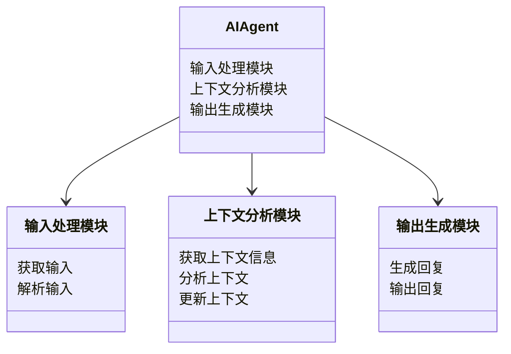
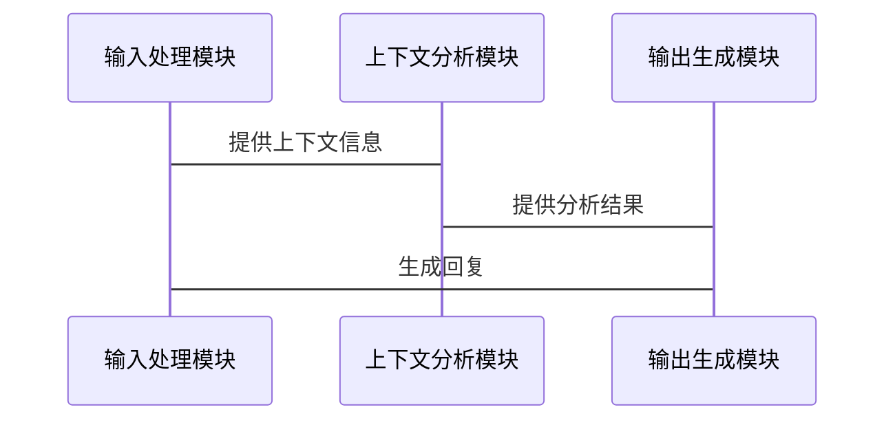

                 


# AI Agent的情境理解：增强LLM的上下文感知能力

> 关键词：AI Agent，情境理解，上下文感知，大语言模型，LLM，语义理解，注意力机制

> 摘要：本文深入探讨了AI Agent在情境理解中的作用，分析了如何通过增强大语言模型（LLM）的上下文感知能力来提升AI Agent的智能水平。文章从背景介绍、核心概念、算法原理、系统架构到项目实战，全面解析了AI Agent的情境理解技术，并结合实际案例，总结了最佳实践和未来发展方向。

---

# 第1章: AI Agent与情境理解概述

## 1.1 情境理解的定义与重要性

### 1.1.1 情境理解的定义
情境理解是指AI系统能够识别和解析当前交互的上下文、背景信息、用户意图和环境条件，从而更准确地理解和回应用户需求的能力。

### 1.1.2 情境理解的重要性
在AI Agent的应用中，情境理解是实现人机交互的关键技术。通过理解上下文，AI Agent可以更好地处理复杂对话、多轮交互和动态任务需求。

### 1.1.3 情境理解的核心要素
情境理解的核心要素包括：
- **上下文信息**：对话历史、用户行为、环境数据等。
- **用户意图**：用户的显式和隐式需求。
- **语义关联**：词语、短语和句子之间的语义关系。

## 1.2 AI Agent的基本概念

### 1.2.1 AI Agent的定义
AI Agent是一种智能代理，能够感知环境、理解用户需求，并通过自主决策和执行任务来实现目标。

### 1.2.2 AI Agent的分类
AI Agent可以根据智能水平分为：
- **反应式Agent**：基于当前感知做出反应。
- **认知式Agent**：具备推理、规划和学习能力。
- **混合式Agent**：结合反应式和认知式的特点。

### 1.2.3 AI Agent的应用场景
AI Agent广泛应用于智能助手、对话系统、自动化任务执行和智能客服等领域。

## 1.3 LLM的上下文感知能力

### 1.3.1 LLM的定义与特点
大语言模型（LLM）是一种基于深度学习的自然语言处理模型，具有强大的文本生成和理解能力。

### 1.3.2 上下文感知能力的必要性
LLM的上下文感知能力是实现AI Agent智能交互的基础，能够帮助模型更好地理解用户需求和对话情境。

### 1.3.3 情境理解对LLM的提升作用
通过增强情境理解能力，LLM可以实现更准确的意图识别、更连贯的对话生成和更高效的多轮交互。

## 1.4 本章小结
本章介绍了AI Agent和情境理解的基本概念，并阐述了LLM的上下文感知能力在AI Agent中的重要性。

---

# 第2章: 情境理解的语义基础

## 2.1 语义理解的定义与挑战

### 2.1.1 语义理解的定义
语义理解是指AI系统能够理解语言的深层含义，而不仅仅是表面的词义。

### 2.1.2 语义理解的挑战
语义理解的挑战包括：
- **歧义性**：词语或句子的多种含义。
- **上下文依赖性**：语义理解需要依赖上下文信息。
- **知识鸿沟**：不同领域的知识差异。

### 2.1.3 语义理解的核心技术
语义理解的核心技术包括词嵌入、句法分析和语义推理。

## 2.2 上下文感知的理论模型

### 2.2.1 上下文感知的定义
上下文感知是指AI系统能够理解当前情境中的相关信息。

### 2.2.2 上下文感知的理论模型
上下文感知的理论模型包括：
- **语义网络模型**：通过网络结构表示语义关系。
- **上下文向量模型**：将上下文信息编码为向量。

### 2.2.3 上下文感知的数学模型
上下文感知的数学模型可以通过向量空间模型和注意力机制来实现。

## 2.3 情境理解的语义网络

### 2.3.1 语义网络的定义
语义网络是一种用于表示语义关系的网络结构，节点表示词语或概念，边表示语义关系。

### 2.3.2 语义网络的构建方法
语义网络的构建方法包括：
- **词嵌入技术**：通过Word2Vec等技术生成词向量。
- **知识图谱构建**：利用外部知识库构建语义网络。

### 2.3.3 语义网络的应用案例
语义网络可以应用于智能对话系统、信息检索和知识推理。

## 2.4 本章小结
本章探讨了情境理解的语义基础，介绍了语义理解的定义、挑战和核心技术，以及语义网络的构建和应用。

---

# 第3章: LLM的上下文处理机制

## 3.1 上下文窗口的定义与作用

### 3.1.1 上下文窗口的定义
上下文窗口是指在LLM中用于处理上下文信息的窗口区域。

### 3.1.2 上下文窗口的作用
上下文窗口的作用是帮助LLM理解当前对话的上下文信息，从而生成更连贯的回复。

### 3.1.3 上下文窗口的限制
上下文窗口的限制包括窗口大小和信息处理能力。

## 3.2 上下文窗口的扩展方法

### 3.2.1 窗口大小的调整
窗口大小的调整可以根据任务需求动态调整。

### 3.2.2 窗口内容的优化
窗口内容的优化可以通过信息过滤和信息增强来实现。

### 3.2.3 窗口信息的增强
窗口信息的增强可以通过引入外部知识库和多模态信息来实现。

## 3.3 上下文窗口的优化策略

### 3.3.1 上下文窗口的动态调整
动态调整上下文窗口可以根据对话的进展和任务需求实时调整。

### 3.3.2 上下文窗口的信息过滤
信息过滤可以通过去除无关信息和保留关键信息来优化上下文窗口。

### 3.3.3 上下文窗口的多模态融合
多模态融合可以通过结合文本、图像和语音等多种信息来增强上下文窗口的感知能力。

## 3.4 本章小结
本章探讨了LLM的上下文处理机制，介绍了上下文窗口的定义、作用和优化策略。

---

# 第4章: 情境理解的注意力机制

## 4.1 注意力机制的定义与原理

### 4.1.1 注意力机制的定义
注意力机制是一种用于聚焦重要信息的机制，通过计算权重来表示每个位置的重要性。

### 4.1.2 注意力机制的原理
注意力机制的原理包括查询、键和值的计算，以及权重的计算和应用。

### 4.1.3 注意力机制的作用
注意力机制的作用是帮助模型聚焦于重要的上下文信息。

## 4.2 上下文建模的注意力机制

### 4.2.1 上下文建模的定义
上下文建模是指通过模型捕捉和表示上下文信息。

### 4.2.2 上下文建模的注意力机制
上下文建模的注意力机制可以通过自注意力机制和交叉注意力机制来实现。

### 4.2.3 上下文建模的应用案例
上下文建模的应用案例包括对话生成和文本摘要。

## 4.3 本章小结
本章探讨了情境理解的注意力机制，介绍了注意力机制的定义、原理和应用。

---

# 第5章: AI Agent的情境理解系统架构

## 5.1 系统功能设计

### 5.1.1 系统模块划分
AI Agent的情境理解系统主要包括输入处理模块、上下文分析模块和输出生成模块。

### 5.1.2 系统功能设计
系统功能包括上下文解析、意图识别和对话生成。

### 5.1.3 系统功能设计的MERmaid类图


## 5.2 系统架构设计

### 5.2.1 系统架构的定义
系统架构是指系统的整体结构和组成部分。

### 5.2.2 系统架构的MERmaid架构图
```mermaid
container AI Agent {
    输入处理模块
    上下文分析模块
    输出生成模块
}
```

## 5.3 系统接口设计

### 5.3.1 系统接口的定义
系统接口是指系统与其他模块之间的交互接口。

### 5.3.2 系统接口的MERmaid序列图


## 5.4 本章小结
本章探讨了AI Agent的情境理解系统架构，介绍了系统的功能设计、架构设计和接口设计。

---

# 第6章: 项目实战：基于LLM的AI Agent开发

## 6.1 环境安装

### 6.1.1 开发环境
开发环境包括Python 3.8及以上版本、TensorFlow或PyTorch框架。

### 6.1.2 依赖安装
安装必要的依赖包，如transformers、numpy等。

## 6.2 核心代码实现

### 6.2.1 输入处理模块
```python
def process_input(input_text):
    return input_text.lower()
```

### 6.2.2 上下文分析模块
```python
def analyze_context(context):
    return context[-5:]  # 取最后5条对话历史
```

### 6.2.3 输出生成模块
```python
from transformers import AutoTokenizer, AutoModelForCausalLM

tokenizer = AutoTokenizer.from_pretrained('gpt2')
model = AutoModelForCausalLM.from_pretrained('gpt2')

def generate_output(context, input_text):
    full_context = context + [input_text]
    inputs = tokenizer.encode(" ".join(full_context), return_tensors='pt')
    outputs = model.generate(inputs, max_length=100)
    return tokenizer.decode(outputs[0], skip_special_tokens=True)
```

## 6.3 案例分析

### 6.3.1 案例1：简单对话
输入：'今天天气怎么样？'
上下文：['我今天有点不舒服', '今天天气怎么样？']
输出：'今天天气很好，您感觉怎么样？'

### 6.3.2 案例2：多轮对话
输入：'我今天去了公园。'
上下文：['我今天去了公园', '你玩得开心吗？']
输出：'我玩得非常开心，公园很漂亮。'

## 6.4 项目小结
本章通过一个简单的项目实战，展示了如何基于LLM开发AI Agent的情境理解系统。

---

# 第7章: 最佳实践与总结

## 7.1 最佳实践

### 7.1.1 上下文窗口的动态调整
根据任务需求动态调整上下文窗口的大小和内容。

### 7.1.2 注意力机制的优化
优化注意力机制的计算方式，提升上下文感知能力。

### 7.1.3 多模态信息的融合
引入图像、语音等多模态信息，增强上下文感知能力。

## 7.2 本章总结
通过本文的探讨，我们了解了AI Agent的情境理解技术，包括背景、理论基础、算法原理、系统架构和项目实战。通过最佳实践，我们可以更好地提升LLM的上下文感知能力，实现更智能的AI Agent。

---

作者：AI天才研究院/AI Genius Institute & 禅与计算机程序设计艺术 /Zen And The Art of Computer Programming

