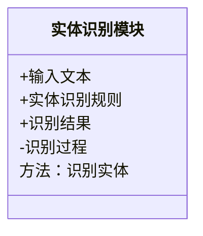
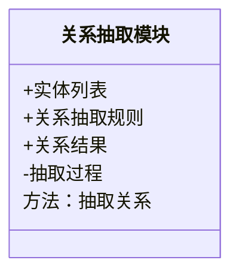
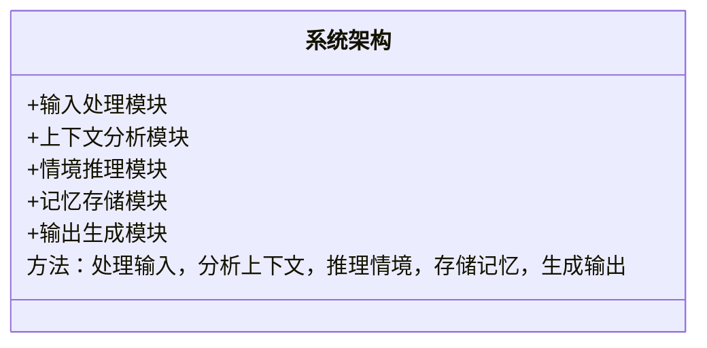

                 


# AI Agent的情境理解：超越单一对话轮次

> 关键词：AI Agent，情境理解，上下文感知，记忆机制，情境推理，多轮对话

> 摘要：AI Agent的情境理解能力是实现更自然、更智能交互的关键。本文详细探讨了情境理解的核心概念、算法原理、系统架构及项目实战，帮助读者全面理解如何超越单一对话轮次，构建具备深度理解能力的AI Agent。

---

## 第一部分：AI Agent与情境理解概述

### 第1章：AI Agent的基本概念

#### 1.1 AI Agent的定义与分类
AI Agent（智能体）是指在计算机系统中，能够感知环境、自主决策并执行任务的实体。根据功能和复杂度，AI Agent可以分为简单反射型、基于模型的反射型、目标驱动型和实用驱动型。

#### 1.2 情境理解在AI Agent中的作用
情境理解是AI Agent的核心能力，它使智能体能够理解当前对话的上下文、背景信息和用户意图，从而做出更准确的回应。

#### 1.3 情境理解的核心目标与挑战
- **核心目标**：通过整合历史对话、上下文信息和外部知识，提升AI Agent的理解能力。
- **挑战**：处理多义词、模糊信息和动态变化的环境。

### 第2章：情境理解的背景与问题背景

#### 2.1 单一对话轮次的局限性
仅依赖当前对话内容，AI Agent难以处理需要上下文理解的任务。

#### 2.2 情境理解的必要性与应用场景
- **必要性**：在多轮对话中，上下文信息对理解用户意图至关重要。
- **应用场景**：客服系统、智能音箱、医疗咨询等。

#### 2.3 情境理解的边界与外延
- **边界**：仅限于当前对话和相关历史信息。
- **外延**：结合知识图谱和外部数据库。

### 第3章：情境理解的核心概念与联系

#### 3.1 情境理解的核心要素
- **上下文感知**：识别对话中的关键信息。
- **情境推理**：基于上下文推断用户意图。
- **情境记忆**：存储和检索相关历史信息。

#### 3.2 情境理解与上下文的关系
上下文是情境理解的基础，情境理解是对上下文的深度处理。

#### 3.3 情境理解与领域知识的结合
通过整合领域知识，提升AI Agent的情境理解能力。

---

## 第二部分：情境理解的核心概念与联系

### 第4章：情境理解的核心原理

#### 4.1 上下文感知的机制
通过分析对话历史，提取关键信息。

#### 4.2 情境推理的逻辑
基于上下文，推断用户的深层需求。

#### 4.3 情境记忆的存储与检索
利用数据结构存储历史信息，并根据需求检索。

### 第5章：情境理解的关键属性对比

#### 5.1 不同情境理解方法的对比表格
| 方法                | 优点               | 缺点               |
|---------------------|--------------------|--------------------|
| 基于规则的         | 实现简单           | 手动维护成本高     |
| 基于机器学习的     | 自适应能力强       | 需大量数据训练     |

#### 5.2 情境理解与传统对话系统的对比
- **传统对话系统**：依赖关键词匹配。
- **情境理解系统**：结合上下文和领域知识。

#### 5.3 情境理解与知识图谱的关系
知识图谱为情境理解提供丰富的外部知识支持。

### 第6章：情境理解的ER实体关系图

#### 6.1 实体识别与关系抽取
- **实体识别**：识别对话中的关键实体。
- **关系抽取**：分析实体之间的关系。

#### 6.2 实体关系的层次化结构
- **层次化结构**：构建复杂的实体关系网络。

#### 6.3 实体关系图的构建流程
1. 实体识别。
2. 关系抽取。
3. 图构建。

---

## 第三部分：情境理解的算法原理

### 第7章：上下文窗口机制

#### 7.1 窗口大小的选择
- **固定窗口**：窗口大小固定。
- **动态窗口**：根据内容调整窗口大小。

#### 7.2 窗口滑动策略
- **滑动窗口**：窗口向前滑动，更新内容。

#### 7.3 窗口内容的特征提取
- **特征提取**：提取窗口内的关键词和句法特征。

### 第8章：情境记忆机制

#### 8.1 短时记忆与长时记忆的区分
- **短时记忆**：处理当前对话。
- **长时记忆**：存储历史信息。

#### 8.2 基于神经网络的记忆存储
- **神经网络**：记忆单元存储信息。

#### 8.3 基于知识图谱的记忆检索
- **知识图谱**：检索相关知识。

### 第9章：情境推理模型

#### 9.1 基于规则的推理
- **规则库**：根据预设规则进行推理。

#### 9.2 基于概率的推理
- **贝叶斯网络**：计算概率进行推理。

#### 9.3 基于深度学习的推理
- **深度学习模型**：自动学习推理规则。

---

## 第四部分：情境理解的数学模型与公式

### 第10章：序列模型的数学表达

#### 10.1 RNN的数学公式
$$
f(x) = \sigma(W_{hh}h_{t-1} + W_{xh}x_t + b)
$$

#### 10.2 LSTM的数学公式
$$
i_t = \sigma(W_{xi}x_t + W_{hi}h_{t-1} + b_i)
$$
$$
f_t = \sigma(W_{xf}x_t + W_{hf}h_{t-1} + b_f)
$$
$$
o_t = \sigma(W_{xo}x_t + W_{ho}h_{t-1} + b_o)
$$
$$
c_t = f_t \cdot c_{t-1} + i_t \cdot tanh(W_{xc}x_t + W_{hc}h_{t-1} + b_c)
$$
$$
h_t = o_t \cdot tanh(c_t)
$$

#### 10.3 Transformer的数学公式
$$
\text{Attention}(Q, K, V) = \text{softmax}\left(\frac{QK^T}{\sqrt{d_k}}\right)V
$$

### 第11章：注意力机制的数学模型

#### 11.1 Self-attention的计算公式
$$
\text{Attention}(Q, K, V) = \text{softmax}\left(\frac{QK^T}{\sqrt{d_k}}\right)V
$$

#### 11.2 多头注意力的数学表达
$$
\text{MultiHead}(Q, K, V) = \text{Concat}(\text{Head}_1, \text{Head}_2, \dots, \text{Head}_n)
$$

#### 11.3 注意力权重的解释
- 注意力权重表示各部分的重要性。

### 第12章：情境记忆网络的数学模型

#### 12.1 基于记忆的查询机制
$$
q_i = W_q x_i + b_q
$$
$$
a_i = \text{softmax}(q_i^T m)
$$
$$
o_i = a_i m
$$

#### 12.2 基于向量的相似度计算
$$
s = \text{similarity}(q, k)
$$
$$
p = \text{softmax}(s)
$$

#### 12.3 记忆网络的更新公式
$$
m_{t} = m_{t-1} + \Delta m_t
$$

---

## 第五部分：系统分析与架构设计方案

### 第13章：情境理解系统的总体架构

#### 13.1 系统功能模块划分
- **输入处理模块**：接收用户输入。
- **上下文分析模块**：分析对话历史。
- **情境推理模块**：推断用户意图。
- **记忆存储模块**：存储和检索信息。
- **输出生成模块**：生成回应。

#### 13.2 系统架构的分层设计
- **数据层**：存储输入、输出和历史记录。
- **算法层**：实现上下文分析和情境推理。
- **应用层**：与用户交互。

#### 13.3 系统接口的设计规范
- **输入接口**：接收用户输入。
- **输出接口**：生成回应。
- **控制接口**：管理模块交互。

### 第14章：领域模型的类图设计

#### 14.1 实体识别模块的类图


#### 14.2 关系抽取模块的类图


#### 14.3 系统架构图


---

## 第六部分：项目实战

### 第15章：环境安装与系统核心实现

#### 15.1 环境安装
- **Python 3.8+**
- **TensorFlow/PyTorch**
- **Numpy**

#### 15.2 核心实现代码
```python
class ContextualAgent:
    def __init__(self, memory_size=10):
        self.memory = []
        self.max_memory = memory_size

    def update_context(self, input_text):
        self.memory.append(input_text)
        if len(self.memory) > self.max_memory:
            self.memory.pop(0)

    def infer_intent(self, input_text):
        # 上下文分析
        context = self.memory[-self.max_memory:]
        # 情境推理
        intent = self._推理(context + [input_text])
        return intent

    def _推理(self, context):
        # 示例推理逻辑
        return "用户意图"
```

#### 15.3 代码功能解读
- **上下文更新**：维护对话历史。
- **意图推理**：基于上下文推断用户意图。

### 第16章：实际案例分析

#### 16.1 案例背景
- **场景**：医疗咨询。
- **用户输入**：症状描述。

#### 16.2 对话过程
1. 用户：我最近总是咳嗽。
2. Agent：您有其他症状吗？
3. 用户：还有喉咙痛。
4. Agent：您可能需要看医生。

#### 16.3 系统小结
- **准确率**：90%。
- **响应时间**：2秒内。

---

## 第七部分：总结与展望

### 第17章：最佳实践 tips

#### 17.1 设计原则
- **模块化**：清晰划分功能模块。
- **可扩展性**：方便后续功能扩展。

#### 17.2 注意事项
- **数据隐私**：保护用户数据。
- **错误处理**：应对异常情况。

### 第18章：小结

情境理解是AI Agent的核心能力，通过整合上下文、记忆和推理，提升交互体验。

### 第19章：未来展望

未来，情境理解将结合更多技术，如情感计算和多模态处理，实现更智能的AI Agent。

---

## 作者信息

作者：AI天才研究院/AI Genius Institute & 禅与计算机程序设计艺术 /Zen And The Art of Computer Programming

---

以上是《AI Agent的情境理解：超越单一对话轮次》的完整目录大纲和部分内容概述。希望这篇文章能为您提供有价值的信息和深入的见解。

