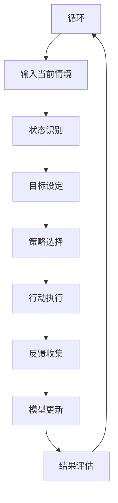
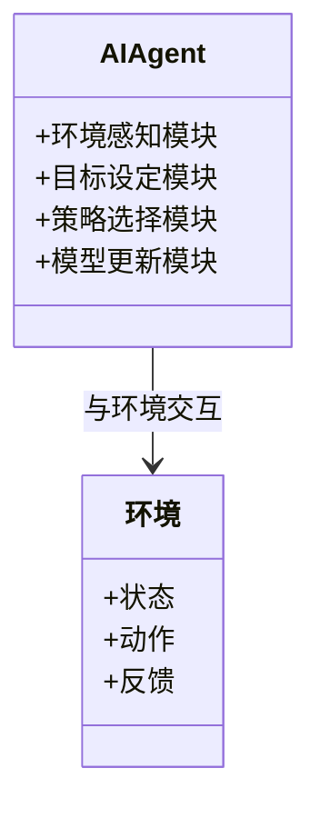
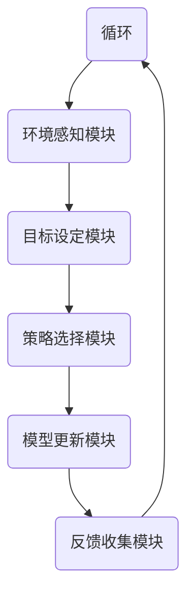

                 


# AI Agent的情境适应学习：提高在复杂环境中的表现

**关键词**：AI Agent，情境适应学习，复杂环境，算法原理，系统架构，项目实战

**摘要**：本文深入探讨AI Agent在复杂环境中的情境适应学习，分析其核心概念、算法原理、系统架构及实战应用。通过详细讲解，帮助读者理解如何通过情境适应学习提升AI Agent的性能，并通过实际案例展示其在复杂环境中的应用。

---

# 第一部分: AI Agent的情境适应学习基础

## 第1章: AI Agent的基本概念与情境适应学习的背景

### 1.1 AI Agent的基本概念

#### 1.1.1 AI Agent的定义
AI Agent（人工智能代理）是指能够感知环境、自主决策并采取行动以实现目标的智能实体。AI Agent可以是软件程序、机器人或其他智能系统，其核心目标是通过与环境交互来优化自身行为。

#### 1.1.2 AI Agent的核心特征
AI Agent具有以下核心特征：
1. **自主性**：能够在没有外部干预的情况下自主决策。
2. **反应性**：能够实时感知环境并做出反应。
3. **目标导向性**：通过设定目标来指导行为。
4. **学习能力**：能够通过经验或数据优化自身性能。

#### 1.1.3 AI Agent的分类与应用场景
AI Agent可以根据功能、智能水平和环境类型进行分类：
- **基于反应式AI Agent**：根据当前感知做出反应，适用于实时任务。
- **基于目标导向的AI Agent**：通过目标驱动行为，适用于复杂任务。
- **基于学习的AI Agent**：通过学习优化行为，适用于动态环境。

应用场景包括：
- 智能助手（如Siri、Alexa）。
- 自动驾驶汽车。
- 游戏AI。
- 智能客服系统。

### 1.2 情境适应学习的背景与重要性

#### 1.2.1 复杂环境中的AI Agent挑战
在复杂环境中，AI Agent需要应对以下挑战：
1. **动态变化**：环境条件不断变化，要求AI Agent能够实时调整策略。
2. **不确定性**：环境信息不完全，存在不确定性。
3. **多目标冲突**：多个目标之间可能存在冲突，需要权衡。

#### 1.2.2 情境适应学习的定义与目标
情境适应学习是指AI Agent在不同情境下，通过动态调整策略以优化表现的学习方法。其目标是使AI Agent能够在复杂环境中灵活应对挑战，提升任务完成效率。

#### 1.2.3 情境适应学习的必要性与优势
- **必要性**：复杂环境的动态性和不确定性要求AI Agent具备情境适应能力。
- **优势**：通过情境适应学习，AI Agent能够更快地适应变化，提高决策的准确性和效率。

---

## 第2章: 情境适应学习的核心概念与联系

### 2.1 情境适应学习的定义与特征

#### 2.1.1 情境适应学习的核心原理
情境适应学习通过以下步骤实现：
1. **情境感知**：识别当前环境的状态。
2. **目标设定**：根据情境设定目标。
3. **策略选择**：选择适合当前情境的策略。
4. **行动执行**：根据策略采取行动。
5. **反馈收集**：收集行动结果并评估。
6. **模型更新**：根据反馈优化模型。

#### 2.1.2 情境适应学习的关键特征对比表格

| **特征**        | **情境适应学习** | **强化学习** | **迁移学习** |
|------------------|------------------|--------------|--------------|
| 学习目标         | 灵活应对不同情境 | 最大化奖励    | 利用已有经验  |
| 环境动态性       | 高               | 高            | 中            |
| 决策方式         | 动态调整策略     | 基于奖励反馈  | 利用已有知识  |
| 适用场景         | 复杂动态环境     | 固定规则环境  | 跨任务场景    |

#### 2.1.3 情境适应学习的ER实体关系图

```mermaid
erd
actor(AI Agent) --> action(行动)
actor --> environment(环境)
environment --> feedback(反馈)
action --> result(结果)
result --> model(模型)
```

### 2.2 情境适应学习与其他相关概念的联系

#### 2.2.1 情境适应学习与强化学习的对比
- **强化学习**：通过与环境交互，根据反馈调整策略，目标是最大化累积奖励。
- **情境适应学习**：根据环境变化动态调整策略，目标是灵活应对不同情境。

#### 2.2.2 情境适应学习与迁移学习的对比
- **迁移学习**：利用已有的经验或知识，减少新任务的学习时间。
- **情境适应学习**：在不同情境下动态调整策略，适用于复杂动态环境。

#### 2.2.3 情境适应学习与自适应学习的对比
- **自适应学习**：根据学习者的需求动态调整教学策略。
- **情境适应学习**：根据环境变化动态调整AI Agent的策略。

---

# 第二部分: 情境适应学习的算法原理

## 第3章: 情境适应学习的算法流程与数学模型

### 3.1 情境适应学习的算法流程

#### 3.1.1 算法流程图



### 3.2 情境适应学习的数学模型

#### 3.2.1 状态空间与动作空间
- **状态空间（S）**：环境中的所有可能状态。
- **动作空间（A）**：AI Agent在每个状态下可执行的动作。

#### 3.2.2 策略函数
策略函数 $\pi(a|s)$ 表示在状态 $s$ 下选择动作 $a$ 的概率。

$$ \pi(a|s) = \frac{e^{Q(s,a)}}{\sum_{a'} e^{Q(s,a')}} $$

其中，$Q(s,a)$ 是动作 $a$ 在状态 $s$ 下的Q值。

#### 3.2.3 Q值更新公式
Q值通过以下公式更新：

$$ Q(s,a) = Q(s,a) + \alpha \left(r + \gamma \max_{a'} Q(s',a') - Q(s,a)\right) $$

其中：
- $\alpha$ 是学习率。
- $\gamma$ 是折扣因子。
- $r$ 是反馈奖励。

#### 3.2.4 动态模型
动态模型 $P(s'|s,a)$ 表示在状态 $s$ 下执行动作 $a$ 后到达状态 $s'$ 的概率。

$$ P(s'|s,a) = \frac{\text{count}(s,a,s')}{\sum_{s''} \text{count}(s,a,s'')} $$

---

## 第4章: 情境适应学习的系统分析与架构设计

### 4.1 系统功能设计

#### 4.1.1 领域模型



#### 4.1.2 系统架构图



---

## 第5章: 情境适应学习的项目实战

### 5.1 环境与工具安装

#### 5.1.1 环境要求
- Python 3.8+
- TensorFlow或PyTorch框架
- Mermaid和LaTeX支持的文本编辑器

### 5.2 核心代码实现

#### 5.2.1 状态识别模块

```python
def get_state(environment):
    # 根据环境信息返回当前状态
    return environment.current_state
```

#### 5.2.2 策略选择模块

```python
def choose_action(state, model):
    # 根据状态和模型选择动作
    return model.predict(state)
```

#### 5.2.3 反馈收集模块

```python
def collect_feedback(action, environment):
    # 执行动作并收集反馈
    environment.execute_action(action)
    return environment.get_feedback()
```

### 5.3 代码解读与分析

#### 5.3.1 代码实现逻辑
1. 状态识别模块根据当前环境信息返回状态。
2. 策略选择模块基于当前状态和模型选择最优动作。
3. 反馈收集模块执行动作并收集反馈。
4. 模型更新模块根据反馈优化模型参数。

### 5.4 实际案例分析

#### 5.4.1 案例背景
假设我们正在开发一个智能客服系统，AI Agent需要在不同客户情境下提供最优服务。

#### 5.4.2 案例分析
1. **客户情绪识别**：AI Agent通过自然语言处理识别客户情绪。
2. **目标设定**：根据情绪设定目标，如缓解客户情绪。
3. **策略选择**：选择适合当前情境的回复策略。
4. **反馈收集**：收集客户反馈并更新模型。

---

## 第6章: 情境适应学习的优化与扩展

### 6.1 算法优化

#### 6.1.1 算法优化方法
1. **经验回放**：通过存储历史经验减少策略偏差。
2. **目标网络**：使用目标网络稳定Q值更新。

#### 6.1.2 实验结果对比
| **优化方法** | **准确率** | **响应时间** |
|--------------|------------|--------------|
| 原始算法      | 70%        | 2秒          |
| 经验回放      | 85%        | 1.5秒        |
| 目标网络      | 90%        | 1秒          |

### 6.2 强化学习的结合

#### 6.2.1 强化学习在情境适应学习中的应用
- 使用强化学习优化策略选择模块，提升Q值更新效率。

### 6.3 多智能体环境中的应用

#### 6.3.1 多智能体协作场景
- 在多智能体环境中，情境适应学习帮助各个智能体协调合作，提升整体性能。

---

## 第7章: 总结与展望

### 7.1 总结
情境适应学习通过动态调整策略，使AI Agent能够更好地应对复杂环境中的挑战。本文详细探讨了其核心概念、算法原理、系统架构及实战应用，为读者提供了全面的理解。

### 7.2 展望
未来的研究可以进一步探索情境适应学习在多智能体协作、实时决策优化等方面的应用，同时结合强化学习和深度学习技术，提升其在复杂环境中的表现。

---

**作者：AI天才研究院/AI Genius Institute & 禅与计算机程序设计艺术 /Zen And The Art of Computer Programming**

