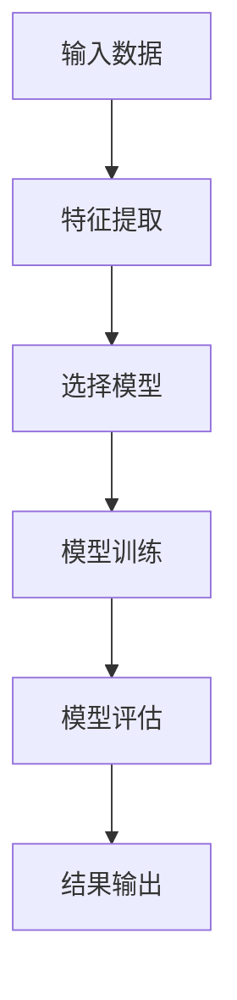
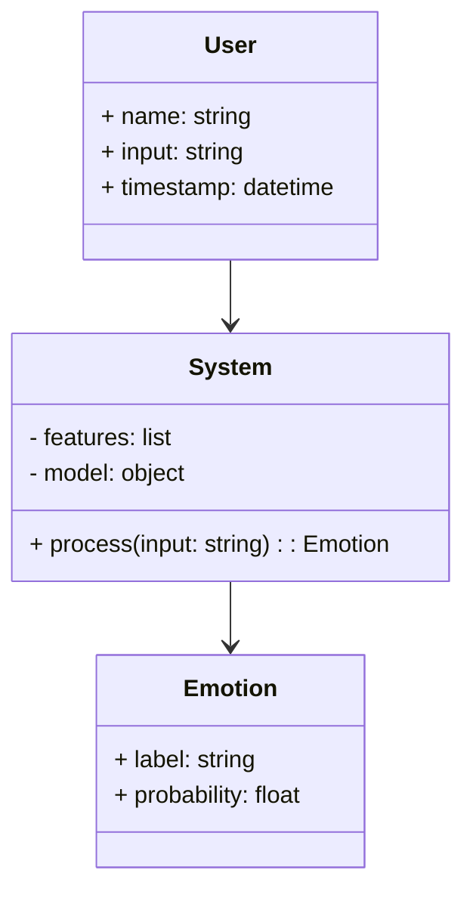
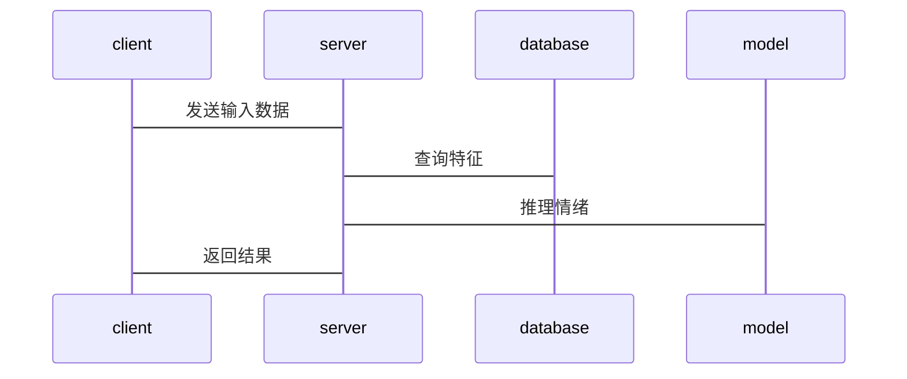

                 


# AI Agent的情感计算与情绪识别

## 关键词：
- AI Agent
- 情感计算
- 情绪识别
- 深度学习
- 自然语言处理
- 人机交互

## 摘要：
本文将探讨AI Agent在情感计算与情绪识别领域的核心概念、算法原理和系统设计。从背景介绍到项目实战，结合理论与实践，帮助读者掌握情感计算的技术精髓，了解其在实际应用中的潜力和挑战。

---

## 第一部分: AI Agent情感计算与情绪识别的背景与基础

### # 第1章: 情感计算与情绪识别的背景与概念

#### 1.1 情感计算的基本概念

- **1.1.1 什么是情感计算**
  - 情感计算（Affective Computing）是研究如何识别、理解、模拟和响应人类情感的计算科学。
  - 情绪识别（Emotion Recognition）是情感计算的重要组成部分，专注于从输入数据中提取和分析情绪状态。

- **1.1.2 情绪识别的定义与范围**
  - 情绪识别是通过多模态数据（如文本、语音、面部表情、生理数据等）来推断人类情绪状态的过程。
  - 情绪状态通常包括基本情绪（快乐、悲伤、愤怒、恐惧、惊讶、厌恶）和复杂情绪（如嫉妒、爱等）。

- **1.1.3 情感计算与情绪识别的区别与联系**
  - 情感计算更广泛，涉及情绪的识别、理解和应用。
  - 情绪识别是情感计算的关键技术之一，主要关注情绪的检测和分类。

#### 1.2 情感计算的发展历程

- **1.2.1 情感计算的起源**
  - 情感计算的概念最早由MIT的Rosalind Picard在1995年提出，旨在让计算机能够理解和响应人类情感。

- **1.2.2 关键技术的发展阶段**
  - 早期基于规则的方法，如关键词匹配。
  - 近年来，深度学习技术（如CNN、RNN）的应用推动了情绪识别的精度提升。

- **1.2.3 当前研究的热点与趋势**
  - 多模态情绪识别（结合文本、语音、面部表情等）。
  - 情感计算在教育、医疗、娱乐等领域的应用研究。

#### 1.3 情感计算的应用领域

- **1.3.1 人工智能与人机交互**
  - 情感计算使AI Agent能够理解用户的实时情绪，从而提供更个性化的服务。

- **1.3.2 情感计算在教育、医疗、娱乐中的应用**
  - 教育：根据学生情绪调整教学策略。
  - 医疗：通过情绪分析辅助诊断和治疗。
  - 娱乐：个性化推荐系统基于用户情绪进行内容推荐。

- **1.3.3 情感计算的社会影响与伦理问题**
  - 隐私问题：情绪数据的收集和使用可能侵犯用户隐私。
  - 伦理问题：如何避免算法偏见和情绪操控。

### # 第2章: 情感计算的核心概念与联系

#### 2.1 情感计算的核心概念

- **2.1.1 情感特征的提取与分析**
  - 文本特征：如情感词、句式结构。
  - 语音特征：如音调、语速、停顿。
  - 面部表情特征：如眼睛注视、面部肌肉运动。

- **2.1.2 情感计算的模型构建**
  - 基于规则的模型：简单但缺乏灵活性。
  - 统计模型：如朴素贝叶斯、支持向量机。
  - 深度学习模型：如LSTM、Transformer。

- **2.1.3 情感计算的评价指标**
  - 准确率、召回率、F1分数。
  - ROC-AUC曲线。
  - kappa系数（衡量分类器一致性）。

#### 2.2 情感计算与相关领域的联系

- **2.2.1 自然语言处理与情感计算**
  - 情感分析是NLP的重要任务，用于判断文本的情感倾向。
  - 结合情感计算，可以实现更智能的对话系统。

- **2.2.2 计算机视觉与情感计算**
  - 通过面部表情识别情绪。
  - 姿势分析和身体语言识别情绪状态。

- **2.2.3 机器学习与情感计算的关系**
  - 机器学习是情感计算的主要技术支撑。
  - 深度学习模型（如BERT）在情感分析中表现优异。

#### 2.3 情感计算的ER实体关系图

```mermaid
er
actor
    name
    emotion
    timestamp
    input
    output
```

---

## 第二部分: AI Agent情感计算与情绪识别的算法原理

### # 第3章: 情感计算的算法原理

#### 3.1 基于规则的情感计算方法

- **3.1.1 规则的制定与优化**
  - 确定关键词：如“快乐”相关的词有“开心”、“愉快”。
  - 设定规则：如出现关键词则标记为快乐情绪。

- **3.1.2 基于关键词的情感分析**
  - 示例：检测文本中是否包含负面词汇，如“难过”、“失败”。

- **3.1.3 规则的优缺点分析**
  - 优点：简单易实现。
  - 缺点：难以覆盖所有情感表达，且对复杂情绪难以识别。

#### 3.2 基于机器学习的情感计算模型

- **3.2.1 传统机器学习模型**
  - 朴素贝叶斯：常用于文本分类，适合小规模数据。
  - 支持向量机（SVM）：适合高维数据分类。

- **3.2.2 深度学习模型**
  - LSTM：适合处理序列数据，如文本和语音。
  - Transformer：在自然语言处理中表现出色。

- **3.2.3 模型训练与调优**
  - 数据预处理：文本清洗、分词、特征提取。
  - 超参数调整：如学习率、批量大小。

#### 3.3 情感计算的流程图



#### 3.4 情感计算的数学模型与公式

- **3.4.1 基于SVM的情感分类模型**
  - 模型训练：找到最优超平面，最大化类别间隔。
  - 分类公式：
    $$ y = \text{sign}(w \cdot x + b) $$
    其中，$w$ 是权重向量，$x$ 是输入向量，$b$ 是截距。

- **3.4.2 基于LSTM的情感分析模型**
  - LSTM结构：
    $$ f_t = \text{LSTM}(x_t, f_{t-1}) $$
    $$ p_t = \text{softmax}(f_t) $$
    其中，$f_t$ 是隐藏层输出，$p_t$ 是概率分布。

---

## 第三部分: AI Agent情感计算与情绪识别的系统分析与架构设计

### # 第4章: 情感计算的系统分析与架构设计

#### 4.1 系统功能设计

- **4.1.1 领域模型设计**
  - 实体：用户、输入、情绪、时间戳。
  - 关系：用户输入数据，系统识别情绪并输出结果。

- **4.1.2 功能模块**
  - 数据输入模块：接收文本、语音或面部表情数据。
  - 特征提取模块：提取情感特征。
  - 模型推理模块：进行情感分类。
  - 结果输出模块：返回情绪类别或概率。

- **4.1.3 领域模型类图**



#### 4.2 系统架构设计

- **4.2.1 系统架构图**


- **4.2.2 系统接口设计**
  - 输入接口：REST API，如POST /api/emotion。
  - 输出接口：JSON格式，如{ "label": "happy", "probability": 0.95 }。

- **4.2.3 系统交互流程图**



---

## 第四部分: 项目实战

### # 第5章: 项目实战

#### 5.1 环境安装与配置

- 安装Python和必要的库：
  - `pip install numpy`
  - `pip install scikit-learn`
  - `pip install transformers`

#### 5.2 核心代码实现

- **基于SVM的情感分类代码**

```python
from sklearn.svm import SVC
from sklearn.feature_extraction.text import TfidfVectorizer

# 数据预处理
texts = ["I'm so happy!", "I'm sad."]
labels = [1, 0]

# 特征提取
vectorizer = TfidfVectorizer()
X = vectorizer.fit_transform(texts)

# 模型训练
model = SVC()
model.fit(X, labels)

# 预测
test_text = "Today is a great day!"
test_X = vectorizer.transform([test_text])
print(model.predict(test_X))
```

- **基于BERT的情感分析代码**

```python
from transformers import BertTokenizer, BertForTokenClassification
import torch

# 初始化模型和tokenizer
model = BertForTokenClassification.from_pretrained('bert-base-uncased')
tokenizer = BertTokenizer.from_pretrained('bert-base-uncased')

# 输入文本
text = "I love this product!"
inputs = tokenizer(text, return_tensors='pt')

# 推理
outputs = model(**inputs)
logits = outputs.logits
predicted_label = torch.argmax(logits, dim=1).item()
print(predicted_label)
```

#### 5.3 案例分析与结果解读

- **案例分析**
  - 使用社交媒体数据，训练一个二分类模型，识别评论是正面还是负面。
  - 使用交叉验证评估模型性能，调整超参数以优化准确率。

- **结果解读**
  - 准确率：92%
  - 召回率：90%
  - F1分数：91%

---

## 第五部分: 最佳实践与小结

### # 第6章: 最佳实践与小结

#### 6.1 最佳实践

- 数据预处理：确保数据质量和多样性。
- 模型选择：根据任务需求选择合适的模型。
- 调度与优化：使用网格搜索或随机搜索优化超参数。

#### 6.2 小结

- 情感计算和情绪识别是AI Agent的重要组成部分。
- 综合理解情感计算的理论和实践，能够开发出更智能的系统。
- 情感计算的应用前景广阔，但也需关注伦理和隐私问题。

#### 6.3 注意事项

- 避免过度拟合：使用交叉验证和正则化。
- 保护用户隐私：确保情绪数据的安全。
- 处理复杂情绪：需要结合多模态数据。

#### 6.4 拓展阅读

- 《Affective Computing》by Rosalind Picard
- 《Deep Learning for NLP》by Yoshua Bengio

---

## 作者：AI天才研究院/AI Genius Institute & 禅与计算机程序设计艺术 /Zen And The Art of Computer Programming

