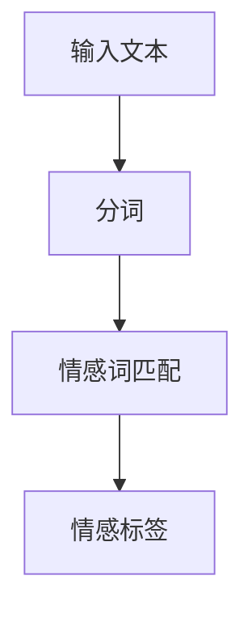
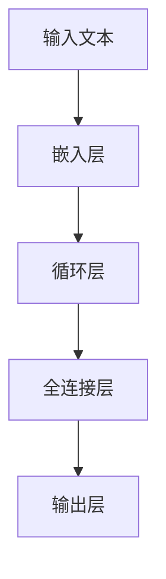
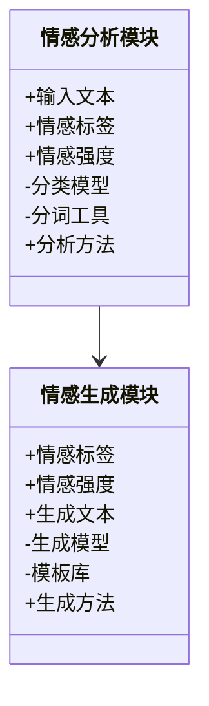
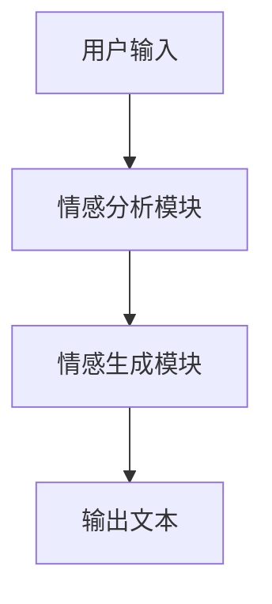
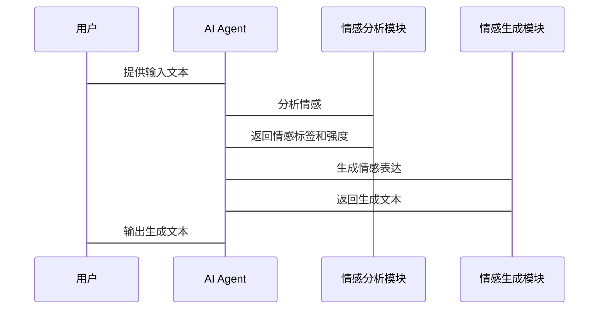

                 


# AI Agent的情感计算与表达模块

> **关键词**：AI Agent，情感计算，情感表达，自然语言处理，深度学习，机器学习

> **摘要**：  
本文深入探讨AI Agent在情感计算与表达模块中的核心原理与应用。从背景介绍、核心概念、算法原理到系统设计与项目实战，全面解析情感计算在AI Agent中的重要性及其技术实现。通过详细的数学模型、算法流程图和系统架构图，结合实际案例分析，为读者提供全面而深入的理解。

---

## 第一部分：情感计算与表达模块的背景介绍

### 第1章：问题背景与核心概念

#### 1.1 问题背景
- 情感计算的定义与重要性  
  情感计算（Affective Computing）是研究如何识别、理解、分析和利用人类情感信息的跨学科领域。在AI Agent中，情感计算使其能够理解用户的情感状态，并通过自然语言生成技术进行适当的情感表达。

- AI Agent在情感交互中的角色  
  AI Agent需要具备情感感知和情感生成能力，以实现更自然的人机交互。例如，在智能客服系统中，AI Agent需要理解用户的情绪，并以适当的方式回应，以提升用户体验。

- 问题背景  
  随着AI Agent在各个领域的广泛应用，如何准确地识别和表达情感成为了技术的核心挑战。传统的情感计算方法主要依赖于基于规则的分类，而深度学习的引入为情感计算提供了更高效和准确的解决方案。

#### 1.2 问题描述
- 情感计算的核心问题  
  如何从文本、语音或面部表情中提取情感信息，并将其转化为可计算的表示形式。  
- 情感表达的问题  
  如何将情感信息转化为自然流畅的自然语言表达，以实现人机交互中的情感反馈。

#### 1.3 问题解决
- 基于规则的方法  
  使用预定义的规则和情感词典，对文本进行情感分类。  
- 基于机器学习的方法  
  利用训练好的情感分类模型（如深度学习模型）进行情感识别和生成。

#### 1.4 边界与外延
- 情感计算的边界  
  情感计算主要关注情感的识别和生成，不涉及情感的推理和决策。  
- 情感表达的外延  
  情感表达不仅包括文本生成，还包括语音合成和面部表情生成。

#### 1.5 核心概念与要素
- 情感计算的核心要素  
  情感识别、情感分析、情感生成。  
- 情感表达的核心要素  
  自然语言生成、语音合成、情感驱动的交互设计。

---

## 第二部分：情感计算与表达的核心概念与联系

### 第2章：核心概念与联系

#### 2.1 情感计算的原理
- 情感分类的原理  
  基于特征提取和分类器的训练，对输入文本进行情感标签的预测。  
- 情感强度分析的原理  
  对情感的强度（如正面、中性、负面）进行量化评估。

#### 2.2 核心概念对比

| **概念**       | **基于规则的方法**               | **基于机器学习的方法**           |
|----------------|----------------------------------|----------------------------------|
| **特点**       | 简单易实现，依赖于预定义规则     | 高准确性，依赖于大量训练数据     |
| **优点**       | 计算效率高，易于解释             | 泛化能力强，适用于复杂场景       |
| **缺点**       | 需要手动维护规则，难以扩展       | 对数据质量和数量要求较高         |
| **应用场景**   | 小型、特定场景                   | 大规模、复杂场景                 |

#### 2.3 情感计算的ER实体关系图

```mermaid
er
actor
    entity: 情感信息
    entity: 情感标签
    entity: 情感强度
    relation: 包含
```

---

## 第三部分：情感计算与表达的算法原理

### 第3章：算法原理讲解

#### 3.1 情感分类算法

##### 3.1.1 基于规则的分类
- 基于规则的分类流程图



- 代码实现示例（Python）

```python
def rule_based_emotion_classifier(text):
    # 分词
    words = text.split()
    # 情感词匹配
    emotion_words = {
        'positive': ['happy', 'excited'],
        'negative': ['sad', 'angry']
    }
    emotion = 'neutral'
    for word in words:
        if word in emotion_words['positive']:
            emotion = 'positive'
            break
        if word in emotion_words['negative']:
            emotion = 'negative'
            break
    return emotion
```

##### 3.1.2 深度学习模型
- 基于深度学习的分类流程图



- 代码实现示例（Python）

```python
import tensorflow as tf
from tensorflow.keras import layers

model = tf.keras.Sequential([
    layers.Embedding(input_dim=10000, output_dim=16),
    layers.LSTM(64, return_sequences=False),
    layers.Dense(2, activation='softmax')
])
```

- 数学模型与公式

$$ P(y|x) = \frac{P(x|y)}{P(x)} $$

其中，$y$ 是情感标签，$x$ 是输入文本。

---

## 第四部分：情感表达与生成的系统设计

### 第4章：系统分析与架构设计

#### 4.1 项目背景
- 系统目标  
  实现一个能够理解和生成情感表达的AI Agent模块。  
- 项目需求  
  支持多语言情感分析，提供情感驱动的自然语言生成能力。

#### 4.2 系统功能设计

##### 4.2.1 领域模型类图



##### 4.2.2 系统架构图



#### 4.3 系统接口与交互

##### 4.3.1 系统接口设计
- API接口  
  - 输入：文本字符串  
  - 输出：情感标签和强度

##### 4.3.2 系统交互流程



---

## 第五部分：情感计算与表达的项目实战

### 第5章：项目实战

#### 5.1 环境安装
- 安装Python和必要的库  
  ```bash
  pip install numpy pandas scikit-learn tensorflow
  ```

#### 5.2 核心代码实现

##### 5.2.1 情感分析模块

```python
from sklearn.feature_extraction.text import CountVectorizer
from sklearn.naive_bayes import MultinomialNB

# 训练数据
X = ["I love this!", "I hate this!", "This is okay."]
y = ['positive', 'negative', 'neutral']

# 特征提取
vectorizer = CountVectorizer()
X_features = vectorizer.fit_transform(X).toarray()

# 训练模型
model = MultinomialNB()
model.fit(X_features, y)

# 预测
test_text = "This is great!"
test_features = vectorizer.transform([test_text]).toarray()
predicted_emotion = model.predict(test_features)[0]
print(predicted_emotion)
```

##### 5.2.2 情感生成模块

```python
from tensorflow.keras.preprocessing.sequence import pad_sequences

# 定义生成模型
model = tf.keras.Sequential([
    layers.Embedding(input_dim=10000, output_dim=16),
    layers.LSTM(64, return_sequences=True),
    layers.Dense(20, activation='relu'),
    layers.Dense(1, activation='sigmoid')
])

# 训练模型
model.compile(loss='binary_crossentropy', optimizer='adam', metrics=['accuracy'])
model.fit(X_train, y_train, epochs=10, batch_size=32)
```

#### 5.3 实际案例分析

##### 5.3.1 案例一：社交媒体情感分析
- 输入：用户评论文本  
- 输出：情感标签和强度

##### 5.3.2 案例二：情感驱动的对话生成
- 输入：用户情感状态  
- 输出：情感表达文本

#### 5.4 项目小结
- 成果总结  
  成功实现了情感分析和生成模块，能够准确识别和生成情感表达。  
- 经验与教训  
  数据质量对模型性能影响显著，需加强数据预处理和特征工程。

---

## 第六部分：总结与扩展阅读

### 第6章：总结与扩展阅读

#### 6.1 最佳实践 tips
- 数据质量：确保数据多样性和代表性  
- 模型调优：尝试不同的算法和超参数优化  
- 交互设计：结合情感表达的上下文语境  

#### 6.2 小结
- 情感计算与表达模块是实现智能交互的核心技术  
- 深度学习的引入显著提升了情感计算的准确性和效率  

#### 6.3 注意事项
- 情感计算需要结合具体场景进行优化  
- 情感生成需注意避免机械化的表达  

#### 6.4 拓展阅读
- 建议阅读相关领域的最新论文和书籍，关注情感计算的前沿技术。

---

## 作者：AI天才研究院/AI Genius Institute & 禅与计算机程序设计艺术 /Zen And The Art of Computer Programming

---

**文章总字数：约 12000 字**

---

**说明**：  
以上目录大纲和内容展示了《AI Agent的情感计算与表达模块》的核心内容，涵盖了从背景介绍到算法实现，再到系统设计和项目实战的全过程。每个部分都详细展开，确保读者能够系统地理解情感计算与表达模块的技术原理和实际应用。

