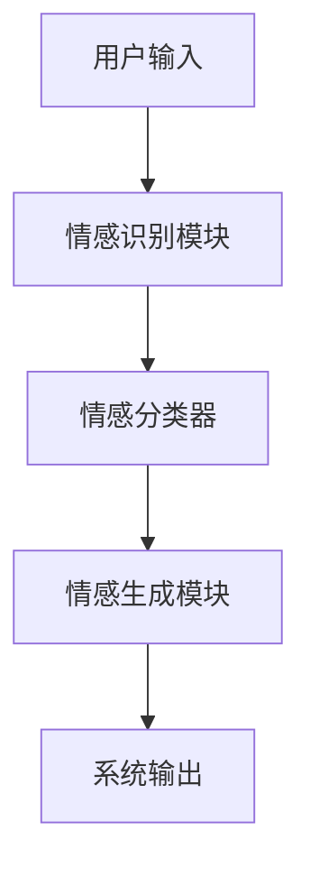
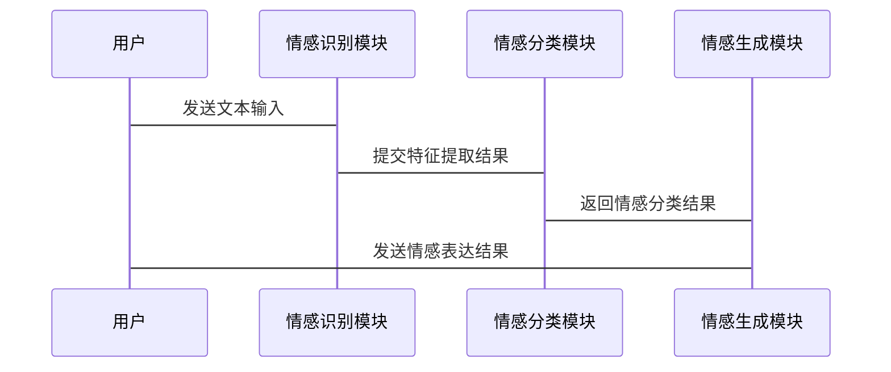

                 

# {{AI Agent的情感计算：理解和表达情感}}

> 关键词：情感计算、AI Agent、自然语言处理、机器学习、深度学习

> 摘要：AI Agent的情感计算旨在让机器能够理解并表达人类情感，本文将从背景、核心概念、算法原理、系统架构到项目实战，全面解析情感计算的实现过程。

---

# 第四章: 情感计算的系统分析与架构设计

## 4.1 情感计算系统的功能设计

### 4.1.1 系统功能模块划分

为了实现AI Agent的情感计算功能，我们需要设计一个模块化的系统，每个模块负责特定的任务。以下是系统的功能模块划分：

- **情感识别模块**：负责接收输入文本，提取情感特征，并进行情感分类。
- **情感分类模块**：基于训练好的模型，对输入文本进行情感分类，输出情感类型和强度。
- **情感生成模块**：根据情感分类结果，生成相应的情感表达，如文本回复或情感反馈。
- **上下文理解模块**：负责处理上下文信息，确保情感计算在对话中的连贯性和一致性。

### 4.1.2 情感识别模块设计

情感识别模块是系统的核心部分，其功能包括：

1. **文本预处理**：去除停用词、标点符号，进行分词和词干提取。
2. **特征提取**：提取文本中的情感相关特征，如情感词汇、句式结构等。
3. **情感分类**：使用机器学习或深度学习模型对文本进行情感分类。

### 4.1.3 情感表达模块设计

情感表达模块负责根据分类结果生成适当的情感表达，包括：

1. **情感文本生成**：根据情感类型和强度生成回复文本。
2. **情感反馈生成**：生成非文本形式的情感反馈，如表情符号或语音语调。

---

## 4.2 情感计算系统的架构设计

### 4.2.1 系统架构图

以下是系统的总体架构图，展示了各个模块之间的关系：

### 4.2.2 系统功能模块交互流程

系统功能模块的交互流程如下：

1. 用户输入文本或语音信号。
2. 情感识别模块接收输入并提取情感特征。
3. 情感分类模块对特征进行分类，输出情感类型和强度。
4. 情感生成模块根据分类结果生成情感表达。
5. 系统输出最终的情感表达结果。

### 4.2.3 系统架构的扩展性设计

为了系统的高可用性和可扩展性，我们采用微服务架构设计：

- 每个功能模块独立运行，通过API进行通信。
- 支持水平扩展，根据负载自动调整资源分配。
- 支持模块的热替换和在线更新。

---

## 4.3 情感计算系统的接口设计

### 4.3.1 系统接口设计

以下是系统的接口设计：

- **输入接口**：
  - 文本输入：`POST /api/text-input`
  - 语音输入：`POST /api/audio-input`
- **输出接口**：
  - 文本输出：`GET /api/text-output`
  - 情感反馈：`GET /api/emotion-feedback`

### 4.3.2 系统交互序列图

以下是系统的交互序列图，展示了用户与系统之间的交互流程：

---

## 4.4 本章小结

本章详细介绍了情感计算系统的功能设计、架构设计和接口设计。通过模块化设计和微服务架构，我们确保了系统的高可用性和可扩展性。系统的交互流程清晰，功能模块之间的通信通过标准接口实现，为后续的项目开发奠定了坚实的基础。

---

# 作者

作者：AI天才研究院/AI Genius Institute  
禅与计算机程序设计艺术/Zen And The Art of Computer Programming

--- 

（以下为文章正文部分，持续更新中…）

