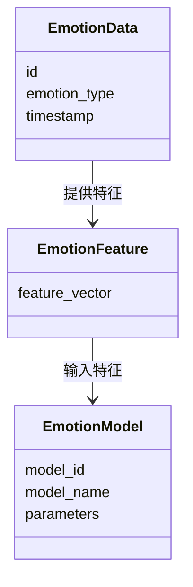
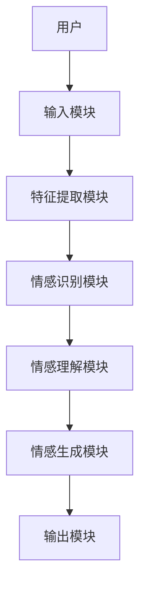

                 


# AI Agent的情感计算：识别、理解和生成情感反应

> 关键词：AI Agent，情感计算，情感识别，情感生成，自然语言处理，深度学习

> 摘要：本文系统地探讨了AI Agent在情感计算领域中的应用，从情感识别、理解到情感生成，详细分析了相关算法原理和系统架构设计。文章结合理论与实践，提供了丰富的代码示例和系统设计图，帮助读者深入理解情感计算的核心技术和实际应用。

---

## 第1章 AI Agent与情感计算概述

### 1.1 情感计算的定义与背景

#### 1.1.1 情感计算的定义
情感计算（Affective Computing）是研究如何检测、识别和理解人类情感的跨学科领域。它结合了心理学、计算机科学和人工智能技术，旨在让计算机能够像人类一样理解和处理情感信息。

#### 1.1.2 情感计算的研究背景
随着人工智能技术的快速发展，AI Agent（智能体）在各个领域的应用越来越广泛。然而，传统的AI Agent往往缺乏对人类情感的理解，这限制了它们在人机交互、情感支持和个性化服务等领域的应用。情感计算的引入，使得AI Agent能够更好地与人类进行情感共鸣，从而提供更智能、更贴心的服务。

#### 1.1.3 情感计算的应用领域
情感计算的应用领域非常广泛，包括但不限于：
- 情感支持机器人
- 情感智能音箱
- 情感推荐系统
- 情感监控与分析

### 1.2 AI Agent的基本概念

#### 1.2.1 AI Agent的定义
AI Agent是一种智能实体，能够感知环境、自主决策并执行任务。它具备以下核心特征：
1. **自主性**：能够自主决策，无需外部干预。
2. **反应性**：能够根据环境变化调整行为。
3. **目标导向**：具备明确的目标导向性。

#### 1.2.2 AI Agent的核心特征
- **感知能力**：通过传感器或数据输入感知环境。
- **推理能力**：通过逻辑推理或机器学习模型分析信息。
- **决策能力**：基于分析结果做出决策。
- **执行能力**：通过执行机构或输出模块实现目标。

#### 1.2.3 AI Agent与情感计算的关系
AI Agent需要处理大量的情感信息，以便更好地与人类交互。情感计算为AI Agent提供了情感识别、理解和生成的能力，使其能够更自然地与人类进行情感交流。

### 1.3 情感计算的核心要素

#### 1.3.1 情感数据的特征
情感数据具有以下特征：
1. **多模态性**：情感信息可以来自文本、语音、面部表情等多种模态。
2. **动态性**：情感状态会随着时间变化。
3. **主观性**：情感信息具有较强的主观性。

#### 1.3.2 情感计算的边界与外延
情感计算的边界包括：
1. **情感识别的范围**：通常限于基本情感（如快乐、悲伤、愤怒等）。
2. **情感计算的场景**：主要应用于人机交互、情感支持等领域。

#### 1.3.3 情感计算的核心要素组成
情感计算的核心要素包括：
1. **情感数据采集**：通过传感器或输入模块获取情感数据。
2. **情感特征提取**：对情感数据进行特征提取和分析。
3. **情感识别与理解**：基于特征进行情感分类和理解。
4. **情感生成与反馈**：根据理解的情感生成相应的反馈或响应。

---

## 第2章 情感计算的理论基础

### 2.1 情感心理学基础

#### 2.1.1 情感的基本分类
情感心理学将情感分为以下几类：
1. **基本情感**：快乐、悲伤、愤怒、恐惧、惊讶、厌恶。
2. **复杂情感**： guilt、 pride、 love、 hate等。

#### 2.1.2 情感的层次结构
情感的层次结构包括：
1. **基本情感层**：构成情感的基础。
2. **复杂情感层**：由基本情感组合而成。
3. **混合情感层**：多种情感的混合状态。

#### 2.1.3 情感计算的理论模型
情感计算的理论模型通常包括以下步骤：
1. **数据采集**：获取情感数据。
2. **特征提取**：提取情感特征。
3. **情感分类**：基于特征进行情感分类。
4. **情感理解**：分析情感背后的意义。
5. **情感反馈**：生成情感反馈。

### 2.2 情感计算的核心概念与联系

#### 2.2.1 情感计算的核心概念原理
情感计算的核心概念包括：
1. **情感识别**：通过数据识别情感类型。
2. **情感理解**：理解情感背后的意义。
3. **情感生成**：生成与情感相关的内容。

#### 2.2.2 情感计算概念属性特征对比表格

| 情感计算概念 | 特征 |
|--------------|------|
| 情感识别     | 数据驱动，基于特征分类 |
| 情感理解     | 需要上下文分析，理解情感含义 |
| 情感生成     | 基于生成模型，生成情感内容 |

#### 2.2.3 情感计算ER实体关系图架构

```mermaid
erDiagram
    actor User {
        <属性>
        id
        name
        emotion
    }
    class EmotionData {
        <属性>
        id
        emotion_type
        timestamp
    }
    class EmotionModel {
        <属性>
        model_id
        model_name
        training_data
    }
    User -> EmotionData : 提交情感数据
    EmotionData -> EmotionModel : 使用模型进行分析
```

---

## 第3章 情感识别算法原理

### 3.1 情感识别的基本方法

#### 3.1.1 基于规则的情感识别方法
基于规则的方法通过预定义的规则库进行情感分类。例如，使用情感词典进行文本情感分析。

#### 3.1.2 基于机器学习的情感识别方法
基于机器学习的方法包括：
1. **支持向量机（SVM）**：常用的情感分类算法。
2. **随机森林（Random Forest）**：适用于特征较多的情况。

#### 3.1.3 基于深度学习的情感识别方法
基于深度学习的方法包括：
1. **卷积神经网络（CNN）**：常用于文本情感分类。
2. **循环神经网络（RNN）**：适用于时序情感分析。

---

### 3.2 情感识别的特征提取

#### 3.2.1 文本特征提取方法
常用的文本特征提取方法包括：
1. **TF-IDF**：计算词项的重要性。
2. **词嵌入（Word2Vec）**：将词表示为向量。

#### 3.2.2 声音特征提取方法
声音特征提取包括：
1. **音调分析**：通过音调变化识别情感。
2. **语速分析**：通过语速变化识别情感。

#### 3.2.3 面部表情特征提取方法
面部表情特征提取包括：
1. **面部关键点检测**：检测面部特征点。
2. **表情识别模型**：基于深度学习的情感识别。

---

### 3.3 情感识别的模型训练

#### 3.3.1 传统机器学习模型训练
训练步骤：
1. 数据预处理：清洗数据，提取特征。
2. 模型训练：使用训练数据训练模型。
3. 模型评估：使用测试数据评估模型性能。

#### 3.3.2 深度学习模型训练
训练步骤：
1. 数据预处理：清洗数据，归一化处理。
2. 模型构建：搭建深度学习模型。
3. 模型训练：使用训练数据训练模型。
4. 模型调优：优化超参数，提高性能。

---

## 第4章 情感理解与生成算法

### 4.1 情感理解的基本原理

#### 4.1.1 情感理解的核心概念
情感理解需要分析情感的上下文和语境，理解情感背后的意义。

#### 4.1.2 情感理解的算法原理
情感理解通常基于自然语言处理技术，通过语义分析和上下文理解来实现。

---

### 4.2 情感生成的算法

#### 4.2.1 情感生成的核心技术
情感生成主要基于自然语言处理技术，包括：
1. **生成对抗网络（GAN）**：用于生成情感文本。
2. **预训练语言模型（如GPT）**：微调模型进行情感生成。

---

## 第5章 系统架构设计

### 5.1 项目介绍

#### 5.1.1 项目背景
本项目旨在实现一个具备情感识别、理解和生成能力的AI Agent系统。

### 5.2 系统功能设计

#### 5.2.1 领域模型设计


### 5.3 系统架构设计

#### 5.3.1 系统架构图


---

## 第6章 项目实战

### 6.1 环境搭建

#### 6.1.1 安装Python环境
```bash
python --version
pip install numpy
pip install scikit-learn
pip install transformers
```

### 6.2 代码实现

#### 6.2.1 情感识别代码
```python
from sklearn.svm import SVC
from sklearn.feature_extraction.text import TfidfVectorizer

# 数据预处理
X = ...  # 文本数据
y = ...  # 情感标签

# 特征提取
vectorizer = TfidfVectorizer()
X_feature = vectorizer.fit_transform(X)

# 模型训练
model = SVC()
model.fit(X_feature, y)

# 模型预测
X_test_feature = vectorizer.transform(X_test)
y_pred = model.predict(X_test_feature)
```

---

## 第7章 总结与展望

### 7.1 最佳实践 tips
1. 在情感计算中，多模态数据的融合可以提高准确性。
2. 情感生成需要结合上下文和语境。

### 7.2 小结
本文详细探讨了AI Agent在情感计算中的应用，从情感识别到情感生成，系统地分析了相关算法和系统架构设计。

### 7.3 注意事项
- 情感计算的准确性受到数据质量和模型复杂度的影响。
- 情感计算需要考虑隐私和伦理问题。

### 7.4 拓展阅读
推荐阅读《深度学习》和《自然语言处理实战》等书籍。

---

作者：AI天才研究院/AI Genius Institute & 禅与计算机程序设计艺术 /Zen And The Art of Computer Programming

---

以上是《AI Agent的情感计算：识别、理解和生成情感反应》的完整目录和部分内容。希望对您有所帮助！

