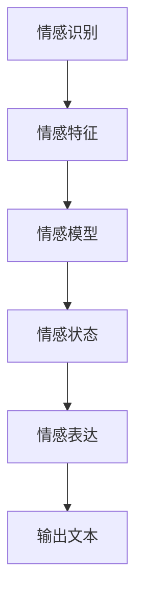
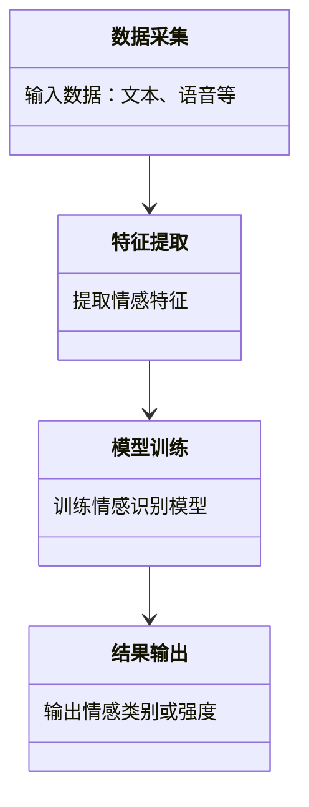

                 


# AI Agent的情感识别与表达机制

> 关键词：AI Agent, 情感识别, 情感表达, 情感计算, 深度学习, 人机交互

> 摘要：本文详细探讨了AI Agent在情感识别与表达机制中的核心原理与实现方法，从背景介绍、核心概念、算法原理、系统架构到项目实战，全面解析情感计算的关键技术与应用实践。

---

# 第一部分: AI Agent情感识别与表达机制的背景与核心概念

## 第1章: 情感识别与表达机制的背景介绍

### 1.1 问题背景与描述

#### 1.1.1 人机交互中的情感需求
在人机交互场景中，用户不仅需要完成任务，还期望与AI Agent进行情感上的互动。例如，在智能客服、虚拟助手和社交机器人等场景中，用户希望AI Agent能够理解并回应他们的情感需求。

#### 1.1.2 情感计算的研究现状
情感计算（Affective Computing）是人工智能领域的重要分支，旨在赋予计算机理解和处理人类情感的能力。近年来，随着深度学习技术的发展，情感计算在多个领域取得了显著进展。

#### 1.1.3 AI Agent在情感交互中的重要性
AI Agent需要具备情感识别与表达能力，才能更好地满足用户的情感需求，提升用户体验。例如，在情感支持类应用中，AI Agent需要能够识别用户的悲伤情绪并提供相应的安慰。

---

### 1.2 问题解决与边界

#### 1.2.1 情感识别的核心问题
情感识别的核心问题是通过分析输入（如文本、语音或图像）来判断用户的情感状态（如快乐、悲伤、愤怒等）。这些情感状态可以进一步细分为情感类型和情感强度。

#### 1.2.2 情感表达的实现边界
情感表达是指AI Agent通过输出（如文本、语音或动作）来传递特定情感状态的能力。情感表达的实现边界包括如何选择合适的情感表达方式以及如何确保表达的自然性和可理解性。

#### 1.2.3 情感计算的外延与限制
情感计算不仅包括情感识别和情感表达，还包括情感分析、情感推理等任务。然而，情感计算的外延和限制也需要注意，例如情感计算目前主要基于输入数据的特征，难以完全理解人类复杂的情感状态。

---

### 1.3 情感识别与表达机制的概念结构

#### 1.3.1 情感计算的基本要素
情感计算的基本要素包括：
- **输入数据**：如文本、语音、图像等。
- **情感特征**：如情感类别（快乐、悲伤等）和情感强度。
- **情感模型**：用于情感识别和情感生成的算法或模型。

#### 1.3.2 情感识别与表达的关系
情感识别是情感表达的基础，而情感表达是情感识别的延伸。AI Agent需要先识别用户的情感状态，才能进行相应的情感表达。

#### 1.3.3 情感计算的系统架构
情感计算的系统架构通常包括数据采集、特征提取、模型训练和结果输出四个模块。

---

## 第2章: 情感计算的核心概念与原理

### 2.1 情感识别的基本原理

#### 2.1.1 基于规则的情感识别方法
基于规则的情感识别方法通过预定义的情感词汇表和规则来判断情感状态。例如，当文本中出现“开心”、“高兴”等词汇时，系统可以判断用户的情感为快乐。

#### 2.1.2 基于机器学习的情感识别方法
基于机器学习的情感识别方法利用训练好的模型来分类情感状态。常用的模型包括支持向量机（SVM）和朴素贝叶斯（Naive Bayes）等。

#### 2.1.3 深度学习在情感识别中的应用
深度学习模型（如LSTM和Transformer）在情感识别中表现出色，能够捕捉文本中的语义信息和情感特征。

---

### 2.2 情感表达的实现机制

#### 2.2.1 情感生成的基本原理
情感生成是指AI Agent根据情感状态生成相应的文本或语音。例如，当用户表达悲伤时，AI Agent可以通过生成安慰的话语来回应。

#### 2.2.2 基于模板的情感表达方法
基于模板的情感表达方法通过预定义的模板和规则来生成情感表达内容。这种方法简单易实现，但缺乏灵活性。

#### 2.2.3 基于生成模型的情感表达
基于生成模型的情感表达方法利用深度学习模型（如GPT）生成多样化的情感表达内容。这种方法能够生成更自然、更贴近人类表达的文本。

---

### 2.3 情感计算的核心概念对比

#### 2.3.1 情感识别与情感生成的对比
| 对比维度 | 情感识别 | 情感生成 |
|----------|----------|----------|
| 目标     | 判断情感状态 | 生成情感内容 |
| 输入     | 文本、语音等 | 情感状态 |
| 输出     | 情感类别或强度 | 文本或语音 |

#### 2.3.2 基于规则与基于数据驱动的方法对比
| 对比维度 | 基于规则 | 基于数据驱动 |
|----------|----------|------------|
| 实现复杂度 | 低 | 高 |
| 灵活性     | 低 | 高 |
| 需要数据   | 少 | 大 |

---

## 第3章: 情感计算的核心概念与联系

### 3.1 情感计算的实体关系图



---

### 3.2 情感计算的核心概念联系

#### 3.2.1 情感识别与情感生成的关系
情感识别是情感生成的基础，情感生成是情感识别的延伸。AI Agent需要先识别用户的情感状态，才能进行相应的情感表达。

#### 3.2.2 情感计算与其他AI技术的联系
情感计算与自然语言处理（NLP）、机器学习和深度学习等技术密切相关。例如，情感计算可以利用NLP技术提取文本特征，利用机器学习模型进行情感分类。

---

## 第4章: 情感计算的系统架构与实现

### 4.1 情感计算的系统架构



---

### 4.2 情感计算的实现步骤

#### 4.2.1 数据预处理
数据预处理包括文本清洗、分词和特征提取等步骤。

#### 4.2.2 模型训练
模型训练包括选择合适的算法（如SVM、LSTM等）并训练情感识别模型。

#### 4.2.3 情感生成
情感生成包括根据情感状态生成相应的文本或语音。

---

## 第5章: 情感计算的数学模型与公式

### 5.1 情感强度计算公式

$$ \text{情感强度} = \sum_{i=1}^{n} w_i \times f_i $$

其中，$w_i$ 是特征 $f_i$ 的权重。

---

### 5.2 情感分类的概率模型

$$ P(y|x) = \prod_{i=1}^{n} P(x_i|y) $$

其中，$y$ 是情感类别，$x$ 是输入数据。

---

# 第二部分: AI Agent情感识别与表达机制的算法实现

## 第6章: 情感识别的算法实现

### 6.1 基于词典的情感识别算法

```python
def情感识别(文本):
    词典 = 加载情感词典()
    分数 = 0
    对于每个词 in 文本:
        如果词在词典中:
            分数 += 词典[词]
    情感强度 = 分数 / len(文本)
    返回 情感强度
```

---

### 6.2 基于机器学习的情感识别算法

```python
from sklearn.svm import SVC

def训练情感分类器(训练数据, 标签):
    分类器 = SVC()
    分类器.fit(训练数据, 标签)
    返回 分类器

def预测情感(测试数据, 分类器):
    预测标签 = 分类器.predict(测试数据)
    返回 预测标签
```

---

## 第7章: 情感表达的算法实现

### 7.1 基于模板的情感表达方法

```python
def生成情感表达(情感状态):
    模板库 = 加载模板库()
    随机选择一个模板
    替换模板中的占位符
    返回 生成文本
```

---

### 7.2 基于生成模型的情感表达方法

```python
from transformers import GPT2Tokenizer, GPT2ModelWithLMHead

def生成情感表达(情感状态):
    tokenizer = GPT2Tokenizer.from_pretrained('gpt2')
    model = GPT2ModelWithLMHead.from_pretrained('gpt2')
    输入文本 = "根据情感状态生成相应的文本："
    输入id = tokenizer.encode(输入文本, add_special_tokens=True)
    outputs = model.generate(input_ids=input_id, max_length=50)
    生成文本 = tokenizer.decode(outputs[0], skip_special_tokens=True)
    返回 生成文本
```

---

# 第三部分: 项目实战与应用

## 第8章: 项目实战: 构建一个简单的AI Agent情感分类器

### 8.1 环境安装

```bash
pip install numpy scikit-learn transformers
```

---

### 8.2 核心代码实现

```python
from sklearn.feature_extraction.text import TfidfVectorizer
from sklearn.svm import SVC
from sklearn.metrics import accuracy_score

def训练情感分类器(训练数据, 标签):
    向量器 = TfidfVectorizer()
    训练特征 = 向量器.fit_transform(训练数据)
    分类器 = SVC()
    分类器.fit(训练特征.toarray(), 标签)
    返回 分类器, 向量器

def测试情感分类器(测试数据, 分类器, 向量器):
    测试特征 = 向量器.transform(测试数据)
    预测标签 = 分类器.predict(测试特征.toarray())
    返回 预测标签
```

---

### 8.3 项目小结

通过本项目，我们实现了一个简单的AI Agent情感分类器。该分类器可以对输入文本进行情感分类，识别出情感类别（如快乐、悲伤等）。未来可以进一步优化模型，引入深度学习技术，提升情感识别的准确率。

---

# 第四部分: 最佳实践与总结

## 第9章: 最佳实践与总结

### 9.1 小结
情感识别与表达是AI Agent实现人机交互的重要环节。通过本文的探讨，我们了解了情感计算的核心概念、算法原理和系统架构，并通过项目实战掌握了情感分类器的实现方法。

### 9.2 注意事项
在实际应用中，需要注意以下几点：
- 数据的质量和多样性
- 模型的可解释性和透明度
- 用户隐私和数据安全

### 9.3 拓展阅读
推荐以下资源进行深入学习：
- 情感计算的经典论文
- 最新的研究成果和技术创新
- 相关技术书籍和课程

---

作者：AI天才研究院/AI Genius Institute & 禅与计算机程序设计艺术 /Zen And The Art of Computer Programming

