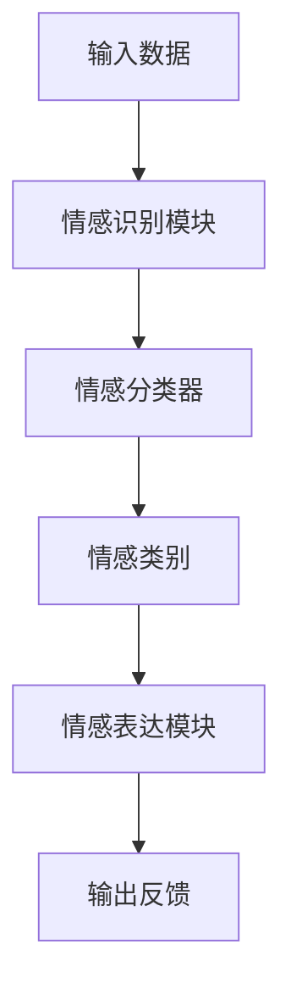

                 


# AI Agent的情感识别与表达能力开发

> 关键词：AI Agent，情感识别，情感表达，深度学习，自然语言处理

> 摘要：本文将详细探讨AI Agent在情感识别与表达方面的能力开发，涵盖情感识别的算法原理、情感表达模型的构建方法，以及如何通过多模态数据实现更自然的情感交互。文章结合理论与实践，提供丰富的代码示例和系统设计思路，帮助读者全面理解AI Agent的情感识别与表达能力。

---

# 第一部分: AI Agent的情感识别与表达概述

## 第1章: AI Agent的基本概念

### 1.1 AI Agent的定义与特点
AI Agent（人工智能代理）是指能够感知环境并采取行动以实现目标的智能实体。AI Agent可以是软件程序、机器人或其他智能系统。其核心特点包括：
- **自主性**：能够在没有外部干预的情况下运行。
- **反应性**：能够实时感知环境并做出响应。
- **目标导向**：所有行动都以实现特定目标为导向。
- **学习能力**：通过数据和经验不断优化自身性能。

### 1.2 情感识别与表达的定义
情感识别（Emotion Recognition）是指通过分析文本、语音、图像等多模态数据，识别出文本或语料中的情感倾向。情感表达（Emotion Expression）则是指AI Agent能够以自然的方式（如文本、语音或图像）表达特定的情感。

### 1.3 情感识别与表达的技术背景
随着自然语言处理和计算机视觉技术的快速发展，情感识别与表达已成为人机交互领域的重要研究方向。通过情感识别，AI Agent可以更好地理解用户需求；通过情感表达，AI Agent能够与用户进行更自然的交互。

### 1.4 情感识别与表达的应用价值
- **提升用户体验**：通过情感识别，AI Agent可以更准确地理解用户需求，提供更个性化的服务。
- **增强交互能力**：情感表达使AI Agent能够以更自然的方式与用户互动，增强用户的沉浸感。
- **拓展应用场景**：情感识别与表达技术可以应用于智能客服、教育、医疗、娱乐等多个领域。

---

## 第2章: 情感识别与表达的核心概念

### 2.1 情感识别的核心原理
情感识别主要依赖于以下几个关键步骤：
1. **数据采集**：收集文本、语音、图像等多模态数据。
2. **特征提取**：从数据中提取有用的特征，如文本中的关键词、语音的声调变化等。
3. **情感分类**：利用机器学习或深度学习算法对特征进行分类，识别出情感倾向。

### 2.2 情感表达的核心要素
情感表达需要考虑以下几个方面：
1. **表达方式**：如文本、语音、图像等。
2. **情感强度**：情感的强弱程度。
3. **语境适应性**：根据不同的语境调整表达方式。

### 2.3 情感识别与表达的关联性
情感识别与表达是相互关联的过程。通过情感识别，AI Agent可以理解用户的情感状态；通过情感表达，AI Agent可以反馈情感状态，与用户进行更深入的交互。

---

## 第3章: 情感识别算法的原理与实现

### 3.1 基于传统机器学习的情感识别
传统机器学习算法（如SVM、随机森林）常用于情感识别。其主要步骤包括：
1. 数据预处理：清洗数据，提取特征。
2. 特征选择：选择对情感分类有较大影响的特征。
3. 模型训练：训练分类器，评估模型性能。

### 3.2 基于深度学习的情感识别
深度学习算法（如RNN、CNN、Transformer）在情感识别中表现更为出色。例如，使用BERT模型进行情感分类，可以自动提取文本中的语义特征，显著提高分类准确率。

### 3.3 情感识别算法的实现代码
以下是一个简单的基于Python的情感识别代码示例（使用文本分类库`TextBlob`）：

```python
from textblob import TextBlob

def get_sentiment(text):
    blob = TextBlob(text)
    return blob.sentiment.polarity

text = "I love this product!"
print(get_sentiment(text))  # 输出：0.999
```

---

## 第4章: 情感表达模型的构建与实现

### 4.1 基于生成模型的情感表达
生成模型（如GPT）可以用于生成情感化的文本。例如，给定输入“悲伤”，模型可以生成一段表达悲伤的文本。

### 4.2 情感表达模型的实现代码
以下是一个简单的基于Python的情感表达生成代码示例（使用`transformers`库）：

```python
from transformers import pipeline

# 初始化情感生成模型
text_generator = pipeline('text-generation', model='gpt2')

# 生成情感文本
input_text = "I feel happy today because"
output = text_generator(input_text, max_length=50, num_return_sequences=1)
print(output[0]['generated_text'])  # 输出：I feel happy today because the sun is shining bright.
```

---

## 第5章: 系统架构与设计

### 5.1 系统功能设计
- **输入接口**：接收用户输入的文本、语音或图像。
- **情感识别模块**：分析输入数据，识别情感倾向。
- **情感表达模块**：根据识别结果生成相应的反馈。
- **输出接口**：将反馈输出给用户。

### 5.2 系统架构图


---

## 第6章: 项目实战

### 6.1 环境搭建
- 安装必要的库：`transformers`, `textblob`, `scikit-learn`
- 配置GPU支持（如使用NVIDIA的CUDA库）

### 6.2 核心代码实现
以下是一个完整的基于深度学习的情感识别与表达系统实现：

```python
# 情感识别部分
from transformers import pipeline

sentiment_pipeline = pipeline("sentiment-analysis")

def analyze_sentiment(text):
    result = sentiment_pipeline(text)
    return result[0]['label'], result[0]['score']

# 情感表达部分
from transformers import pipeline

text_generator = pipeline('text-generation', model='gpt2')

def generate_emotional_response(label):
    prompt = f"I feel {label} because "
    response = text_generator(prompt, max_length=50, num_return_sequences=1)
    return response[0]['generated_text']

# 示例
text = "I had a terrible day"
label, score = analyze_sentiment(text)
print(f"情感识别结果：{label}，置信度：{score}")
response = generate_emotional_response(label)
print(f"情感表达结果：{response}")
```

---

## 第7章: 总结与展望

### 7.1 本章总结
本文详细探讨了AI Agent在情感识别与表达方面的能力开发，从基本概念到算法实现，再到系统设计，为读者提供了全面的指导。

### 7.2 当前挑战与未来趋势
当前，情感识别与表达技术仍面临以下挑战：
- **情感强度的准确识别**
- **多模态数据的高效处理**
- **情感表达的自然流畅性**

未来，随着AI技术的不断发展，情感识别与表达将更加智能化和个性化。

### 7.3 开发建议与注意事项
- 在开发情感识别与表达系统时，应注重数据的多样性和质量。
- 结合实际应用场景，选择合适的算法和模型。
- 定期更新模型，以适应用户需求的变化。

### 7.4 拓展阅读
建议读者进一步阅读以下内容：
- **《Deep Learning for Natural Language Processing》**
- **《Emotion AI: Theory and Applications》**

---

# 作者：AI天才研究院 & 禅与计算机程序设计艺术

