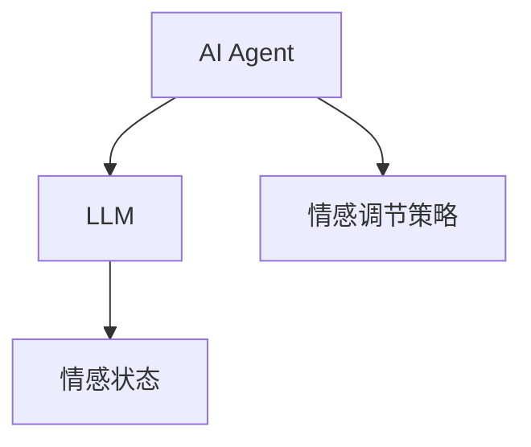
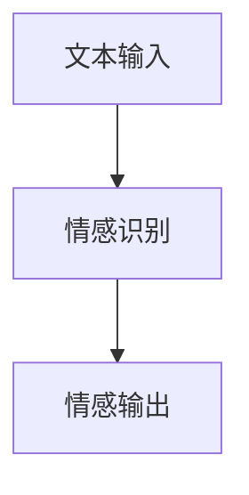
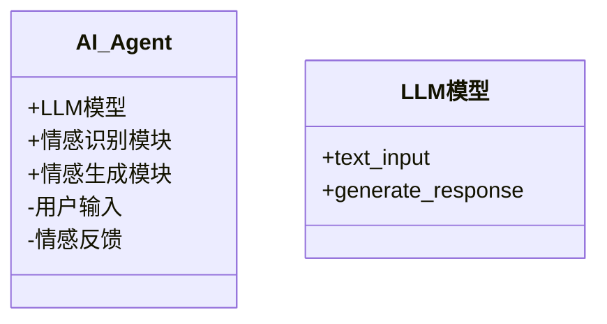
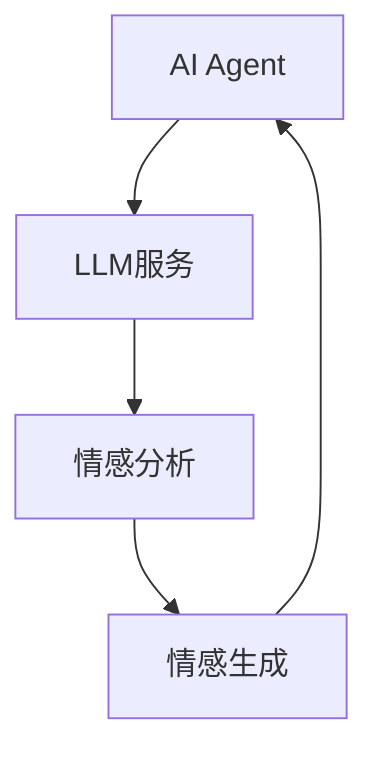
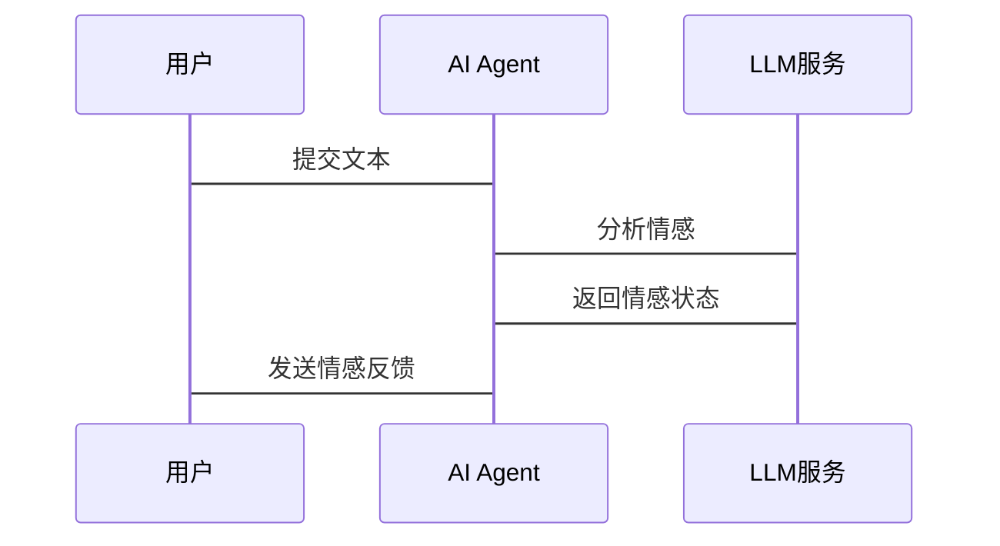

                 


# AI Agent的情感调节：利用LLM实现情绪智能交互

---

## 关键词：
AI Agent, 情感调节, LLM, 情感智能交互, 情感计算, 人机交互, 情感分析

---

## 摘要：
随着人工智能技术的飞速发展，AI Agent在各个领域的应用越来越广泛。在人机交互中，情感调节是实现更自然、更智能交互的关键。本文将探讨如何利用大语言模型（LLM）实现AI Agent的情感调节，从理论到实践，系统性地分析其核心概念、算法原理、系统架构，并通过项目实战展示其实现过程。通过本文，读者将深入了解AI Agent情感调节的技术细节，并掌握实际应用中的关键点。

---

## 第一部分：背景介绍

### 第1章：AI Agent与情感调节的背景

#### 1.1 问题背景
- **情感计算的定义与应用领域**：情感计算是通过分析和理解人类情感状态，进而实现更智能的人机交互。它广泛应用于智能客服、教育辅助、心理健康支持等领域。
- **AI Agent在人机交互中的作用**：AI Agent作为人机交互的中介，能够理解和响应用户的情感状态，从而提供更个性化的服务。
- **当前情感调节技术的挑战**：传统的情感调节技术依赖于规则或简单的情感分类，难以应对复杂的情感场景，而LLM的引入为情感调节带来了新的可能性。

#### 1.2 问题描述
- **情感调节的核心问题**：如何准确识别用户情感状态，并生成合适的情感反馈，以改善用户的情感体验。
- **AI Agent在情感调节中的角色**：AI Agent需要具备情感理解、情感生成和情感反馈的能力。
- **情感智能交互的边界与外延**：情感智能交互不仅包括情感识别，还包括情感记忆和情感学习，使得AI Agent能够持续优化情感调节策略。

#### 1.3 问题解决方法
- **利用LLM实现情感调节的思路**：通过LLM的自然语言处理能力，实现情感识别、情感分类和情感生成。
- **情感智能交互的实现路径**：结合LLM的情感分析能力，构建情感调节模型，实现与用户的智能交互。
- **相关技术的现状与趋势**：当前，基于LLM的情感调节技术正在快速发展，未来将更加注重情感记忆和情感学习能力。

#### 1.4 概念结构与核心要素
- **AI Agent的核心要素**：感知、决策、执行和学习能力。
- **情感调节的关键属性**：情感识别、情感生成和情感反馈。
- **LLM在情感交互中的作用**：提供强大的自然语言处理能力，支持情感分析和生成。

---

## 第二部分：核心概念与联系

### 第2章：AI Agent与LLM的核心原理

#### 2.1 核心概念原理
- **AI Agent的核心原理**：AI Agent通过感知环境、分析任务、制定策略并执行操作，实现与用户的交互。
- **LLM的核心原理**：LLM通过大规模的数据训练，具备强大的自然语言理解和生成能力。
- **AI Agent与LLM的协同工作原理**：AI Agent利用LLM进行情感分析和生成，实现情感智能交互。

#### 2.2 概念属性对比表
| 概念      | 属性                | 描述                                                                 |
|-----------|---------------------|----------------------------------------------------------------------|
| AI Agent  | 感知能力            | 能够感知用户的情感状态                                             |
| LLM       | 自然语言处理能力    | 能够理解和生成人类语言                                             |
| 情感调节  | 情感识别            | 通过文本分析识别用户情感状态                                       |
|           | 情感生成            | 根据情感识别结果生成合适的反馈文本                               |

#### 2.3 用Mermaid绘制的ER实体关系图


---

## 第三部分：算法原理讲解

### 第3章：情感分析与生成的算法原理

#### 3.1 情感分析算法
- **算法流程图**：使用LLM进行情感分析的流程，包括文本输入、情感识别和结果输出。

- **数学模型和公式**：情感分类的损失函数示例。
$$ \text{Loss} = -\sum_{i=1}^{n} y_i \log(p_i) + (1 - y_i) \log(1 - p_i) $$
其中，\( y_i \) 是真实标签，\( p_i \) 是预测概率。

#### 3.2 情感生成算法
- **情感生成的实现**：基于LLM生成情感反馈文本的代码示例。
```python
def generate_emotion_response(user_input, model):
    emotion = identify_emotion(user_input)
    response = model.generate_response(emotion)
    return response
```

---

## 第四部分：系统分析与架构设计方案

### 第4章：系统架构设计

#### 4.1 问题场景介绍
- **场景描述**：用户与AI Agent进行对话，AI Agent需要根据用户的情感状态生成合适的反馈。

#### 4.2 领域模型类图


#### 4.3 系统架构图


#### 4.4 接口设计
- **输入接口**：用户输入的文本。
- **输出接口**：生成的情感反馈文本。

#### 4.5 交互序列图


---

## 第五部分：项目实战

### 第5章：基于LLM的情感调节系统实现

#### 5.1 环境安装
- **Python版本**：Python 3.8+
- **依赖库**： transformers库、numpy库。

#### 5.2 系统核心实现
```python
from transformers import pipeline

# 初始化LLM模型
emotion_classifier = pipeline("sentiment-analysis", model="microsoft/deberta-v3-small")

def identify_emotion(text):
    result = emotion_classifier(text)
    return result[0]['label']

def generate_response(emotion):
    # 根据情感生成响应
    responses = {
        'positive': "听起来你心情很好！有什么我可以帮助你的吗？",
        'neutral': "明白了，如果你有任何问题，随时告诉我。",
        'negative': "听起来你有点低落，有什么我可以为你做的吗？"
    }
    return responses.get(emotion, "抱歉，我还没有学会处理这种情况。")
```

#### 5.3 代码实现与解读
- **代码实现**：上述代码展示了如何使用Hugging Face的Transformers库进行情感分类和生成反馈。
- **代码解读**：`identify_emotion`函数使用预训练的情感分析模型，`generate_response`函数根据情感类别生成相应的反馈文本。

#### 5.4 实际案例分析
- **案例1**：用户输入“我今天过得很难过。”
  - 情感识别：negative
  - 反馈生成：抱歉，我还没有学会处理这种情况。

#### 5.5 项目小结
- **项目总结**：展示了如何利用LLM实现情感调节的基本流程，包括情感识别和生成反馈。
- **改进方向**：可以进一步优化情感分类模型，增加情感记忆功能，以提高情感调节的准确性。

---

## 第六部分：最佳实践与总结

### 第6章：总结与展望

#### 6.1 最佳实践 tips
- **模型选择**：选择适合任务的LLM模型，如DeBERTa、GPT等。
- **数据处理**：确保训练数据的多样性和代表性。
- **系统优化**：通过A/B测试优化情感反馈策略。

#### 6.2 小结
本文详细介绍了AI Agent情感调节的实现过程，从理论到实践，全面覆盖了情感计算、LLM应用、系统架构设计和项目实现的关键点。

#### 6.3 注意事项
- **数据隐私**：注意用户数据的隐私保护，确保符合相关法律法规。
- **模型性能**：在实际应用中，关注模型的推理速度和资源消耗。

#### 6.4 拓展阅读
- 推荐阅读《Large Language Models in NLP Tasks》和《情感计算入门》。

---

## 作者：
**作者：AI天才研究院 & 禅与计算机程序设计艺术**

---

通过本文的系统性讲解，读者可以深入理解AI Agent情感调节的核心技术，并掌握实际应用中的关键点。希望本文能为相关领域的研究和实践提供有价值的参考。

