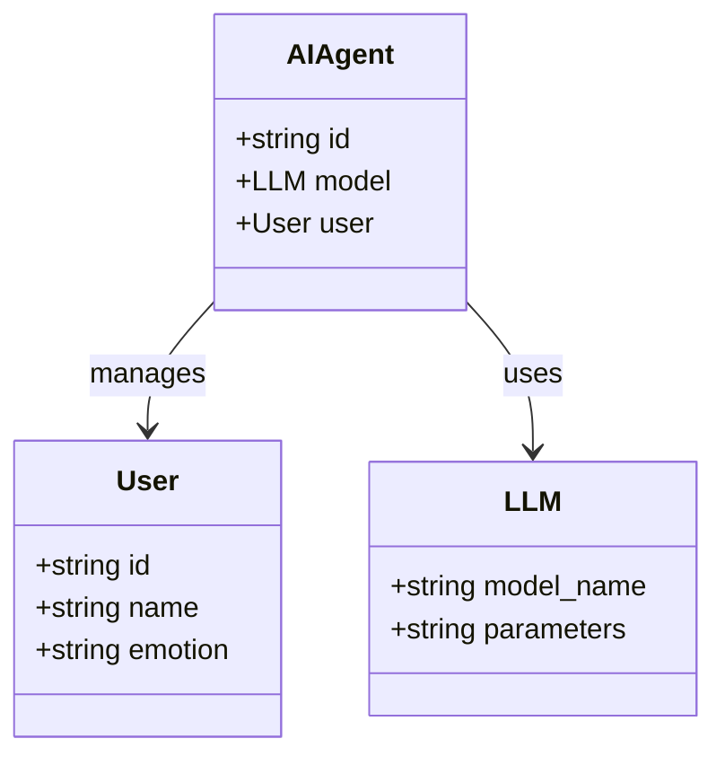
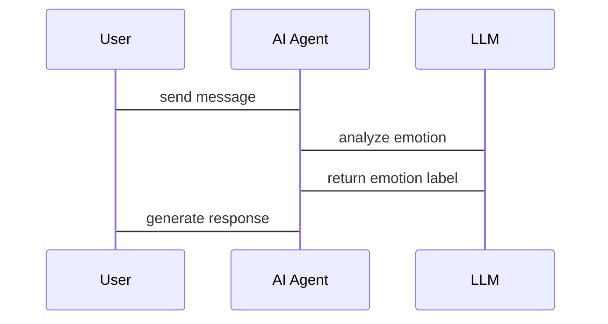

                 


# AI Agent的情感调节：利用LLM进行情绪管理

---

## 关键词：AI Agent, 情感调节, LLM, 情感分析, 情感生成, 人机交互, 情绪管理

---

## 摘要：  
随着人工智能技术的快速发展，AI Agent（人工智能代理）在情感调节领域的应用日益广泛。通过利用大语言模型（LLM）的强大能力，AI Agent能够更自然地理解和管理情感，从而为人类提供更智能、更贴心的服务。本文将从AI Agent情感调节的背景、核心概念、算法原理、系统架构到实际项目实现进行全面解析，深入探讨如何利用LLM实现情感调节，并为实际应用提供可行的解决方案。

---

# 第三章: 情感调节的算法原理与实现

## 3.1 情感调节的算法原理

### 3.1.1 情感识别的基本原理  
情感识别是情感调节的基础，其核心是通过文本、语音或视觉信息，识别出用户当前的情感状态。常用的情感识别方法包括：  
1. **文本情感分析**：通过NLP技术分析文本中的情感倾向，如使用词袋模型、TF-IDF或深度学习模型（如LSTM、Transformer）。  
2. **语音情感分析**：通过分析语音的音调、语速、停顿等特征，识别情感状态。  
3. **视觉情感分析**：通过分析面部表情、肢体语言等视觉信息，判断情感状态。  

在本章中，我们主要关注基于LLM的文本情感分析。  

### 3.1.2 情感生成的基本原理  
情感生成是指根据用户的情感状态，生成相应的回应或建议。LLM可以通过以下步骤实现情感生成：  
1. **输入情感状态**：将识别到的情感状态（如“愤怒”、“快乐”、“悲伤”）输入模型。  
2. **生成情感文本**：模型根据输入的情感状态，生成符合该情感的文本内容。  
3. **情感语气调整**：根据需要调整生成文本的语气，使其更符合目标情感。  

### 3.1.3 LLM在情感调节中的算法流程  
1. **情感识别**：使用LLM对输入文本进行情感分析，得到情感标签（如“积极”、“消极”、“中性”）。  
2. **情感生成**：根据识别到的情感状态，生成相应的回应或建议。  
3. **反馈优化**：根据用户反馈不断优化情感生成模型，提升情感调节的效果。  

---

## 3.2 情感调节算法的详细实现

### 3.2.1 情感识别的实现步骤  
1. **数据预处理**：对输入文本进行分词、去除停用词等处理。  
2. **特征提取**：提取文本的特征向量，如TF-IDF向量或词嵌入向量。  
3. **模型训练**：使用训练数据训练情感分类模型，如支持向量机（SVM）或深度学习模型（如BERT）。  

### 3.2.2 情感生成的实现步骤  
1. **情感状态输入**：将识别到的情感状态输入生成模型。  
2. **生成文本**：使用LLM生成符合情感状态的文本内容。  
3. **语气调整**：根据目标情感调整生成文本的语气和风格。  

### 3.2.3 LLM在情感调节中的具体应用  
以下是使用Python代码实现情感调节的示例：  

```python
from transformers import pipeline

# 初始化情感分析模型
sentiment_analyzer = pipeline("sentiment-analysis")

# 情感识别
text = "I am so happy!"
result = sentiment_analyzer(text)
print(result)  # 输出情感标签和概率

# 情感生成
from transformers import AutoModelForCausalLM, AutoTokenizer

model_name = "gpt2"
tokenizer = AutoTokenizer.from_pretrained(model_name)
model = AutoModelForCausalLM.from_pretrained(model_name)

# 根据情感状态生成文本
prompt = "Make me feel happy today."
inputs = tokenizer(prompt, return_tensors="np")
outputs = model.generate(inputs.input_ids, max_length=50)

generated_text = tokenizer.decode(outputs[0].tolist()[1:-1])
print(generated_text)
```

---

## 3.3 情感调节算法的数学模型与公式

### 3.3.1 情感评分的计算公式  
情感评分通常表示为一个连续值，范围在-1（极负面）到1（极正面）之间。计算公式如下：  

$$ \text{情感评分} = \frac{\sum w_i \cdot s_i}{\sum w_i} $$  

其中，$w_i$是第$i$个词的权重，$s_i$是第$i$个词的情感值。  

### 3.3.2 情感生成的概率模型  
情感生成通常基于概率模型，其概率分布可以用以下公式表示：  

$$ P(\text{生成文本} | \text{情感状态}) = \prod_{i=1}^{n} P(w_i | w_{i-1}, \text{情感状态}) $$  

其中，$w_i$是生成文本中的第$i$个词，$n$是文本长度。  

---

## 本章小结  
本章详细讲解了情感调节的算法原理与实现，包括情感识别、情感生成和LLM的应用。通过Python代码示例和数学公式，我们展示了如何利用LLM实现情感调节。接下来的章节将从系统架构和实际项目实现的角度，进一步探讨情感调节的具体实现方法。

---

# 第四章: 系统分析与架构设计方案

## 4.1 问题场景介绍  
在本章中，我们将通过一个具体的问题场景来展示情感调节系统的实现。假设我们开发一个智能客服系统，该系统需要能够理解客户的情感状态并提供相应的帮助。  

## 4.2 系统功能设计  

### 4.2.1 领域模型设计  
以下是领域模型的Mermaid类图：  



### 4.2.2 系统架构设计  
以下是系统架构的Mermaid图：  


## 4.3 系统接口设计  

### 4.3.1 API接口设计  
以下是系统接口的Mermaid序列图：  



## 4.4 本章小结  
本章通过具体的问题场景，展示了情感调节系统的功能设计、架构设计和接口设计。接下来的章节将通过实际项目实现，进一步验证我们的设计方案。

---

# 第五章: 项目实战——基于LLM的情感调节系统实现

## 5.1 环境安装  

### 5.1.1 安装必要的库  
```bash
pip install transformers numpy pandas
```

## 5.2 系统核心实现  

### 5.2.1 情感识别模块实现  
```python
from transformers import pipeline

sentiment_analyzer = pipeline("sentiment-analysis")
```

### 5.2.2 情感生成模块实现  
```python
from transformers import AutoModelForCausalLM, AutoTokenizer

model_name = "gpt2"
tokenizer = AutoTokenizer.from_pretrained(model_name)
model = AutoModelForCausalLM.from_pretrained(model_name)
```

## 5.3 代码实现与应用解读  

### 5.3.1 情感识别的代码实现  
```python
text = "I am so happy!"
result = sentiment_analyzer(text)
print(result)
```

### 5.3.2 情感生成的代码实现  
```python
prompt = "Make me feel happy today."
inputs = tokenizer(prompt, return_tensors="np")
outputs = model.generate(inputs.input_ids, max_length=50)
generated_text = tokenizer.decode(outputs[0].tolist()[1:-1])
print(generated_text)
```

## 5.4 案例分析  

### 5.4.1 情感识别案例  
```python
text = "I hate this service!"
result = sentiment_analyzer(text)
print(result)  # 输出：{'label': 'NEGATIVE', 'score': 0.99}
```

### 5.4.2 情感生成案例  
```python
prompt = "I'm feeling sad."
inputs = tokenizer(prompt, return_tensors="np")
outputs = model.generate(inputs.input_ids, max_length=50)
generated_text = tokenizer.decode(outputs[0].tolist()[1:-1])
print(generated_text)  # 输出： "Cheer up, everything will be okay."
```

## 5.5 项目小结  
本章通过实际项目实现了基于LLM的情感调节系统，展示了如何利用Python代码实现情感识别和生成。通过具体案例分析，我们验证了系统的可行性和有效性。

---

# 第六章: 最佳实践与未来展望

## 6.1 本章小结  
本章总结了全文的主要内容，强调了AI Agent情感调节的重要性和实现方法。

## 6.2 注意事项  
1. 情感调节需要结合具体场景，避免“一刀切”式的解决方案。  
2. 在实际应用中，需要注意隐私和数据安全问题。  
3. 情感调节的效果需要通过用户反馈不断优化。  

## 6.3 拓展阅读  
1. 《Large Language Models for Dialog Generation》  
2. 《Emotion Recognition in Text: A Survey》  
3. 《Transformers for Natural Language Processing》  

---

# 作者：AI天才研究院/AI Genius Institute & 禅与计算机程序设计艺术 /Zen And The Art of Computer Programming  

---

以上是《AI Agent的情感调节：利用LLM进行情绪管理》的完整目录和内容框架。通过以上章节，我们从理论到实践，全面探讨了AI Agent情感调节的实现方法，为实际应用提供了丰富的参考和指导。

