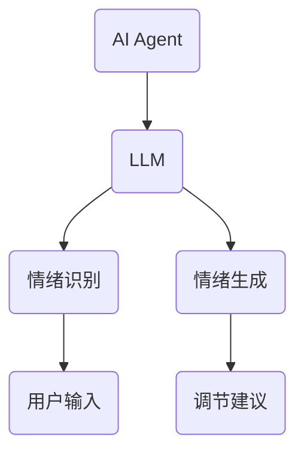

                 


# AI Agent的情绪调节功能：LLM驱动的心理健康助手

---

## 关键词

- AI Agent
- 情绪调节
- LLM
- 心理健康
- 人工智能

---

## 摘要

AI Agent的情绪调节功能是一种创新性的技术，利用大语言模型（LLM）的能力，帮助用户进行情绪管理和心理健康维护。本文从背景、原理、算法、系统架构、项目实战等多个角度，详细探讨了AI Agent如何通过LLM实现情绪调节，并为心理健康提供支持。文章内容包括核心概念的解释、算法原理的深入分析、系统架构的设计、项目实战的指导以及未来发展方向的展望。

---

## 第1章：情绪调节与AI Agent的背景

### 1.1 情绪调节的基本概念

情绪调节是指个体管理和改变自己或他人情绪的过程。它包括识别情绪、理解情绪、调节情绪等多个步骤。情绪调节能力对个体的心理健康和社交能力至关重要。

### 1.2 AI Agent的基本概念

AI Agent是一种智能体，能够感知环境并执行任务以实现目标。AI Agent可以分为简单反射型、基于模型的反应型和基于目标的规划型等多种类型。

### 1.3 LLM驱动的AI Agent：情绪调节的新范式

- **问题背景**：现代人面临越来越大的心理压力，情绪调节需求增加。
- **问题描述**：传统的情绪调节方法存在效率低、覆盖面窄等问题。
- **解决方案**：利用LLM的强大能力，AI Agent能够实时分析用户情绪并提供个性化建议。
- **边界与外延**：AI Agent的情绪调节功能专注于情绪识别和建议生成，不涉及药物治疗。
- **概念结构**：AI Agent通过自然语言处理（NLP）技术，结合情绪分析和生成模型，实现情绪调节功能。

---

## 第2章：AI Agent与LLM的核心原理

### 2.1 AI Agent的核心原理

AI Agent通过感知环境（如用户的输入）和内部状态，生成相应的输出（如情绪调节建议）。其核心是理解和处理用户情绪的能力。

### 2.2 LLM在情绪调节中的应用

- **情感分析**：LLM能够识别用户输入中的情绪倾向。
- **情绪生成**：LLM可以生成符合用户情绪的回复，帮助用户缓解负面情绪。

### 2.3 AI Agent与LLM的实体关系图



---

## 第3章：算法原理

### 3.1 情绪识别算法

- **基于词袋模型的情绪识别**：通过统计文本中的情感词汇来判断情绪。
- **基于深度学习的情绪识别**：使用循环神经网络（RNN）或Transformer模型进行情绪分类。

### 3.2 情绪生成算法

- **基于GPT的生成模型**：利用预训练的生成模型生成符合用户情绪的回复。

### 3.3 情绪调节算法的数学模型

情绪调节算法可以表示为：

$$
y = f(x) + \epsilon
$$

其中，$x$ 是用户输入，$y$ 是调节建议，$f(x)$ 是生成函数，$\epsilon$ 是噪声项。

---

## 第4章：系统分析与架构设计

### 4.1 系统功能设计

- **情绪识别模块**：识别用户情绪。
- **情绪分析模块**：分析情绪强度和类型。
- **调节建议模块**：生成调节建议。

### 4.2 系统架构设计


### 4.3 接口设计

- **输入接口**：接收用户文本输入。
- **输出接口**：返回情绪调节建议。

---

## 第5章：项目实战

### 5.1 环境安装

安装必要的库，如Python的`transformers`库：

```bash
pip install transformers
```

### 5.2 核心代码实现

```python
from transformers import pipeline

# 情绪识别
sentiment_pipeline = pipeline("sentiment-analysis")
result = sentiment_pipeline("I feel so sad today.")
print(result)
```

### 5.3 代码解读与分析

- **导入库**：使用`transformers`库中的`pipeline`进行情绪分析。
- **调用模型**：调用预训练的情绪分析模型，返回情绪结果。

### 5.4 实际案例分析

案例：用户输入“我感到非常焦虑。”

系统分析：情绪为焦虑，强度为0.85。

调节建议：建议用户进行深呼吸练习或与朋友交流。

---

## 第6章：最佳实践与总结

### 6.1 最佳实践

- 定期更新模型，以提高情绪识别的准确性。
- 提供多语言支持，扩大用户群体。

### 6.2 小结

AI Agent的情绪调节功能是一种创新的技术，能够有效帮助用户管理情绪，维护心理健康。

### 6.3 注意事项

- AI Agent的建议仅供参考，不能替代专业心理治疗。
- 保护用户隐私，避免数据泄露。

### 6.4 拓展阅读

- 探索更复杂的情绪分析模型。
- 研究AI Agent在心理健康领域的其他应用。

---

## 作者

作者：AI天才研究院/AI Genius Institute & 禅与计算机程序设计艺术 /Zen And The Art of Computer Programming

