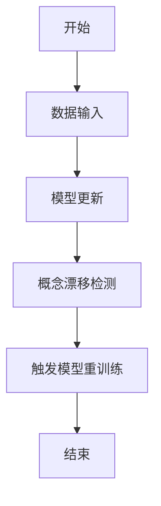
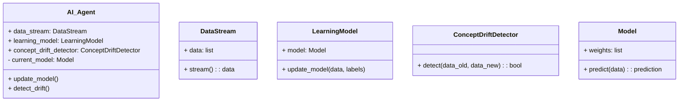

                 


# AI Agent的持续学习与概念漂移适应

> **关键词**：AI Agent，持续学习，概念漂移，机器学习，数据流处理  
> **摘要**：本文探讨了AI Agent在持续学习中的挑战与解决方案，特别是如何应对数据分布变化（概念漂移）的问题。通过分析持续学习的核心机制和概念漂移适应策略，结合实际案例和算法实现，深入剖析了AI Agent在动态环境中的自适应能力。

---

## 第1章: 背景介绍

### 1.1 问题背景
#### 1.1.1 AI Agent的定义与作用
AI Agent（人工智能代理）是一种能够感知环境、自主决策并执行任务的智能体。它通过与环境交互，利用数据和算法实现目标，例如推荐系统、自动驾驶和智能助手。

#### 1.1.2 持续学习的必要性
AI Agent需要在动态环境中不断适应新任务和数据变化。持续学习允许模型在新数据流中更新知识，保持高性能。

#### 1.1.3 概念漂移的定义与影响
概念漂移是指数据分布随时间变化，导致模型性能下降。例如，用户偏好变化或市场趋势波动，影响预测准确性。

### 1.2 问题描述
#### 1.2.1 持续学习的核心问题
持续学习需解决在线更新模型、内存效率和防止遗忘等问题。

#### 1.2.2 概念漂移的类型与挑战
概念漂移包括渐进式和突然式变化，增加检测难度。

#### 1.2.3 问题解决的思路与方法
通过增量学习算法和概念漂移检测，动态更新模型。

### 1.3 问题解决
#### 1.3.1 持续学习的解决方案
使用在线学习和模型蒸馏等技术。

#### 1.3.2 概念漂移的应对策略
检测概念漂移后，触发模型重训练或参数更新。

#### 1.3.3 综合解决方案的设计
结合增量学习和概念漂移检测，动态调整模型。

### 1.4 边界与外延
#### 1.4.1 持续学习的边界条件
仅处理增量数据，需内存高效。

#### 1.4.2 概念漂移的适用范围
适用于动态数据环境。

#### 1.4.3 相关概念的对比与区分
区分持续学习和在线学习，概念漂移与数据漂移。

### 1.5 概念结构与核心要素
持续学习和概念漂移适应构成AI Agent的核心机制，涉及学习算法、数据流处理和模型更新。

---

## 第2章: 核心概念与联系

### 2.1 AI Agent的持续学习机制
#### 2.1.1 持续学习的基本原理
模型逐步更新，利用新数据优化性能。

#### 2.1.2 持续学习的核心要素
数据流、模型更新和学习策略。

#### 2.1.3 持续学习与在线学习的对比
持续学习注重长期更新，而在线学习注重实时处理。

### 2.2 概念漂移适应策略
#### 2.2.1 概念漂移的检测方法
统计测试和性能监控。

#### 2.2.2 概念漂移的适应机制
模型重训练和权重调整。

#### 2.2.3 概念漂移适应的算法选择
使用增量学习算法和动态权重分配。

### 2.3 核心概念对比
| 概念 | 持续学习 | 概念漂移 |
|------|----------|----------|
| 定义 | 在线更新 | 数据分布变化 |
| 目标 | 高性能 | 高准确性 |
| 挑战 | 防止遗忘 | 检测及时 |
| 解决 | 增量算法 | 动态调整 |

### 2.4 ER实体关系图
```mermaid
er
  actor: AI Agent
  concept_drift: 概念漂移
  learning_model: 学习模型
  data_stream: 数据流
  action: 行动
  actor --> concept_drift: 感知概念漂移
  concept_drift --> learning_model: 触发模型更新
  data_stream --> learning_model: 数据输入
  learning_model --> action: 输出决策
```

---

## 第3章: 算法原理讲解

### 3.1 持续学习算法
#### 3.1.1 增量学习算法
```python
class IncrementalLearner:
    def __init__(self, model, optimizer):
        self.model = model
        self.optimizer = optimizer

    def update_model(self, x, y):
        # 前向传播
        outputs = self.model(x)
        # 计算损失
        loss = loss_fn(outputs, y)
        # 反向传播
        self.optimizer.zero_grad()
        loss.backward()
        self.optimizer.step()
```

#### 3.1.2 随机梯度下降算法
$$ \text{SGD} = \theta_{t+1} = \theta_t - \eta \nabla_{\theta_t} J(\theta_t) $$

#### 3.1.3 模型蒸馏算法
通过教师模型指导学生模型，降低计算复杂度。

### 3.2 概念漂移适应算法
#### 3.2.1 概念漂移检测算法
使用统计测试（如卡方检验）和性能监控。

#### 3.2.2 动态权重分配算法
调整模型参数权重，适应数据变化。

#### 3.2.3 模型重训练算法
检测到概念漂移后，重新训练模型。

### 3.3 算法流程图


---

## 第4章: 系统分析与架构设计

### 4.1 问题场景介绍
动态数据环境中的AI Agent，需实时处理数据流。

### 4.2 系统功能设计
- 数据流处理
- 模型更新
- 概念漂移检测

### 4.3 领域模型类图


### 4.4 系统架构设计
分层架构：数据层、模型层和代理层，支持模块化设计。

### 4.5 接口和交互流程
使用序列图展示AI Agent与数据流、模型之间的交互。

---

## 第5章: 项目实战

### 5.1 环境安装
安装Python、机器学习库和Mermaid工具。

### 5.2 核心代码实现
```python
import numpy as np
from sklearn.linear_model import SGDClassifier

class AI_Agent:
    def __init__(self, model):
        self.model = model
        self.data_stream = DataStream()

    def update_model(self):
        x, y = self.data_stream.stream()
        self.model.partial_fit(x, y)

    def detect_drift(self):
        # 假设data_old和data_new是旧数据和新数据
        old_data = self.data_stream.old_data
        new_data = self.data_stream.new_data
        # 检测概念漂移
        return np.mean(old_data) != np.mean(new_data)

    def main(self):
        while True:
            self.update_model()
            if self.detect_drift():
                # 重新训练模型
                self.model.fit(self.data_stream.get_all_data())
```

### 5.3 案例分析
分析用户行为数据，检测偏好变化，动态更新推荐模型。

### 5.4 项目总结
实现了一个动态适应的AI Agent，能够检测和应对概念漂移。

---

## 第6章: 最佳实践

### 6.1 小结
AI Agent的持续学习和概念漂移适应是动态环境中的关键能力。

### 6.2 注意事项
- 定期检测概念漂移
- 选择合适的增量学习算法
- 管理模型更新的计算资源

### 6.3 拓展阅读
推荐书籍和论文，深入学习持续学习和概念漂移适应技术。

---

## 作者：AI天才研究院 & 禅与计算机程序设计艺术

