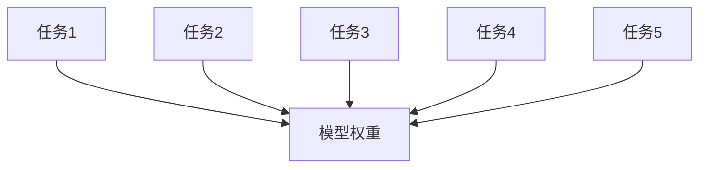
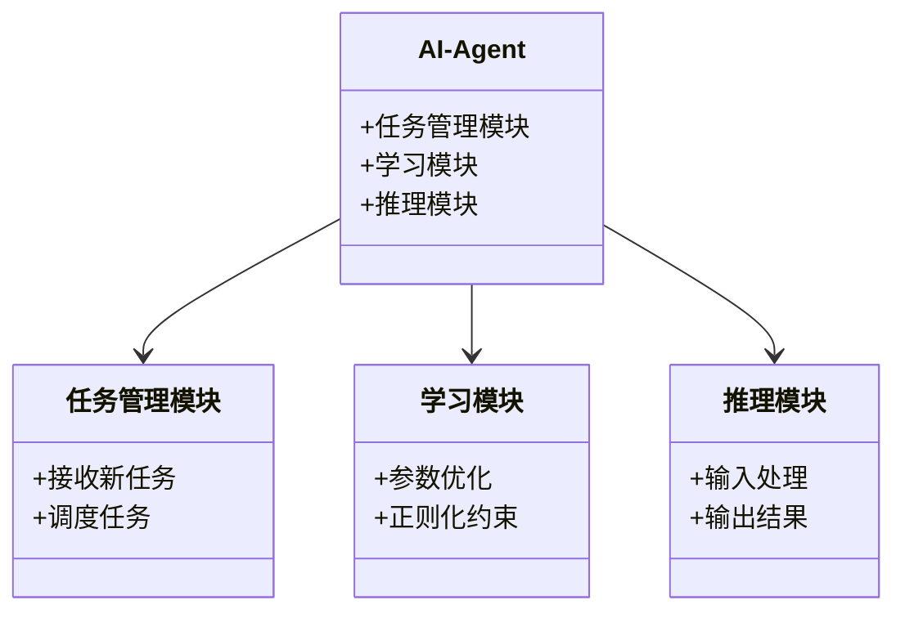
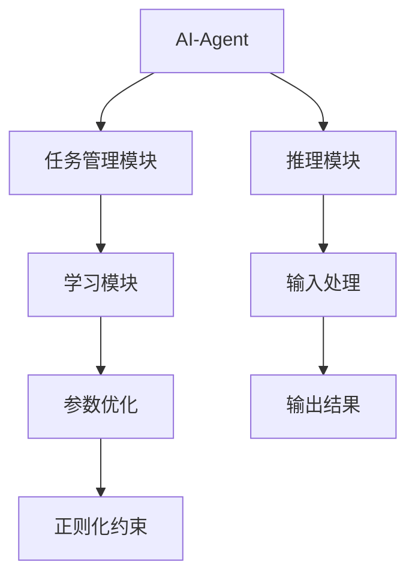
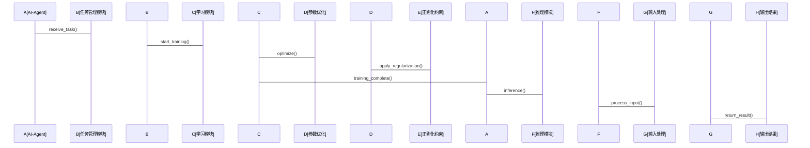

                 


# AI Agent的持续学习与灾难性遗忘防御

> 关键词：AI Agent, 持续学习, 灾难性遗忘, 神经网络, 深度学习, 模型优化, 机器学习

> 摘要：AI Agent在持续学习过程中面临着灾难性遗忘的问题，即在学习新任务时忘记旧任务的知识。本文系统地探讨了AI Agent持续学习的核心概念、灾难性遗忘的形成原理、多种防御方法及其优缺点，并通过实际项目案例展示了如何在系统架构中实现这些防御方法。文章还分析了不同算法的数学模型，提供了系统设计的架构图和接口设计，并总结了最佳实践和注意事项。

---

# 第1章: AI Agent与持续学习概述

## 1.1 AI Agent的基本概念

### 1.1.1 AI Agent的定义
AI Agent（人工智能代理）是指能够感知环境、自主决策并采取行动以实现目标的智能实体。与传统AI相比，AI Agent具有更强的自主性和适应性，能够实时与环境交互并动态调整行为。

### 1.1.2 AI Agent的核心特点
- **自主性**：AI Agent能够自主决策，无需外部干预。
- **反应性**：能够实时感知环境并快速响应。
- **目标导向**：所有行为都围绕特定目标展开。
- **学习能力**：能够通过经验改进性能。

### 1.1.3 AI Agent与传统AI的区别
传统AI依赖于预定义的规则和数据，而AI Agent具有更强的自主性和学习能力，能够动态适应环境变化。

---

## 1.2 持续学习的定义与背景

### 1.2.1 持续学习的定义
持续学习是指AI系统在新的任务或数据流中，能够不断更新知识和模型，同时保持对旧任务性能的稳定。

### 1.2.2 持续学习的背景与重要性
随着AI Agent的应用场景越来越复杂，持续学习能够帮助AI Agent在动态环境中保持竞争力。例如，在医疗领域，AI Agent需要不断更新医学知识以应对新病种和治疗方案。

### 1.2.3 持续学习的应用场景
- 医疗诊断
- 自然语言处理
- 游戏AI
- 智能推荐系统

---

## 1.3 灾难性遗忘的定义与影响

### 1.3.1 灾难性遗忘的定义
灾难性遗忘是指AI Agent在学习新任务时，忘记旧任务的知识，导致旧任务性能急剧下降。

### 1.3.2 灾难性遗忘的表现形式
- **渐进式遗忘**：随着新任务的学习，旧任务性能逐步下降。
- **突然式遗忘**：旧任务性能在某个时间点突然下降。

### 1.3.3 灾难性遗忘对AI Agent的影响
- 降低模型的泛化能力
- 影响任务之间的知识迁移
- 导致模型性能不稳定性

---

## 1.4 灾难性遗忘防御的必要性

### 1.4.1 灾难性遗忘防御的目标
保持旧任务性能的同时，提升新任务的性能。

### 1.4.2 灾难性遗忘防御的挑战
- **模型容量限制**：模型难以同时处理多个任务。
- **梯度干扰**：新任务的学习会影响旧任务的权重。
- **任务异构性**：任务之间可能存在冲突。

### 1.4.3 灾难性遗忘防御的解决方案
- **正则化方法**：通过约束模型参数的变化。
- **经验重放**：保存旧任务的数据进行再学习。
- **任务分离**：通过 gating机制分离任务。

---

# 第2章: 灾难性遗忘的核心概念与联系

## 2.1 灾难性遗忘的原理

### 2.1.1 神经网络的权重更新机制
神经网络通过调整权重来优化损失函数。灾难性遗忘的根本原因在于权重更新对旧任务的特征提取能力破坏过大。

### 2.1.2 灾难性遗忘的形成原因
- **权重空间的挤压**：新任务的学习占据了大部分权重空间，压缩了旧任务的表示。
- **梯度干扰**：新任务的梯度更新对旧任务的权重造成负面影响。

### 2.1.3 灾难性遗忘的数学模型
$$ L_{total} = L_{new} + \lambda L_{old} $$
其中，$\lambda$ 是正则化系数，用于平衡新任务和旧任务的损失。

---

## 2.2 灾难性遗忘与持续学习的关系

### 2.2.1 灾难性遗忘对持续学习的影响
持续学习的目标是保持旧任务性能，但灾难性遗忘的存在使得这一目标难以实现。

### 2.2.2 持续学习如何缓解灾难性遗忘
- **任务调度策略**：合理安排任务学习顺序，减少任务之间的干扰。
- **动态网络架构**：通过增加新层或模块来分离任务表示。

### 2.2.3 灾难性遗忘与任务迁移的关系
任务迁移学习通过共享特征降低任务之间的干扰，从而缓解灾难性遗忘。

---

## 2.3 灾难性遗忘的特征对比

### 2.3.1 不同任务之间的特征对比
| 特征                | 旧任务          | 新任务          |
|---------------------|-----------------|-----------------|
| 数据分布           | 稳定            | 动态变化        |
| 任务复杂度         | 较低            | 较高            |
| 任务相关性         | 高              | 低              |

### 2.3.2 不同模型的特征对比
| 模型                | 参数量          | 过拟合风险       | 灾难性遗忘风险   |
|---------------------|-----------------|-----------------|-----------------|
| 单任务模型          | 小              | 高              | 高              |
| 多任务模型          | 中              | 中              | 中              |
| 持续学习模型        | 大              | 低              | 低              |

### 2.3.3 不同防御方法的特征对比
| 方法                | 计算复杂度       | 空间复杂度       | 有效性           |
|---------------------|-----------------|-----------------|-----------------|
| EWC                | 高              | 中              | 良好            |
| MAML               | 中              | 中              | 较好            |
| L2I                | 低              | 低              | 良好            |

---

## 2.4 灾难性遗忘的ER实体关系图



---

# 第3章: 灾难性遗忘的数学模型与算法原理

## 3.1 灾难性遗忘的数学模型

### 3.1.1 灾难性遗忘的数学表示
$$ L_{total} = \sum_{i=1}^{n} L_i $$
其中，$L_i$ 是第i个任务的损失函数。

### 3.1.2 持续学习的优化目标
$$ \min_{\theta} \sum_{i=1}^{n} L_i(\theta) $$
其中，$\theta$ 是模型参数。

---

## 3.2 灾难性遗忘的算法原理

### 3.2.1 Experience Replay（经验重放）
通过保存旧任务的数据样本，重新采样并加入新任务训练中。

### 3.2.2 Elastic Weight Consolidation（EWC）

#### 3.2.2.1 EWC的原理
EWC通过约束模型参数的变化，防止权重更新对旧任务性能的破坏。

#### 3.2.2.2 EWC的公式
$$ \sum_{i=1}^{n} f_i(\theta) $$
其中，$f_i$ 是旧任务的正则化项。

---

## 3.3 灾难性遗忘的防御算法

### 3.3.1 Meta-Learning（元学习）

#### 3.3.1.1 MAML的原理
通过在任务间共享参数，快速适应新任务。

---

## 3.4 灾难性遗忘的其他防御方法

### 3.4.1 L2I（Learning without forgetting）

#### 3.4.1.1 L2I的原理
通过正则化损失保持旧任务的知识。

#### 3.4.1.2 L2I的公式
$$ L_{total} = L_{new} + \lambda ||g||^2 $$
其中，$g$ 是旧任务的梯度。

---

# 第4章: 系统分析与架构设计

## 4.1 项目场景介绍

### 4.1.1 项目背景
AI Agent在医疗领域进行病灶识别和诊断。

### 4.1.2 项目目标
实现持续学习，保持对多种病灶的识别能力。

---

## 4.2 系统功能设计

### 4.2.1 领域模型设计


---

## 4.3 系统架构设计

### 4.3.1 系统架构图


---

## 4.4 系统接口设计

### 4.4.1 系统接口
- `receive_task()`: 接收新任务
- `train_model()`: 训练模型
- `inference()`: 推理结果

---

## 4.5 系统交互设计

### 4.5.1 系统交互图


---

# 第5章: 项目实战

## 5.1 环境安装

### 5.1.1 环境要求
- Python 3.8+
- PyTorch 1.9+
- numpy 1.21+

---

## 5.2 系统核心实现源代码

### 5.2.1 AI Agent的核心代码
```python
class AI-Agent:
    def __init__(self):
        self.tasks = []
        self.model = Model()
    
    def receive_task(self, task):
        self.tasks.append(task)
    
    def train_model(self):
        for task in self.tasks:
            self.model.train(task)
    
    def inference(self, input):
        return self.model.predict(input)
```

---

## 5.3 代码应用解读与分析

### 5.3.1 代码解读
AI-Agent类包含任务管理、模型训练和推理功能。

### 5.3.2 代码分析
- `receive_task`方法用于接收新任务。
- `train_model`方法负责训练模型，防止灾难性遗忘。
- `inference`方法用于推理和输出结果。

---

## 5.4 实际案例分析

### 5.4.1 案例分析
AI-Agent在医疗领域的应用案例，展示如何通过持续学习保持对多种病灶的识别能力。

---

## 5.5 项目小结

### 5.5.1 项目总结
通过系统设计和实际实现，展示了如何在AI Agent中防御灾难性遗忘。

---

# 第6章: 总结与展望

## 6.1 最佳实践

### 6.1.1 实践建议
- 合理设计任务调度策略
- 选择合适的防御方法
- 定期评估模型性能

### 6.1.2 注意事项
- 避免过度优化
- 定期清理无用任务
- 监控模型性能

---

## 6.2 小结

### 6.2.1 核心内容回顾
AI Agent的持续学习与灾难性遗忘防御是实现动态环境下智能系统的核心技术。

---

## 6.3 展望

### 6.3.1 未来研究方向
- 更高效的防御方法
- 更智能的任务调度策略
- 更灵活的模型架构

---

# 作者

作者：AI天才研究院/AI Genius Institute & 禅与计算机程序设计艺术 /Zen And The Art of Computer Programming

---

感谢您的阅读！

