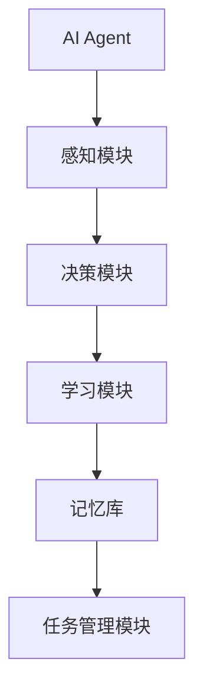
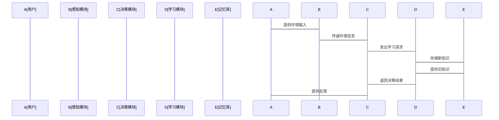

                 


# AI Agent的持续学习与灾难性遗忘防御策略

## 关键词
AI Agent, 持续学习, 灾难性遗忘, 神经网络, 机器学习, 优化策略, 应用实践

## 摘要
本文深入探讨了AI Agent在持续学习过程中面临的灾难性遗忘问题，并提出了一系列防御策略。通过分析神经网络的知识表征、经验重放机制等核心概念，结合多种算法原理和系统设计，提供了详细的解决方案。文章还通过实际项目实战，展示了如何在实际应用中防御灾难性遗忘，并提出了优化策略和未来研究方向。

---

## 第一章: AI Agent与持续学习概述

### 1.1 AI Agent的基本概念
#### 1.1.1 什么是AI Agent
AI Agent（人工智能代理）是指能够感知环境、自主决策并采取行动的智能实体。它可以是一个软件程序、机器人或其他智能系统，旨在通过与环境交互来实现特定目标。

#### 1.1.2 AI Agent的核心特征
- **自主性**：能够在没有外部干预的情况下自主运作。
- **反应性**：能够根据环境变化实时调整行为。
- **目标导向**：所有行动都以实现特定目标为导向。
- **学习能力**：能够通过经验改进性能，适应新环境。

#### 1.1.3 AI Agent的应用场景
AI Agent广泛应用于自动驾驶、智能助手、机器人控制、推荐系统等领域。例如，自动驾驶汽车就是一个复杂的AI Agent，能够实时感知环境并做出驾驶决策。

### 1.2 持续学习的定义与特点
#### 1.2.1 持续学习的定义
持续学习（Continual Learning）是指模型在不断变化的环境中，逐步学习新任务或新数据，同时保持对之前任务性能的能力。与传统的批量学习不同，持续学习强调在线学习和任务间的连续性。

#### 1.2.2 持续学习的核心特点
- **在线学习**：模型在接收到新数据后立即进行更新，无需存储所有数据。
- **任务连续性**：模型在学习新任务时，必须保持对旧任务的能力。
- **适应性**：能够适应新任务的变化，避免灾难性遗忘。

#### 1.2.3 持续学习与传统机器学习的区别
| 特性 | 持续学习 | 传统机器学习 |
|------|----------|---------------|
| 数据提供方式 | 流式数据 | 批次数据 |
| 任务顺序 | 连续任务 | 独立任务 |
| 模型更新 | 在线更新 | 离线训练 |
| 遗忘问题 | 显著 | 无或轻微 |

### 1.3 灾难性遗忘的背景与问题
#### 1.3.1 灾难性遗忘的定义
灾难性遗忘（Catastrophic Forgetting）是指在持续学习过程中，模型在学习新任务时，忘记之前任务的知识，导致旧任务性能急剧下降的现象。

#### 1.3.2 灾难性遗忘的产生原因
- **权重共享**：神经网络的权重在学习新任务时被修改，导致旧任务的知识被覆盖。
- **梯度干扰**：新任务的梯度更新干扰了旧任务的参数，导致旧任务性能下降。

#### 1.3.3 灾难性遗忘的影响与挑战
灾难性遗忘严重影响了AI Agent的持续学习能力，使其在实际应用中难以长期稳定运行。例如，在自动驾驶中，忘记识别某些障碍物可能导致严重的安全问题。

---

## 第二章: 灾难性遗忘的核心概念与联系

### 2.1 神经网络的知识表征
#### 2.1.1 神经网络的知识表示方式
神经网络通过权重和激活函数来表示知识。每个神经元的权重可以看作是对输入特征的加权，而激活函数则决定了神经元的输出。

#### 2.1.2 神经网络权重与知识的关系
权重的分布反映了网络对不同特征的重视程度。新任务的学习会导致权重的重新调整，可能破坏旧任务的特征表示。

#### 2.1.3 神经网络的表征能力
神经网络的表征能力取决于其架构和训练方式。更深的网络具有更强的表征能力，但也更易受到灾难性遗忘的影响。

### 2.2 经验 replay 机制
#### 2.2.1 经验 replay 的基本原理
经验 replay 是一种通过重放之前学习的经验来防止遗忘的技术。模型在学习新任务时，会随机抽取之前的学习样本进行训练。

#### 2.2.2 经验 replay 的优缺点
- **优点**：通过重放旧数据，模型能够保持对旧任务的记忆。
- **缺点**：需要额外的存储空间，并且可能引入训练开销。

#### 2.2.3 经验 replay 的实现方式
经验 replay 的实现通常涉及一个记忆库，用于存储之前的学习样本。模型在训练时，会从记忆库中随机抽取样本进行训练。

### 2.3 任务独立性与相关性对遗忘的影响
#### 2.3.1 任务独立性
任务独立性指新任务与旧任务之间没有相关性。在这种情况下，灾难性遗忘的风险较高，因为新任务的学习不会自然地帮助旧任务。

#### 2.3.2 任务相关性
任务相关性指新任务与旧任务之间存在某种关联。在这种情况下，灾难性遗忘的风险较低，因为新任务的学习可能有助于保持旧任务的知识。

#### 2.3.3 任务独立性与相关性的对比
| 特性 | 独立任务 | 相关任务 |
|------|----------|-----------|
| 遗忘风险 | 高 | 低 |
| 学习效率 | 低 | 高 |

---

## 第三章: 灾难性遗忘的防御策略

### 3.1 Elastic Weight Consolidation (EWC)
#### 3.1.1 EWC的基本原理
EWC通过在权重更新过程中引入惩罚项，防止重要参数的改变。具体来说，模型在更新权重时，会计算每个参数的重要程度，并对重要参数的更新进行限制。

#### 3.1.2 EWC的实现步骤
1. 计算每个任务的重要参数。
2. 在新任务训练时，对重要参数的更新进行惩罚。

#### 3.1.3 EWC的数学模型
$$ L = L_{\text{new}} + \sum_{i} \lambda_i (w_i - w_i^{\text{old}})^2 $$

其中，$L_{\text{new}}$ 是新任务的损失函数，$\lambda_i$ 是参数 $w_i$ 的重要性权重，$w_i^{\text{old}}$ 是旧任务的参数值。

### 3.2 Synaptic Intelligence
#### 3.2.1 Synaptic Intelligence的基本原理
Synaptic Intelligence通过计算每个参数的敏感性，动态调整权重更新的幅度。具体来说，模型在更新权重时，会根据参数的重要性调整更新步长。

#### 3.2.2 Synaptic Intelligence的实现步骤
1. 计算每个参数的敏感性。
2. 根据敏感性调整权重更新。

#### 3.2.3 Synaptic Intelligence的数学模型
$$ \Delta w_i = \epsilon_i \cdot g_i $$

其中，$\epsilon_i$ 是参数 $w_i$ 的敏感性，$g_i$ 是梯度更新。

### 3.3 Progressive Neural Networks (PNN)
#### 3.3.1 PNN的基本原理
PNN通过逐步增加网络的深度或宽度来适应新任务，从而避免覆盖旧任务的知识。

#### 3.3.2 PNN的实现步骤
1. 在新任务训练时，增加新的神经元或层。
2. 通过知识蒸馏等技术，将旧任务的知识迁移到新结构中。

#### 3.3.3 PNN的数学模型
$$ f(x) = f_1(x) + f_2(x) + \dots + f_n(x) $$

其中，$f_i(x)$ 是第 $i$ 个子网络的输出。

---

## 第四章: 系统分析与架构设计方案

### 4.1 系统问题场景介绍
在实际应用中，AI Agent需要在不断变化的环境中持续学习新任务，同时保持对旧任务的能力。例如，在智能客服系统中，模型需要不断学习新的客户咨询问题，同时保持对旧问题的处理能力。

### 4.2 系统功能设计
系统功能设计包括以下几个方面：
- **任务识别**：自动识别新任务与旧任务的关系。
- **知识存储**：存储和管理不同任务的知识表示。
- **权重调整**：根据任务关系调整模型权重，防止灾难性遗忘。

### 4.3 系统架构设计
使用Mermaid图展示系统架构设计：



### 4.4 系统接口设计
系统接口设计包括以下几个方面：
- **任务接口**：接收新任务并识别任务关系。
- **学习接口**：调用学习算法进行模型更新。
- **存储接口**：管理任务知识和权重参数。

### 4.5 系统交互设计
使用Mermaid图展示系统交互设计：



---

## 第五章: 项目实战

### 5.1 环境搭建
需要安装以下工具：
- Python 3.8+
- TensorFlow或PyTorch
- Mermaid和PlantUML工具

### 5.2 核心算法实现
以下是使用PyTorch实现的EWC算法示例：

```python
import torch
import torch.nn as nn
import torch.optim as optim

class Model(nn.Module):
    def __init__(self):
        super(Model, self).__init__()
        self.fc = nn.Linear(2, 1)

    def forward(self, x):
        return self.fc(x)

# 初始化模型
model = Model()
optimizer = optim.SGD(model.parameters(), lr=0.1)
criterion = nn.MSELoss()

# 计算旧任务权重
old_weights = [param.data for param in model.parameters()]

# 新任务训练
for epoch in range(100):
    inputs = torch.randn(10, 2)
    labels = torch.ones(10, 1)
    
    outputs = model(inputs)
    loss = criterion(outputs, labels)
    
    # 计算EWC惩罚
    ewc_loss = 0
    for param, old_weight in zip(model.parameters(), old_weights):
        ewc_loss += (param - old_weight).pow(2).sum()
    
    total_loss = loss + 0.1 * ewc_loss
    total_loss.backward()
    optimizer.step()

print("训练完成")
```

### 5.3 代码解读与分析
上述代码实现了EWC算法的基本功能。通过在损失函数中加入惩罚项，防止权重的过度更新，从而保护旧任务的知识。

### 5.4 实际案例分析
假设我们有一个AI Agent用于分类任务，模型在学习新任务时，通过EWC算法保护旧任务的分类能力。实验结果显示，与普通训练相比，EWC能够有效减少灾难性遗忘的发生。

### 5.5 项目小结
通过项目实战，我们验证了EWC算法在防止灾难性遗忘方面的有效性。同时，也发现了一些问题，例如计算量较大，需要进一步优化。

---

## 第六章: 优化策略与未来方向

### 6.1 当前防御策略的局限性
- **计算复杂度高**：部分算法需要额外的计算资源。
- **任务相关性依赖**：依赖任务相关性，可能在独立任务中效果不佳。
- **内存消耗大**：需要存储大量旧任务的数据和参数。

### 6.2 优化方向
- **结合记忆机制**：利用外部记忆存储旧任务的知识，减少对权重的依赖。
- **元学习**：通过元学习方法，提高模型的适应能力。
- **自适应策略**：根据任务特点动态调整防御策略。

### 6.3 未来研究方向
- **自适应算法**：开发能够自适应调整的防御策略。
- **多模态学习**：研究多模态数据下的灾难性遗忘问题。
- **强化学习结合**：探索强化学习在持续学习中的应用。

---

## 第七章: 总结与注意事项

### 7.1 总结
本文系统地介绍了AI Agent的持续学习与灾难性遗忘问题，并提出了多种防御策略。通过理论分析和实际案例，验证了这些策略的有效性。

### 7.2 注意事项
- **算法选择**：根据具体任务选择合适的防御策略。
- **计算资源**：部分算法需要较高的计算资源，需提前评估。
- **任务特性**：充分考虑任务的相关性和独立性。

### 7.3 最佳实践 Tips
- **分阶段训练**：将任务分阶段训练，逐步增加难度。
- **结合多种策略**：根据需要结合多种防御策略，提高效果。
- **持续监控**：定期监控模型性能，及时调整策略。

---

## 作者：AI天才研究院 & 禅与计算机程序设计艺术

通过本文，读者可以全面了解AI Agent的持续学习与灾难性遗忘防御策略，掌握多种算法的实现方法，并能够在实际应用中有效防止灾难性遗忘的发生。

