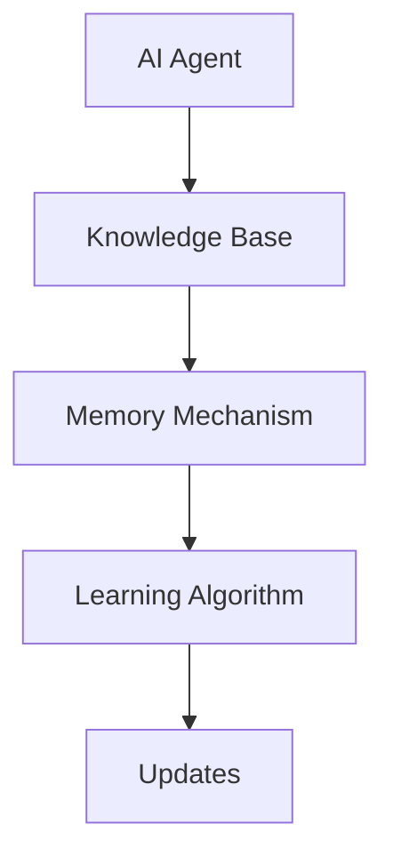
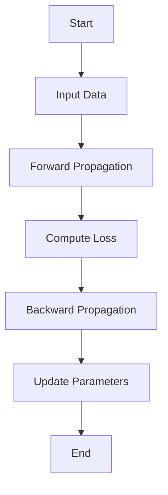
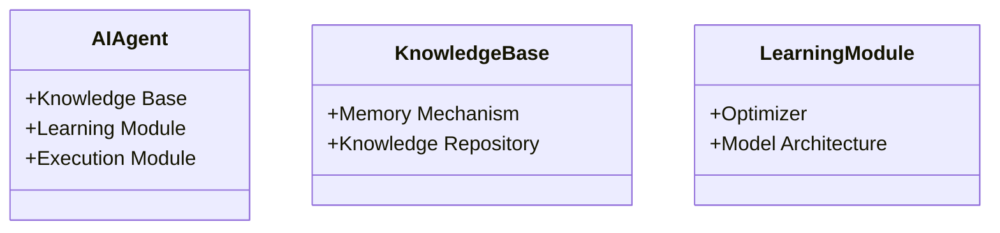
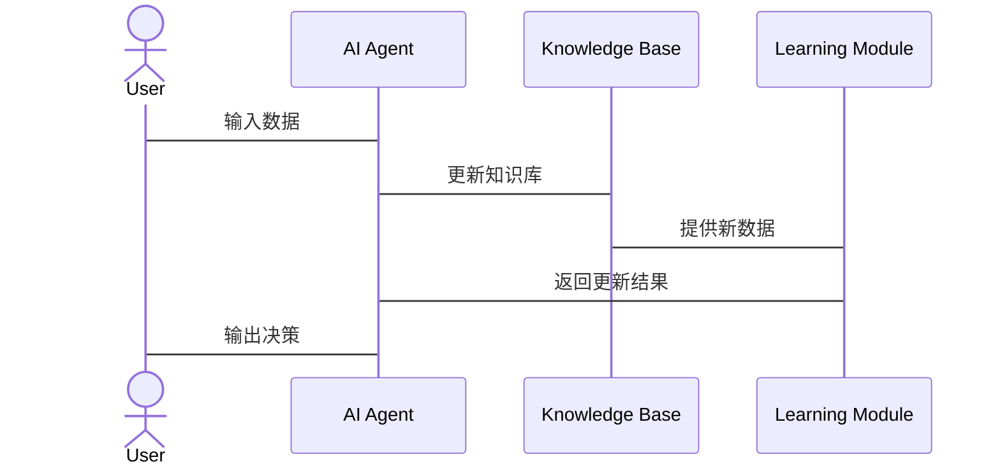

                 


# AI Agent的持续学习与知识更新策略

> **关键词**：AI Agent、持续学习、知识更新、机器学习、在线学习、自适应学习、增量学习  
>
> **摘要**：本文将深入探讨AI Agent的持续学习与知识更新策略，从理论到实践，分析其核心概念、算法原理、系统架构及应用场景。通过详细讲解记忆机制、自适应学习、在线学习等关键要素，结合数学公式和实际案例，揭示如何设计高效的AI Agent持续学习系统。本文还将探讨增量学习、知识蒸馏等技术，并通过系统设计与项目实战，展示如何实现动态更新的知识管理，提升AI Agent的智能化水平。

---

## 第1章: AI Agent的持续学习与知识更新概述

### 1.1 问题背景与挑战

#### 1.1.1 AI Agent的定义与特点
AI Agent是一种能够感知环境、执行任务并做出决策的智能实体。其核心特点包括：
1. **自主性**：能够在没有外部干预的情况下自主运行。
2. **反应性**：能够实时感知环境并做出反应。
3. **学习能力**：通过数据和经验不断优化自身性能。

#### 1.1.2 持续学习的必要性
AI Agent在动态环境中工作时，会面临数据、任务或环境的变化。为了适应这些变化，AI Agent需要具备持续学习的能力，以避免“过时”或“失效”。

#### 1.1.3 知识更新的核心问题
知识更新的核心问题在于如何高效地整合新信息，同时保持已有知识的完整性与一致性。这涉及到数据处理、模型优化和知识表示等多个方面。

### 1.2 问题描述与目标

#### 1.2.1 持续学习的定义
持续学习是指AI Agent在任务执行过程中，通过不断接收新数据，动态更新其知识库或模型参数，以适应变化的环境或任务需求。

#### 1.2.2 知识更新的挑战
1. **数据稀疏性**：新数据可能有限，难以覆盖所有可能的场景。
2. **模型稳定性**：频繁更新可能导致模型性能波动。
3. **计算效率**：持续学习需要在实时或近实时的条件下完成。

#### 1.2.3 目标与边界
目标：设计一种高效的持续学习框架，能够在动态环境中保持AI Agent的性能稳定性和可扩展性。  
边界：仅关注知识更新的算法和策略，不涉及具体的应用场景实现。

---

## 第2章: AI Agent的核心概念与联系

### 2.1 核心概念原理

#### 2.1.1 记忆机制
记忆机制是AI Agent持续学习的基础，负责存储和检索必要的信息。常见的记忆机制包括：
1. ** episodic memory**：存储特定事件或经验。
2. ** semantic memory**：存储通用知识和概念。

#### 2.1.2 自适应学习
自适应学习是指AI Agent能够根据环境反馈动态调整学习策略。其核心在于：
1. **反馈机制**：通过奖励或惩罚信号指导学习方向。
2. **在线学习**：实时更新模型参数，适应新数据。

#### 2.1.3 在线学习
在线学习是一种实时处理数据的学习方式，适用于动态环境。其特点包括：
1. **增量学习**：每次处理一条数据，逐步更新模型。
2. **低延迟**：实时响应，适用于需要快速决策的任务。

### 2.2 概念属性特征对比表

| 概念       | 属性特征           |
|------------|--------------------|
| 记忆机制    | 存储、检索、更新    |
| 自适应学习  | 动态调整、反馈机制  |
| 在线学习    | 实时更新、增量学习  |

### 2.3 ER实体关系图



---

## 第3章: AI Agent持续学习的算法原理

### 3.1 算法原理概述

#### 3.1.1 模型架构
持续学习的模型架构需要支持动态更新，常见的选择包括：
1. **DNN（深度神经网络）**：适用于复杂的模式识别任务。
2. **RNN（循环神经网络）**：适用于序列数据处理。
3. **Transformer**：适用于长序列处理和并行计算。

#### 3.1.2 优化算法
优化算法是模型更新的核心。常用的优化算法包括：
1. **随机梯度下降（SGD）**：适用于在线学习。
2. **Adam优化器**：结合动量和自适应学习率，适合动态环境。

#### 3.1.3 知识更新策略
知识更新策略决定了如何整合新数据。常用策略包括：
1. **增量学习**：逐步更新模型参数。
2. **知识蒸馏**：通过教师模型指导学生模型学习。

### 3.2 算法流程图



### 3.3 数学模型与公式

#### 3.3.1 损失函数
$$ L = \frac{1}{2} (y - \hat{y})^2 $$

#### 3.3.2 优化算法
$$ \theta_{new} = \theta - \eta \cdot \nabla L $$

#### 3.3.3 知识更新策略
$$ \Delta w = \alpha (w_{new} - w) $$

---

## 第4章: 系统分析与架构设计方案

### 4.1 问题场景介绍

#### 4.1.1 AI Agent的应用场景
AI Agent可以应用于自动驾驶、智能客服、机器人控制等领域，这些场景需要实时决策和持续优化。

#### 4.1.2 知识更新的系统需求
系统需要支持：
1. **实时数据处理**：快速响应新数据。
2. **动态调整模型**：根据反馈优化性能。
3. **高效存储与检索**：确保知识库的高效管理。

### 4.2 系统功能设计

#### 4.2.1 领域模型



### 4.3 系统架构设计


### 4.4 系统接口设计

#### 4.4.1 输入接口
- 新数据输入：实时接收新数据并触发学习模块。
- 用户反馈：接收用户反馈以调整学习策略。

#### 4.4.2 输出接口
- 决策输出：根据当前知识库生成决策。
- 状态报告：输出系统当前状态和性能指标。

### 4.5 系统交互流程



---

## 第5章: 项目实战与案例分析

### 5.1 环境安装与配置

#### 5.1.1 安装依赖
- Python 3.8+
- TensorFlow 2.0+
- scikit-learn
- Mermaid CLI

### 5.2 核心实现代码

```python
import numpy as np
import tensorflow as tf

# 定义模型
model = tf.keras.Sequential([
    tf.keras.layers.Dense(64, activation='relu'),
    tf.keras.layers.Dense(1, activation='sigmoid')
])

# 编译模型
model.compile(optimizer=tf.keras.optimizers.Adam(learning_rate=0.001),
              loss='binary_crossentropy',
              metrics=['accuracy'])

# 模型训练
def train_model():
    # 生成数据
    X = np.random.randn(1000, 64)
    y = np.random.randint(2, size=1000)
    # 训练模型
    model.fit(X, y, epochs=10, batch_size=32)
```

### 5.3 案例分析与解读

#### 5.3.1 案例背景
假设我们正在开发一个智能客服AI Agent，需要处理大量的用户咨询。随着时间推移，用户的问题会不断变化，AI Agent需要能够动态更新其知识库，以保持回答的准确性。

#### 5.3.2 实现过程
1. 数据预处理：将用户咨询分类并提取关键词。
2. 模型训练：使用增量学习方法，逐步更新分类模型。
3. 知识更新：定期整合新数据，优化模型性能。

#### 5.3.3 代码分析
```python
# 定义增量学习函数
def incremental_learning(new_data, new_labels):
    # 合并新数据
    global X, y
    X = np.vstack((X, new_data))
    y = np.concatenate((y, new_labels))
    # 重新训练模型
    model.fit(X, y, epochs=5, batch_size=32)
```

### 5.4 项目小结

---

## 第6章: 总结与展望

### 6.1 核心要点总结
1. AI Agent的持续学习能力是适应动态环境的关键。
2. 记忆机制和自适应学习是实现知识更新的核心技术。
3. 在线学习和增量学习是持续学习的主要策略。

### 6.2 未来研究方向
1. 更高效的增量学习算法。
2. 更智能的知识蒸馏技术。
3. 更鲁棒的在线学习框架。

---

**作者：AI天才研究院/AI Genius Institute & 禅与计算机程序设计艺术 /Zen And The Art of Computer Programming**

