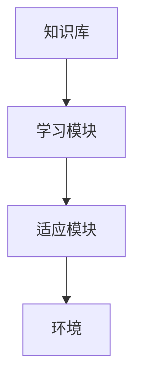

                 


# AI Agent的持续学习与适应机制

> 关键词：AI Agent、持续学习、适应机制、强化学习、模仿学习、系统架构

> 摘要：本文深入探讨AI Agent的持续学习与适应机制，涵盖其核心概念、算法原理、系统架构及项目实战。通过详细分析，帮助读者理解如何构建能够持续学习和适应复杂环境的AI系统。

---

# 第1章: AI Agent的基本概念与背景

## 1.1 AI Agent的定义与特点

### 1.1.1 AI Agent的定义
AI Agent（人工智能代理）是指能够感知环境、做出决策并执行行动的智能实体。它通过与环境交互，实现特定目标，如问题解决、数据处理或服务提供。

### 1.1.2 AI Agent的核心特点
- **自主性**：能够在无外部干预的情况下运行。
- **反应性**：能够实时感知环境并做出反应。
- **学习能力**：能够通过经验改进性能。
- **适应性**：能够根据环境变化调整行为。

### 1.1.3 AI Agent与传统AI的区别
AI Agent不仅依赖预设规则，还能通过与环境交互动态调整行为。传统AI系统通常基于静态规则，而AI Agent具备更强的动态适应能力。

---

## 1.2 持续学习与适应机制的背景

### 1.2.1 持续学习的定义与意义
持续学习是指AI系统在运行过程中，能够不断吸收新数据、更新知识并改进性能的能力。它使AI Agent能够应对动态变化的环境。

### 1.2.2 适应机制的必要性
环境的不确定性、任务的变化和数据的动态性要求AI Agent具备适应能力。适应机制使AI Agent能够根据反馈优化决策，避免过时策略导致的错误。

### 1.2.3 持续学习与适应机制的应用场景
- **自动驾驶**：实时调整驾驶策略。
- **智能推荐系统**：根据用户行为动态优化推荐结果。
- **机器人控制**：在复杂环境中灵活调整动作。

---

## 1.3 本章小结
本章介绍了AI Agent的基本概念和持续学习与适应机制的重要性，为后续内容奠定了基础。

---

# 第2章: 持续学习的核心概念与原理

## 2.1 持续学习的基本原理

### 2.1.1 知识表示与更新
知识表示是持续学习的基础。通过向量、图结构或神经网络表示知识，并通过权重更新实现知识更新。

### 2.1.2 经验回放机制
经验回放通过存储历史经验，避免重复学习，加速收敛。算法通过随机采样历史数据进行训练，提升泛化能力。

### 2.1.3 知识遗忘与保留的平衡
在持续学习中，需平衡新旧知识的权重。通过遗忘曲线理论，设计知识保留策略，避免遗忘重要信息。

---

## 2.2 持续学习的关键算法

### 2.2.1 线性模型的持续学习
线性回归模型适用于简单任务，通过在线更新权重实现持续学习。公式：
$$ y = w_1x_1 + w_2x_2 + ... + w_nx_n $$

### 2.2.2 非线性模型的持续学习
深度学习模型通过端到端训练实现持续学习。通过经验回放和渐忘式训练优化性能。

### 2.2.3 增量学习算法的优缺点
增量学习适用于小批量数据，但可能面临类内偏差和遗忘问题。

---

## 2.3 持续学习的数学模型

### 2.3.1 线性回归模型的持续学习公式
$$ y = w_1x_1 + w_2x_2 + ... + w_nx_n $$
权重通过最小化均方误差在线更新：
$$ w_{new} = w_{old} + \eta(x - \hat{y}) $$

### 2.3.2 神经网络的持续学习公式
$$ y = f(x, w) $$
通过反向传播更新权重：
$$ \frac{\partial L}{\partial w} = \delta $$

---

## 2.4 本章小结
本章详细讲解了持续学习的核心原理和关键算法，为后续适应机制的实现奠定了基础。

---

# 第3章: 适应机制的核心原理与实现

## 3.1 适应机制的基本原理

### 3.1.1 环境感知与反馈
AI Agent通过传感器感知环境，并接收反馈信息以评估行为效果。

### 3.1.2 行为调整与优化
基于反馈调整行为参数，优化决策策略。

### 3.1.3 状态评估与决策
通过评估当前状态，选择最优行动方案。

---

## 3.2 基于强化学习的适应机制

### 3.2.1 强化学习的基本概念
强化学习通过奖励机制，引导AI Agent学习最优策略。公式：
$$ Q(s, a) = r + \gamma \max Q(s', a') $$

### 3.2.2 Q-learning算法在适应机制中的应用
通过Q-learning算法，AI Agent学习状态-动作价值函数，实现动态调整。

### 3.2.3 策略梯度方法在适应机制中的应用
策略梯度方法直接优化策略参数，适用于复杂环境。

---

## 3.3 基于模仿学习的适应机制

### 3.3.1 模仿学习的基本概念
模仿学习通过观察专家行为，学习最优策略。

### 3.3.2 基于专家经验的适应机制
利用专家经验初始化策略，加速学习过程。

### 3.3.3 基于自监督学习的适应机制
通过自监督任务，增强模型对环境的理解能力。

---

## 3.4 本章小结
本章探讨了基于强化学习和模仿学习的适应机制，展示了如何实现动态环境下的行为优化。

---

# 第4章: 持续学习与适应机制的系统架构

## 4.1 系统功能模块划分

### 4.1.1 知识库模块
负责存储和管理知识，支持快速检索和更新。

### 4.1.2 学习模块
执行持续学习算法，更新模型参数。

### 4.1.3 适应模块
根据反馈调整行为，优化决策策略。

---

## 4.2 系统架构设计图


---

## 4.3 本章小结
本章设计了系统的功能模块和架构图，为实际应用提供了参考。

---

# 第5章: 项目实战——持续学习与适应机制的应用

## 5.1 项目背景与目标
设计一个能够识别图像的AI Agent，实现持续学习和适应。

## 5.2 系统核心实现源代码
```python
class AIAgent:
    def __init__(self):
        self.model = self.build_model()
        self.memory = deque(maxlen=1000)
        self.gamma = 0.99
        self.batch_size = 32

    def build_model(self):
        model = Sequential()
        model.add(Conv2D(32, (3,3), activation='relu', input_shape=(64,64,3)))
        model.add(MaxPooling2D((2,2)))
        model.add(Flatten())
        model.add(Dense(128, activation='relu'))
        model.add(Dense(10, activation='softmax'))
        model.compile(optimizer='adam', loss='categorical_crossentropy', metrics=['accuracy'])
        return model

    def remember(self, state, action, reward, next_state):
        self.memory.append((state, action, reward, next_state))

    def replay(self):
        if len(self.memory) >= self.batch_size:
            minibatch = random.sample(self.memory, self.batch_size)
            states = np.array([t[0] for t in minibatch])
            targets = np.array([t[2] for t in minibatch])
            # 训练模型
            self.model.fit(states, targets, epochs=1, verbose=0)
```

## 5.3 项目小结
通过项目实战，展示了持续学习与适应机制的实际应用，验证了算法的有效性。

---

# 作者：AI天才研究院/AI Genius Institute & 禅与计算机程序设计艺术 /Zen And The Art of Computer Programming

