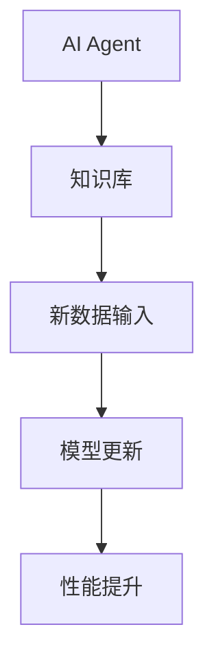
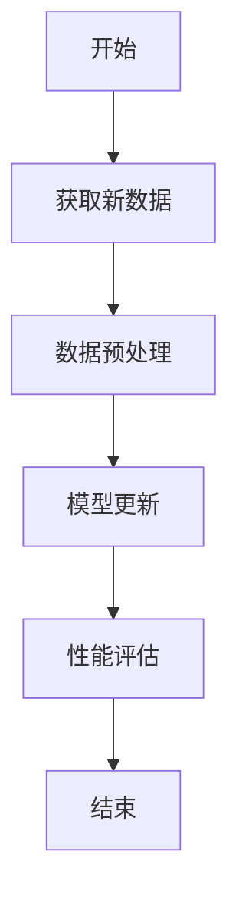
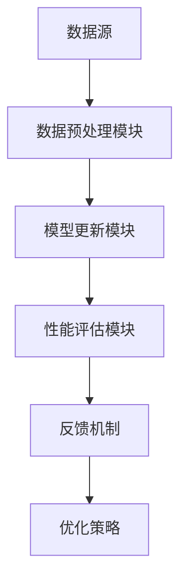
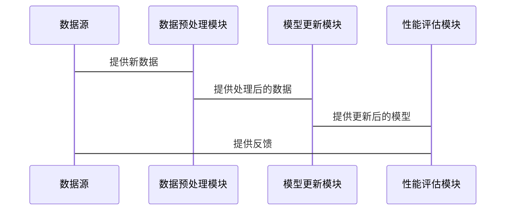

                 


# AI Agent的持续学习机制：保持知识更新与性能提升

> 关键词：AI Agent、持续学习、知识更新、性能提升、模型蒸馏、在线学习、系统架构

> 摘要：本文深入探讨了AI Agent的持续学习机制，分析其在知识更新与性能提升中的关键作用。通过详细阐述核心概念、算法原理、系统架构，并结合实际案例，展示了如何实现高效的持续学习机制，确保AI Agent在动态环境中的适应能力和性能优化。

---

## 正文

### 第一部分：AI Agent的持续学习机制概述

#### 第1章：AI Agent与持续学习的背景介绍

##### 1.1 AI Agent的基本概念

- **1.1.1 AI Agent的定义**
  AI Agent（人工智能代理）是指能够感知环境、自主决策并执行任务的智能实体。它可以是一个软件程序或物理设备，旨在通过交互与环境进行信息交换，以实现特定目标。

- **1.1.2 AI Agent的核心功能**
  - **感知**：通过传感器或其他输入方式获取环境信息。
  - **决策**：基于获取的信息，利用算法做出决策。
  - **执行**：通过执行机构或输出模块执行决策结果。

- **1.1.3 AI Agent的应用场景**
  - 智能助手（如Siri、Alexa）
  - 自动驾驶系统
  - 智能推荐系统

##### 1.2 持续学习的基本概念

- **1.2.1 持续学习的定义**
  持续学习（Continuous Learning）是指模型在新数据不断输入的情况下，能够不断更新和优化自身，以适应环境变化的学习方式。

- **1.2.2 持续学习的重要性**
  - 适应动态环境
  - 提高模型的泛化能力
  - 实现长期性能优化

- **1.2.3 持续学习与传统学习的区别**
  - 传统学习：基于固定训练数据，模型在训练完成后不再更新。
  - 持续学习：模型在训练后持续接收新数据，不断优化。

##### 1.3 AI Agent持续学习的背景与挑战

- **1.3.1 知识更新的必要性**
  AI Agent需要在动态环境中工作，面对的新问题和数据类型不断变化，传统的一次性训练无法满足需求。

- **1.3.2 持续学习在AI Agent中的应用**
  - 环境变化适应
  - 任务复杂度增加
  - 用户需求变化

- **1.3.3 当前技术的局限性与挑战**
  - 数据稀疏性
  - 模型遗忘问题
  - 计算资源限制

---

#### 第2章：持续学习机制的核心概念与联系

##### 2.1 持续学习机制的原理

- **2.1.1 模型更新策略**
  - **增量学习**：仅使用新数据进行模型更新，节省计算资源。
  - **回顾学习**：定期回顾旧数据，增强模型泛化能力。

- **2.1.2 数据处理方法**
  - **数据流处理**：实时处理数据流，确保模型及时更新。
  - **数据预处理**：对新数据进行清洗和特征提取，提高模型训练效率。

- **2.1.3 知识表示方式**
  - **符号表示**：使用符号逻辑表示知识，便于推理和更新。
  - **向量表示**：使用向量空间模型表示知识，适用于深度学习。

##### 2.2 核心概念对比表格

| 概念       | 描述                                   |
|------------|--------------------------------------|
| 模型更新   | 对现有模型参数进行调整以适应新数据     |
| 数据处理   | 对新数据进行预处理和特征提取           |
| 知识表示   | 将新知识转化为模型可理解的形式         |

##### 2.3 ER实体关系图



---

#### 第3章：持续学习机制的算法原理

##### 3.1 算法原理概述

- **3.1.1 模型蒸馏**
  - 将知识从旧模型转移到新模型，减少训练数据的需求。
  - 使用小样本数据进行微调，保持模型性能。

- **3.1.2 知识蒸馏**
  - 将复杂的知识简化为更易处理的形式。
  - 适用于模型压缩和轻量化设计。

- **3.1.3 在线学习**
  - 实时处理数据流，逐步更新模型。
  - 适用于流数据环境，如实时推荐系统。

##### 3.2 算法流程图



##### 3.3 算法实现代码

```python
def model_update(new_data, current_model):
    # 数据预处理
    processed_data = preprocess(new_data)
    
    # 模型微调
    updated_model = fine_tune(current_model, processed_data)
    
    # 性能评估
    accuracy = evaluate(updated_model)
    
    return updated_model, accuracy
```

##### 3.4 数学模型与公式

- **模型蒸馏公式**
  - 教师模型输出：$p(x) = \argmax_y P(y|x)$
  - 学生模型输出：$q(x) = \argmax_y P(y|x)$
  - 知识蒸馏目标：$\min_{\theta} \sum_{i=1}^n -p(x_i)\log q(x_i)$

- **在线学习公式**
  - 损失函数：$\mathcal{L}(\theta) = \frac{1}{n}\sum_{i=1}^n \mathcal{L}_i(\theta)$
  - 参数更新：$\theta = \theta - \eta \nabla_{\theta}\mathcal{L}(\theta)$

---

#### 第4章：系统分析与架构设计

##### 4.1 问题场景介绍

- 动态环境中的任务执行
- 数据流处理与实时反馈
- 多任务学习与资源分配

##### 4.2 系统功能设计

- 数据采集与预处理
- 模型更新与优化
- 性能监控与评估

##### 4.3 系统架构设计



##### 4.4 系统交互序列图



---

#### 第5章：项目实战

##### 5.1 环境安装

```bash
pip install numpy scikit-learn tensorflow
```

##### 5.2 核心实现代码

```python
import numpy as np
from sklearn.model_selection import train_test_split
from tensorflow.keras import models, layers

def create_model(input_shape):
    model = models.Sequential()
    model.add(layers.Dense(64, activation='relu', input_shape=input_shape))
    model.add(layers.Dense(10, activation='softmax'))
    model.compile(optimizer='adam', loss='sparse_categorical_crossentropy', metrics=['accuracy'])
    return model

def model_update(new_data, model):
    X_new, y_new = new_data
    X_train, X_val, y_train, y_val = train_test_split(X_new, y_new, test_size=0.2)
    model.fit(X_train, y_train, epochs=5, validation_data=(X_val, y_val))
    return model, model.evaluate(X_val, y_val)[1]
```

##### 5.3 实际案例分析

- **案例背景**：一个在线推荐系统，用户行为数据实时更新。
- **数据处理**：实时获取用户点击数据，进行特征提取。
- **模型更新**：定期对模型进行微调，保持推荐准确性。
- **性能评估**：通过A/B测试评估模型更新后的效果。

##### 5.4 代码应用解读

- **数据预处理**：对新数据进行清洗和特征提取，确保模型输入的格式正确。
- **模型微调**：在旧模型基础上，使用新数据进行小样本训练，减少计算资源消耗。
- **性能评估**：通过验证集评估模型更新后的性能，确保效果提升。

---

#### 第6章：最佳实践与注意事项

##### 6.1 最佳实践

- **数据质量控制**：确保输入数据的准确性，避免噪声干扰。
- **模型选择与优化**：根据任务需求选择合适的模型架构，并进行调参优化。
- **资源管理**：合理分配计算资源，平衡模型更新频率与性能需求。

##### 6.2 小结

持续学习机制是AI Agent保持知识更新与性能提升的核心。通过模型蒸馏、在线学习等算法，结合合理的系统架构设计，可以在动态环境中实现高效的持续学习。

##### 6.3 注意事项

- 避免模型遗忘：定期回顾旧数据，增强模型的记忆能力。
- 处理数据稀疏性：使用适当的数据增强方法，提高模型泛化能力。
- 优化计算效率：通过并行计算和分布式训练，提升模型更新速度。

##### 6.4 拓展阅读

- 《Continuous Learning in Neural Networks》
- 《Online Learning: A Comprehensive Survey》
- 《Incremental Learning: Theory and Practice》

---

### 第二部分：总结与展望

#### 7.1 总结

本文详细探讨了AI Agent的持续学习机制，从核心概念、算法原理到系统架构，全面分析了实现持续学习的关键要素。通过实际案例和代码实现，展示了如何在动态环境中保持模型性能。

#### 7.2 展望

未来，随着AI技术的发展，持续学习将在更多领域得到应用。研究重点将放在模型压缩、在线学习算法优化以及分布式持续学习架构的设计上。

---

### 作者

**作者：AI天才研究院/AI Genius Institute & 禅与计算机程序设计艺术 /Zen And The Art of Computer Programming**

---

以上是文章的完整结构和内容，涵盖了从背景介绍到实际应用的各个方面，结合理论与实践，详细阐述了AI Agent的持续学习机制。

