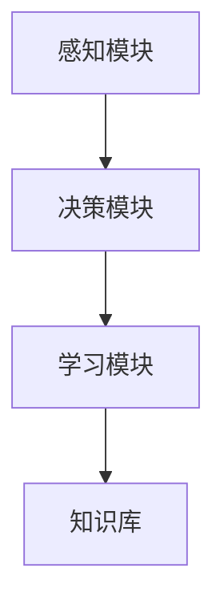

                 


# AI Agent的持续学习：保持知识更新

**关键词**：AI Agent、持续学习、知识更新、机器学习、深度学习

**摘要**：  
随着人工智能技术的快速发展，AI Agent（智能体）在各个领域的应用越来越广泛。然而，AI Agent的核心能力——学习能力，需要不断进化以适应动态变化的环境。本文将深入探讨AI Agent的持续学习机制，分析其核心原理、算法实现、系统架构以及实际应用，帮助读者全面理解如何实现AI Agent的知识更新与能力提升。

---

## 正文

### 第1章: AI Agent与持续学习概述

#### 1.1 AI Agent的基本概念
AI Agent是指在计算机系统中，能够感知环境并采取行动以实现特定目标的智能实体。它具备以下核心特征：
- **自主性**：能够在没有外部干预的情况下独立决策。
- **反应性**：能够实时感知环境并做出响应。
- **目标导向**：通过优化目标函数来驱动行为。
- **学习能力**：能够通过经验改进自身的决策和行为。

AI Agent的应用场景广泛，包括机器人控制、智能助手、自动驾驶、游戏AI等。

#### 1.2 持续学习的定义与特点
持续学习是指AI Agent在不断变化的环境中，能够通过与环境的交互持续更新知识和技能，以适应新的任务和挑战。其特点包括：
- **在线性**：学习过程与任务执行紧密结合，实时更新。
- **累积性**：新知识建立在已有知识的基础上，逐步积累。
- **动态性**：能够处理实时变化的环境信息。

#### 1.3 AI Agent持续学习的背景与意义
在动态和不确定的环境中，AI Agent需要不断调整其知识库和行为策略。持续学习能够帮助AI Agent：
- **适应新任务**：在新的任务中快速调整策略。
- **应对环境变化**：在环境变化时保持高效决策能力。
- **提升长期性能**：通过持续优化算法，提高长期任务表现。

### 第2章: 持续学习的核心概念与原理

#### 2.1 持续学习的基本原理
持续学习的核心在于如何有效地更新知识库，同时保持已有知识的完整性。常见的知识表示方法包括：
- **符号表示**：通过规则或逻辑表达知识。
- **神经网络表示**：通过深度学习模型（如神经网络）表示知识。

知识更新机制需要解决两个关键问题：
- **知识遗忘**：如何防止旧知识的遗忘。
- **知识记忆**：如何高效存储新知识。

#### 2.2 持续学习的关键技术
- **经验重放（Experience Replay）**：通过存储历史经验，避免重复学习，提高学习效率。
- **知识蒸馏（Knowledge Distillation）**：通过教师模型将知识迁移到学生模型，减少知识损失。
- **网络适应性调整（Adaptive Network Adjustment）**：根据新任务动态调整网络结构和参数。

#### 2.3 持续学习的挑战与解决方案
- **数据偏见问题**：通过多样化数据来源和平衡训练策略解决。
- **计算资源限制**：通过轻量化设计和增量学习方法优化计算效率。

### 第3章: 持续学习的算法原理

#### 3.1 基于DQN的持续学习算法
DQN（Deep Q-Network）是一种经典的强化学习算法，适用于离散动作空间的任务。其核心步骤如下：
1. **环境感知**：通过观察环境获取当前状态。
2. **动作选择**：基于当前知识选择一个动作。
3. **执行动作**：执行选定动作，观察新状态和奖励。
4. **知识更新**：将新经验（状态、动作、奖励）存储到经验回放池，并通过神经网络更新价值函数。

#### 3.2 基于PPO的持续学习算法
PPO（Proximal Policy Optimization）是一种适用于连续动作空间的强化学习算法。其核心思想是通过限制策略更新的幅度，确保策略的稳定性。

#### 3.3 算法实现代码示例
以下是一个简单的DQN算法实现示例：

```python
import numpy as np

def dqn_update(state, action, reward, next_state):
    target = reward + gamma * np.max(dqn_model.predict(next_state))
    target_f = dqn_model.predict(state)
    target_f[0][action] = target
    dqn_model.fit(state, target_f, epochs=1, verbose=0)
```

### 第4章: 系统架构与设计

#### 4.1 系统结构
AI Agent的持续学习系统通常包括以下几个模块：
- **感知模块**：负责感知环境信息。
- **决策模块**：基于当前知识做出决策。
- **学习模块**：负责知识的更新和优化。
- **知识库**：存储和管理AI Agent的知识。

#### 4.2 系统架构图


### 第5章: 项目实战

#### 5.1 环境配置
以OpenAI Gym中的CartPole环境为例，配置环境并初始化AI Agent。

#### 5.2 核心代码实现
以下是AI Agent的持续学习代码示例：

```python
import gym
import numpy as np
from tensorflow.keras import layers

# 初始化环境
env = gym.make('CartPole-v1')
state_space = env.observation_space.shape[0]
action_space = env.action_space.n

# 定义DQN模型
model = keras.Sequential()
model.add(layers.Dense(24, activation='relu', input_dim=state_space))
model.add(layers.Dense(action_space, activation='linear'))
model.compile(optimizer='adam', loss='mean_squared_error')

# 持续学习过程
for episode in range(1000):
    state = env.reset()
    while True:
        # 选择动作
        action = np.argmax(model.predict(np.array([state])))
        next_state, reward, done, _ = env.step(action)
        
        # 更新知识库
        target = reward + 0.95 * np.max(model.predict(np.array([next_state])))
        target_f = model.predict(np.array([state]))
        target_f[0][action] = target
        model.fit(np.array([state]), target_f, epochs=1, verbose=0)
        
        state = next_state
        if done:
            break
```

### 第6章: 最佳实践与总结

#### 6.1 小结
持续学习是AI Agent保持竞争力的关键能力。通过经验重放、知识蒸馏等技术，AI Agent能够不断优化自身的知识库和决策能力。

#### 6.2 注意事项
- **数据质量**：确保输入数据的多样性和代表性。
- **模型稳定性**：避免过度优化导致模型不稳定性。
- **计算资源**：合理配置计算资源，优化学习效率。

#### 6.3 未来趋势
随着深度学习和强化学习技术的不断进步，AI Agent的持续学习能力将更加智能化和高效化。

---

**作者**：AI天才研究院/AI Genius Institute & 禅与计算机程序设计艺术 /Zen And The Art of Computer Programming

---

**参考文献**：
1. Mnih, V., et al. "Playing atari with deep reinforcement learning." arXiv preprint arXiv:1312.5602 (2013).
2. Schmidhuber, J. "Deep learning in neural networks: An overview." Neural Networks, 2015.

