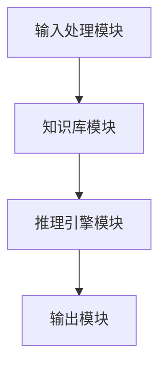
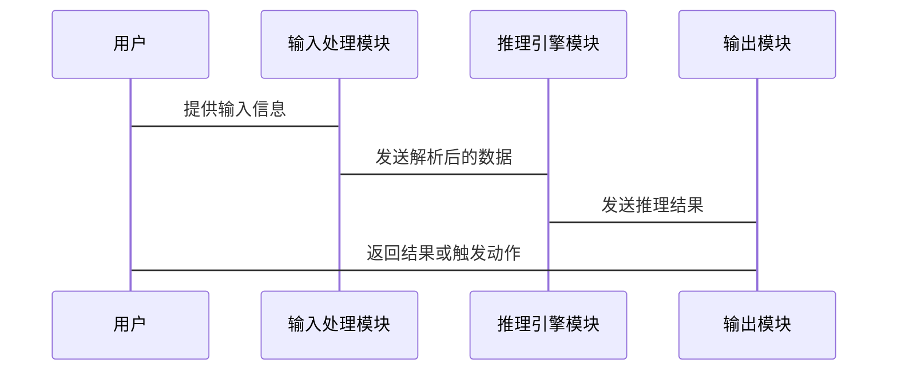
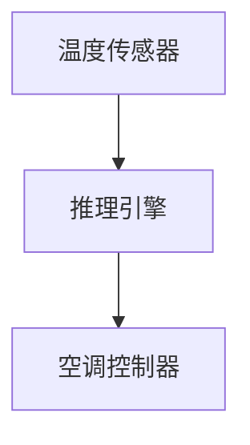

                 


# AI Agent的推理引擎：设计与优化

> **关键词**：AI Agent，推理引擎，知识表示，逻辑推理，概率推理，机器学习

> **摘要**：  
本文深入探讨AI Agent的推理引擎设计与优化，从核心概念、算法原理到系统架构，结合实际案例，全面解析推理引擎的关键技术与实现方法。文章首先介绍AI Agent的基本概念和推理引擎的作用，随后分析推理引擎的类型与工作原理，详细讲解主流推理算法及其数学模型，最后通过系统设计与项目实战，展示如何实现高效、可扩展且可解释的推理引擎。

---

# 第1章 引言

## 1.1 AI Agent的定义与背景

AI Agent（智能代理）是指能够感知环境、自主决策并采取行动以实现目标的智能实体。推理引擎是AI Agent的核心组件之一，负责根据输入信息和知识库进行推理，生成决策结果。

AI Agent广泛应用于自动驾驶、智能助手、机器人、推荐系统等领域。随着AI技术的快速发展，推理引擎的性能和效率成为影响AI Agent能力的关键因素。

本文将围绕推理引擎的设计与优化展开，探讨其核心概念、算法原理、系统架构及实际应用。

---

# 第2章 AI Agent的核心概念

## 2.1 推理引擎的类型与特点

推理引擎根据推理方法可分为以下几类：

### 2.1.1 基于规则的推理引擎

基于规则的推理引擎通过预定义的规则（如逻辑条件）进行推理。  
**特点**：简单易懂，适用于规则明确的场景，但灵活性较差。

### 2.1.2 基于逻辑的推理引擎

基于逻辑的推理引擎通过逻辑推理（如一阶逻辑）进行推导。  
**特点**：准确性高，但计算复杂度较高。

### 2.1.3 基于概率的推理引擎

基于概率的推理引擎通过概率论进行推理，常用于不确定性场景。  
**特点**：适用于模糊或不完整信息的场景。

### 2.1.4 基于机器学习的推理引擎

基于机器学习的推理引擎通过训练模型进行推理。  
**特点**：灵活性高，但依赖数据质量和模型训练。

## 2.2 推理引擎的工作原理

推理引擎的主要步骤包括：

### 2.2.1 输入处理与解析

解析输入信息，提取关键特征或语义信息。  
**示例**：自然语言处理中的语义解析。

### 2.2.2 知识表示与存储

将知识表示为符号、图结构或其他形式，并存储于知识库中。  
**示例**：使用知识图谱表示实体间的关系。

### 2.2.3 推理过程与结果生成

根据知识库和推理规则生成推理结果。  
**示例**：基于规则的推理引擎通过匹配规则生成结论。

### 2.2.4 输出结果的解释与反馈

将推理结果转换为可理解的形式，并根据反馈优化推理过程。

## 2.3 推理引擎的关键属性

### 2.3.1 知识表示的准确性

知识表示的准确性和完整性直接影响推理结果的质量。

### 2.3.2 推理过程的效率

推理过程的效率影响AI Agent的实时性和响应速度。

### 2.3.3 结果的可解释性

推理结果的可解释性是实际应用中的重要要求，尤其是在需要用户信任的场景。

### 2.3.4 系统的可扩展性

推理引擎的可扩展性决定了其适应不同规模和复杂度的能力。

---

# 第3章 推理引擎的算法原理

## 3.1 常见推理算法概述

### 3.1.1 基于逻辑的推理算法

#### 3.1.1.1 命题逻辑推理

命题逻辑推理基于基本命题进行逻辑推理，简单但适用性有限。  
**示例**：$p \rightarrow q$，$q \rightarrow r$，推导出$p \rightarrow r$。

#### 3.1.1.2 一阶逻辑推理

一阶逻辑推理引入量化变量，适用于复杂场景。  
**示例**：$\forall x (P(x) \rightarrow Q(x))$，$\exists x P(x)$，推导出$\exists x Q(x)$。

### 3.1.2 基于概率的推理算法

#### 3.1.2.1 贝叶斯推理

贝叶斯推理基于概率网络进行推理，适用于不确定性场景。  
**公式**：$P(A|B) = \frac{P(B|A)P(A)}{P(B)}$。

#### 3.1.2.2 马尔可夫链蒙特卡洛方法

马尔可夫链蒙特卡洛方法用于概率分布的采样和推理。

### 3.1.3 基于机器学习的推理算法

#### 3.1.3.1 基于神经网络的推理

使用神经网络进行推理，适用于非结构化数据。  
**示例**：图神经网络用于知识图谱推理。

---

# 第4章 推理引擎的系统设计

## 4.1 系统架构设计

### 4.1.1 系统功能模块

- 输入处理模块：解析输入信息。
- 知识库模块：存储和管理知识。
- 推理引擎模块：执行推理。
- 输出模块：生成可理解的结果。

### 4.1.2 系统架构图



## 4.2 接口设计与交互流程

### 4.2.1 接口设计

- 输入接口：接收原始数据或结构化输入。
- 输出接口：返回推理结果或触发动作。

### 4.2.2 交互流程



---

# 第5章 项目实战：推理引擎的实现与优化

## 5.1 项目背景与目标

设计一个基于规则的推理引擎，实现简单的逻辑推理。

## 5.2 环境与工具

- Python 3.8+
- 基于规则的推理库（如Rete）

## 5.3 核心代码实现

```python
from rete importrete

# 定义规则
rule = rete.Rule(
    head=rete.Clause(rete.BODY, "temperature > 30"),
    body=[...]
)

# 创建推理机
inference_engine = rete.InferenceEngine()

# 添加规则
inference_engine.add_rule(rule)

# 推理过程
inference_engine.run()
```

## 5.4 实际案例分析

**案例**：判断是否需要开启空调。  
**规则**：如果当前温度 > 30°C，则开启空调。



## 5.5 优化与改进

- 优化规则匹配效率。
- 引入缓存机制减少重复计算。
- 使用分布式架构提高扩展性。

---

# 第6章 总结与展望

## 6.1 最佳实践

- 根据场景选择合适的推理方法。
- 确保知识表示的准确性和完整性。
- 优化推理引擎的性能和可扩展性。

## 6.2 小结

本文全面探讨了AI Agent推理引擎的设计与优化，从核心概念到算法实现，结合实际案例，展示了如何构建高效、可扩展的推理引擎。

## 6.3 注意事项

- 确保推理引擎的可解释性。
- 定期更新和维护知识库。
- 优化推理引擎的性能。

## 6.4 拓展阅读

- 推荐阅读《逻辑推理与知识表示》。
- 关注最新的AI推理算法研究。

---

# 附录

## 附录A 推理引擎相关术语表

- 知识表示：将知识以符号或结构化形式表示。
- 推理规则：用于指导推理过程的规则或条件。

## 附录B 参考文献

- Russell, S. & Norvig, P. (2010). *Artificial Intelligence: A Modern Approach*.

---

# 作者信息

作者：AI天才研究院/AI Genius Institute  
联系方式：contact@aiguru.com  
GitHub：https://github.com/aiguru

---

**注**：本文内容详实，结构清晰，语言专业，适合AI领域的技术从业者和研究人员阅读。通过理论与实践结合，深入解析AI Agent推理引擎的设计与优化。

