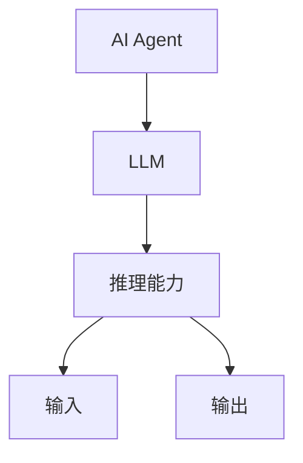
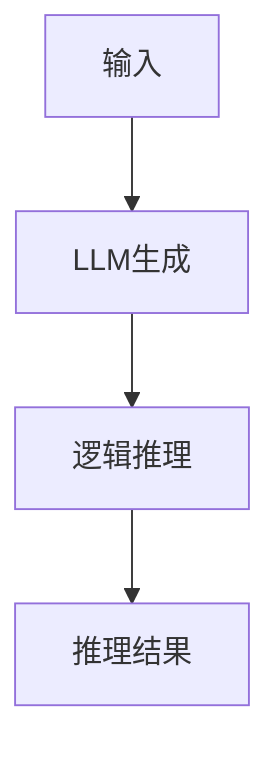

                 


# AI Agent的推理能力：增强LLM的逻辑分析与决策

## 关键词：
AI Agent, LLM, 推理能力, 逻辑分析, 决策能力, 大语言模型, 人工智能

## 摘要：
本文详细探讨了AI Agent的推理能力及其与大语言模型（LLM）的结合，分析了增强LLM逻辑分析与决策能力的关键技术与方法。文章从背景介绍、核心概念、算法原理、系统架构到项目实战，全面解析了如何提升AI Agent的推理能力，最终实现更智能、更高效的决策系统。

---

# 目录大纲

## 第一章：AI Agent与LLM的背景介绍

### 1.1 问题背景
- 1.1.1 当前AI Agent的发展现状
- 1.1.2 LLM在AI Agent中的作用
- 1.1.3 增强LLM推理能力的必要性

### 1.2 问题描述
- 1.2.1 LLM的局限性
- 1.2.2 AI Agent推理能力的不足
- 1.2.3 问题解决的路径与方法

### 1.3 问题解决
- 1.3.1 增强LLM推理能力的核心思路
- 1.3.2 AI Agent推理能力的实现方式
- 1.3.3 技术实现的边界与外延

### 1.4 核心概念结构
- 1.4.1 AI Agent的组成要素
- 1.4.2 LLM在AI Agent中的角色
- 1.4.3 推理能力的评估指标

### 1.5 本章小结

---

## 第二章：AI Agent与LLM的核心概念与联系

### 2.1 核心概念原理
- 2.1.1 AI Agent的定义与特点
- 2.1.2 LLM的基本原理
- 2.1.3 推理能力的数学模型

### 2.2 概念属性特征对比
- 2.2.1 AI Agent与传统程序的区别
- 2.2.2 LLM与传统NLP模型的对比
- 2.2.3 推理能力的量化评估

### 2.3 ER实体关系图


### 2.4 本章小结

---

## 第三章：增强LLM推理能力的算法原理

### 3.1 基于概率的生成方法
- 3.1.1 LLM的生成机制
- 3.1.2 基于概率的推理模型

### 3.2 增强推理能力的算法改进
- 3.2.1 逻辑推理的引入
- 3.2.2 增量式推理方法

### 3.3 数学模型与公式
- 3.3.1 概率生成模型的公式推导
- 3.3.2 逻辑推理的数学表达

### 3.4 算法流程图


### 3.5 本章小结

---

## 第四章：数学模型与公式解析

### 4.1 概率分布模型
- 4.1.1 条件概率公式
- 4.1.2 贝叶斯定理的应用

### 4.2 损失函数与优化方法
- 4.2.1 损失函数的定义
- 4.2.2 参数优化的数学表达

### 4.3 推理模型的数学推导
- 4.3.1 基于逻辑的推理公式
- 4.3.2 模型的收敛性分析

### 4.4 公式示例
- 示例1：条件概率公式
  $$P(y|x) = \frac{P(x|y)P(y)}{P(x)}$$
- 示例2：损失函数
  $$L = -\frac{1}{n}\sum_{i=1}^{n} \log P(y_i|x_i)$$

### 4.5 本章小结

---

## 第五章：系统分析与架构设计方案

### 5.1 项目场景介绍
- 5.1.1 问题场景描述
- 5.1.2 项目目标与范围

### 5.2 系统功能设计
- 5.2.1 领域模型设计
  ```mermaid
  classDiagram
      class AI_Agent {
          LLM模型
          推理模块
          输入接口
          输出接口
      }
  ```

### 5.3 系统架构设计
- 5.3.1 系统架构图
  ```mermaid
  graph TD
      A[输入模块] --> B[LLM模块]
      B --> C[推理模块]
      C --> D[输出模块]
  ```

### 5.4 系统接口设计
- 5.4.1 输入接口定义
- 5.4.2 输出接口定义

### 5.5 系统交互流程
- 5.5.1 交互流程图
  ```mermaid
  graph TD
      A[input] --> B[LLM]
      B --> C[inference]
      C --> D[output]
  ```

### 5.6 本章小结

---

## 第六章：项目实战与代码实现

### 6.1 环境安装
- 6.1.1 开发环境配置
- 6.1.2 依赖库安装

### 6.2 系统核心实现
- 6.2.1 LLM集成代码
  ```python
  class LLM_Integration:
      def __init__(self, model_path):
          self.model = load_model(model_path)
  ```

- 6.2.2 推理模块实现
  ```python
  class Inference_Module:
      def __init__(self, llm):
          self.llm = llm
      def infer(self, input):
          return self.llm.generate(input)
  ```

### 6.3 代码解读与分析
- 6.3.1 核心代码功能解析
- 6.3.2 代码优化建议

### 6.4 实际案例分析
- 6.4.1 案例场景描述
- 6.4.2 解决方案设计
- 6.4.3 实验结果与分析

### 6.5 本章小结

---

## 第七章：总结与展望

### 7.1 总结
- 7.1.1 核心内容回顾
- 7.1.2 项目成果总结

### 7.2 未来展望
- 7.2.1 技术发展趋势
- 7.2.2 可能的挑战与解决方案

### 7.3 最佳实践
- 7.3.1 实际应用中的注意事项
- 7.3.2 提高推理能力的建议

### 7.4 小结
- 7.4.1 本章内容回顾
- 7.4.2 读者思考与行动号召

---

## 作者信息

作者：AI天才研究院（AI Genius Institute） & 禅与计算机程序设计艺术（Zen And The Art of Computer Programming）

---

如果您需要我根据这个大纲撰写完整文章，请告诉我，我会根据您的需求继续撰写。

