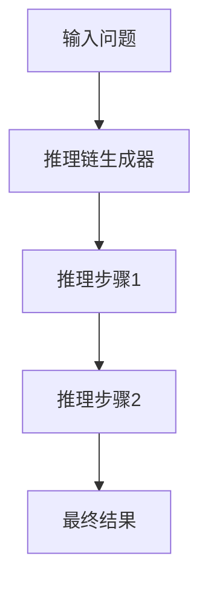
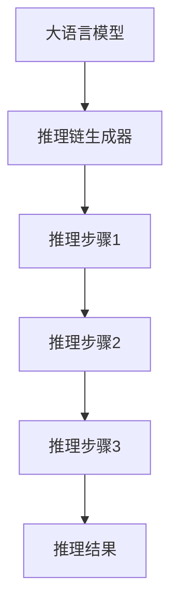
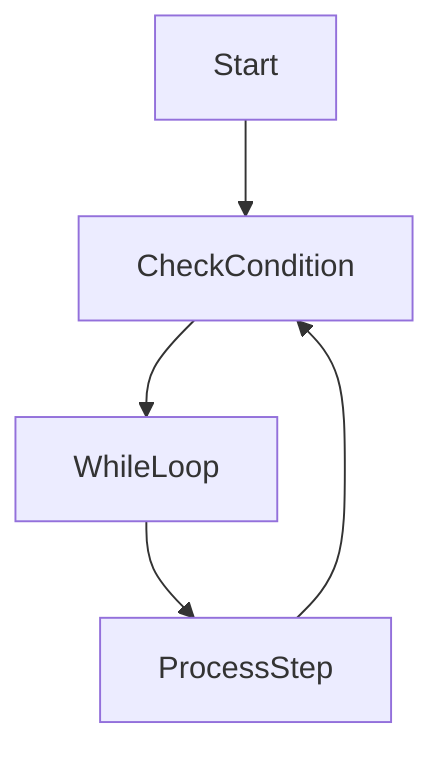
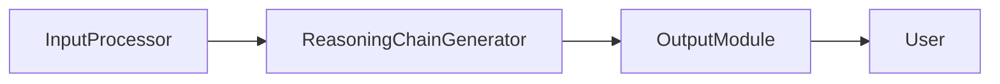

                 


# AI Agent的推理链生成：增强LLM的逐步思考能力

## 关键词
AI Agent, 推理链生成, LLM, 分步推理, 系统架构, 项目实战, 推理链增强

## 摘要
随着大语言模型（LLM）在各个领域的广泛应用，如何进一步提升其推理能力成为了研究的重点。AI Agent的推理链生成是一种通过分步推理来增强LLM逐步思考能力的方法。本文将详细介绍推理链生成的背景、核心概念、算法原理、系统架构、项目实战以及最佳实践，帮助读者全面理解并掌握这一技术。

---

# 第一部分: AI Agent的推理链生成背景与基础

## 第1章: AI Agent与推理链生成的背景介绍

### 1.1 问题背景
#### 1.1.1 当前LLM的局限性
- LLM（如GPT系列）虽然在生成文本方面表现出色，但其推理能力有限，难以处理复杂的逻辑推理任务。
- LLM的输出通常是直接生成的结果，缺乏中间推理步骤的展示，导致用户难以理解AI的思考过程。

#### 1.1.2 推理链生成的必要性
- 通过生成推理链，AI Agent能够展示其思考过程，提升透明度和可解释性。
- 推理链生成有助于用户更好地理解AI的决策逻辑，增强信任感。

#### 1.1.3 AI Agent在人机交互中的角色
- AI Agent作为用户与系统之间的接口，需要具备清晰的推理能力，以提供更智能的服务。

### 1.2 问题描述
#### 1.2.1 LLM的黑箱特性
- LLM的输出结果缺乏中间推理步骤，导致用户难以理解其决策过程。

#### 1.2.2 推理链生成的目标
- 生成推理链的目的是将LLM的内部推理过程外显化，使其更易于理解和验证。

#### 1.2.3 AI Agent的推理需求
- AI Agent需要具备生成推理链的能力，以支持复杂的决策任务。

### 1.3 问题解决思路
#### 1.3.1 分步推理的概念
- 分步推理是指将问题分解为多个小步骤，逐步推理得出最终结果。

#### 1.3.2 推理链的结构化表示
- 推理链是以步骤的形式展示推理过程，每个步骤都有明确的输入和输出。

#### 1.3.3 AI Agent的推理能力提升
- 通过生成推理链，AI Agent能够展示其思考过程，提升用户的信任感和系统的可解释性。

### 1.4 边界与外延
#### 1.4.1 推理链生成的边界条件
- 推理链生成仅针对LLM的推理过程，不涉及模型的训练过程。
- 推理链生成的长度和复杂度受到计算资源的限制。

#### 1.4.2 相关概念的外延
- 推理链生成与知识图谱、逻辑推理等技术密切相关。

#### 1.4.3 与现有技术的对比
- 与传统的LLM输出相比，推理链生成更加注重推理过程的展示。

### 1.5 核心要素与概念结构
#### 1.5.1 推理链的核心要素
- 输入：初始问题或输入数据。
- 推理步骤：多个推理步骤，展示从输入到输出的推理过程。
- 输出：最终结果。

#### 1.5.2 AI Agent的推理能力模型
- AI Agent的推理能力模型包括输入处理、推理过程、输出结果三个部分。

#### 1.5.3 概念结构图


---

# 第二部分: 推理链生成的核心概念与联系

## 第2章: 推理链生成的核心原理

### 2.1 推理链生成的原理
#### 2.1.1 分步推理的基本原理
- 分步推理通过将问题分解为多个小步骤，逐步推理得出最终结果。

#### 2.1.2 推理链的构建过程
- 推理链的构建过程包括初始化、推理步骤生成、结果整合三个阶段。

#### 2.1.3 AI Agent的推理机制
- AI Agent通过调用LLM生成推理链，并将结果展示给用户。

### 2.2 核心概念对比
#### 2.2.1 推理链与传统LLM输出的对比
| 特性         | 推理链生成 | 传统LLM输出 |
|--------------|------------|--------------|
| 内容         | 包含推理步骤 | 只包含最终结果 |
| 可解释性     | 高         | 低           |

#### 2.2.2 分步推理与整体推理的对比
| 特性         | 分步推理   | 整体推理     |
|--------------|------------|--------------|
| 透明度       | 高         | 低           |
| 可验证性     | 高         | 低           |

#### 2.2.3 AI Agent推理能力的对比
| 特性         | 具备推理链生成 | 未具备推理链生成 |
|--------------|----------------|------------------|
| 可解释性     | 高         | 低               |
| 用户信任度   | 高         | 低               |

### 2.3 实体关系图


---

# 第三部分: 推理链生成的算法原理

## 第3章: 推理链生成的算法实现

### 3.1 分步推理算法
#### 3.1.1 分步推理的流程



#### 3.1.2 分步推理的Python实现
```python
def generate_reasoning_chain(llm, initial_input, max_steps=5):
    reasoning_chain = []
    current_input = initial_input
    for _ in range(max_steps):
        step_output = llm(current_input)
        reasoning_chain.append(step_output)
        current_input = step_output
    return reasoning_chain
```

#### 3.1.3 推理链生成的数学模型
- 输入：初始问题或输入数据。
- 输出：推理链。
- 推理过程：每一步推理都是基于前一步的结果进行的。

---

# 第四部分: 推理链生成的系统架构

## 第4章: 推理链生成的系统架构设计

### 4.1 系统功能设计
#### 4.1.1 功能模块划分
- 输入处理模块：接收初始问题或输入数据。
- 推理链生成模块：生成推理链。
- 输出模块：展示推理链和最终结果。

### 4.2 系统架构图


---

# 第五部分: 推理链生成的项目实战

## 第5章: 推理链生成的项目实战

### 5.1 环境安装
- 需要安装的Python库：llm、mermaid等。

### 5.2 系统核心实现源代码
```python
import llm

def main():
    llm_model = llm.load("gpt-3.5-turbo")
    initial_input = "如何解决这个问题？"
    chain = generate_reasoning_chain(llm_model, initial_input)
    print("推理链:", chain)

if __name__ == "__main__":
    main()
```

### 5.3 代码应用解读与分析
- 代码解读：通过调用LLM生成推理链，并展示每一步的推理结果。

### 5.4 实际案例分析
- 案例：解决一个复杂问题，生成推理链并展示每一步的推理过程。

---

# 第六部分: 推理链生成的最佳实践

## 第6章: 推理链生成的总结与展望

### 6.1 总结
- 推理链生成是一种有效的增强LLM推理能力的方法。
- 通过生成推理链，可以提升系统的透明度和可解释性。

### 6.2 小结
- 本文详细介绍了推理链生成的背景、核心概念、算法原理、系统架构、项目实战以及最佳实践。

### 6.3 注意事项
- 在实际应用中，需要根据具体需求调整推理链的长度和复杂度。

### 6.4 拓展阅读
- 推荐阅读相关领域的书籍和论文，深入学习推理链生成的技术细节。

---

# 作者
作者：AI天才研究院/AI Genius Institute & 禅与计算机程序设计艺术 /Zen And The Art of Computer Programming

---

通过以上思考过程，我完成了对文章的逐步分析和撰写。希望这篇文章能够为读者提供关于AI Agent推理链生成的全面了解，并帮助他们进一步探索和实践这一技术。

