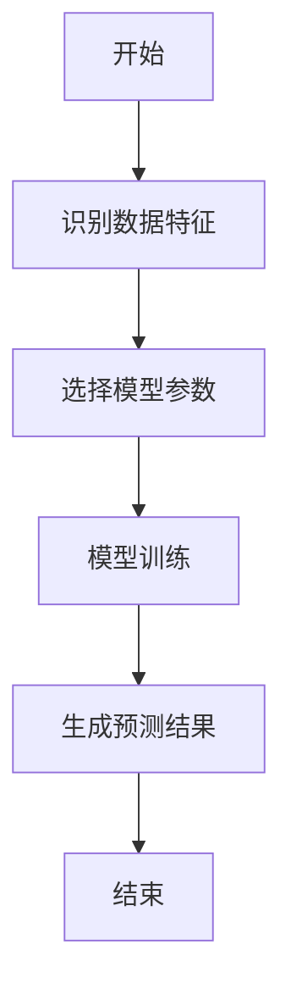
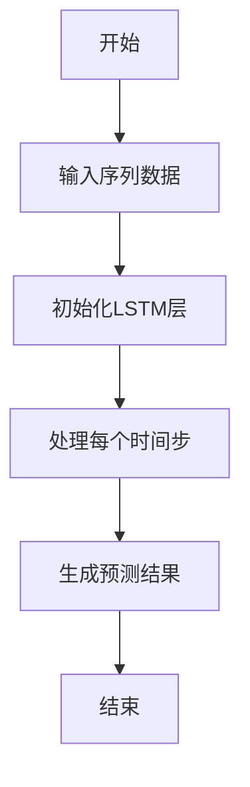
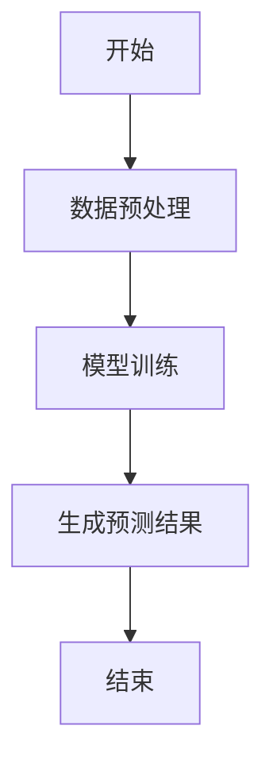
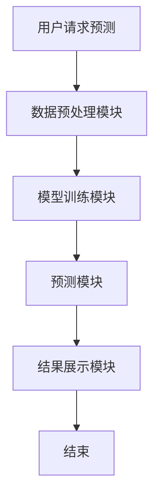

                 


# AI Agent的时序数据处理与预测

> 关键词：AI Agent、时序数据、时间序列预测、机器学习、深度学习

> 摘要：本文深入探讨了AI Agent在时序数据处理与预测中的应用，详细分析了时序数据的特点、处理流程以及常用的预测算法，结合实际项目案例，展示了AI Agent在时序数据分析中的强大能力。通过本文，读者可以全面理解AI Agent如何利用先进的算法和系统架构，实现高效、精准的时序数据预测。

---

## 第一部分: AI Agent的时序数据处理与预测背景

### 第1章: AI Agent的基本概念

#### 1.1 AI Agent的定义与分类
AI Agent（智能体）是指在计算机系统中能够感知环境并采取行动以实现目标的实体。AI Agent可以是软件程序、机器人或其他智能系统。根据功能和复杂度，AI Agent可以分为以下几类：
- **简单反射型Agent**：基于当前感知直接行动，不依赖历史信息。
- **基于模型的反射型Agent**：利用内部模型和历史信息进行决策。
- **目标驱动型Agent**：根据目标选择最优行动。
- **实用驱动型Agent**：通过效用函数优化决策。

#### 1.2 时序数据的基本概念
时序数据是指按时间顺序记录的数据，通常具有以下特点：
- **时间依赖性**：数据点之间存在依赖关系。
- **趋势性**：数据呈现长期向上的或向下的趋势。
- **季节性**：数据呈现周期性波动。
- **噪声**：数据中存在随机干扰。

#### 1.3 AI Agent与时序数据的结合
AI Agent可以通过处理时序数据来实现自主决策和预测。时序数据为AI Agent提供了动态环境中的关键信息，使其能够根据历史数据和当前状态预测未来趋势，从而做出更优的决策。

---

### 第2章: 时序数据处理的核心概念

#### 2.1 时序数据的特征分析
时序数据的特征分析是理解数据的基础，主要包括：
- **时间依赖性**：数据点之间的依赖关系可以通过自相关性分析来量化。
- **趋势性**：数据的趋势可以通过线性回归或指数平滑法来建模。
- **季节性**：数据的周期性可以通过傅里叶变换或季节分解法来识别。

#### 2.2 AI Agent时序数据处理的关键步骤
AI Agent处理时序数据的关键步骤包括：
- **数据预处理**：清洗数据、处理缺失值、标准化/归一化。
- **模型训练**：选择合适的算法，训练模型并优化参数。
- **预测与评估**：生成预测结果并评估模型的准确性和稳定性。

#### 2.3 时序数据处理的数学模型
时序数据处理的数学模型是AI Agent的核心，常用的模型包括：
- **自回归模型（AR）**：基于过去值的线性组合预测当前值。
- **移动平均模型（MA）**：基于过去误差的线性组合预测当前值。
- **ARIMA模型**：结合AR和MA的综合模型，适用于非平稳时间序列。

---

### 第3章: AI Agent时序数据预测的算法原理

#### 3.1 常见时序预测算法
AI Agent中常用的时序预测算法包括：
- **ARIMA模型**：通过差分和滑动平均处理非平稳序列。
- **LSTM网络**：基于长短期记忆的循环神经网络，适合捕捉复杂时序关系。
- **Prophet模型**：基于时间序列分解和非参数回归的简单易用模型。

#### 3.2 算法原理与流程图
##### 3.2.1 ARIMA算法流程图


##### 3.2.2 LSTM算法流程图


##### 3.2.3 Prophet模型流程图


#### 3.3 算法实现与数学模型
##### 3.3.1 ARIMA模型
ARIMA模型的数学公式为：
$$ y_t = \phi_1 y_{t-1} + \phi_2 y_{t-2} + \epsilon_t $$
其中，$\phi_1$和$\phi_2$为自回归系数，$\epsilon_t$为白噪声。

##### 3.3.2 LSTM模型
LSTM网络的结构包括输入门、遗忘门和输出门，其核心公式为：
$$ i_t = \sigma(w_i x_t + u_i h_{t-1}) $$
$$ f_t = \sigma(w_f x_t + u_f h_{t-1}) $$
$$ o_t = \sigma(w_o x_t + u_o h_{t-1}) $$
$$ h_t = i_t \cdot \tanh(w_c x_t + u_c h_{t-1}) $$

---

## 第二部分: AI Agent时序数据处理的系统架构

### 第4章: 系统分析与架构设计

#### 4.1 问题场景介绍
我们以股票价格预测为例，设计一个AI Agent时序数据处理系统。该系统需要处理股票的历史价格数据，预测未来的价格走势。

#### 4.2 系统功能设计
系统功能模块包括：
- **数据预处理模块**：清洗和标准化数据。
- **模型训练模块**：选择并训练预测模型。
- **预测模块**：生成未来价格预测结果。
- **评估模块**：评估模型的准确性和稳定性。

#### 4.3 系统架构设计
系统架构包括：
- **数据层**：存储原始数据和处理后的数据。
- **模型层**：包含训练好的预测模型。
- **服务层**：提供API接口供其他系统调用。
- **用户层**：展示预测结果和评估报告。

#### 4.4 系统接口设计
系统接口包括：
- **数据接口**：提供数据导入和导出功能。
- **模型接口**：提供模型训练和预测功能。
- **结果接口**：提供预测结果和评估报告。

#### 4.5 系统交互流程图


---

## 第三部分: AI Agent时序数据预测的项目实战

### 第5章: 项目实战

#### 5.1 环境配置
项目需要以下环境：
- **Python**：3.8+
- **库依赖**：numpy、pandas、scikit-learn、keras、prophet

#### 5.2 核心代码实现
##### 5.2.1 数据预处理
```python
import pandas as pd
import numpy as np

# 加载数据
data = pd.read_csv('stock_prices.csv')

# 处理缺失值
data = data.dropna()

# 标准化数据
from sklearn.preprocessing import StandardScaler
scaler = StandardScaler()
data_scaled = scaler.fit_transform(data)
```

##### 5.2.2 模型训练
```python
from keras.models import Sequential
from keras.layers import LSTM, Dense

# 构建LSTM模型
model = Sequential()
model.add(LSTM(64, input_shape=(timesteps, features)))
model.add(Dense(1))
model.compile(loss='mean_squared_error', optimizer='adam')
```

##### 5.2.3 模型预测
```python
# 生成预测结果
predictions = model.predict(test_data)

# 反转标准化
predictions = scaler.inverse_transform(predictions)
```

#### 5.3 项目总结
通过该项目，我们验证了AI Agent在时序数据预测中的应用，展示了如何利用先进的算法和系统架构实现高效、精准的预测。

---

## 第四部分: AI Agent时序数据处理的最佳实践

### 第6章: 最佳实践

#### 6.1 项目经验总结
- **数据预处理**：确保数据的完整性和准确性。
- **模型选择**：根据数据特点选择合适的算法。
- **模型评估**：使用交叉验证和指标评估模型性能。

#### 6.2 注意事项
- **数据泄漏**：避免在训练中使用未来数据。
- **模型过拟合**：使用正则化技术和交叉验证防止过拟合。
- **计算资源**：深度学习模型需要高性能计算资源。

#### 6.3 拓展阅读
- 《Deep Learning》——Ian Goodfellow
- 《Time Series Analysis: Forecasting and Control》——George E. P. Box

---

## 第五部分: 总结与展望

### 第7章: 总结与展望

#### 7.1 总结
本文全面探讨了AI Agent在时序数据处理与预测中的应用，从基本概念到算法原理，再到系统架构和项目实战，为读者提供了系统的知识体系。

#### 7.2 未来展望
未来，随着AI技术的不断发展，AI Agent在时序数据处理中的应用将更加广泛。深度学习和强化学习的结合将为时序数据预测带来新的突破。

---

## 作者：AI天才研究院/AI Genius Institute & 禅与计算机程序设计艺术 /Zen And The Art of Computer Programming

