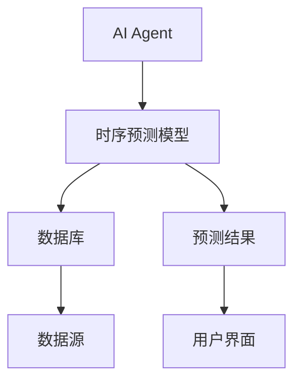

                 


```markdown
# AI Agent的时序预测能力：理解和预测动态过程

> 关键词：AI Agent, 时序预测, 动态过程, 算法原理, 系统架构, 项目实战

> 摘要：本文详细探讨了AI Agent在时序预测中的应用，从基本概念到算法原理，再到系统架构和项目实战，全面解析了如何理解和预测动态过程。

---

## 第一部分: AI Agent的时序预测能力基础

### 第1章: AI Agent与时序预测概述

#### 1.1 AI Agent的基本概念
- **1.1.1 AI Agent的定义与特点**
  - AI Agent是具备自主决策和行动能力的智能体。
  - 具备感知环境、推理和执行任务的能力。
  - 可以分为简单反射型、基于模型的反射型、目标驱动型和效用驱动型。

- **1.1.2 AI Agent的核心功能**
  - 感知环境：通过传感器或数据输入获取信息。
  - 推理与决策：基于感知信息进行推理和决策。
  - 行动执行：根据决策结果执行动作。

- **1.1.3 时序预测在AI Agent中的重要性**
  - 时序预测是AI Agent在动态环境中做出准确决策的关键。
  - 通过预测未来状态，AI Agent可以提前规划和优化行动。

#### 1.2 时序预测的基本概念
- **1.2.1 时序预测的定义与特点**
  - 时序预测是根据历史数据预测未来事件或数据序列的过程。
  - 具有时间依赖性、非线性关系和不确定性。

- **1.2.2 时序预测的应用场景**
  - 股票价格预测：基于历史数据预测未来股价。
  - 智慧城市：预测交通流量、空气质量等。
  - 医疗健康：预测疾病传播趋势。

- **1.2.3 动态过程中的时序预测挑战**
  - 数据稀疏性：数据不足导致预测困难。
  - 模型选择：如何选择适合的预测模型。
  - 实时性要求：动态环境下的实时预测需求。

#### 1.3 AI Agent与时序预测的结合
- **1.3.1 AI Agent的决策过程**
  - 感知环境：获取实时数据。
  - 推理与预测：基于历史数据预测未来状态。
  - 行动决策：根据预测结果制定行动计划。

- **1.3.2 时序预测在动态过程中的作用**
  - 提高决策的准确性。
  - 优化资源分配。
  - 提前应对潜在风险。

- **1.3.3 AI Agent时序预测的核心问题**
  - 数据处理：如何处理和分析时序数据。
  - 模型选择：如何选择适合的预测模型。
  - 结果解释：如何解释预测结果并指导行动。

---

### 第2章: 时序预测的核心概念与联系

#### 2.1 时序预测的原理
- **2.1.1 数据驱动与模型驱动的对比**
  - 数据驱动：基于大量数据训练模型，不需要明确的模型假设。
  - 模型驱动：基于领域知识构建模型，适用于数据不足的情况。

- **2.1.2 时序预测的关键要素**
  - 数据特征：如趋势、季节性、周期性。
  - 模型选择：如ARIMA、LSTM、Transformer。
  - 评估指标：如MAE、MSE、RMSE。

- **2.1.3 动态过程中的因果关系**
  - 因果关系在时序预测中的重要性。
  - 如何在动态过程中识别和建模因果关系。

#### 2.2 时序预测模型的分类
- **2.2.1 线性模型与非线性模型**
  - 线性模型：如ARIMA，适用于线性趋势。
  - 非线性模型：如LSTM，适用于复杂动态。

- **2.2.2 基于统计的方法与基于机器学习的方法**
  - 统计方法：如ARIMA，基于假设检验和参数估计。
  - 机器学习方法：如随机森林、神经网络，基于数据驱动。

- **2.2.3 常见时序预测模型的对比分析**
  - 对比ARIMA、LSTM、Transformer的优缺点。
  - 选择模型的考虑因素：数据类型、预测精度、计算资源。

#### 2.3 AI Agent时序预测的实体关系图
```mermaid
er
actor: AI Agent
agent: 时序预测模型
process: 预测过程
attribute: 预测结果
```

---

## 第二部分: 时序预测的算法原理

### 第3章: 常见时序预测算法详解

#### 3.1 ARIMA算法
- **3.1.1 ARIMA算法的数学模型**
  $$ ARIMA(p, d, q) $$
  - p：自回归阶数。
  - d：差分阶数。
  - q：移动平均阶数。

- **3.1.2 ARIMA算法的实现步骤**
  1. 检查数据的平稳性。
  2. 进行差分处理。
  3. 确定AR和MA的阶数。
  4. 模型拟合与预测。

- **3.1.3 ARIMA算法的优缺点**
  - 优点：简单易用，适合线性趋势。
  - 缺点：对非线性数据表现不佳。

#### 3.2 LSTM网络
- **3.2.1 LSTM的基本结构**
  - 细胞状态：长期记忆。
  - 输入门、遗忘门、输出门：控制信息的流动。

- **3.2.2 LSTM的实现步骤**
  1. 输入数据处理。
  2. 初始化权重和偏置。
  3. 前向传播计算门控和细胞状态。
  4. 后向传播更新权重。

- **3.2.3 LSTM算法的优缺点**
  - 优点：能够捕捉长期依赖关系。
  - 缺点：训练时间较长，参数多。

#### 3.3 Transformer模型
- **3.3.1 Transformer的基本结构**
  - 编码器和解码器：处理序列数据。
  - 自注意力机制：捕捉全局依赖关系。

- **3.3.2 Transformer的实现步骤**
  1. 输入嵌入。
  2. 自注意力计算。
  3. 前向网络处理。
  4. 输出预测结果。

- **3.3.3 Transformer算法的优缺点**
  - 优点：在复杂动态中表现优异。
  - 缺点：计算资源消耗大。

#### 3.4 算法对比与选择
- 对比ARIMA、LSTM、Transformer的性能和适用场景。
- 根据数据类型和预测精度选择合适算法。

---

## 第三部分: 系统分析与架构设计方案

### 第4章: 时序预测系统的架构设计

#### 4.1 问题场景介绍
- 动态过程中的时序预测需求。
- 系统需要具备实时预测和自适应能力。

#### 4.2 项目介绍
- 系统目标：构建一个支持时序预测的AI Agent。
- 项目范围：股票价格预测、设备故障预测。

#### 4.3 系统功能设计
- 数据采集：实时获取动态数据。
- 数据预处理：清洗和特征提取。
- 模型训练：选择合适的预测算法。
- 预测输出：生成预测结果并提供解释。

#### 4.4 系统架构设计


#### 4.5 系统接口设计
- 数据接口：数据输入和输出接口。
- 模型接口：与预测模型的交互接口。
- 用户接口：展示预测结果和控制界面。

#### 4.6 系统交互流程
```mermaid
sequenceDiagram
    actor 用户
    agent AI Agent
    process 时序预测过程
    用户 -> agent: 发出预测请求
    agent -> process: 执行时序预测
    process -> agent: 返回预测结果
    agent -> 用户: 显示预测结果
```

---

## 第四部分: 项目实战

### 第5章: 时序预测项目实现

#### 5.1 环境安装
- 安装Python、TensorFlow、Keras、pandas等库。
  ```bash
  pip install numpy pandas scikit-learn tensorflow keras
  ```

#### 5.2 核心实现
- 数据预处理：加载数据、特征提取。
  ```python
  import pandas as pd
  data = pd.read_csv('stock_prices.csv')
  ```

- 模型训练：选择LSTM模型进行训练。
  ```python
  model = Sequential()
  model.add(LSTM(50, input_shape=(timesteps, features)))
  model.add(Dense(1))
  model.compile(optimizer='adam', loss='mean_squared_error')
  model.fit(X_train, y_train, epochs=50, batch_size=32)
  ```

- 模型预测：使用训练好的模型进行预测。
  ```python
  predictions = model.predict(X_test)
  ```

#### 5.3 代码解读与分析
- 数据预处理：处理和清洗数据，提取特征。
- 模型选择：根据数据特点选择合适的预测算法。
- 结果分析：评估预测结果的准确性，调整模型参数。

#### 5.4 案例分析
- 股票价格预测：展示预测结果和实际价格的对比。
- 设备故障预测：展示预测结果和实际故障时间的对比。

#### 5.5 项目小结
- 总结项目实施过程中的经验教训。
- 提出优化建议和未来改进方向。

---

## 第五部分: 总结与展望

### 第6章: 总结与展望

#### 6.1 总结
- AI Agent在时序预测中的应用价值。
- 各种时序预测算法的优缺点。
- 系统架构设计的关键点。

#### 6.2 展望
- 新兴技术的发展对时序预测的影响。
- AI Agent在更多领域的应用潜力。

#### 6.3 最佳实践 tips
- 数据预处理的重要性。
- 模型选择的注意事项。
- 系统优化的建议。

#### 6.4 结语
- 感谢读者的阅读。
- 邀请读者提出反馈和建议。

---

## 作者信息

作者：AI天才研究院 & 禅与计算机程序设计艺术

---

### 附录

#### 附录A: 时序预测算法对比表
| 算法 | 优点 | 缺点 |
|------|------|------|
| ARIMA | 简单易用 | 仅适合线性数据 |
| LSTM  | 能捕捉长期依赖 | 训练时间长 |
| Transformer | 高准确性 | 计算资源消耗大 |

#### 附录B: 时序预测的数学公式
- ARIMA模型：
  $$ ARIMA(p, d, q) $$
- LSTM细胞状态更新：
  $$ c_t = \beta \cdot c_{t-1} + \alpha \cdot f(x_t) $$

---

感谢您的阅读！如需进一步探讨，请随时联系！
```

