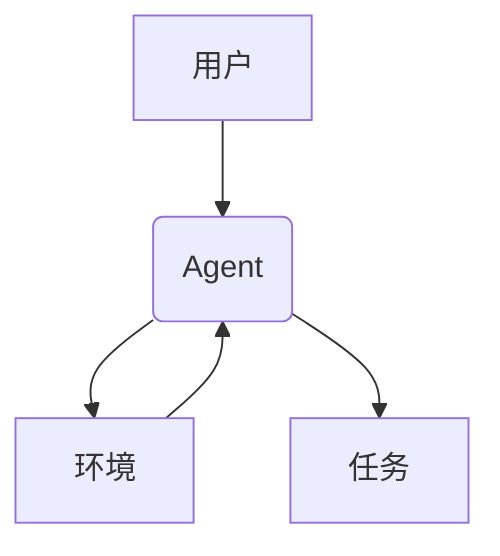
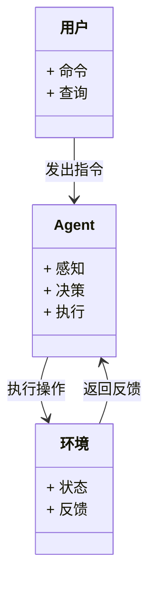
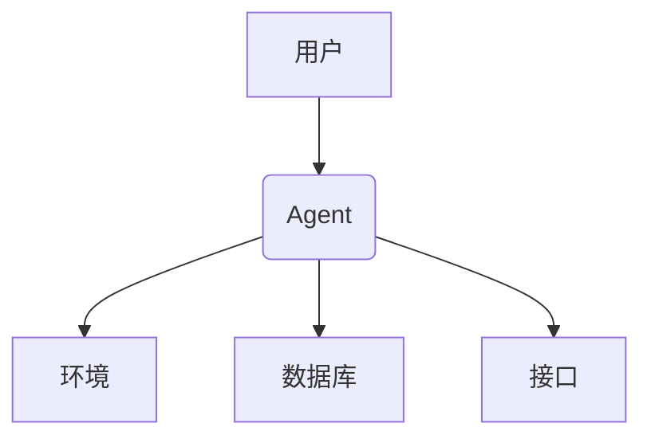

                 


# AI Agent的未来：趋势预测与展望

## 关键词
AI Agent, 人工智能代理, 未来趋势, 技术博客, 趋势预测

## 摘要
随着人工智能技术的飞速发展，AI Agent（人工智能代理）作为一类能够自主决策并执行任务的智能体，正在成为科技领域的焦点。本文将深入探讨AI Agent的核心概念、技术原理、系统架构以及未来的发展趋势。通过分析当前的技术现状和应用场景，预测未来AI Agent的发展方向，并提出相应的建议。

---

## 第一部分: AI Agent的背景与核心概念

### 第1章: AI Agent的基本概念与背景

#### 1.1 AI Agent的定义与特征
- **1.1.1 AI Agent的基本定义**  
  AI Agent（人工智能代理）是一种智能体，能够感知环境、自主决策并执行任务，以实现特定目标。它具备自主性、反应性、目标导向性和社会性等核心特征。

- **1.1.2 AI Agent的核心特征**  
  - 自主性：无需外部干预，自主完成任务。  
  - 反应性：能够实时感知环境变化并做出反应。  
  - 目标导向性：以目标为导向，优化决策过程。  
  - 社会性：能够与其他智能体或人类进行交互与协作。

- **1.1.3 AI Agent与传统AI的区别**  
  AI Agent不仅仅是静态的知识库或规则系统，而是动态的、能够主动适应环境的智能体。

#### 1.2 AI Agent的历史发展与现状
- **1.2.1 AI Agent的发展历程**  
  AI Agent的概念起源于20世纪60年代的知识表示与推理研究，经历了从专家系统到机器学习，再到现代深度学习的演变。

- **1.2.2 当前AI Agent的主要应用领域**  
  - 智能助手（如Siri、Alexa）。  
  - 自动驾驶技术。  
  - 智能客服与机器人。  
  - 游戏AI与虚拟助手。  

- **1.2.3 AI Agent技术的现状与挑战**  
  当前AI Agent已在多个领域取得显著成果，但仍面临复杂环境适应性不足、多智能体协作难题以及伦理问题等挑战。

#### 1.3 AI Agent的未来趋势与展望
- **1.3.1 技术发展趋势**  
  - 多模态感知能力的增强。  
  - 自适应学习与自优化决策。  
  - 跨领域应用的扩展。  

- **1.3.2 市场需求与应用场景**  
  随着企业智能化转型的推进，AI Agent在金融、医疗、教育、交通等领域的应用需求将持续增长。

- **1.3.3 可能面临的伦理与社会问题**  
  数据隐私、算法偏见、责任划分等问题将成为AI Agent普及过程中的主要障碍。

---

## 第二部分: AI Agent的核心概念与原理

### 第2章: AI Agent的核心概念与联系

#### 2.1 AI Agent的核心原理
- **2.1.1 感知模块**  
  AI Agent通过传感器或数据接口感知环境信息，例如图像识别、语音识别和自然语言处理。

- **2.1.2 决策模块**  
  基于感知到的信息，AI Agent利用机器学习模型（如强化学习、决策树）进行决策。

- **2.1.3 执行模块**  
  根据决策结果，AI Agent通过执行器（如机器人、软件API）完成任务。

#### 2.2 AI Agent的实体关系图


---

## 第三部分: AI Agent的算法原理讲解

### 第3章: 感知与决策算法

#### 3.1 强化学习算法
- **3.1.1 算法流程**  
  ```mermaid
  graph TD
      A[状态] --> B(动作)
      B --> C[奖励]
      C --> D[新状态]
  ```
  - 状态：环境反馈给AI Agent的信息。  
  - 动作：AI Agent选择的动作。  
  - 奖励：环境对动作的反馈。  

- **3.1.2 数学模型**  
  $$ Q(s, a) = Q(s, a) + \alpha(r + \max Q(s', a) - Q(s, a)) $$  
  其中，$\alpha$ 是学习率，$r$ 是奖励，$s'$ 是新状态。

### 第4章: 数学模型与公式

#### 4.1 状态空间与动作空间
- **4.1.1 状态空间**  
  状态空间$S$表示所有可能的状态集合，例如位置坐标、传感器数据等。

- **4.1.2 动作空间**  
  动作空间$A$表示所有可能的动作集合，例如移动、抓取、点击等。

- **4.1.3 状态转移概率**  
  $$ P(s' | s, a) $$  
  表示在状态$s$下执行动作$a$后转移到状态$s'$的概率。

---

## 第四部分: 系统分析与架构设计方案

### 第5章: 系统功能设计

#### 5.1 领域模型


### 第6章: 系统架构设计

#### 6.1 系统架构图


---

## 第五部分: 项目实战

### 第7章: 项目实战与案例分析

#### 7.1 环境安装
- 需要安装的工具：Python、TensorFlow、Keras、OpenAI API。

#### 7.2 核心代码实现
```python
class Agent:
    def __init__(self, model):
        self.model = model

    def perceive(self, environment):
        return environment.get_state()

    def decide(self, state):
        return self.model.predict(state)

    def execute(self, action):
        return action.perform()
```

#### 7.3 案例分析与总结
通过实际案例分析，展示AI Agent在智能客服中的应用，详细解读代码实现和优化建议。

---

## 第六部分: 未来展望与最佳实践

### 第8章: 未来展望与最佳实践

#### 8.1 技术发展趋势
- 多模态AI Agent的普及。  
- 自适应学习算法的突破。  
- 跨领域协作的增强。  

#### 8.2 最佳实践 tips
- 确保数据隐私与安全。  
- 定期更新模型以应对环境变化。  
- 与人类协作，提升用户体验。  

---

## 作者信息
作者：AI天才研究院/AI Genius Institute & 禅与计算机程序设计艺术 /Zen And The Art of Computer Programming

---

希望这篇文章能满足您的要求！如果需要进一步调整或补充，请随时告知。

