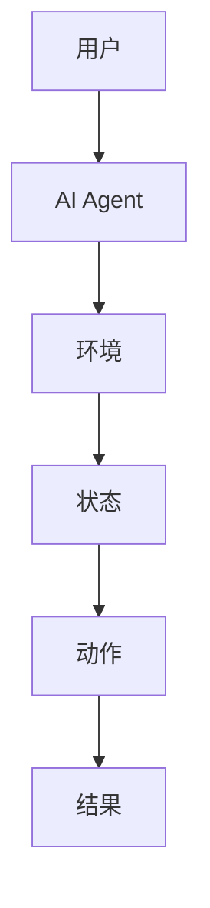
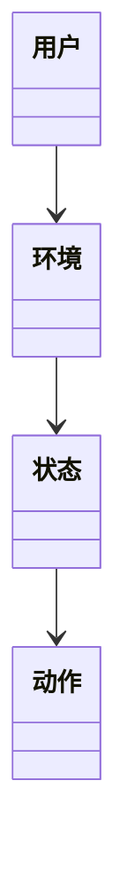
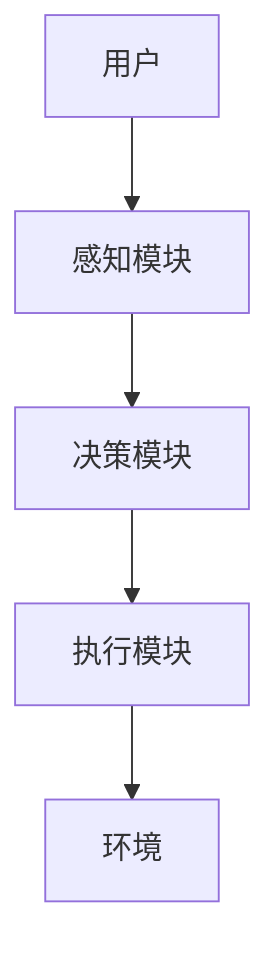
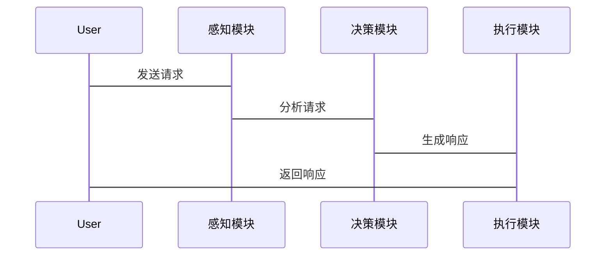

                 


# AI Agent的架构设计：从概念到实现

---

## 关键词：
AI Agent，架构设计，算法原理，系统架构，项目实战，知识表示，行为决策

---

## 摘要：
本文系统地探讨了AI Agent的架构设计，从基本概念到实现方法，涵盖核心概念、算法原理、系统架构、项目实战等多个方面。文章通过详细讲解AI Agent的定义、分类、核心原理，结合数学模型、算法代码和系统架构图，帮助读者全面理解AI Agent的设计与实现过程。同时，本文还通过实际案例分析，展示了AI Agent在现实场景中的应用，并提供了最佳实践和注意事项，为读者提供了实用的指导。

---

# 第1章: AI Agent的基本概念与背景

## 1.1 AI Agent的定义与背景

### 1.1.1 什么是AI Agent
AI Agent（人工智能代理）是一种能够感知环境、自主决策并执行任务的智能实体。它可以是一个软件程序、机器人或其他智能系统，其核心目标是通过与环境的交互，实现特定任务的目标。

### 1.1.2 AI Agent的发展背景
随着人工智能技术的快速发展，AI Agent的应用场景越来越广泛。从智能家居到自动驾驶，从智能客服到机器人助手，AI Agent正在渗透到我们生活的方方面面。

### 1.1.3 AI Agent的应用场景
- **智能家居**：通过传感器和设备与环境交互，实现自动化控制。
- **自动驾驶**：通过感知环境和实时决策，实现无人驾驶。
- **智能助手**：通过自然语言处理，为用户提供信息查询和任务执行服务。

## 1.2 AI Agent的核心概念

### 1.2.1 感知、决策与执行
AI Agent通过感知环境获取信息，经过决策过程做出选择，最后通过执行机构将决策转化为具体行动。

### 1.2.2 状态、动作与环境
- **状态**：AI Agent对环境的感知结果。
- **动作**：AI Agent根据决策做出的行为。
- **环境**：AI Agent所处的外部世界。

### 1.2.3 目标与策略
- **目标**：AI Agent追求的最终结果。
- **策略**：实现目标的行动计划。

## 1.3 AI Agent的分类

### 1.3.1 简单反射型Agent
基于当前状态做出即时反应，没有内部状态或目标。

### 1.3.2 基于模型的反应型Agent
维护内部状态模型，能够根据当前状态和历史信息做出决策。

### 1.3.3 目标驱动型Agent
基于目标驱动，通过规划和推理来实现目标。

### 1.3.4 学习型Agent
通过学习和适应改进性能，能够从经验中自我优化。

## 1.4 AI Agent的架构特点

### 1.4.1 模块化设计
AI Agent通常由感知模块、决策模块、执行模块等组成，各模块相对独立。

### 1.4.2 可扩展性
支持新增功能模块，适应不同应用场景的需求。

### 1.4.3 自适应能力
能够根据环境变化和任务需求，动态调整行为和策略。

## 1.5 本章小结
本章介绍了AI Agent的基本概念、核心要素和分类，为后续章节的深入探讨奠定了基础。

---

# 第2章: AI Agent的核心概念与联系

## 2.1 AI Agent的核心原理

### 2.1.1 知识表示与推理
知识表示是将信息以计算机可处理的形式存储，推理是根据知识进行逻辑推导。

### 2.1.2 行为决策机制
基于感知信息和内部知识，通过决策算法选择最优动作。

### 2.1.3 状态空间与动作空间
状态空间是所有可能状态的集合，动作空间是所有可能动作的集合。

## 2.2 核心概念对比表

| 比较维度 | 简单反射型Agent | 基于模型的反应型Agent | 目标驱动型Agent | 学习型Agent |
|----------|----------------|----------------------|-----------------|------------|
| 内部状态 | 无              | 有                   | 有              | 有         |
| 决策方式 | 简单规则        | 基于模型推理          | 基于目标规划    | 基于学习   |
| 学习能力 | 无              | 无                   | 无              | 有         |

## 2.3 ER实体关系图
```mermaid
er
  actor: 用户
  agent: AI Agent
  environment: 环境
  action: 动作
  state: 状态
  relation: 实体间的关系
```

## 2.4 核心概念流程图


## 2.5 本章小结
本章通过对比分析和图表展示，明确了AI Agent的核心概念及其相互关系。

---

# 第3章: AI Agent的算法原理

## 3.1 基于搜索的算法

### 3.1.1 广度优先搜索（BFS）
按层遍历状态空间，寻找最短路径。

### 3.1.2 深度优先搜索（DFS）
按深度遍历状态空间，适合解决某些特定问题。

### 3.1.3 A*算法
综合考虑当前节点和目标节点的评估，使用优先队列选择最优路径。

### 3.1.4 算法实现的代码示例
```python
def a_star_search(graph, start, goal):
    import heapq
    heap = []
    heapq.heappush(heap, (0, start))
    visited = {start: 0}
    
    while heap:
        current_cost, current_node = heapq.heappop(heap)
        if current_node == goal:
            break
        for neighbor, cost in graph[current_node].items():
            new_cost = current_cost + cost
            if neighbor not in visited or new_cost < visited[neighbor]:
                visited[neighbor] = new_cost
                heapq.heappush(heap, (new_cost, neighbor))
    return visited[goal]
```

## 3.2 基于推理的算法

### 3.2.1 逻辑推理
通过逻辑规则进行推理，例如一阶逻辑推理。

### 3.2.2 概率推理
基于概率论进行不确定性推理，例如贝叶斯网络。

## 3.3 基于强化学习的算法

### 3.3.1 Q-Learning
通过试错学习，更新Q值表，实现最优策略。

### 3.3.2 Deep Q-Learning
使用深度神经网络近似Q值函数，解决高维状态空间问题。

## 3.4 算法的数学模型

### 3.4.1 A*算法的数学模型
$$ f(n) = g(n) + h(n) $$
其中，\( g(n) \) 是从起点到当前节点的实际成本，\( h(n) \) 是从当前节点到目标节点的启发式估计。

### 3.4.2 Q-Learning的数学模型
$$ Q(s, a) = Q(s, a) + \alpha (r + \gamma \max Q(s', a') - Q(s, a)) $$
其中，\( \alpha \) 是学习率，\( \gamma \) 是折扣因子。

## 3.5 本章小结
本章详细讲解了AI Agent常用的算法，包括搜索算法、推理算法和强化学习算法，并通过数学公式和代码示例进行了深入分析。

---

# 第4章: AI Agent的系统分析与架构设计

## 4.1 问题场景介绍

### 4.1.1 项目介绍
设计一个智能客服AI Agent，能够自动响应用户咨询并解决问题。

### 4.1.2 功能需求
- 用户信息识别
- 问题分类
- 自动响应

## 4.2 系统功能设计

### 4.2.1 领域模型类图


## 4.3 系统架构设计

### 4.3.1 系统架构图


## 4.4 系统接口设计

### 4.4.1 接口定义
- 输入接口：用户输入
- 输出接口：自动响应

## 4.5 系统交互流程图

### 4.5.1 交互流程


## 4.6 本章小结
本章通过系统分析和架构设计，明确了AI Agent在实际应用中的结构和实现方式。

---

# 第5章: AI Agent的项目实战

## 5.1 环境安装

### 5.1.1 依赖库安装
- Python 3.8+
- numpy、pandas、scikit-learn

## 5.2 核心代码实现

### 5.2.1 知识库构建
```python
class KnowledgeBase:
    def __init__(self):
        self.data = {}

    def add(self, key, value):
        self.data[key] = value
```

### 5.2.2 决策模块实现
```python
class DecisionModule:
    def decide(self, state, knowledge):
        # 具体决策逻辑
        pass
```

## 5.3 实际案例分析

### 5.3.1 案例背景
设计一个智能客服AI Agent，处理用户咨询。

### 5.3.2 实现步骤
1. 构建知识库。
2. 实现感知模块。
3. 设计决策模块。
4. 接口集成。

## 5.4 项目总结
本章通过实际案例，展示了AI Agent从设计到实现的完整过程。

---

# 第6章: 最佳实践、小结与注意事项

## 6.1 最佳实践

### 6.1.1 模块化设计
确保系统模块化，便于维护和扩展。

### 6.1.2 选择合适的算法
根据具体场景选择合适的算法，避免过度复杂化。

## 6.2 小结
本文从概念到实现，全面探讨了AI Agent的架构设计，为读者提供了系统的知识体系和实践指导。

## 6.3 注意事项

### 6.3.1 数据安全
确保系统数据安全，防止信息泄露。

### 6.3.2 系统性能
优化系统性能，提高响应速度和处理能力。

## 6.4 拓展阅读
建议读者进一步阅读相关书籍和论文，深入研究AI Agent的前沿技术。

---

## 作者：AI天才研究院 & 禅与计算机程序设计艺术

---

这篇文章系统地介绍了AI Agent的架构设计，从基本概念到实现方法，结合理论与实践，为读者提供了全面的知识和实用的指导。

