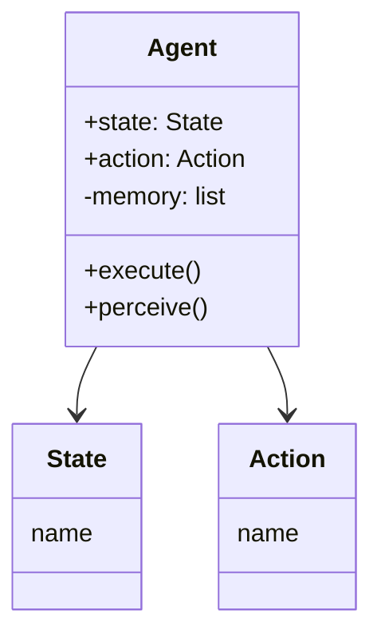
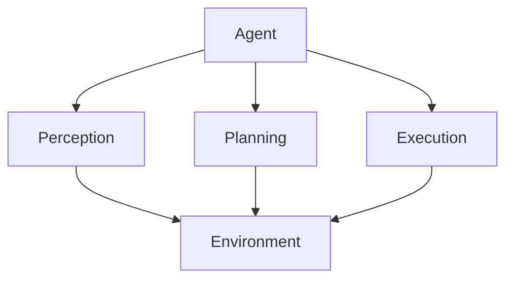
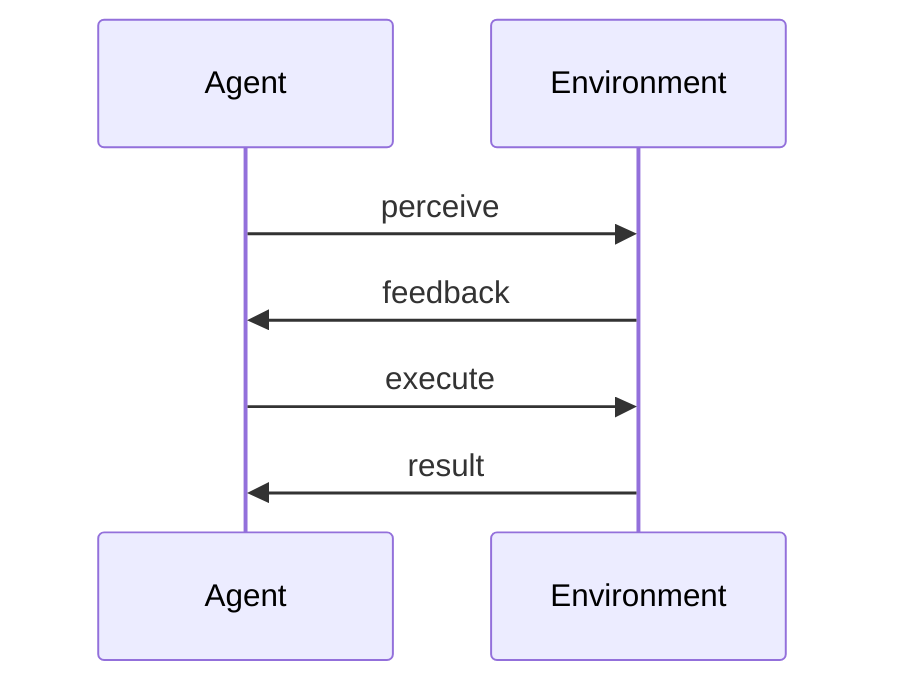

                 


# AI Agent的架构设计：从需求分析到系统规划

> 关键词：AI Agent、架构设计、需求分析、系统规划、人工智能、智能体

> 摘要：本文从AI Agent的基本概念出发，详细探讨了AI Agent的架构设计过程，包括需求分析、算法实现、系统架构设计和项目实战等环节。通过理论与实践相结合的方式，帮助读者系统地掌握AI Agent的架构设计方法。

---

# 第一部分：引言

## 第1章：AI Agent概述

### 1.1 AI Agent的基本概念

AI Agent，即人工智能代理，是指能够感知环境、自主决策并执行任务的智能实体。AI Agent可以是软件程序、机器人或其他智能系统，其核心目标是通过智能算法实现特定任务。

AI Agent的核心特点包括自主性、反应性、目标导向性和学习能力。与传统程序不同，AI Agent能够根据环境反馈动态调整行为，具有较强的适应性和灵活性。

AI Agent的应用场景非常广泛，例如智能助手（如Siri、Alexa）、自动驾驶、智能客服、游戏AI等。这些应用场景要求AI Agent具备高效的问题解决能力和智能决策能力。

### 1.2 AI Agent的核心概念

AI Agent的结构可以分为感知层、计划层和执行层。感知层负责获取环境信息，计划层负责制定行动计划，执行层负责执行任务并反馈结果。这种分层结构使得AI Agent能够高效地处理复杂问题。

AI Agent的行为模式可以分为反应式、计划式和学习式三种。反应式AI Agent基于当前感知做出即时反应；计划式AI Agent会根据环境信息制定详细的行动计划；学习式AI Agent则能够通过经验改进自身性能。

### 1.3 AI Agent的核心算法

AI Agent的实现依赖于多种算法，包括状态空间搜索、强化学习和知识表示与推理。状态空间搜索用于寻找最优路径，强化学习用于通过试错优化行为，知识表示与推理则用于理解和处理复杂信息。

---

# 第二部分：算法与数学模型

## 第2章：AI Agent的核心算法

### 2.1 状态空间搜索

状态空间搜索是一种常用的AI Agent算法，用于解决路径规划等问题。通过遍历所有可能的状态，AI Agent可以找到最优路径。以下是一个简单的状态空间搜索算法实现：

```python
def search_algorithm(start, goal):
    visited = set()
    queue = deque([start])
    while queue:
        current = queue.popleft()
        if current == goal:
            return current
        for neighbor in current.neighbors:
            if neighbor not in visited:
                visited.add(neighbor)
                queue.append(neighbor)
    return None
```

### 2.2 强化学习

强化学习是一种通过试错优化行为的算法。AI Agent通过与环境互动，不断调整策略以最大化奖励。以下是一个简单的强化学习框架：

```python
class Agent:
    def __init__(self, state_space, action_space):
        self.state_space = state_space
        self.action_space = action_space
        self.memory = []
        self.gamma = 0.99  # 折扣因子
        self.epsilon = 1.0  # 探索率
        self.epsilon_min = 0.01

    def remember(self, state, action, reward, next_state):
        self.memory.append((state, action, reward, next_state))

    def act(self, state):
        if random.random() < self.epsilon:
            return random.choice(self.action_space)
        else:
            return self.model.predict(state)

    def replay(self, batch_size):
        mini_batch = random.sample(self.memory, batch_size)
        # 训练模型
        pass
```

### 2.3 知识表示与推理

知识表示与推理是AI Agent理解和处理复杂信息的核心。常用的知识表示方法包括语义网络和逻辑推理。以下是一个简单的逻辑推理示例：

```python
# 知识库
knowledge = {
    "A": {"subconcept": "B"},
    "B": {"instance": "C"}
}

# 推理过程
def infer(sub, pred, obj):
    if pred == "subconcept":
        return knowledge.get(sub, {}).get(pred, []).append(obj)
    elif pred == "instance":
        return knowledge.get(sub, {}).get(pred, []).append(obj)
```

---

# 第三部分：系统架构与设计

## 第3章：系统架构设计

### 3.1 领域模型设计

领域模型是AI Agent系统的核心，用于描述问题领域的实体及其关系。以下是一个简单的领域模型类图：



### 3.2 系统架构设计

AI Agent的系统架构通常包括感知层、计划层和执行层。以下是一个典型的系统架构图：



### 3.3 接口设计与交互

AI Agent系统需要与外部环境进行交互，以下是一个简单的序列图：



---

# 第四部分：项目实战

## 第4章：项目实战

### 4.1 环境安装

要实现一个简单的AI Agent，需要安装以下库：

```bash
pip install numpy
pip install gym
pip install matplotlib
```

### 4.2 核心代码实现

以下是一个简单的AI Agent实现代码：

```python
import gym
import numpy as np

env = gym.make('CartPole-v0')
env.seed(42)

# 初始化智能体
class Agent:
    def __init__(self, observation_space, action_space):
        self.observation_space = observation_space
        self.action_space = action_space
        self.theta = np.random.randn(2, 1)

    def perceive(self, observation):
        return observation

    def plan(self, observation):
        return np.dot(observation, self.theta)

    def execute(self, action):
        return env.step(action)

# 训练过程
agent = Agent(env.observation_space.shape[0], env.action_space.n)
for _ in range(1000):
    observation = env.reset()
    action = agent.plan(observation)
    next_observation, reward, done, info = agent.execute(action)
    env.render()
```

### 4.3 实际案例分析

在实际案例中，AI Agent需要根据环境反馈不断调整策略。例如，在CartPole问题中，AI Agent通过感知棒的位置和速度，规划出最优动作，并通过执行和反馈不断优化策略。

---

# 第五部分：总结与展望

## 第5章：总结与展望

### 5.1 总结

本文从AI Agent的基本概念出发，详细探讨了AI Agent的架构设计过程，包括需求分析、算法实现、系统架构设计和项目实战等环节。通过理论与实践相结合的方式，帮助读者系统地掌握AI Agent的架构设计方法。

### 5.2 展望

未来，AI Agent技术将在更多领域得到应用，例如智能城市、自动驾驶和智能医疗等。同时，随着AI技术的不断发展，AI Agent的架构设计也将更加复杂和精细，需要更多的创新和突破。

---

作者：AI天才研究院 & 禅与计算机程序设计艺术

