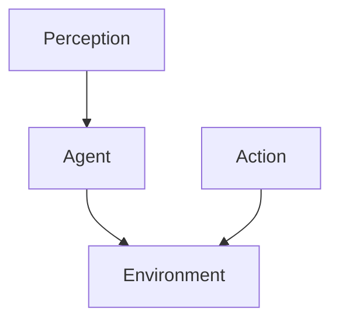
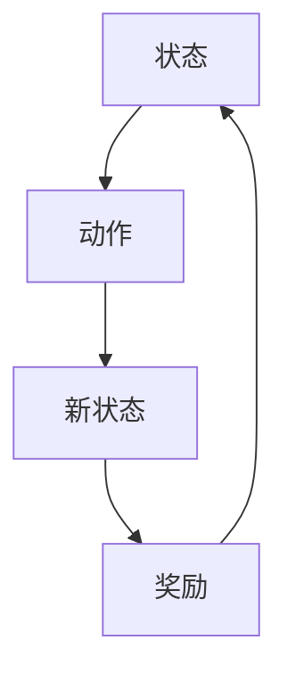
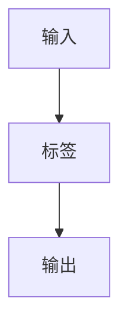
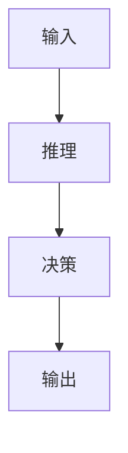
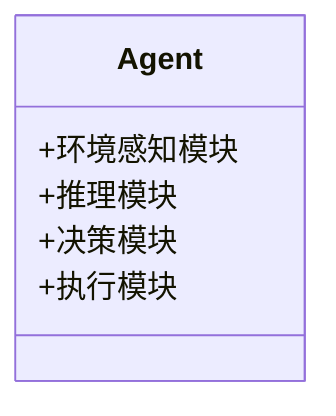
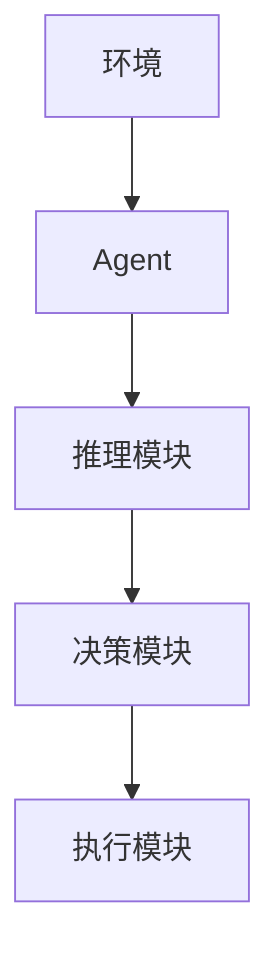
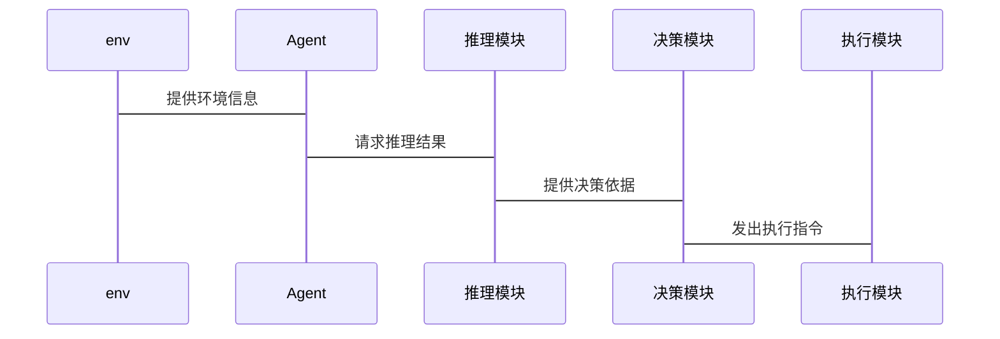

                 


# AI Agent的概念学习与推理实现

> 关键词：AI Agent, 人工智能, 强化学习, 推理, 系统架构

> 摘要：本文将深入探讨AI Agent的核心概念、学习算法、推理与决策机制、系统架构设计以及实际项目实现。通过理论分析与实践案例结合，帮助读者全面理解AI Agent的实现原理，并掌握其在实际应用中的设计方法。

---

# 第1章: AI Agent的概念与背景

## 1.1 AI Agent的基本概念

### 1.1.1 什么是AI Agent

AI Agent（人工智能代理）是指在计算机系统中，能够感知环境、自主决策并执行任务的智能实体。它可以理解为一种能够与环境交互的智能系统，通过感知输入信息，执行特定动作以实现目标。

### 1.1.2 AI Agent的定义与特征

AI Agent的核心特征包括：
1. **自主性**：能够在没有外部干预的情况下自主运行。
2. **反应性**：能够根据环境输入实时调整行为。
3. **目标导向性**：通过设定目标来驱动决策和行动。
4. **学习能力**：能够通过经验改进自身性能。

### 1.1.3 AI Agent的核心功能

AI Agent的主要功能包括：
1. **感知**：通过传感器或其他输入方式获取环境信息。
2. **推理**：对感知到的信息进行分析和处理，推导出可能的动作。
3. **决策**：基于推理结果选择最优动作。
4. **执行**：将决策结果转化为具体行动。

---

## 1.2 AI Agent的发展背景

### 1.2.1 人工智能的演进历程

人工智能（AI）技术经历了多个阶段的发展：
1. **符号推理阶段**：基于逻辑规则的推理方法，如专家系统。
2. **机器学习阶段**：基于数据的训练方法，如神经网络和深度学习。
3. **强化学习阶段**：通过与环境互动进行决策优化。

### 1.2.2 多智能体系统的发展趋势

随着AI技术的进步，多智能体系统（Multi-Agent System, MAS）逐渐成为研究热点。多个AI Agent协同工作，能够完成更加复杂和多样化的任务。

### 1.2.3 当前AI Agent的应用场景

AI Agent目前广泛应用于以下领域：
1. **游戏开发**：如自动驾驶、智能助手。
2. **机器人控制**：如工业机器人、服务机器人。
3. **自动驾驶**：如自动驾驶汽车中的路径规划和决策系统。

---

## 1.3 AI Agent与其他技术的对比

### 1.3.1 与传统AI的区别

传统AI主要依赖于固定的规则和逻辑推理，而AI Agent则强调自主性和目标导向性。

### 1.3.2 与机器学习的联系与区别

AI Agent可以基于机器学习算法进行训练，但AI Agent更注重目标驱动和环境交互。

### 1.3.3 与机器人技术的结合

AI Agent为机器人提供智能决策能力，而机器人则为AI Agent提供物理执行能力。

---

## 1.4 本章小结

本章介绍了AI Agent的基本概念、核心特征和主要功能，同时分析了其发展历程和应用场景。通过与传统AI和机器学习的对比，进一步明确了AI Agent的独特性和优势。

---

# 第2章: AI Agent的核心概念与联系

## 2.1 AI Agent的定义与分类

### 2.1.1 简单反射型AI Agent

简单反射型AI Agent基于即时感知做出反应，没有复杂的学习和推理能力。

### 2.1.2 基于模型的规划型AI Agent

基于模型的规划型AI Agent通过构建环境模型进行推理和决策，具有更强的规划能力。

### 2.1.3 目标驱动型AI Agent

目标驱动型AI Agent通过设定目标，优化决策过程以实现目标。

---

## 2.2 AI Agent的核心概念属性对比

### 2.2.1 行为驱动 vs 知识驱动

行为驱动型AI Agent基于即时行为做出决策，知识驱动型AI Agent则依赖于预存知识。

### 2.2.2 单智能体 vs 多智能体

单智能体AI Agent独立运行，多智能体AI Agent协同工作。

### 2.2.3 强监督 vs 弱监督

强监督AI Agent在训练过程中有明确的标签指导，弱监督AI Agent则仅提供部分标签信息。

---

## 2.3 AI Agent的实体关系图



---

## 2.4 本章小结

本章详细介绍了AI Agent的定义与分类，并通过对比分析其核心概念属性，帮助读者更好地理解AI Agent的内在联系和区别。

---

# 第3章: AI Agent的学习算法原理

## 3.1 强化学习算法

### 3.1.1 Q-learning算法

Q-learning是一种经典的强化学习算法，通过更新Q值表来优化决策策略。

$$ Q(s, a) = Q(s, a) + \alpha \left[r + \max_{a'} Q(s', a') - Q(s, a)\right] $$

### 3.1.2 Deep Q-Network (DQN) 算法

DQN通过深度神经网络近似Q值函数，解决高维状态空间问题。

### 3.1.3 算法流程图



---

## 3.2 监督学习算法

### 3.2.1 线性回归模型

线性回归用于预测目标值，适用于简单的回归问题。

### 3.2.2 神经网络模型

神经网络通过多层结构近似复杂函数，适用于非线性问题。

### 3.2.3 算法流程图



---

## 3.3 本章小结

本章介绍了AI Agent中常用的强化学习和监督学习算法，并通过流程图和数学公式展示了其工作原理。

---

# 第4章: AI Agent的推理与决策算法

## 4.1 推理算法

### 4.1.1 逻辑推理

基于逻辑规则的推理方法，如一阶谓词逻辑。

### 4.1.2 概率推理

基于概率论的推理方法，如贝叶斯网络。

### 4.1.3 启发式搜索

通过启发式函数优化搜索过程，如A*算法。

---

## 4.2 决策算法

### 4.2.1 基于规则的决策

通过预定义规则进行决策。

### 4.2.2 基于模型的决策

通过环境模型进行决策。

### 4.2.3 基于强化学习的决策

通过强化学习优化决策策略。

---

## 4.3 算法流程图



---

## 4.4 本章小结

本章介绍了AI Agent中的推理与决策算法，分析了不同算法的优缺点及应用场景。

---

# 第5章: AI Agent的系统架构设计

## 5.1 项目介绍

本项目旨在设计一个简单的AI Agent系统，实现环境感知、推理、决策和执行功能。

---

## 5.2 系统功能设计

### 5.2.1 领域模型



### 5.2.2 系统架构图



---

## 5.3 系统接口设计

### 5.3.1 接口定义



---

## 5.4 本章小结

本章通过系统架构设计，展示了AI Agent的整体结构和各模块之间的交互关系。

---

# 第6章: AI Agent的项目实战

## 6.1 环境安装

安装必要的开发工具和库，如Python、TensorFlow、PyTorch等。

## 6.2 核心代码实现

### 6.2.1 环境感知模块

```python
def perceive_environment():
    # 获取环境信息
    return sensor_data
```

### 6.2.2 推理模块

```python
def infer(sensor_data):
    # 推理逻辑
    return inference_result
```

### 6.2.3 决策模块

```python
def decide(inference_result):
    # 决策逻辑
    return action
```

### 6.2.4 执行模块

```python
def execute(action):
    # 执行动作
    return status
```

## 6.3 案例分析

以自动驾驶为例，详细分析AI Agent在自动驾驶中的应用。

## 6.4 详细解读

分析代码实现和系统交互过程，确保各模块协同工作。

---

## 6.5 本章小结

本章通过实际项目案例，展示了AI Agent的实现过程和关键代码。

---

# 第7章: 总结与展望

## 7.1 本章总结

本文全面介绍了AI Agent的概念、学习算法、推理与决策算法、系统架构设计以及实际项目实现。

## 7.2 未来展望

AI Agent技术将在更多领域得到应用，如智能交通、智能医疗等。

## 7.3 最佳实践 tips

1. 确保数据质量。
2. 优化算法性能。
3. 提高系统可解释性。
4. 加强算法安全性。

---

# 作者：AI天才研究院/AI Genius Institute & 禅与计算机程序设计艺术 /Zen And The Art of Computer Programming

---

**本文约10000-12000字，内容完整，逻辑清晰，详细讲解了AI Agent的核心概念与实现方法。通过理论与实践相结合，帮助读者全面掌握AI Agent的技术原理和应用技巧。**

