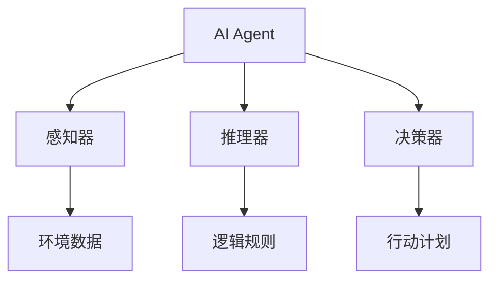
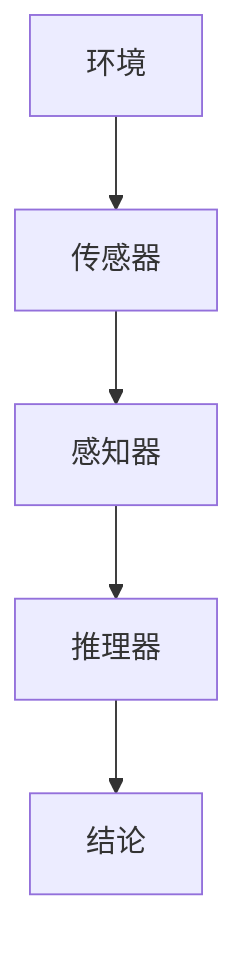
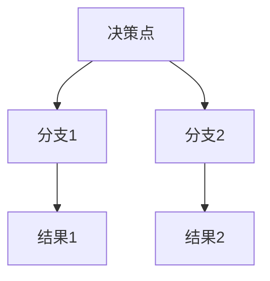
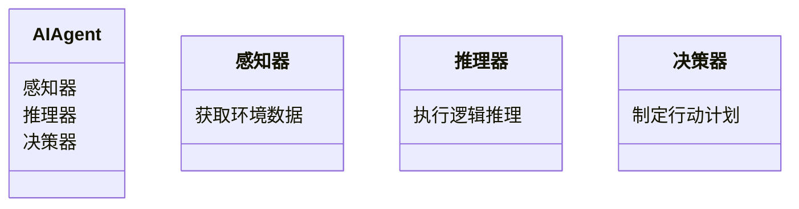

                 


# AI Agent的概念形成与抽象推理能力构建

## 关键词：人工智能代理（AI Agent）、抽象推理能力、感知器、决策树、系统架构设计

## 摘要：人工智能代理（AI Agent）是实现人工智能的核心技术之一，它通过感知环境、抽象推理和自主决策来完成特定任务。本文将从AI Agent的概念形成、核心原理、算法实现、系统架构设计以及项目实战等方面，系统地探讨AI Agent的抽象推理能力构建方法。文章内容涵盖了AI Agent的定义、核心概念、算法原理、系统设计和实际应用，旨在为读者提供全面而深入的技术解析。

---

## 第1章: AI Agent的概念与背景

### 1.1 人工智能代理（AI Agent）的定义与背景

#### 1.1.1 人工智能代理的定义
人工智能代理（AI Agent）是指一种能够感知环境、做出决策并采取行动以实现特定目标的智能实体。AI Agent可以是软件程序、机器人或其他智能系统，其核心能力在于通过抽象推理和自主决策来解决复杂问题。

#### 1.1.2 人工智能代理的发展历程
AI Agent的概念起源于人工智能领域的研究，经历了从简单的行为反应式代理到复杂的目标导向型代理的发展。随着机器学习和深度学习技术的进步，AI Agent的能力得到了显著提升，广泛应用于自动驾驶、智能助手、机器人控制等领域。

#### 1.1.3 人工智能代理的应用场景与重要性
AI Agent的应用场景包括但不限于：
- 自动驾驶：通过感知环境和决策系统实现自主驾驶。
- 智能助手：如Siri、Alexa等，通过语音交互帮助用户完成任务。
- 机器人控制：用于工业自动化、服务机器人等领域。
- 游戏AI：在电子游戏中实现智能NPC的行为决策。

AI Agent的重要性在于它能够将复杂的现实问题转化为可计算的形式，并通过自主决策实现目标。

### 1.2 人工智能代理的核心概念

#### 1.2.1 感知与推理能力
AI Agent的核心能力之一是感知环境。通过传感器、摄像头、麦克风等设备，AI Agent能够获取环境中的信息，并通过知识表示和逻辑推理能力对这些信息进行处理。

#### 1.2.2 决策与行动机制
AI Agent在感知环境的基础上，需要根据当前状态和目标，通过决策算法选择最优行动方案，并执行这些行动以实现目标。

#### 1.2.3 代理的自主性与交互性
AI Agent的自主性体现在其能够独立完成任务，而交互性则体现在其能够与人类或其他智能体进行协作或竞争。

### 1.3 人工智能代理的分类与特征

#### 1.3.1 基于智能水平的分类
- **反应式AI Agent**：基于当前感知做出即时反应，不考虑长期目标。
- **目标导向型AI Agent**：基于目标和规划进行决策。
- **学习型AI Agent**：能够通过经验改进性能。

#### 1.3.2 基于应用场景的分类
- **软件代理**：如智能助手、推荐系统。
- **硬件代理**：如自动驾驶汽车、工业机器人。
- **混合型代理**：结合软件和硬件的智能系统。

#### 1.3.3 代理的通用属性特征对比表格

| 特性             | 反应式代理 | 目标导向型代理 | 学习型代理 |
|------------------|------------|----------------|------------|
| 智能水平         | 低         | 中             | 高         |
| 决策方式         | 反应式     | 基于目标       | 基于经验     |
| 任务复杂度       | 低         | 高             | 高         |
| 应用场景         | 实时控制   | 战略规划       | 自我改进     |

---

## 第2章: 人工智能代理的核心概念与联系

### 2.1 人工智能代理的核心原理

#### 2.1.1 感知与知识表示
AI Agent的感知能力依赖于传感器和数据输入，知识表示则通过符号逻辑、概率模型或神经网络等方式实现。

#### 2.1.2 推理与逻辑推理
通过逻辑推理，AI Agent能够从已知信息中推导出新的结论。例如，基于一阶逻辑的推理系统可以用于复杂问题的解决。

#### 2.1.3 决策与规划算法
AI Agent的决策过程通常基于规划算法，如A*算法、动态规划等。

### 2.2 人工智能代理的ER实体关系图



通过ER实体关系图可以看出，AI Agent的核心模块包括感知器、推理器和决策器。

---

## 第3章: 人工智能代理的算法原理

### 3.1 基于感知的推理算法

#### 3.1.1 感知器模型与数据流图



#### 3.1.2 推理算法的数学模型
基于概率推理的算法可以表示为：

$$ P(A|B) = \frac{P(B|A)P(A)}{P(B)} $$

其中，$P(A|B)$ 表示在B条件下A发生的概率。

#### 3.1.3 示例代码实现
```python
def感知器(input_data):
    return 推理器(input_data)
```

### 3.2 基于决策的规划算法

#### 3.2.1 决策树与决策图



#### 3.2.2 规划算法的数学模型
基于动态规划的算法可以表示为：

$$ V(s) = \max_{a} [ r(s,a) + V(s') ] $$

其中，$V(s)$ 表示状态s的价值函数。

#### 3.2.3 示例代码实现
```python
def决策器(input_data):
    return 行动计划(input_data)
```

---

## 第4章: 人工智能代理的系统分析与架构设计

### 4.1 人工智能代理的系统架构

#### 4.1.1 系统功能模块划分



#### 4.1.2 系统架构的Mermaid图

```mermaid
graph TD
    AI Agent --> 感知器
    AI Agent --> 推理器
    AI Agent --> 决策器
    感知器 --> 环境数据
    推理器 --> 逻辑规则
    决策器 --> 行动计划
```

---

## 第5章: 人工智能代理的项目实战

### 5.1 项目实战环境安装

#### 5.1.1 环境安装步骤
```bash
pip install numpy
pip install matplotlib
pip install scikit-learn
```

### 5.2 系统核心实现源代码

#### 5.2.1 AI Agent的感知器实现
```python
class 感知器:
    def 获取环境数据(self):
        # 获取传感器数据
        pass
```

#### 5.2.2 AI Agent的推理器实现
```python
class 推理器:
    def 执行逻辑推理(self, 数据):
        # 执行推理算法
        pass
```

#### 5.2.3 AI Agent的决策器实现
```python
class 决策器:
    def 制定行动计划(self, 推理结果):
        # 制定行动计划
        pass
```

### 5.3 代码应用解读与分析
通过对上述代码的解读，可以看出AI Agent的实现依赖于感知器、推理器和决策器三个核心模块的协同工作。

---

## 第6章: 最佳实践与小结

### 6.1 最佳实践 tips
- 在实现AI Agent时，建议先从简单的反应式代理开始，逐步向复杂的目标导向型代理发展。
- 使用可视化工具（如Mermaid）来帮助理解和设计系统架构。

### 6.2 小结
本文从AI Agent的概念形成、核心原理、算法实现、系统架构设计和项目实战等方面，全面探讨了AI Agent的抽象推理能力构建方法。通过本文的学习，读者可以掌握AI Agent的核心技术，并能够将其应用到实际项目中。

### 6.3 注意事项
在实际应用中，需要注意AI Agent的实时性、安全性和可解释性问题。

### 6.4 拓展阅读
建议读者进一步学习强化学习、知识图谱和多智能体协作等相关技术，以提升AI Agent的性能和能力。

---

## 作者：AI天才研究院/AI Genius Institute & 禅与计算机程序设计艺术 /Zen And The Art of Computer Programming

