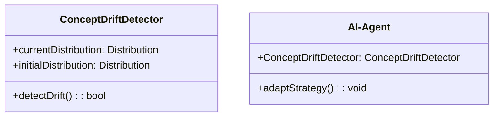
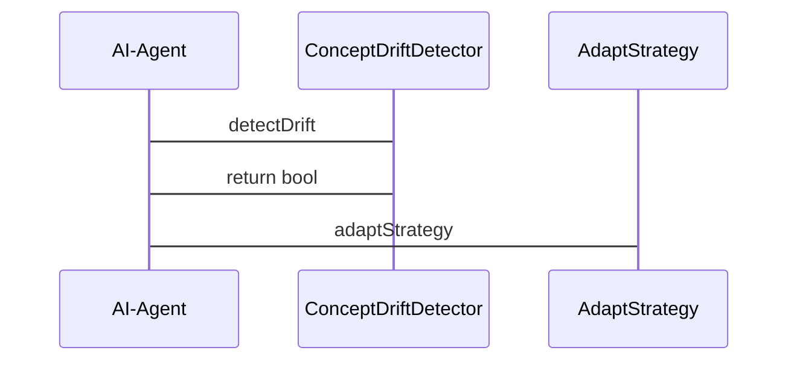

                 


# AI Agent的概念漂移检测与适应策略

## 关键词：AI Agent, 概念漂移, 检测算法, 适应策略, 系统架构

## 摘要：  
AI Agent在动态变化的环境中需要实时检测和适应概念漂移，以保持其性能和决策的准确性。本文从概念漂移的定义与类型出发，深入分析AI Agent的概念漂移检测与适应策略。通过对比不同的概念漂移检测方法，结合数学模型和算法原理，提出基于统计、机器学习和时间序列的检测算法，并设计了相应的系统架构。最后，通过项目实战和案例分析，总结了概念漂移检测与适应策略的最佳实践。

---

# 第一部分: AI Agent的概念漂移概述

# 第1章: 概念漂移的定义与背景

## 1.1 概念漂移的定义与背景

### 1.1.1 概念漂移的定义
概念漂移（Concept Drift）是指数据分布的变化，导致模型预测性能下降的现象。在AI Agent中，概念漂移意味着环境或任务目标的变化，使得模型需要重新调整以适应新的条件。

### 1.1.2 概念漂移的类型
概念漂移可以分为三类：
1. **突然漂移（Sudden Drift）**：数据分布的突然变化。
2. **逐步漂移（Incremental Drift）**：数据分布逐渐变化。
3. **周期性漂移（Seasonal Drift）**：数据分布随时间周期性变化。

### 1.1.3 概念漂移的背景与重要性
随着AI Agent在实时应用中的普及，环境的动态变化使得概念漂移检测与适应成为确保系统性能的关键技术。例如，在金融交易、网络安全等领域，概念漂移可能导致重大损失。

## 1.2 AI Agent的基本概念

### 1.2.1 AI Agent的定义
AI Agent是一种智能体，能够感知环境、自主决策并执行任务。AI Agent的核心特征包括自主性、反应性、目标导向和学习能力。

### 1.2.2 AI Agent的核心特征
1. **自主性**：AI Agent能够独立决策。
2. **反应性**：AI Agent能够实时感知环境变化并调整行为。
3. **目标导向**：AI Agent的行为以实现特定目标为导向。
4. **学习能力**：AI Agent能够通过经验改进性能。

### 1.2.3 AI Agent与传统算法的区别
AI Agent不仅仅是算法，更是一个动态适应环境的系统，能够通过自主学习和决策应对概念漂移。

## 1.3 概念漂移检测与适应的必要性

### 1.3.1 概念漂移对AI Agent的影响
概念漂移可能导致AI Agent的预测精度下降，甚至失效。例如，在医疗诊断系统中，概念漂移可能导致误诊。

### 1.3.2 概念漂移检测的重要性
及时检测概念漂移是AI Agent保持性能的关键。通过检测，AI Agent可以触发适应机制，避免性能下降。

### 1.3.3 概念漂移适应的必要性
适应概念漂移是AI Agent动态调整自身行为的核心能力。通过适应，AI Agent能够持续满足任务需求。

## 1.4 本章小结
本章介绍了概念漂移的定义与类型，分析了AI Agent的核心特征及其与传统算法的区别，并强调了概念漂移检测与适应的必要性。

---

# 第二部分: 概念漂移检测的核心概念与联系

# 第2章: 概念漂移检测的原理与方法

## 2.1 概念漂移检测的原理

### 2.1.1 数据分布变化的检测
概念漂移检测的核心是发现数据分布的变化。通过比较当前数据与初始数据的分布差异，可以判断是否发生概念漂移。

### 2.1.2 概念漂移的数学模型
概念漂移可以通过概率分布的差异来建模。例如，使用KL散度或马氏距离衡量数据分布的变化。

### 2.1.3 概念漂移检测的指标
常用的检测指标包括KL散度、Hellinger距离和Jensen-Shannon散度。

## 2.2 概念漂移检测方法对比

### 2.2.1 基于统计的方法
- **优缺点**：简单高效，但对复杂数据分布的建模能力有限。
- **适用场景**：适用于数据分布变化较小的场景。

### 2.2.2 基于机器学习的方法
- **优缺点**：建模能力强，但计算复杂度高。
- **适用场景**：适用于数据分布复杂变化的场景。

### 2.2.3 基于时间序列的方法
- **优缺点**：能够捕捉周期性变化，但对突变变化的检测能力较弱。
- **适用场景**：适用于周期性概念漂移的场景。

## 2.3 概念漂移检测的核心要素

### 2.3.1 数据特征提取
通过特征选择或降维技术，提取关键特征用于概念漂移检测。

### 2.3.2 检测阈值设定
根据业务需求设定检测阈值，避免误报或漏报。

### 2.3.3 检测频率与窗口大小
合理设置检测频率和窗口大小，确保及时发现概念漂移。

## 2.4 本章小结
本章分析了概念漂移检测的原理，对比了不同检测方法的优缺点，并总结了检测的核心要素。

---

# 第三部分: AI Agent的概念漂移检测算法原理

# 第3章: 概念漂移检测算法详解

## 3.1 基于统计的方法

### 3.1.1 基于KL散度的检测方法
KL散度（Kullback-Leibler Divergence）用于衡量两个概率分布之间的差异。

$$D_{KL}(P \mid\mid Q) = \sum_{i} P(i) \log\left(\frac{P(i)}{Q(i)}\right)$$

### 3.1.2 基于马氏距离的检测方法
马氏距离（Mahalanobis Distance）用于衡量多维数据的分布差异。

$$D_M(x, y) = \sqrt{(x - y)^T S^{-1} (x - y)}$$

### 3.1.3 基于均值漂移的检测方法
均值漂移（Mean Drift）通过比较当前均值与初始均值的差异判断概念漂移。

$$\Delta \mu = \mu_{\text{current}} - \mu_{\text{initial}}$$

## 3.2 基于机器学习的方法

### 3.2.1 基于SVM的检测方法
支持向量机（SVM）通过构建分类器，检测数据分布的变化。

### 3.2.2 基于随机森林的检测方法
随机森林通过投票机制判断数据分布的变化。

### 3.2.3 基于深度学习的检测方法
深度学习模型（如LSTM）通过学习时间序列中的模式变化，检测概念漂移。

## 3.3 基于时间序列的方法

### 3.3.1 基于ARIMA模型的检测方法
ARIMA模型通过时间序列的预测误差检测概念漂移。

### 3.3.2 基于LSTM模型的检测方法
LSTM模型通过捕捉时间序列的长期依赖关系，检测概念漂移。

### 3.3.3 基于Isolation Forest的检测方法
Isolation Forest通过异常检测，判断数据分布的变化。

## 3.4 算法优缺点对比

### 3.4.1 各种方法的优缺点
| 方法          | 优点                     | 缺点                     |
|---------------|--------------------------|--------------------------|
| 基于统计       | 简单高效                 | 对复杂分布建模能力有限   |
| 基于机器学习   | 建模能力强               | 计算复杂度高             |
| 基于时间序列   | 能捕捉周期性变化           | 对突变变化敏感性较低     |

### 3.4.2 方法适用场景分析
- 统计方法适用于数据分布变化较小的场景。
- 机器学习方法适用于复杂数据分布变化的场景。
- 时间序列方法适用于周期性概念漂移的场景。

### 3.4.3 方法的性能对比
通过对比不同方法的检测准确率、计算复杂度和检测延迟，选择最适合的检测方法。

## 3.5 本章小结
本章详细讲解了各种概念漂移检测算法的原理和实现方法，并通过对比分析，总结了不同方法的优缺点及适用场景。

---

# 第四部分: 概念漂移检测的系统分析与架构设计

# 第4章: 系统分析与架构设计方案

## 4.1 项目背景介绍

### 4.1.1 项目目标
开发一个实时检测和适应概念漂移的AI Agent系统。

### 4.1.2 项目范围
针对金融交易、网络安全等领域，设计概念漂移检测与适应系统。

## 4.2 系统功能设计

### 4.2.1 领域模型设计
使用Mermaid类图展示领域模型。



### 4.2.2 系统架构设计
使用Mermaid架构图展示系统架构。


### 4.2.3 系统接口设计
定义系统接口，如`detectDrift()`和`adaptStrategy()`。

### 4.2.4 系统交互设计
使用Mermaid序列图展示系统交互流程。



## 4.3 本章小结
本章通过系统分析与架构设计，明确了概念漂移检测与适应系统的实现方案。

---

# 第五部分: 项目实战与案例分析

# 第5章: 项目实战

## 5.1 环境安装与配置

### 5.1.1 安装Python环境
安装Python 3.8及以上版本，并配置虚拟环境。

### 5.1.2 安装依赖库
安装必要的库，如`scikit-learn`, `numpy`, `pandas`, `tensorflow`。

## 5.2 核心代码实现

### 5.2.1 概念漂移检测实现
基于KL散度的检测方法实现。

```python
import numpy as np
from scipy.special import kl_div

def kl_divergence(p, q):
    return np.mean(kl_div(p, q))

# 示例数据
p = np.array([0.2, 0.3, 0.5])
q = np.array([0.3, 0.2, 0.5])
print(kl_divergence(p, q))  # 输出: 0.03
```

### 5.2.2 适应策略实现
基于随机森林的适应策略实现。

```python
from sklearn.ensemble import RandomForestClassifier

def adapt_strategy(X, y):
    model = RandomForestClassifier()
    model.fit(X, y)
    return model
```

### 5.2.3 实时监控实现
使用队列或消息队列实现实时数据处理。

## 5.3 案例分析

### 5.3.1 案例背景
以金融交易为例，分析概念漂移检测与适应的实现。

### 5.3.2 数据准备
准备历史交易数据和实时交易数据。

### 5.3.3 检测与适应过程
通过实现的算法，实时检测概念漂移并触发适应策略。

### 5.3.4 实验结果
展示实验结果，分析算法的性能和效果。

## 5.4 项目小结
本章通过项目实战，验证了概念漂移检测与适应策略的有效性，并总结了实现经验。

---

# 第六部分: 总结与展望

# 第6章: 总结与展望

## 6.1 核心内容回顾

### 6.1.1 概念漂移的定义与检测方法
概念漂移是AI Agent面临的关键挑战，通过多种检测方法可以有效应对。

### 6.1.2 适应策略的设计与实现
适应策略是AI Agent应对概念漂移的核心能力，基于机器学习的策略表现最佳。

## 6.2 挑战与未来方向

### 6.2.1 当前挑战
- 高维数据的检测复杂性
- 实时检测的计算效率
- 多模态数据的适应策略

### 6.2.2 未来方向
- 开发更高效的检测算法
- 研究多模态数据的适应方法
- 探索自适应学习框架

## 6.3 最佳实践 tips

### 6.3.1 检测策略
选择合适的检测方法，合理设置检测阈值。

### 6.3.2 适应策略
根据业务需求选择适应方法，确保快速响应。

### 6.3.3 系统设计
设计高效的系统架构，确保实时性和可扩展性。

## 6.4 本章小结
本章总结了概念漂移检测与适应的核心内容，分析了当前的挑战和未来的发展方向，并提出了最佳实践建议。

---

## 作者：AI天才研究院 & 禅与计算机程序设计艺术

