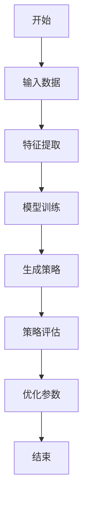
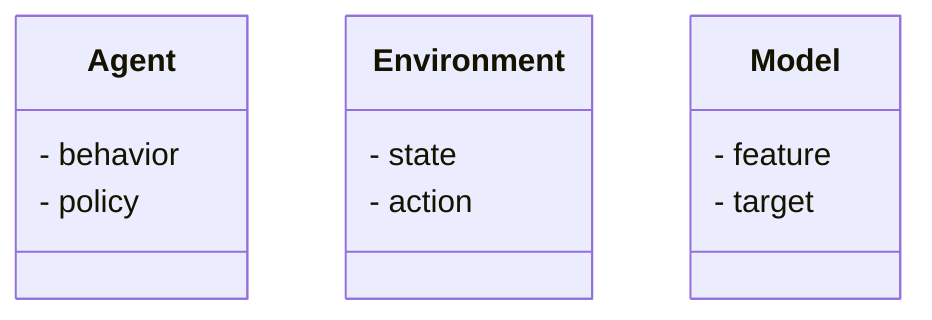
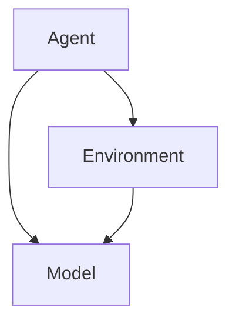

                 


# AI Agent的模仿学习：从人类行为中学习

> 关键词：AI Agent，模仿学习，强化学习，监督学习，行为学习

> 摘要：本文深入探讨AI Agent如何通过模仿人类行为来学习执行任务，分析模仿学习的核心概念、算法原理、系统架构及实际应用。文章从背景介绍、核心概念、算法原理、系统分析、项目实战、总结展望等方面逐步展开，全面解析模仿学习的技术细节与实际应用。

---

## 第一部分: AI Agent模仿学习的背景与概念

### 第1章: AI Agent与模仿学习概述

#### 1.1 AI Agent的基本概念
##### 1.1.1 AI Agent的定义与分类
AI Agent（人工智能代理）是指能够感知环境、自主决策并执行任务的智能体。根据智能水平，AI Agent可以分为反应式和认知式代理；根据应用场景，可分为软件代理、机器人代理等。AI Agent的核心目标是通过感知和行动实现特定任务，而模仿学习是其实现智能行为的重要途径。

##### 1.1.2 模仿学习的定义与特点
模仿学习（Imitative Learning）是一种机器学习方法，通过观察和模仿教师、人类或其他智能体的行为，使学习者掌握特定任务。其特点包括数据驱动、行为导向、适应性学习等。与监督学习和强化学习不同，模仿学习更注重从行为中直接学习，适用于任务示范场景。

##### 1.1.3 模仿学习的核心问题与挑战
模仿学习的核心问题包括如何从有限的行为数据中泛化学习、如何处理动态变化的环境、如何确保学习行为的稳定性和安全性。此外，如何处理数据偏差、避免过拟合也是关键挑战。

---

#### 1.2 模仿学习的背景与意义
##### 1.2.1 从人类行为学习的必要性
人类行为的多样性和复杂性使得直接从人类行为中学习具有重要意义。模仿学习能够从人类经验中提取有用的模式，使AI Agent更快地掌握复杂任务。

##### 1.2.2 AI Agent在实际场景中的应用需求
在自动驾驶、智能客服、机器人控制等领域，AI Agent需要通过模仿学习快速掌握人类的操作方式，满足实际应用需求。

##### 1.2.3 模仿学习的优势与局限性
优势：快速学习、适应性强；局限性：数据依赖性强、泛化能力有限。

---

### 第2章: 模仿学习的核心概念与联系

#### 2.1 核心概念原理
##### 2.1.1 模仿学习的基本原理
模仿学习通过观察教师或人类的行为，提取特征并生成类似的行为模式。其核心是建立行为与环境之间的映射关系。

##### 2.1.2 模仿学习的关键要素
包括行为数据、特征提取、模型训练、行为生成和效果评估。

##### 2.1.3 模仿学习的数学模型概述
模仿学习的数学模型主要基于概率论和优化理论，涉及特征空间、策略空间等。

#### 2.2 核心概念对比分析
##### 2.2.1 模仿学习与其他学习方式的对比
与监督学习、强化学习、对比学习等方法的对比分析，突出模仿学习的独特性。

##### 2.2.2 不同模仿学习方法的优缺点分析
基于行为的模仿学习和基于策略的模仿学习的对比。

##### 2.2.3 模仿学习的评价指标与标准
包括行为准确率、学习速度、泛化能力等。

#### 2.3 ER实体关系图
```mermaid
er
actor(Agent)
agent行为(Behavior)
目标函数(ObjectiveFunction)
```

---

## 第3章: 模仿学习的算法原理

### 3.1 基于行为的模仿学习
#### 3.1.1 行为模仿的基本流程
从观察行为到特征提取，再到模型训练和行为生成。

#### 3.1.2 基于策略的模仿学习
通过策略函数直接生成行为策略。

#### 3.1.3 基于值函数的模仿学习
通过值函数评估行为的价值，指导行为选择。

### 3.2 基于策略的模仿学习
#### 3.2.1 策略梯度方法
通过梯度上升优化策略函数，公式如下：
$$
\theta \leftarrow \theta + \alpha \nabla_\theta J(\theta)
$$

#### 3.2.2 Actor-Critic算法
结合Actor和Critic的结构，通过策略优化和价值评估共同提升学习效果。

#### 3.2.3 策略评估与改进
通过评估当前策略的效果，不断改进策略以达到最优。

### 3.3 算法流程图


---

## 第4章: 数学模型与公式

### 4.1 策略梯度方法
#### 4.1.1 策略函数定义
$$
P(a|s) = \pi_\theta(a|s)
$$

#### 4.1.2 梯度计算公式
$$
\nabla J = \mathbb{E}_{s,a}[\nabla \log \pi_\theta(a|s) Q(s,a)]
$$

### 4.2 Actor-Critic算法
#### 4.2.1 策略函数
$$
\pi_\theta(a|s) = \text{softmax}(Q_\theta(s,a))
$$

#### 4.2.2 价值函数
$$
V_\theta(s) = \max_a Q_\theta(s,a)
$$

---

## 第5章: 系统分析与架构设计方案

### 5.1 问题场景介绍
设计一个AI Agent，通过模仿学习掌握客服对话任务。

### 5.2 系统功能设计
领域模型类图：


### 5.3 系统架构设计
系统架构图：


---

## 第6章: 项目实战

### 6.1 环境安装
安装必要的库：TensorFlow、Keras、OpenAI Gym。

### 6.2 核心实现代码
```python
import tensorflow as tf
from tensorflow.keras import layers

class Agent:
    def __init__(self, state_dim, action_dim):
        self.policy = self.build_policy(state_dim, action_dim)
    
    def build_policy(self, state_dim, action_dim):
        model = tf.keras.Sequential([
            layers.Dense(64, activation='relu', input_dim=state_dim),
            layers.Dense(action_dim, activation='softmax')
        ])
        return model

# 示例使用
agent = Agent(state_dim=4, action_dim=2)
```

### 6.3 案例分析与解读
通过实际案例展示模仿学习的应用，分析模型的表现和效果。

### 6.4 项目小结
总结项目实现的关键点和经验教训。

---

## 第7章: 总结与展望

### 7.1 总结
模仿学习为AI Agent提供了一种有效的学习方式，能够从人类行为中快速获取经验。

### 7.2 注意事项
数据质量、模型泛化能力、环境适应性是实际应用中的关键问题。

### 7.3 未来展望
未来，模仿学习将与强化学习结合，进一步提升AI Agent的智能水平和应用范围。

---

## 作者：AI天才研究院/AI Genius Institute & 禅与计算机程序设计艺术 /Zen And The Art of Computer Programming

