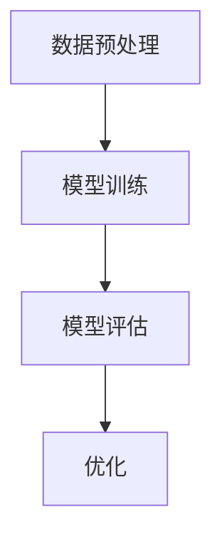

                 


# AI Agent的模仿学习：从人类行为数据中提取知识

> 关键词：AI Agent，模仿学习，人类行为数据，知识提取，机器学习，人机交互

> 摘要：模仿学习是AI Agent从人类行为数据中学习并模仿人类行为模式的重要方法。本文将详细探讨模仿学习的基本概念、核心原理、算法实现、系统架构设计以及实际应用案例，帮助读者全面理解并掌握AI Agent的模仿学习技术。

---

## 第一部分: 模仿学习的基本概念与背景

### 第1章: 模仿学习的背景与应用

#### 1.1 模仿学习的基本概念
模仿学习（Imitation Learning）是一种机器学习方法，旨在通过观察和模仿人类或其他智能体的行为，使AI Agent学习并掌握特定任务。其核心在于从行为数据中提取模式，并将其转化为可执行的策略或模型。

#### 1.2 模仿学习的背景
随着人工智能技术的飞速发展，AI Agent在多个领域展现出巨大潜力。然而，如何让AI Agent具备类似人类的决策和行为能力，成为了研究的热点。模仿学习作为一种数据驱动的方法，能够有效利用人类行为数据，为AI Agent提供学习的范例。

#### 1.3 模仿学习的应用场景
模仿学习广泛应用于自然语言处理、机器人控制、自动驾驶等领域。例如，在自然语言处理中，AI Agent可以通过模仿人类对话行为，生成更自然的回复；在机器人控制中，机器人可以通过模仿人类操作，快速掌握复杂的动作技能。

---

## 第二部分: 模仿学习的核心概念与原理

### 第2章: 模仿学习的核心概念

#### 2.1 直接模仿学习
直接模仿学习通过直接观察人类行为，学习其决策策略。这种方法通常采用监督学习的方式，将人类的行为视为标签，训练模型预测相同的决策。

#### 2.2 间接模仿学习
间接模仿学习则通过观察环境和结果，推断出人类的决策过程。这种方法常用于强化学习框架中，模型通过试错和奖励机制，逐步逼近人类的决策模式。

#### 2.3 模仿学习与人机交互
在人机交互中，模仿学习能够使AI Agent更好地理解用户的意图和行为模式，从而提供更贴心的服务。例如，在智能客服系统中，AI Agent可以通过模仿人类客服的对话模式，提高用户体验。

---

## 第三部分: 模仿学习的算法原理

### 第3章: 模仿学习的算法原理

#### 3.1 最大似然估计
最大似然估计（Maximum Likelihood Estimation, MLE）是一种常用的学习方法。在模仿学习中，MLE用于通过最大化目标数据的概率，训练模型使其行为更接近人类。

#### 3.2 交叉熵损失函数
交叉熵损失函数（Cross-Entropy Loss）常用于分类任务。在模仿学习中，它帮助模型在决策过程中最小化预测与真实行为的差异。

#### 3.3 模仿学习的数学模型
模仿学习的数学模型通常包括状态空间和动作空间的定义。通过构建损失函数，模型可以学习人类的决策策略，并在新环境中应用。

---

## 第四部分: 模仿学习的系统架构与实现

### 第4章: 模仿学习的系统架构设计

#### 4.1 系统功能模块划分
- 数据预处理模块：处理和清洗人类行为数据。
- 模型训练模块：基于预处理后的数据，训练模仿学习模型。
- 模型评估与优化模块：评估模型性能并进行优化。

#### 4.2 系统架构图


#### 4.3 系统接口设计
- 数据输入接口：接收人类行为数据。
- 模型训练接口：执行训练过程。
- 模型预测接口：输出AI Agent的决策结果。

---

## 第五部分: 模仿学习的项目实战

### 第5章: 模仿学习的实际应用

#### 5.1 环境安装
安装必要的库，如TensorFlow、Keras等。

#### 5.2 代码实现
以下是一个简单的模仿学习代码示例：
```python
import numpy as np
import tensorflow as tf

# 定义数据集
data = np.array([...])  # 人类行为数据
labels = np.array([...])  # 对应的标签

# 构建模型
model = tf.keras.Sequential([
    tf.keras.layers.Dense(64, activation='relu'),
    tf.keras.layers.Dense(10, activation='softmax')
])

# 编译模型
model.compile(optimizer='adam', loss='sparse_categorical_crossentropy', metrics=['accuracy'])

# 训练模型
model.fit(data, labels, epochs=10, batch_size=32)
```

#### 5.3 案例分析
以客服对话系统为例，AI Agent通过模仿人类客服的对话模式，生成自然的回复，提升用户体验。

---

## 第六部分: 模仿学习的最佳实践

### 第6章: 最佳实践与小结

#### 6.1 小结
模仿学习是一种强大的技术，能够使AI Agent快速学习人类行为模式，并在实际场景中应用。

#### 6.2 注意事项
- 数据质量：确保数据的多样性和代表性。
- 模型选择：根据任务需求选择合适的学习方法。
- 持续优化：定期更新模型，适应新数据和环境变化。

#### 6.3 未来研究方向
- 结合强化学习，提升模型的适应性。
- 研究多模态数据的模仿学习方法。
- 探索实时模仿学习的应用场景。

#### 6.4 拓展阅读
推荐阅读经典的模仿学习论文和书籍，深入理解其理论和实践。

---

## 作者：AI天才研究院 & 禅与计算机程序设计艺术

---

以上是关于“AI Agent的模仿学习：从人类行为数据中提取知识”的完整目录和内容框架。每一章都详细阐述了相关概念、算法、系统设计和实际应用，帮助读者全面掌握模仿学习的技术和应用。

