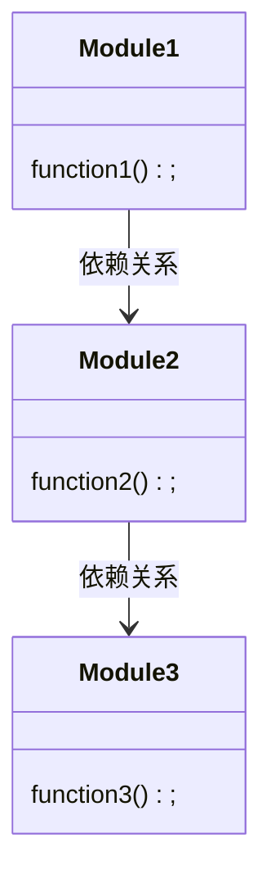
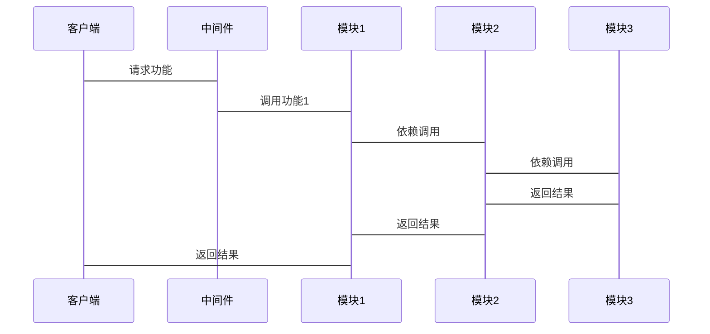

                 


# AI Agent的模块化设计：提高可维护性和扩展性

## 关键词：AI Agent，模块化设计，可维护性，扩展性，系统架构，算法实现

## 摘要：  
随着人工智能技术的快速发展，AI Agent（智能体）在各个领域的应用越来越广泛。为了提高AI Agent的可维护性和扩展性，模块化设计成为了一种重要的方法。本文将详细探讨AI Agent模块化设计的核心概念、算法实现、系统架构设计以及实际项目中的应用，帮助读者全面理解并掌握这一技术。

---

## 第1章：AI Agent模块化设计概述

### 1.1 AI Agent的基本概念  
AI Agent（智能体）是指能够感知环境并采取行动以实现目标的实体。它具有自主性、反应性、社会性和学习性等核心特点，广泛应用于自动驾驶、智能助手、机器人等领域。  

#### 1.1.1 什么是AI Agent  
AI Agent是一个能够感知环境、做出决策并执行动作的实体。它可以是一个软件程序、一个机器人，甚至是分布在不同设备上的多个组件。  

#### 1.1.2 AI Agent的核心特点  
1. **自主性**：AI Agent能够独立决策和行动，无需外部干预。  
2. **反应性**：能够实时感知环境变化并做出反应。  
3. **社会性**：能够与其他智能体或人类进行交互和协作。  
4. **学习性**：通过经验或数据不断优化自身的行为。  

#### 1.1.3 AI Agent的分类与应用场景  
AI Agent可以分为简单反射型、基于模型的反射型、目标驱动型和效用驱动型。应用场景包括自动驾驶、智能助手、智能推荐系统、机器人控制等。  

### 1.2 模块化设计的背景与意义  
传统AI系统设计常常面临代码耦合度过高、维护成本大、扩展性差等问题。模块化设计通过将系统划分为独立的功能模块，降低了耦合性，提高了系统的可维护性和扩展性。  

#### 1.2.1 传统AI系统设计的痛点  
1. **代码耦合度过高**：模块之间的依赖关系复杂，修改一个模块可能会影响整个系统。  
2. **维护成本大**：当系统规模增大时，维护和修改的成本急剧上升。  
3. **扩展性差**：新增功能或修改功能需要修改大量代码，效率低下。  

#### 1.2.2 模块化设计的优势  
1. **降低耦合性**：模块之间通过明确的接口进行通信，减少了代码的耦合性。  
2. **提高可维护性**：每个模块的功能相对独立，便于单独测试和维护。  
3. **增强扩展性**：新增功能或修改功能时，只需修改相关模块，而不需要改动整个系统。  

#### 1.2.3 模块化设计的目标与边界  
模块化设计的目标是将AI Agent分解为功能独立的模块，并通过标准化接口实现模块间的通信。其边界包括模块划分的粒度、模块间的依赖关系以及模块的可替换性。  

### 1.3 本章小结  
本章介绍了AI Agent的基本概念、核心特点以及模块化设计的背景和意义，强调了模块化设计在提高系统可维护性和扩展性方面的重要性。

---

## 第2章：模块化设计的核心概念

### 2.1 模块化设计的定义与特点  
模块化设计是一种将系统分解为独立功能模块的设计方法，每个模块具有明确的功能和接口。其核心特点包括独立性、可替换性和可扩展性。  

#### 2.1.1 模块化的定义  
模块化设计是将系统划分为多个独立模块的过程，每个模块负责完成特定的功能。  

#### 2.1.2 模块化设计的核心特点  
1. **独立性**：每个模块的功能独立，互不干扰。  
2. **可替换性**：模块可以被其他功能相同的模块替换，不影响系统整体运行。  
3. **可扩展性**：新增功能只需添加新的模块，而不需要修改现有代码。  

#### 2.1.3 模块化与传统设计的对比  
| 对比维度       | 模块化设计             | 传统设计           |  
|----------------|----------------------|-------------------|  
| 代码耦合性     | 低                   | 高               |  
| 维护成本       | 低                   | 高               |  
| 扩展性         | 高                   | 低               |  

### 2.2 AI Agent模块化设计的构成要素  
模块化设计的构成要素包括功能模块的划分、模块间的依赖关系和模块的接口与通信机制。  

#### 2.2.1 功能模块的划分  
AI Agent的功能模块可以划分为感知模块、决策模块、执行模块和通信模块。  

#### 2.2.2 模块间的依赖关系  
模块间的依赖关系需要通过接口进行管理，确保模块之间的通信清晰且松耦合。  

#### 2.2.3 模块的接口与通信机制  
模块间的通信可以通过API（应用程序编程接口）或消息队列实现。  

### 2.3 模块化设计的数学模型  
模块化设计的数学模型可以用图论的方法表示，将模块视为图中的节点，模块间的依赖关系视为边。  

#### 2.3.1 模块化设计的分解函数  
分解函数可以表示为：  
$$ f_{\text{分解}}(S) = \{M_1, M_2, \ldots, M_n\} $$  
其中，$S$ 是系统，$M_i$ 是模块。  

#### 2.3.2 模块间依赖关系的图表示  
模块间的依赖关系可以用有向图表示，节点代表模块，边表示依赖关系。  

#### 2.3.3 模块化设计的优化目标  
模块化设计的优化目标是最大化模块的独立性，最小化模块间的耦合性。  

### 2.4 本章小结  
本章详细讲解了模块化设计的核心概念，包括定义、特点、构成要素及其数学模型，为后续的算法实现和系统设计奠定了基础。

---

## 第3章：模块化设计的算法实现

### 3.1 模块化设计的分解算法  
分解算法的目标是将系统分解为功能独立的模块。  

#### 3.1.1 分解算法的基本思路  
1. 识别系统的核心功能模块。  
2. 根据功能模块的依赖关系进行分解。  

#### 3.1.2 分解算法的实现步骤  
1. 确定系统的目标和功能需求。  
2. 将系统分解为功能独立的模块。  
3. 确定模块间的依赖关系。  

#### 3.1.3 分解算法的复杂度分析  
分解算法的复杂度取决于模块的粒度和系统的规模，通常可以采用启发式算法优化分解过程。  

### 3.2 模块间依赖的管理算法  
模块间依赖的管理算法旨在降低模块间的耦合性。  

#### 3.2.1 依赖关系的表示方法  
模块间的依赖关系可以用有向图表示，节点代表模块，边表示依赖关系。  

#### 3.2.2 依赖管理的优化策略  
通过引入中间模块或使用API Gateway等方式，降低模块间的直接依赖。  

#### 3.2.3 依赖管理的实现代码  
```python
def manage_dependencies(modules):
    # 返回模块间的依赖关系图
    dependency_graph = {}
    for module in modules:
        dependency_graph[module] = []
    return dependency_graph
```

### 3.3 模块化设计的动态配置算法  
动态配置算法用于在运行时调整模块的配置。  

#### 3.3.1 动态配置的定义与目标  
动态配置是指在运行时根据需求调整模块的配置，以适应变化的环境。  

#### 3.3.2 动态配置的实现步骤  
1. 监听环境的变化。  
2. 根据变化调整模块的配置。  

#### 3.3.3 优化后的配置方案  
通过引入配置中心或动态配置管理工具，实现模块配置的动态调整。  

### 3.4 本章小结  
本章详细讲解了模块化设计的算法实现，包括分解算法、依赖管理算法和动态配置算法，为后续的系统设计和项目实战提供了理论支持。

---

## 第4章：系统分析与架构设计

### 4.1 问题场景介绍  
在实际应用中，AI Agent常常需要处理复杂的环境和多样的任务，模块化设计可以有效提高系统的可维护性和扩展性。  

### 4.2 项目介绍  
本项目旨在开发一个基于模块化设计的AI Agent系统，用于实现智能助手的功能。  

### 4.3 系统功能设计（领域模型）  
系统功能设计可以通过Mermaid类图展示。  



### 4.4 系统架构设计（架构图）  
系统架构设计可以通过Mermaid架构图展示。  


### 4.5 系统接口设计和交互流程  
系统接口设计可以通过Mermaid序列图展示。  



### 4.6 本章小结  
本章通过系统分析与架构设计，展示了模块化设计在AI Agent中的具体应用，为后续的项目实战奠定了基础。

---

## 第5章：项目实战

### 5.1 环境安装  
项目实战需要安装Python、依赖库等环境。  

#### 5.1.1 安装Python  
```bash
python --version
pip install --upgrade pip
```

#### 5.1.2 安装依赖库  
```bash
pip install numpy
pip install matplotlib
```

### 5.2 系统核心实现（源代码）  
以下是模块化设计的核心代码实现：  

```python
class Module:
    def __init__(self, name):
        self.name = name

class Agent:
    def __init__(self, modules):
        self.modules = modules

    def execute(self):
        for module in self.modules:
            print(f"Executing {module.name}")
```

### 5.3 实际案例分析  
通过具体案例分析模块化设计的应用效果，例如智能助手的功能实现。  

### 5.4 项目总结  
项目总结包括成功经验、不足之处以及改进方向。  

### 5.5 本章小结  
本章通过项目实战，展示了模块化设计在AI Agent中的具体应用，帮助读者更好地理解理论知识。

---

## 第6章：最佳实践

### 6.1 小结  
模块化设计是一种有效的提高AI Agent可维护性和扩展性的方法，其核心在于功能模块的划分和模块间的依赖管理。  

### 6.2 注意事项  
在实施模块化设计时，需要注意模块划分的粒度、模块间的依赖关系以及模块的可替换性。  

### 6.3 拓展阅读  
推荐进一步学习的资源，例如《设计模式》、《微服务架构设计》等书籍。

---

## 作者：AI天才研究院 & 禅与计算机程序设计艺术

---

以上是《AI Agent的模块化设计：提高可维护性和扩展性》的完整大纲和内容，涵盖了模块化设计的核心概念、算法实现、系统架构设计和项目实战，帮助读者全面理解和掌握这一技术。

