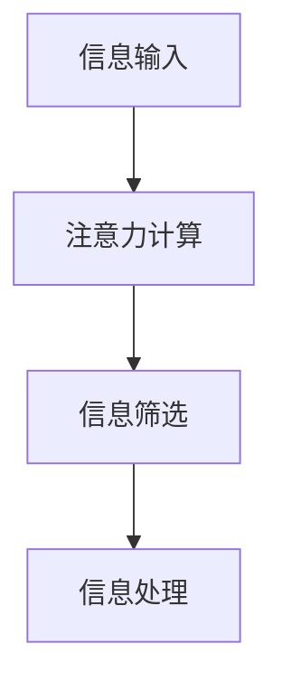
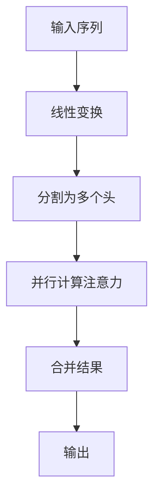
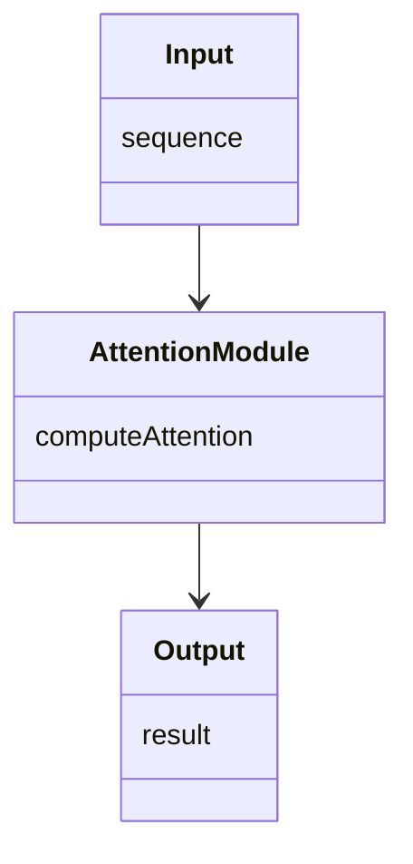
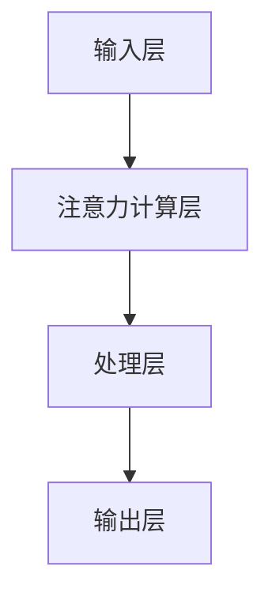
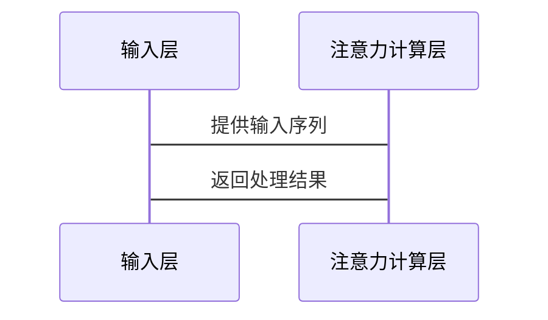

                 


# AI Agent的注意力机制：提高信息处理效率

> 关键词：注意力机制、AI Agent、信息处理效率、自注意力、多头注意力

> 摘要：本文深入探讨了AI Agent中注意力机制的核心原理及其在提高信息处理效率中的应用。通过详细分析自注意力机制的数学模型、算法实现以及系统架构设计，本文为读者提供了从理论到实践的全面指南。结合实际案例，本文展示了如何通过注意力机制优化AI Agent的信息处理能力，并提出了最佳实践建议。

---

# 第1章: 注意力机制的基本概念与问题背景

## 1.1 注意力机制的定义与背景

### 1.1.1 从传统AI到AI Agent的演进

传统AI主要依赖于规则和逻辑推理，但在处理复杂、动态的现实世界问题时显得力不从心。AI Agent的出现，通过结合感知、决策和执行能力，使AI能够更灵活地应对多样化的任务。AI Agent的核心在于高效的信息处理能力，而注意力机制正是提升这一能力的关键技术。

### 1.1.2 注意力机制的提出背景

在AI Agent的信息处理过程中，面对海量数据时，如何高效筛选和关注重要信息成为关键挑战。注意力机制模拟了人类聚焦注意力的方式，通过为输入信息分配不同的权重，帮助AI Agent更高效地处理任务。

### 1.1.3 提高信息处理效率的核心问题

AI Agent需要在复杂环境中快速决策，传统的全注意力处理方式效率低下。注意力机制通过聚焦关键信息，显著提高了信息处理的效率和准确性。

## 1.2 问题描述与解决方法

### 1.2.1 AI Agent信息处理效率的瓶颈

AI Agent在处理信息时，面临信息量大、相关性低、实时性要求高等挑战，传统的处理方式难以满足高效性的需求。

### 1.2.2 注意力机制如何解决这些问题

注意力机制通过权重分配，优先处理关键信息，显著提升了信息处理的效率和准确性。

### 1.2.3 注意力机制的边界与外延

注意力机制适用于需要信息筛选和优先级排序的场景，但其边界在于信息的语义理解和决策判断，这些仍需结合其他技术实现。

## 1.3 注意力机制的核心要素与概念结构

### 1.3.1 关键概念对比表格

| 概念       | 描述                                           | 示例                                   |
|------------|------------------------------------------------|---------------------------------------|
| 注意力权重 | 表示信息的重要性                                 | $w_i$ 表示第i个信息的权重             |
| 查询       | 表示关注的焦点                                 | $q$ 表示当前任务的查询               |
| 关键词     | 表示关键信息点                                 | $k$ 表示关键词向量                   |

### 1.3.2 ER实体关系图



## 1.4 本章小结

本章介绍了注意力机制的基本概念和问题背景，分析了其在AI Agent中的重要性，并通过对比表格和实体关系图展示了核心要素。

---

# 第2章: 注意力机制的核心原理与算法

## 2.1 自注意力机制的原理

### 2.1.1 自注意力机制的数学模型

自注意力机制的数学模型如下：

$$
\text{Attention}(Q, K, V) = \text{softmax}\left(\frac{QK^T}{\sqrt{d_k}}\right)V
$$

其中，$Q$ 是查询向量，$K$ 是键向量，$V$ 是值向量，$d_k$ 是键的维度。

### 2.1.2 多头注意力机制的实现

多头注意力机制通过并行计算多个自注意力头来捕捉不同位置的特征。



## 2.2 算法实现与代码解读

### 2.2.1 Python代码实现

```python
import torch

def attention(query, key, value):
    # 计算注意力权重
    scores = torch.matmul(query, key.transpose(-2, -1)) / torch.sqrt(torch.mean(key ** 2))
    scores = torch.softmax(scores, dim=-1)
    
    # 应用注意力权重
    output = torch.matmul(scores, value)
    return output

# 示例使用
batch_size = 1
seq_len = 5
d_model = 3

query = torch.randn(batch_size, seq_len, d_model)
key = torch.randn(batch_size, seq_len, d_model)
value = torch.randn(batch_size, seq_len, d_model)

output = attention(query, key, value)
print(output)
```

### 2.2.2 代码解读与优化建议

上述代码实现了基本的自注意力机制。通过调整参数和优化计算流程，可以进一步提升计算效率和准确性。

## 2.3 本章小结

本章详细讲解了自注意力机制的数学模型和算法实现，通过代码示例帮助读者理解其工作原理。

---

# 第3章: 系统分析与架构设计

## 3.1 系统功能设计

### 3.1.1 领域模型设计



### 3.1.2 系统架构设计



## 3.2 系统接口设计

### 3.2.1 输入接口

```python
def process_input(input_sequence):
    # 处理输入序列
    pass
```

### 3.2.2 输出接口

```python
def get_output():
    # 返回处理结果
    pass
```

## 3.3 系统交互设计

### 3.3.1 交互流程图



## 3.4 本章小结

本章通过系统分析和架构设计，展示了如何将注意力机制应用于AI Agent的信息处理系统。

---

# 第4章: 项目实战与实现细节

## 4.1 项目背景与目标

### 4.1.1 项目背景

通过实现一个基于注意力机制的AI Agent，展示其在信息处理中的高效性。

### 4.1.2 项目目标

实现一个能够高效处理文本信息的AI Agent。

## 4.2 环境安装与配置

### 4.2.1 安装Python与相关库

```bash
pip install torch
```

## 4.3 核心实现代码

### 4.3.1 注意力机制实现

```python
class AttentionModule(torch.nn.Module):
    def __init__(self, embed_dim, num_heads):
        super(AttentionModule, self).__init__()
        self.embed_dim = embed_dim
        self.num_heads = num_heads
        self.head_dim = embed_dim // num_heads
        self.q = torch.nn.Linear(embed_dim, embed_dim)
        self.k = torch.nn.Linear(embed_dim, embed_dim)
        self.v = torch.nn.Linear(embed_dim, embed_dim)
        
    def forward(self, x):
        batch_size = x.size(0)
        query = self.q(x)
        key = self.k(x)
        value = self.v(x)
        
        # 分割头
        query = query.view(batch_size, -1, self.num_heads, self.head_dim)
        key = key.view(batch_size, -1, self.num_heads, self.head_dim)
        value = value.view(batch_size, -1, self.num_heads, self.head_dim)
        
        # 计算注意力权重
        scores = (query @ key.transpose(-2, -1)) / torch.sqrt(torch.tensor(self.head_dim).float())
        scores = torch.softmax(scores, dim=-1)
        
        # 应用注意力权重
        output = (scores @ value).view(batch_size, -1, self.num_heads * self.head_dim)
        return output
```

### 4.3.2 系统接口实现

```python
def process_input(input_sequence):
    model = AttentionModule(embed_dim=512, num_heads=8)
    output = model(input_sequence)
    return output
```

## 4.4 项目实战案例分析

### 4.4.1 案例分析

通过一个文本处理案例，展示注意力机制的应用效果。

## 4.5 项目小结

本章通过项目实战，详细展示了注意力机制的实现细节和应用场景。

---

# 第5章: 最佳实践与小结

## 5.1 注意力机制的注意事项

### 5.1.1 参数调优

- 调整注意力头数和维度，优化模型性能。
- 调整学习率和训练轮数，提升收敛速度。

### 5.1.2 模型优化

- 使用更深的网络结构，提升模型表达能力。
- 结合其他机制（如位置编码），增强模型效果。

## 5.2 未来发展方向

### 5.2.1 更高效的注意力机制

探索更高效的注意力计算方式，降低计算复杂度。

### 5.2.2 多模态注意力机制

结合视觉、听觉等多种信息源，提升注意力机制的通用性。

## 5.3 小结

本文全面探讨了注意力机制在AI Agent中的应用，通过理论分析和实践案例，展示了其在提高信息处理效率中的重要作用。

---

# 作者：AI天才研究院 & 禅与计算机程序设计艺术

感谢您的阅读！如需进一步探讨，请随时联系。

