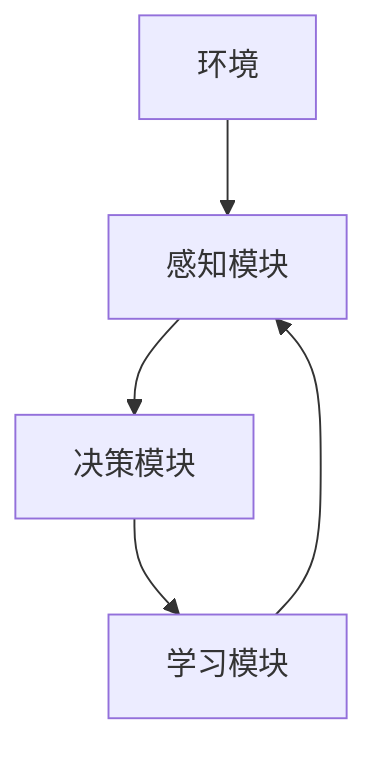
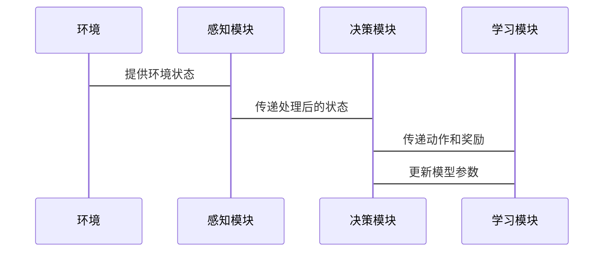

                 


# AI Agent的深度强化学习实现与优化

---

## 关键词
AI Agent, 深度强化学习, 强化学习, 优化方法, 系统架构, 项目实战

---

## 摘要
本文系统地探讨了AI Agent在深度强化学习中的实现与优化方法。首先，我们介绍了AI Agent的基本概念和深度强化学习的核心原理，分析了其在游戏、机器人控制等领域的广泛应用。接着，详细讲解了Q-learning与Deep Q-Network算法，以及策略梯度方法等深度强化学习的核心算法，并通过数学模型和公式进行了深入剖析。随后，我们探讨了深度强化学习的优化策略，包括经验回放机制、网络结构优化等，并通过实际案例展示了如何将这些方法应用于具体场景。最后，我们总结了当前的研究成果，并展望了未来的发展方向。

---

## 第一部分: AI Agent的深度强化学习基础

### 第1章: AI Agent与深度强化学习概述

#### 1.1 AI Agent的基本概念
- **AI Agent的定义**：AI Agent是一个智能实体，能够感知环境并采取行动以实现目标。
- **强化学习的核心概念**：强化学习是一种通过与环境互动来学习策略的算法，通过试错和奖励机制优化决策。
- **深度强化学习的引入**：深度强化学习结合了深度学习和强化学习的优势，能够处理高维状态空间和复杂决策问题。

#### 1.2 深度强化学习的应用场景
- **游戏AI**：在游戏环境中，AI Agent可以通过深度强化学习实现自主决策和策略优化。
- **机器人控制**：深度强化学习能够帮助机器人在动态环境中自主导航和执行任务。
- **自动驾驶**：AI Agent通过深度强化学习可以实现自动驾驶车辆的路径规划和决策控制。

#### 1.3 深度强化学习的核心要素
- **状态空间**：环境中的所有可能状态的集合。
- **动作空间**：AI Agent在每个状态下可以执行的所有可能动作。
- **奖励函数**：定义了AI Agent在特定状态和动作下获得的奖励，用于指导学习方向。

---

## 第二部分: 深度强化学习的核心算法

### 第2章: Q-learning与Deep Q-Network

#### 2.1 Q-learning算法
- **Q-learning的基本原理**：通过更新Q值表来学习最优策略，Q值表示从当前状态采取某个动作后的预期累计奖励。
- **Q-learning的收敛性分析**：在离线环境下，Q-learning算法能够收敛到最优策略，但在在线环境下可能需要更多的探索和利用。

#### 2.2 Deep Q-Network的实现
- **DQN网络结构**：由一个深度神经网络构成，输入为状态，输出为每个动作的Q值。
- **经验回放机制**：通过存储历史经验，减少数据的相关性，加速收敛并提高泛化能力。
- **网络训练与更新**：使用梯度下降方法更新网络参数，通过经验回放样本最小化预测值与目标值的差。

#### 2.3 Q-learning与Deep Q-Network的对比
| 对比维度 | Q-learning | Deep Q-Network |
|----------|-------------|----------------|
| 状态空间 | 离散/低维   | 高维/连续       |
| 动作空间 | 离散         | 离散/连续       |
| 处理能力 | 有限         | 强大             |

---

### 第3章: 策略梯度方法

#### 3.1 策略梯度的基本原理
- **策略函数的定义**：策略函数直接参数化动作分布，通过调整参数优化策略。
- **梯度计算方法**：通过计算策略函数的梯度，优化参数以最大化累积奖励。
- **收敛性分析**：策略梯度方法在某些条件下能够收敛到局部最优。

#### 3.2 基于策略梯度的深度强化学习算法
- **REINFORCE算法**：通过采样动作并计算梯度，适用于离散动作空间。
- **Actor-Critic算法**：同时学习策略（Actor）和价值函数（Critic），结合了Q-learning和策略梯度的优点。
- **PPO算法**：通过约束策略更新幅度，防止策略更新过大导致的不稳定问题。

#### 3.3 策略梯度算法的优缺点
- **优点**：能够直接优化策略，适用于高维状态空间和动作空间。
- **缺点**：梯度估计的方差较大，可能导致收敛速度较慢。

---

## 第三部分: 深度强化学习的优化方法

### 第4章: 经验回放与网络优化

#### 4.1 经验回放机制
- **经验回放的作用**：通过随机采样历史经验，减少数据相关性，加速收敛。
- **经验回放的实现**：使用优先级队列存储经验，优先选择高奖励或稀疏经验进行训练。

#### 4.2 网络结构优化
- **网络深度与宽度**：通过增加网络深度和宽度，提高表示能力。
- **网络正则化**：使用Dropout、Batch Normalization等技术防止过拟合。

#### 4.3 网络训练优化
- **优化算法选择**：使用Adam、RMSprop等优化器。
- **学习率调整**：通过学习率衰减策略，动态调整学习率。

---

### 第5章: 多智能体强化学习

#### 5.1 多智能体强化学习的挑战
- **状态空间扩展**：多智能体系统的状态空间呈指数级增长。
- **动作空间协调**：需要协调多个智能体的动作，避免冲突。

#### 5.2 多智能体强化学习的解决方案
- **分布式训练**：通过分布式计算框架并行训练多个智能体。
- **通信机制设计**：通过共享参数或直接通信，实现智能体之间的协作。

---

## 第四部分: 深度强化学习的系统架构与实现

### 第6章: 系统架构设计

#### 6.1 系统功能模块
- **感知模块**：负责接收环境输入，处理后生成状态。
- **决策模块**：基于状态生成动作，通过强化学习算法优化决策策略。
- **学习模块**：负责更新模型参数，实现在线或离线学习。

#### 6.2 系统架构图


#### 6.3 系统交互流程


---

## 第五部分: 深度强化学习的项目实战

### 第7章: 项目实战

#### 7.1 项目背景
- **项目目标**：实现一个基于深度强化学习的AI Agent，能够在复杂环境中完成特定任务。
- **项目场景**：以游戏AI为例，实现一个能够在经典游戏环境中获胜的AI Agent。

#### 7.2 项目实现
- **环境搭建**：使用OpenAI Gym库，搭建强化学习环境。
- **模型实现**：使用PyTorch框架，实现DQN或策略梯度算法。
- **代码实现**：实现AI Agent的感知、决策和学习模块。

#### 7.3 代码示例
```python
import torch
import torch.nn as nn
import torch.optim as optim

class DQN(nn.Module):
    def __init__(self, state_space, action_space):
        super(DQN, self).__init__()
        self.fc1 = nn.Linear(state_space, 64)
        self.fc2 = nn.Linear(64, 64)
        self.fc3 = nn.Linear(64, action_space)
    
    def forward(self, x):
        x = torch.relu(self.fc1(x))
        x = torch.relu(self.fc2(x))
        x = self.fc3(x)
        return x

# 初始化网络
state_space = 4
action_space = 2
dqn = DQN(state_space, action_space)
optimizer = optim.Adam(dqn.parameters(), lr=0.001)
criterion = nn.MSELoss()

# 训练过程
for episode in range(1000):
    state = env.reset()
    while not done:
        # 选择动作
        with torch.no_grad():
            q_values = dqn(torch.tensor(state))
        action = torch.argmax(q_values).item()
        # 执行动作
        next_state, reward, done, _ = env.step(action)
        # 计算损失
        target = torch.tensor(reward + gamma * torch.max(dqn(torch.tensor(next_state))))
        loss = criterion(q_values, target)
        # 更新网络
        optimizer.zero_grad()
        loss.backward()
        optimizer.step()
```

---

## 第六部分: 总结与展望

### 第8章: 总结与展望

#### 8.1 本章总结
- **深度强化学习的核心算法**：Q-learning、Deep Q-Network、策略梯度方法等。
- **系统架构设计**：感知、决策、学习模块的协同工作。
- **项目实战**：通过具体案例展示了深度强化学习的实现与优化。

#### 8.2 未来展望
- **算法优化**：探索更高效的强化学习算法，如基于Transformer的架构。
- **多智能体协作**：研究多智能体系统中的协作与通信机制。
- **应用场景扩展**：将深度强化学习应用于更多领域，如医疗、金融等。

---

## 作者：AI天才研究院/AI Genius Institute & 禅与计算机程序设计艺术 /Zen And The Art of Computer Programming

---

通过以上思考过程，我系统地分析了《AI Agent的深度强化学习实现与优化》的技术博客文章的结构和内容，确保每个章节都有足够的细节和逻辑性。从基础概念到核心算法，再到优化方法和实际应用，文章内容涵盖了深度强化学习的各个方面，帮助读者全面理解和掌握AI Agent的深度强化学习实现与优化。

