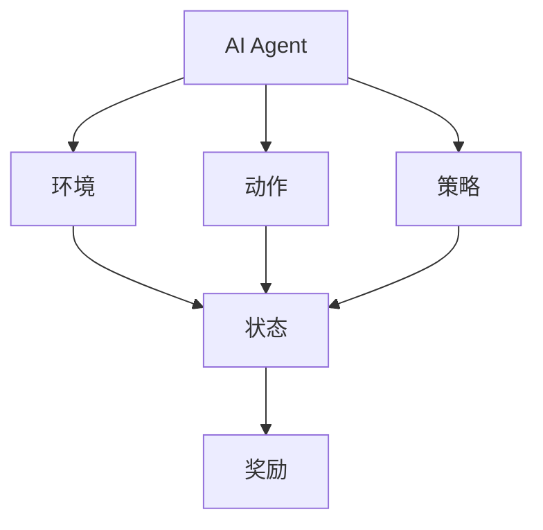
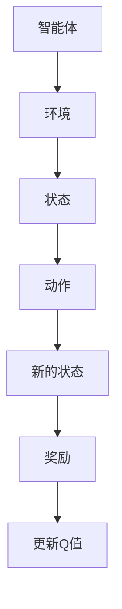
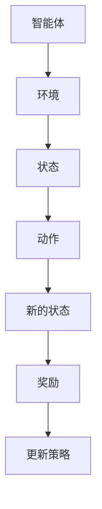

                 


# AI Agent的深度强化学习实现策略

> 关键词：AI Agent，深度强化学习，Q-learning，DQN，Dueling DQN

> 摘要：本文详细探讨了AI Agent在深度强化学习中的实现策略，从基础概念到算法原理，再到系统设计和项目实战，全面解析了如何利用深度强化学习技术来构建高效智能的AI代理。通过具体案例分析，展示了如何将理论应用于实际场景，为AI Agent的开发提供了系统的指导和实践参考。

---

# 第一部分: AI Agent与深度强化学习基础

## 第1章: AI Agent的定义与核心概念

### 1.1 AI Agent的基本概念

#### 1.1.1 AI Agent的定义
AI Agent（人工智能代理）是指能够感知环境、自主决策并采取行动以实现特定目标的智能实体。AI Agent可以是软件程序、机器人或其他智能系统，其核心在于能够与环境交互并优化自身行为以达到目标。

#### 1.1.2 AI Agent的核心特征
- **自主性**：能够在没有外部干预的情况下自主决策。
- **反应性**：能够实时感知环境并做出反应。
- **目标导向性**：基于目标驱动行为。
- **学习能力**：通过经验改进性能。

#### 1.1.3 AI Agent的分类与应用场景
AI Agent可以分为以下几类：
1. **简单反射型Agent**：基于当前感知直接行动，适用于简单任务。
2. **基于模型的反射型Agent**：维护环境状态模型，适用于复杂任务。
3. **目标驱动型Agent**：基于目标选择行动，适用于需要优化的任务。
4. **效用驱动型Agent**：基于效用函数选择行动，适用于多目标优化任务。

应用场景包括游戏AI、自动驾驶、机器人控制、智能推荐系统等。

### 1.2 深度强化学习的背景与原理

#### 1.2.1 强化学习的基本概念
强化学习是一种机器学习范式，通过智能体与环境交互，通过试错学习优化策略以最大化累积奖励。智能体通过选择行动来影响环境状态，并根据环境反馈的奖励或惩罚信号来调整策略。

#### 1.2.2 深度强化学习的定义
深度强化学习是将深度学习与强化学习相结合的技术，利用神经网络作为价值函数或策略函数的近似器，以处理高维、复杂的任务状态空间。

#### 1.2.3 深度强化学习的优势与挑战
- **优势**：
  - 能够处理高维、非结构化的输入数据（如图像、语音）。
  - 自动提取特征，减少手动特征工程的工作量。
- **挑战**：
  - 算法收敛性问题。
  - 训练不稳定性和样本效率低下。
  - 环境复杂性和多智能体协作问题。

### 1.3 问题背景与目标分析

#### 1.3.1 问题背景介绍
在复杂的动态环境中，传统基于规则的AI Agent难以应对不确定性。通过深度强化学习，AI Agent能够通过与环境的交互学习最优策略，适应复杂环境的变化。

#### 1.3.2 问题描述与目标设定
- **问题描述**：设计一个AI Agent，能够在动态环境中通过与环境交互，学习最优策略以最大化累积奖励。
- **目标设定**：实现一个基于深度强化学习的AI Agent，能够在给定环境中完成特定任务。

#### 1.3.3 问题解决的边界与外延
- **边界**：明确AI Agent的决策范围、环境状态和动作空间。
- **外延**：AI Agent的可扩展性、泛化能力及适应性。

### 1.4 核心概念与联系

#### 1.4.1 核心概念原理
- **状态空间**：环境中的所有可能状态的集合。
- **动作空间**：智能体可以执行的所有动作的集合。
- **奖励函数**：定义智能体在每个状态-动作对中的奖励。
- **策略**：智能体选择动作的概率分布。

#### 1.4.2 核心概念属性特征对比表
| 概念       | 描述                                                                 |
|------------|----------------------------------------------------------------------|
| 状态空间   | 环境中的所有可能状态，如位置、速度等。                                   |
| 动作空间   | 智能体可以执行的所有动作，如移动、转向等。                                 |
| 奖励函数   | 定义智能体在每个状态-动作对中的奖励，通常是一个实数。                     |
| 策略       | 智能体选择动作的概率分布，可以是确定性的或概率性的。                     |

#### 1.4.3 ER实体关系图架构


---

## 第2章: 深度强化学习的核心算法

### 2.1 基础算法原理

#### 2.1.1 Q-learning算法
Q-learning是一种经典的强化学习算法，通过更新Q值表来学习最优策略。Q值表记录了每个状态-动作对的期望奖励。

#### 2.1.2 Deep Q-Network (DQN)算法
DQN通过神经网络近似Q值函数，解决了Q-learning在高维状态空间中的计算问题。

#### 2.1.3 Dueling DQN算法
Dueling DQN将Q值分解为状态的价值和动作的优势，以提高策略的稳定性和性能。

### 2.2 算法原理与数学模型

#### 2.2.1 Q-learning的数学模型
$$ Q(s,a) = Q(s,a) + \alpha (r + \max Q(s',a') - Q(s,a)) $$
其中，$\alpha$ 是学习率，$r$ 是奖励，$s'$ 是下一个状态。

#### 2.2.2 DQN的数学模型
DQN的目标是最小化预测Q值与实际奖励之间的误差：
$$ \text{损失函数} = \mathbb{E}[(r + \gamma Q(s',a') - Q(s,a))^2] $$

#### 2.2.3 算法流程图（Mermaid）



### 2.3 算法实现与代码示例

#### 2.3.1 Q-learning的Python实现
```python
import numpy as np

class QLearning:
    def __init__(self, state_size, action_size, alpha=0.1):
        self.state_size = state_size
        self.action_size = action_size
        self.alpha = alpha
        self.q_table = np.zeros((state_size, action_size))
    
    def choose_action(self, state, epsilon=0.1):
        if np.random.random() < epsilon:
            return np.random.randint(self.action_size)
        else:
            return np.argmax(self.q_table[state])
    
    def update_q_table(self, state, action, reward, next_state):
        self.q_table[state][action] = self.q_table[state][action] + self.alpha * (reward + np.max(self.q_table[next_state]) - self.q_table[state][action])
```

#### 2.3.2 DQN的Python实现
```python
import torch
import torch.nn as nn

class DQN(nn.Module):
    def __init__(self, input_dim, output_dim):
        super(DQN, self).__init__()
        self.fc = nn.Sequential(
            nn.Linear(input_dim, 64),
            nn.ReLU(),
            nn.Linear(64, output_dim)
        )
    
    def forward(self, x):
        return self.fc(x)
```

---

## 第3章: 系统分析与架构设计

### 3.1 问题场景介绍
设计一个AI Agent，在动态环境中通过与环境交互，学习最优策略以最大化累积奖励。

### 3.2 系统功能设计
- **状态感知**：感知环境状态。
- **动作选择**：基于当前状态选择最优动作。
- **奖励反馈**：根据环境反馈调整策略。

### 3.3 系统架构设计

#### 3.3.1 系统架构图（Mermaid）


#### 3.3.2 数据流设计
- 输入：环境状态。
- 输出：动作选择。
- 反馈：奖励信号。

### 3.4 系统交互设计

#### 3.4.1 交互流程图（Mermaid）


---

## 第4章: 项目实战

### 4.1 环境配置与安装
- 安装必要的依赖：Python、PyTorch、OpenAI Gym。

### 4.2 系统核心实现

#### 4.2.1 环境接口实现
```python
import gym

env = gym.make('CartPole-v1')
env.seed(42)
```

#### 4.2.2 策略网络实现
```python
class PolicyNetwork(nn.Module):
    def __init__(self, input_dim, output_dim):
        super(PolicyNetwork, self).__init__()
        self.fc = nn.Sequential(
            nn.Linear(input_dim, 64),
            nn.ReLU(),
            nn.Linear(64, output_dim)
        )
    
    def forward(self, x):
        return self.fc(x)
```

### 4.3 功能解读与分析
- **状态感知**：通过环境接口获取状态信息。
- **动作选择**：基于策略网络输出的概率分布选择动作。
- **奖励反馈**：根据环境反馈调整策略。

### 4.4 案例分析与详细讲解
以CartPole-v1为例，展示AI Agent如何通过深度强化学习实现平衡杆的任务。

---

## 第5章: 总结与展望

### 5.1 小结
本文详细探讨了AI Agent的深度强化学习实现策略，从基础概念到算法原理，再到系统设计和项目实战，全面解析了如何利用深度强化学习技术构建高效的AI代理。

### 5.2 注意事项
- 确保环境稳定性和一致性。
- 选择合适的超参数和算法。
- 处理好探索与利用的平衡。

### 5.3 拓展阅读
建议阅读《Deep Reinforcement Learning》和《Reinforcement Learning: Theory and Algorithms》。

---

# 作者
作者：AI天才研究院/AI Genius Institute  
人工智能与计算机程序设计的艺术：[禅与计算机程序设计艺术](https://github.com/ZhaoZehui/zen-of-python)

