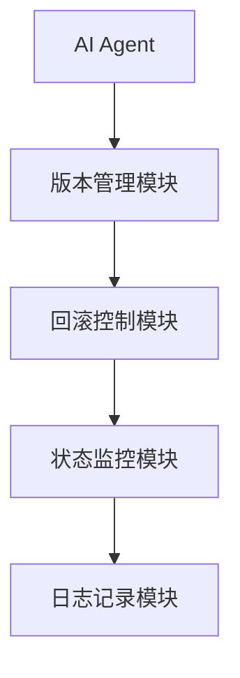
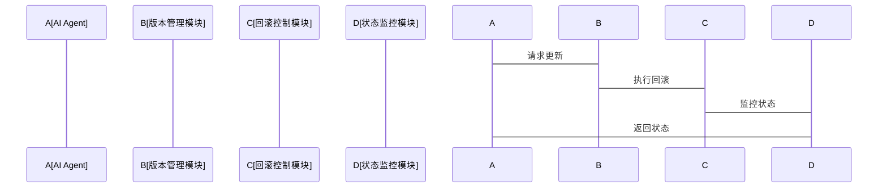

                 

# AI Agent的版本控制与回滚机制：确保稳定运行

## 关键词：
AI Agent, 版本控制, 回滚机制, 稳定性, 动态更新, 系统架构

## 摘要：
本文深入探讨了AI Agent的版本控制与回滚机制，分析了其在确保系统稳定性和可靠性中的重要作用。文章从基本概念出发，详细阐述了版本控制的原理与实现方案，重点分析了回滚机制的核心算法及其在AI Agent中的应用。通过系统架构设计与实际项目案例的分析，本文为读者提供了全面的技术指导，帮助他们在AI Agent开发中实现高效的版本管理和可靠的回滚机制。

---

# 第一部分: AI Agent版本控制与回滚机制概述

## 第1章: AI Agent版本控制与回滚机制概述

### 1.1 AI Agent的基本概念

#### 1.1.1 AI Agent的定义与特点

AI Agent（人工智能代理）是指具有自主决策和行动能力的智能实体，能够根据环境信息自主选择最优行为策略。AI Agent的特点包括自主性、反应性、目标导向性和社会性。这些特点使得AI Agent在实际应用中需要具备高度的稳定性和可维护性。

#### 1.1.2 AI Agent的分类与应用场景

AI Agent可以分为简单反射型、基于模型的反射型、目标驱动型和效用驱动型等类型。其应用场景包括自动驾驶、智能客服、推荐系统、机器人控制等领域。

#### 1.1.3 AI Agent版本控制的重要性

AI Agent的版本控制是指对AI Agent的代码、模型、配置和行为策略等进行版本化管理的过程。随着AI Agent的复杂性和功能的增加，版本控制的重要性日益凸显，特别是在动态更新和回滚机制中。

### 1.2 版本控制与回滚机制的背景

#### 1.2.1 软件开发中的版本控制问题

在传统软件开发中，版本控制是确保代码稳定性和可维护性的关键工具。然而，AI Agent的动态性和复杂性给版本控制带来了新的挑战。

#### 1.2.2 AI Agent的动态更新需求

AI Agent需要在运行时动态更新其模型、算法和策略，以适应环境的变化和用户需求的变更。动态更新要求版本控制机制能够支持在线更新和回滚。

#### 1.2.3 回滚机制的核心作用

回滚机制是指在动态更新过程中，当新版本出现问题时，能够快速回退到之前的稳定版本的能力。回滚机制是确保AI Agent稳定运行的关键保障。

### 1.3 本章小结

本章从AI Agent的基本概念出发，分析了版本控制与回滚机制的背景和重要性，为后续章节奠定了基础。

---

# 第二部分: AI Agent版本控制的核心原理

## 第2章: 版本控制的基本原理

### 2.1 版本控制的分类与实现方式

#### 2.1.1 基于文件的版本控制

基于文件的版本控制方法通过管理文件的变更历史来实现版本控制。这种方法适用于简单的代码模块，但在复杂系统中存在不足。

#### 2.1.2 基于数据库的版本控制

基于数据库的版本控制方法通过管理数据库中的变更记录来实现版本控制。这种方法能够更好地支持动态更新和回滚，但在数据量大时性能可能受到影响。

#### 2.1.3 分布式版本控制的优势

分布式版本控制（如Git）通过去中心化的管理方式，能够更好地支持团队协作和版本分支管理。然而，在AI Agent的动态更新中，分布式版本控制的复杂性可能增加。

#### 2.1.4 对比分析

表2-1对比了基于文件、基于数据库和分布式版本控制的优缺点：

| 特性               | 基于文件 | 基于数据库 | 分布式 |
|--------------------|----------|------------|--------|
| 管理粒度           | 文件     | 数据库     | 代码库 |
| 优缺点             | 简单，但不支持复杂系统 | 高效，支持动态更新 | 支持协作，但复杂性高 |

---

## 第3章: AI Agent的版本控制实现

### 3.1 增量式版本控制方法

#### 3.1.1 增量式更新的原理

增量式版本控制只记录变更部分，减少存储和传输的数据量。这种方法适用于频繁更新但变化较小的场景。

#### 3.1.2 增量式更新的优缺点

优点：节省存储空间，减少网络传输时间；缺点：实现复杂，难以支持复杂的回滚需求。

#### 3.1.3 增量式更新在AI Agent中的应用

在AI模型更新中，增量式版本控制可以有效减少模型参数的更新量，提高更新效率。

---

# 第三部分: AI Agent回滚机制的核心原理

## 第4章: 回滚机制的核心原理

### 4.1 回滚机制的触发条件

#### 4.1.1 性能指标下降

当AI Agent的性能指标（如响应时间、准确率）显著下降时，触发回滚机制。

#### 4.1.2 用户反馈异常

用户反馈的异常行为（如错误率增加）也可以触发回滚机制。

#### 4.1.3 系统监控告警

通过系统监控工具（如Prometheus）设置告警阈值，当系统状态异常时触发回滚。

### 4.2 回滚策略

#### 4.2.1 基于时间窗口的回滚策略

选择最近的稳定版本进行回滚。

#### 4.2.2 基于性能指标的回滚策略

选择最优的稳定版本进行回滚。

### 4.3 回滚实现

#### 4.3.1 回滚流程

回滚流程包括检测异常、选择回滚版本、执行回滚操作和验证回滚结果。

### 4.4 本章小结

本章详细分析了回滚机制的核心原理，包括触发条件、回滚策略和实现方法。

---

# 第四部分: AI Agent版本控制与回滚的系统架构

## 第5章: 系统架构设计

### 5.1 系统功能设计

系统功能包括版本管理、回滚控制、状态监控和日志记录。

### 5.2 系统架构设计

使用Mermaid图展示系统架构设计：

### 5.3 系统接口设计

系统接口包括版本更新接口、回滚接口和状态监控接口。

### 5.4 系统交互设计

使用Mermaid图展示系统交互流程：

### 5.5 本章小结

本章详细分析了AI Agent版本控制与回滚的系统架构设计。

---

# 第五部分: 项目实战

## 第6章: 项目实战

### 6.1 环境搭建

安装必要的工具和依赖，如Git、Python和相关库。

### 6.2 核心实现

#### 6.2.1 版本管理模块的实现

使用Python编写版本管理模块，记录版本信息和变更日志。

#### 6.2.2 回滚控制模块的实现

编写回滚控制模块，实现回滚逻辑和版本切换。

### 6.3 测试与优化

编写测试用例，验证版本控制和回滚机制的正确性，并进行性能优化。

### 6.4 项目小结

总结项目实现的经验和教训，提出改进建议。

---

# 第六部分: 最佳实践与总结

## 第7章: 最佳实践

### 7.1 实践总结

总结AI Agent版本控制与回滚机制的实现经验。

### 7.2 注意事项

提出实现过程中需要注意的事项，如版本依赖管理、回滚策略选择等。

### 7.3 拓展阅读

推荐相关的技术资料和书籍，供读者进一步学习。

### 7.4 本章小结

本章总结了AI Agent版本控制与回滚机制的最佳实践和注意事项。

---

# 附录

## 附录A: 工具与技术参考

列出实现AI Agent版本控制与回滚机制所需的主要工具和技术。

## 附录B: 扩展阅读资料

提供相关的技术文档和参考资料。

---

# 参考文献

列出文章中引用的主要文献和资料。

---

作者：AI天才研究院 & 禅与计算机程序设计艺术

