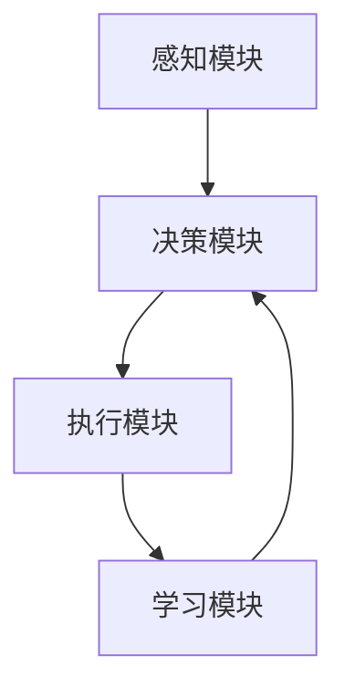

                 


# AI Agent的版本控制与迭代优化流程

---

## 关键词：AI Agent、版本控制、迭代优化、算法优化、系统架构、项目实战

---

## 摘要：

本文详细探讨了AI Agent的版本控制与迭代优化流程，从理论到实践，系统地分析了AI Agent在开发过程中版本控制的重要性、迭代优化的核心方法以及实际项目中的应用。文章通过背景介绍、核心概念、算法原理、系统架构、项目实战等多维度展开，结合数学模型、流程图和代码示例，深入剖析了AI Agent版本控制与迭代优化的全过程，为读者提供了全面而深刻的技术指导。

---

## 目录大纲

### 第1章：AI Agent的概述与背景
1.1 AI Agent的基本概念  
1.2 AI Agent的版本控制问题  
1.3 AI Agent的迭代优化背景  

### 第2章：AI Agent的核心概念与版本控制
2.1 AI Agent的核心概念  
2.2 版本控制在AI Agent中的作用  
2.3 AI Agent版本控制的特点与挑战  

### 第3章：版本控制的理论基础
3.1 版本控制的基本原理  
3.2 版本控制的分类与选择策略  
3.3 AI Agent代码库的管理与跟踪  

### 第4章：迭代优化的流程与方法
4.1 迭代优化的核心策略  
4.2 AI Agent的优化目标与评估指标  
4.3 基于强化学习的迭代优化方法  

### 第5章：算法优化与数学模型
5.1 算法优化的目标与方法  
5.2 强化学习中的策略搜索与超参数调优  
5.3 迭代优化的数学模型与公式  

### 第6章：AI Agent的系统架构设计
6.1 系统设计原则与模块划分  
6.2 系统架构的Mermaid图展示  
6.3 系统接口与交互流程  

### 第7章：项目实战与代码实现
7.1 环境搭建与工具选择  
7.2 代码实现与优化实践  
7.3 案例分析与项目总结  

### 第8章：最佳实践与未来展望
8.1 版本控制与迭代优化的经验总结  
8.2 未来AI Agent发展的趋势与挑战  
8.3 推荐的工具与资源  

---

## 正文

### 第1章：AI Agent的概述与背景

#### 1.1 AI Agent的基本概念

AI Agent（人工智能代理）是指能够感知环境、自主决策并采取行动的智能实体。它通常被设计为解决特定问题或执行特定任务，例如自动驾驶汽车、智能音箱、推荐系统等。AI Agent的核心特征包括自主性、反应性、目标导向和学习能力。

#### 1.2 AI Agent的版本控制问题

在AI Agent的开发过程中，版本控制是确保代码和模型的可追溯性、可重复性和可维护性的重要手段。由于AI Agent通常涉及复杂的算法和大量数据，版本控制不仅需要管理代码，还需要跟踪模型参数、训练数据和实验结果。

#### 1.3 AI Agent的迭代优化背景

AI Agent的性能优化是一个持续的过程。随着环境的变化和任务需求的提升，AI Agent需要不断迭代优化，以提高其决策能力和适应性。迭代优化的核心在于通过策略搜索、强化学习和超参数调优等方法，逐步提升AI Agent的性能。

---

### 第2章：AI Agent的核心概念与版本控制

#### 2.1 AI Agent的核心概念

AI Agent的核心概念包括感知、决策、行动和学习。感知是通过传感器获取环境信息，决策是基于感知信息做出最优选择，行动是通过执行器执行决策，而学习则是通过经验改进性能。

#### 2.2 版本控制在AI Agent中的作用

版本控制在AI Agent开发中的作用包括：
1. 确保代码和模型的可追溯性。
2. 支持团队协作开发。
3. 方便实验结果的复现。
4. 管理不同版本的模型和配置。

#### 2.3 AI Agent版本控制的特点与挑战

AI Agent版本控制的特点包括：
- 数据驱动：AI Agent的性能依赖于数据和模型，因此版本控制需要同时管理代码和数据。
- 复杂性高：AI Agent通常涉及复杂的算法和多团队协作，版本控制需要考虑多种因素。

---

### 第3章：版本控制的理论基础

#### 3.1 版本控制的基本原理

版本控制的基本原理包括分支与合并、版本标签和变更日志。通过分支与合并，可以支持并行开发；通过版本标签，可以标记重要的里程碑；通过变更日志，可以记录每次修改的细节。

#### 3.2 版本控制的分类与选择策略

版本控制的分类包括集中式和分布式。集中式版本控制系统（如svn）依赖于中心服务器，而分布式版本控制系统（如Git）每个开发者都有自己的仓库。选择策略需要根据团队规模和项目需求来决定。

#### 3.3 AI Agent代码库的管理与跟踪

AI Agent代码库的管理包括代码仓库的创建、分支管理、代码审查和代码文档。代码库的跟踪需要记录每次修改的影响，以便于回溯和优化。

---

### 第4章：迭代优化的流程与方法

#### 4.1 迭代优化的核心策略

迭代优化的核心策略包括：
1. 确定优化目标。
2. 设计优化算法。
3. 实施实验验证。
4. 分析结果并调整策略。

#### 4.2 AI Agent的优化目标与评估指标

AI Agent的优化目标包括准确率、响应时间和资源消耗。评估指标需要与优化目标一致，例如通过A/B测试来评估不同策略的效果。

#### 4.3 基于强化学习的迭代优化方法

基于强化学习的迭代优化方法包括策略搜索和超参数调优。策略搜索通过不断调整策略参数，找到最优策略；超参数调优通过优化算法的参数，提升性能。

---

### 第5章：算法优化与数学模型

#### 5.1 算法优化的目标与方法

算法优化的目标是提高AI Agent的性能和效率。常用方法包括梯度下降、随机搜索和遗传算法。

#### 5.2 强化学习中的策略搜索与超参数调优

策略搜索是一种通过优化策略参数来寻找最优策略的方法。超参数调优则是通过调整算法的参数，如学习率和折扣因子，来提升性能。

#### 5.3 迭代优化的数学模型与公式

迭代优化的数学模型可以用以下公式表示：

$$ J(\theta) = \mathbb{E}_{\tau \sim \pi_\theta} [R(\tau)] $$

其中，$$ J(\theta) $$ 是目标函数，$$ \tau $$ 是轨迹，$$ R(\tau) $$ 是轨迹的回报。

---

### 第6章：AI Agent的系统架构设计

#### 6.1 系统设计原则与模块划分

AI Agent的系统设计原则包括模块化、可扩展性和可维护性。模块划分通常包括感知模块、决策模块、执行模块和学习模块。

#### 6.2 系统架构的Mermaid图展示

以下是AI Agent的系统架构图：



#### 6.3 系统接口与交互流程

AI Agent的交互流程包括感知、决策、行动和学习。通过接口定义，可以明确模块之间的通信方式。

---

### 第7章：项目实战与代码实现

#### 7.1 环境搭建与工具选择

建议使用Git进行版本控制，TensorFlow或PyTorch进行模型开发，以及Jupyter Notebook进行实验。

#### 7.2 代码实现与优化实践

以下是AI Agent的简单代码实现：

```python
import tensorflow as tf
from tensorflow.keras import layers

# 定义AI Agent模型
class AI_Agent:
    def __init__(self):
        self.model = self.build_model()

    def build_model(self):
        model = tf.keras.Sequential([
            layers.Dense(64, activation='relu'),
            layers.Dense(1, activation='sigmoid')
        ])
        return model

    def train(self, x_train, y_train):
        self.model.compile(optimizer='adam', loss='binary_crossentropy')
        self.model.fit(x_train, y_train, epochs=10, batch_size=32)

# 使用AI Agent
agent = AI_Agent()
agent.train(x_train, y_train)
```

#### 7.3 案例分析与项目总结

通过实际案例分析，验证版本控制与迭代优化的有效性，并总结经验教训。

---

### 第8章：最佳实践与未来展望

#### 8.1 版本控制与迭代优化的经验总结

经验总结包括选择合适的版本控制工具、制定规范的迭代优化流程和保持团队协作。

#### 8.2 未来AI Agent发展的趋势与挑战

未来趋势包括多模态AI、边缘计算和自适应学习。挑战包括数据隐私、计算资源和模型解释性。

#### 8.3 推荐的工具与资源

推荐使用Git、Docker、TensorFlow等工具，并参考相关技术文档和社区资源。

---

## 结语

通过本文的详细讲解，读者可以全面了解AI Agent的版本控制与迭代优化流程。从理论到实践，结合数学模型、流程图和代码示例，为读者提供了深入的技术指导。

---

## 作者

**作者：AI天才研究院/AI Genius Institute & 禅与计算机程序设计艺术 /Zen And The Art of Computer Programming**

