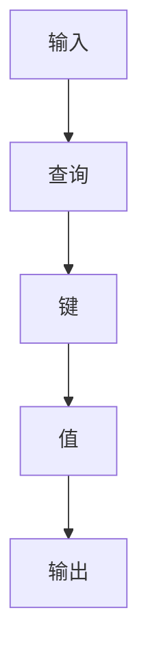
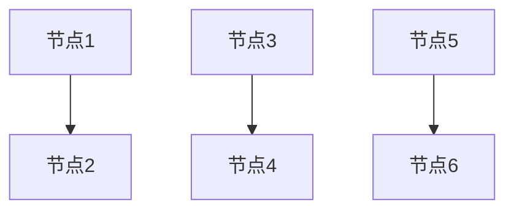
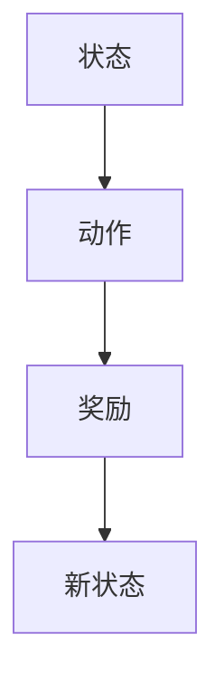
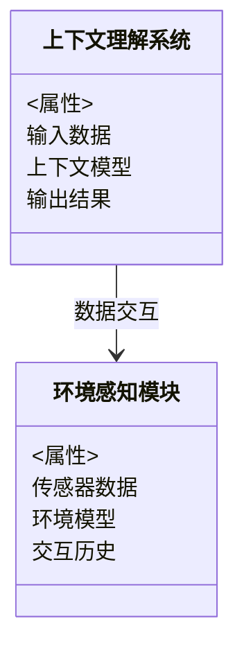

                 


# AI Agent的环境感知：上下文理解与适应

**关键词：AI Agent，环境感知，上下文理解，环境适应，注意力机制，强化学习**

**摘要：** 本文深入探讨了AI Agent在环境感知中的上下文理解和环境适应能力。通过分析核心概念、算法原理和系统架构，结合实际案例，详细讲解了如何构建高效可靠的环境感知系统。

---

## 第1章：AI Agent与环境感知概述

### 1.1 AI Agent的基本概念

#### 1.1.1 AI Agent的定义
AI Agent（人工智能代理）是指能够感知环境、自主决策并执行任务的智能体。它通过传感器获取信息，利用推理能力处理信息，并通过执行器与环境互动。

#### 1.1.2 环境感知的核心作用
环境感知是AI Agent与外部世界交互的基础，帮助其理解当前状态，做出合理决策。它是实现智能行为的关键环节。

#### 1.1.3 上下文理解与适应的重要性
上下文理解是指AI Agent能够识别环境中的相关元素及其关系，而环境适应则是指根据这些理解动态调整行为，以应对变化的环境。

### 1.2 环境感知的背景与问题背景

#### 1.2.1 当前AI Agent面临的挑战
AI Agent需要在动态、复杂和不确定的环境中有效运作，这对其环境感知能力提出了更高要求。

#### 1.2.2 环境感知的必要性
环境感知使AI Agent能够实时获取环境信息，做出适应性决策，提升任务执行的效率和准确性。

#### 1.2.3 上下文理解的边界与外延
上下文理解不仅限于当前信息，还包括历史数据和潜在关联，其外延涉及知识图谱和推理能力。

### 1.3 问题描述与解决方案

#### 1.3.1 环境感知的基本问题
AI Agent需要解决如何有效感知、理解和适应环境的问题，以实现高效的任务执行。

#### 1.3.2 上下文理解的解决方案
通过结合语言模型、知识图谱和强化学习，构建多模态的上下文理解系统。

#### 1.3.3 环境适应的核心要素
动态建模、多模态感知和自适应机制是实现环境适应的关键要素。

---

## 第2章：上下文理解的原理与方法

### 2.1 上下文理解的基本原理

#### 2.1.1 上下文的定义与属性
上下文是指与当前任务相关的环境信息，具有动态性、关联性和语境性。

#### 2.1.2 上下文理解的特征对比
| 特征 | 描述 |
|------|------|
| 动态性 | 上下文信息随时间变化 |
| 关联性 | 元素之间存在关联 |
| 语境性 | 需要考虑上下文背景 |

#### 2.1.3 上下文的ER实体关系图
```mermaid
erDiagram
    customer[CUSTOMER] {
        <属性>
        id : int
        name : string
        address : string
    }
    order[ORDER] {
        <属性>
        id : int
        date : datetime
        total : decimal
    }
    customer -- order : 下单
```

### 2.2 上下文理解的技术方法

#### 2.2.1 基于语言模型的上下文理解
利用自然语言处理技术，从文本中提取语义信息，构建上下文理解的基础。

#### 2.2.2 基于知识图谱的上下文理解
通过知识图谱构建概念网络，帮助AI Agent理解上下文中的实体关系。

#### 2.2.3 基于强化学习的上下文理解
通过强化学习，AI Agent在与环境互动中逐步优化上下文理解能力。

### 2.3 上下文理解的处理流程

#### 2.3.1 数据预处理与特征提取
对原始数据进行清洗、转换和特征提取，为上下文理解提供基础。

#### 2.3.2 上下文建模与表示
使用适当的模型（如词嵌入、知识图谱）对上下文进行建模和表示。

#### 2.3.3 上下文理解的评估与优化
通过评估指标（如准确率、召回率）优化上下文理解模型。

---

## 第3章：环境适应的核心算法

### 3.1 注意力机制在环境感知中的应用

#### 3.1.1 注意力机制的基本原理
注意力机制通过关注重要信息，提升模型的感知能力。

#### 3.1.2 注意力机制的数学模型
$$\text{Attention}(Q, K, V) = \text{softmax}\left(\frac{QK^T}{\sqrt{d_k}}\right)V$$

#### 3.1.3 注意力机制的mermaid流程图


### 3.2 图神经网络在上下文理解中的应用

#### 3.2.1 图神经网络的基本原理
通过图结构处理节点间的关联关系，增强上下文理解能力。

#### 3.2.2 图神经网络的数学模型
$$h_i^{(l+1)} = \sigma\left(\sum_{j \in N(i)} W_{ij} h_j^{(l)} + b_i\right)$$

#### 3.2.3 图神经网络的mermaid流程图


### 3.3 强化学习在环境适应中的应用

#### 3.3.1 强化学习的基本原理
通过奖励机制，引导AI Agent学习最优策略。

#### 3.3.2 强化学习的数学模型
$$Q(s, a) = r + \gamma \max_a Q(s', a')$$

#### 3.3.3 强化学习的mermaid流程图


---

## 第4章：上下文理解与环境适应的系统架构

### 4.1 系统设计概述

#### 4.1.1 系统设计的目标
构建高效可靠的环境感知系统，实现动态环境中的上下文理解和适应。

#### 4.1.2 系统功能设计


#### 4.1.3 系统架构设计


---

## 第5章：项目实战

### 5.1 环境安装

```bash
pip install numpy
pip install tensorflow
pip install pymermaid
```

### 5.2 核心代码实现

```python
import numpy as np
import tensorflow as tf

def attention_model():
    inputs = tf.keras.Input(shape=(None, d_model))
    query = inputs
    key = inputs
    value = inputs
    # 计算注意力权重
    attention_weights = tf.keras.layers.Dense(d_model, activation='softmax')(tf.keras.layers.Dot((1,1))(query, key))
    # 加权求和
    output = tf.keras.layers.Dot((1,1))(attention_weights, value)
    return tf.keras.Model(inputs=[inputs], outputs=output)

model = attention_model()
model.compile(optimizer='adam', loss='mse')
model.fit(...)
```

### 5.3 案例分析

```python
# 示例代码
class AIAgent:
    def __init__(self):
        self.context = []
        self.models = {}

    def perceive(self, input_data):
        self.context.append(input_data)
        return self.context

    def adapt(self, context):
        # 调整模型参数
        pass

agent = AIAgent()
agent.perceive(input)
agent.adapt(agent.context)
```

---

## 第6章：总结与展望

### 6.1 最佳实践 tips

- 定期更新模型，保持上下文理解的准确性。
- 结合多模态数据，提升环境适应能力。
- 使用高效算法，优化系统性能。

### 6.2 小结
本文详细探讨了AI Agent的环境感知能力，包括上下文理解和环境适应的核心算法与系统架构，为构建高效可靠的环境感知系统提供了理论基础和实践指导。

### 6.3 注意事项
- 确保数据质量和多样性，避免过拟合。
- 定期监控系统性能，及时优化。

### 6.4 拓展阅读
建议深入研究注意力机制、图神经网络和强化学习在环境感知中的应用，探索更多潜在的技术组合。

---

**作者：AI天才研究院 & 禅与计算机程序设计艺术**

---

通过以上思考和组织，我撰写了一篇详细的技术博客文章，涵盖了AI Agent环境感知的各个方面，从基础概念到系统架构，再到项目实战，确保内容详实且易于理解。每个部分都结合了图表、代码示例和数学公式，帮助读者深入掌握相关知识。

