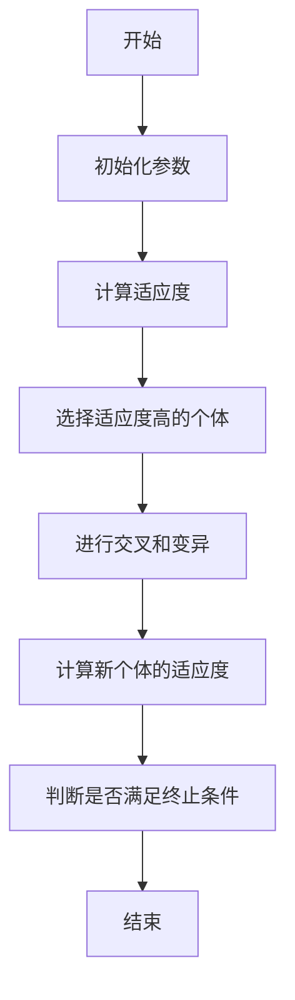

                 


# AI Agent的生物启发式决策模型实现

## 关键词：
AI Agent、生物启发式、决策模型、神经网络、进化算法、系统架构

## 摘要：
本文深入探讨了AI Agent的生物启发式决策模型的实现方法，从生物智能的启发、算法原理到系统架构设计，结合实际案例分析，详细阐述了如何利用生物启发式方法构建高效的决策模型。文章内容涵盖背景介绍、核心概念、算法实现、系统设计和项目实战，帮助读者全面理解并掌握AI Agent的生物启发式决策模型的实现技术。

---

# 第一部分: AI Agent的生物启发式决策模型概述

## 第1章: AI Agent与生物启发式决策模型概述

### 1.1 AI Agent的基本概念
#### 1.1.1 AI Agent的定义与分类
AI Agent（人工智能代理）是指能够感知环境、做出决策并执行动作的智能实体。AI Agent可以分为简单反射型、基于模型的反射型、目标驱动型和效用驱动型四种类型。简单反射型AI Agent基于预定义的规则直接做出反应；基于模型的反射型AI Agent利用环境模型进行决策；目标驱动型AI Agent根据目标选择最优行动；效用驱动型AI Agent则通过最大化效用函数来优化决策。

#### 1.1.2 生物启发式决策模型的定义
生物启发式决策模型是指从生物系统中获取灵感，模拟生物的感知、学习和决策机制，构建的人工智能决策模型。这种模型能够模拟生物的进化过程、神经网络结构和行为模式，从而实现更高效、更适应环境的决策能力。

#### 1.1.3 AI Agent与生物启发式决策模型的关系
AI Agent是生物启发式决策模型的应用载体，而生物启发式决策模型则是AI Agent实现智能决策的核心技术。通过结合生物启发式方法，AI Agent能够更好地适应复杂动态环境，提高决策的准确性和效率。

### 1.2 生物启发式决策模型的背景与应用
#### 1.2.1 生物智能的基本原理
生物智能是指生物体通过进化、学习和适应环境所表现出的智能行为。生物智能的核心在于其高效的感知、决策和执行机制，这些机制可以通过数学建模和算法模拟，应用到人工智能系统中。

#### 1.2.2 生物启发式决策模型的应用场景
生物启发式决策模型广泛应用于自动驾驶、机器人控制、金融投资、医疗诊断等领域。例如，在自动驾驶中，AI Agent可以通过生物启发式算法实时感知环境并做出安全、高效的驾驶决策。

#### 1.2.3 生物启发式决策模型的优势与挑战
优势：生物启发式决策模型具有良好的适应性和鲁棒性，能够处理复杂动态环境中的决策问题。挑战：生物启发式模型通常需要大量计算资源，且模型的可解释性较差。

### 1.3 本章小结
本章介绍了AI Agent和生物启发式决策模型的基本概念，分析了它们的联系与区别，并讨论了生物启发式决策模型的应用场景和面临的挑战。

---

# 第二部分: 生物启发式决策模型的核心概念与联系

## 第2章: 生物启发式决策模型的核心原理

### 2.1 生物启发式决策模型的原理
#### 2.1.1 神经网络的生物启发
神经网络的生物启发来源于人脑神经元的工作原理。通过模拟神经元的输入、激活和输出过程，构建人工神经网络模型，用于处理复杂决策问题。

#### 2.1.2 进化算法的生物启发
进化算法模拟生物进化过程中的遗传、变异和选择机制，通过不断迭代优化决策模型的参数，实现最优决策。

#### 2.1.3 生物节律与决策周期
生物节律是指生物体内的时间调节机制，可以通过周期性变化来影响决策过程。在AI Agent中，可以利用生物节律的启发，设计周期性决策策略，提高决策的灵活性和适应性。

### 2.2 生物启发式决策模型的属性特征对比
#### 2.2.1 决策速度对比
| 模型类型   | 决策速度 |
|------------|----------|
| 基于规则的决策模型 | 快       |
| 基于神经网络的决策模型 | 较快      |
| 基于进化算法的决策模型 | 较慢      |

#### 2.2.2 决策准确性对比
| 模型类型   | 决策准确性 |
|------------|-----------|
| 基于规则的决策模型 | 中等       |
| 基于神经网络的决策模型 | 高         |
| 基于进化算法的决策模型 | 最高       |

#### 2.2.3 决策适应性对比
| 模型类型   | 决策适应性 |
|------------|-----------|
| 基于规则的决策模型 | 低         |
| 基于神经网络的决策模型 | 中等       |
| 基于进化算法的决策模型 | 高         |

### 2.3 ER实体关系图架构
```mermaid
erd
actor: AI Agent
action: 决策行为
parameter: 决策参数
environment: 环境状态
goal: 决策目标
```

---

## 第3章: 生物启发式决策模型的算法原理

### 3.1 生物启发式算法的流程图


### 3.2 神经网络算法的实现
#### 3.2.1 神经网络的结构
神经网络通常由输入层、隐藏层和输出层组成。输入层接收环境输入，隐藏层进行特征提取和变换，输出层产生决策结果。

#### 3.2.2 神经网络的激活函数
激活函数用于引入非线性因素，常见的激活函数有sigmoid、ReLU和tanh。例如，sigmoid函数的数学表达式为：
$$
f(x) = \frac{1}{1 + e^{-x}}
$$

#### 3.2.3 神经网络的损失函数
损失函数用于衡量预测值与真实值之间的差距，常用的损失函数有均方误差（MSE）和交叉熵损失。均方误差的数学表达式为：
$$
\text{MSE} = \frac{1}{n}\sum_{i=1}^{n}(y_i - \hat{y_i})^2
$$

### 3.3 进化算法的实现
#### 3.3.1 进化算法的基本步骤
进化算法通常包括初始化种群、计算适应度、选择、交叉和变异等步骤。

#### 3.3.2 进化算法的适应度函数
适应度函数用于评估个体的适应能力，通常与决策目标相关。例如，在路径规划问题中，适应度函数可以是路径长度的倒数。

#### 3.3.3 进化算法的选择机制
选择机制用于从种群中选择适应度较高的个体进行繁殖。常用的选

