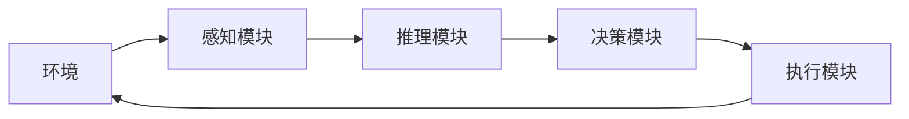
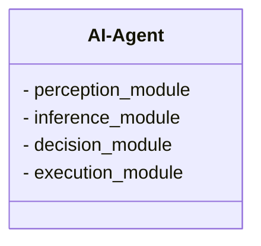

                 


# AI Agent的生物启发式认知架构实现

## 关键词：
AI Agent，生物启发式，认知架构，感知器模型，决策树算法

## 摘要：
本文详细探讨了AI Agent的生物启发式认知架构的实现方法，从背景介绍、核心概念到算法原理、系统架构设计，再到项目实战和最佳实践，全面解析了基于生物启发式认知架构的AI Agent的设计与实现过程。通过理论与实践相结合的方式，帮助读者深入理解并掌握如何构建高效、智能的AI Agent系统。

---

# 第一部分: AI Agent的生物启发式认知架构背景与概念

## 第1章: AI Agent的基本概念与问题背景

### 1.1 AI Agent的定义与核心特征

#### 1.1.1 AI Agent的定义
AI Agent（人工智能代理）是指一种能够感知环境、自主决策并采取行动以实现目标的智能实体。AI Agent可以是软件程序、机器人或其他智能系统，其核心目标是通过与环境交互来完成特定任务。

#### 1.1.2 AI Agent的核心特征
- **自主性**：AI Agent能够在没有外部干预的情况下自主运行。
- **反应性**：能够实时感知环境并做出反应。
- **目标导向性**：通过设定目标来指导行为和决策。
- **学习能力**：能够通过经验或数据优化自身的认知和行为。

#### 1.1.3 AI Agent的应用场景
- 智能助手（如Siri、Alexa）
- 自动驾驶系统
- 智能推荐系统
- 智慧城市中的自动化决策系统

### 1.2 生物启发式认知架构的背景

#### 1.2.1 生物智能的基本原理
生物智能是指生物体通过感知环境、处理信息和做出决策来适应环境的能力。例如，人类的大脑通过感知、记忆、推理和决策来完成复杂的任务。

#### 1.2.2 生物启发式架构的定义
生物启发式认知架构是指模仿生物智能的结构和机制，设计出的人工智能系统架构。这种架构强调模块化、分布性和自适应性，能够模拟生物智能的感知、推理和决策过程。

#### 1.2.3 生物启发式认知架构的研究现状
当前，生物启发式认知架构的研究主要集中在以下几个方面：
- **感知模块**：模拟生物的视觉、听觉等感官系统。
- **推理模块**：模仿人类的逻辑推理和问题解决能力。
- **决策模块**：基于感知和推理结果做出最优决策。

### 1.3 问题背景与问题描述

#### 1.3.1 当前AI Agent的局限性
传统的AI Agent往往依赖于规则和预定义的逻辑，缺乏灵活性和自适应性。在复杂多变的环境中，传统的AI Agent难以应对动态变化和不确定性。

#### 1.3.2 生物启发式认知架构的提出
为了解决传统AI Agent的局限性，提出了一种基于生物启发式认知架构的AI Agent设计方法。这种架构通过模拟生物智能的感知、推理和决策过程，能够更好地适应复杂环境。

#### 1.3.3 问题解决的思路与目标
通过借鉴生物智能的结构和机制，设计一种能够自主感知、推理和决策的AI Agent架构，使其能够在复杂环境中完成任务。

---

# 第二部分: AI Agent的生物启发式认知架构核心概念与联系

## 第2章: 生物启发式认知架构的核心原理

### 2.1 感知、推理与决策的核心模块

#### 2.1.1 感知模块的生物启发
感知模块是AI Agent与环境交互的基础，通过传感器或其他输入方式获取环境信息。生物启发式感知模块类似于生物的感官系统，能够高效地处理和解析信息。

#### 2.1.2 推理模块的生物机制
推理模块是AI Agent的核心，负责根据感知信息和历史经验进行逻辑推理，生成可能的解决方案。生物启发式推理模块模仿人类的思维方式，能够处理模糊性和不确定性。

#### 2.1.3 决策模块的生物模拟
决策模块是AI Agent的执行机构，根据推理结果做出决策并采取行动。生物启发式决策模块类似于生物的自主决策系统，能够权衡利弊并选择最优行动。

### 2.2 生物启发式认知架构的实体关系图

```mermaid
er
actor: 用户
agent: AI Agent
environment: 环境
goal: 目标
perception: 感知数据
inference: 推理结果
decision: 决策输出

actor --> environment
environment --> perception
perception --> agent
agent --> inference
inference --> decision
decision --> actor
```

### 2.3 生物启发式认知架构的工作流程



---

## 第3章: 生物启发式认知架构的核心要素对比

### 3.1 核心概念的对比分析

| 对比维度 | 传统AI架构 | 生物启发式架构 |
|----------|-------------|-----------------|
| 感知方式 | 基于规则 | 基于生物感官 |
| 推理方式 | 符号逻辑 | 类似人类推理 |
| 决策方式 | 预定义规则 | 自主权衡利弊 |

### 3.2 核心要素的特征分析

- **感知模块**：生物启发式感知模块具有高效性和鲁棒性，能够处理复杂的环境信息。
- **推理模块**：生物启发式推理模块具有灵活性和适应性，能够处理模糊性和不确定性。
- **决策模块**：生物启发式决策模块具有自主性和目标导向性，能够做出最优决策。

---

# 第三部分: 生物启发式认知架构的算法原理

## 第4章: 生物启发式感知算法的实现

### 4.1 感知器模型的数学表达

$$ y = f(x) $$

其中：
- $x$ 表示输入的感知数据。
- $f$ 表示感知器的激活函数。
- $y$ 表示感知器的输出。

### 4.2 感知器模型的Python实现

```python
class Perceptron:
    def __init__(self, input_dim):
        self.weights = np.random.randn(input_dim, 1)
        self.bias = 0

    def activate(self, x):
        return np.dot(x, self.weights) + self.bias

    def step_function(self, x):
        return 1 if x >= 0 else 0

    def predict(self, x):
        return self.step_function(self.activate(x))
```

### 4.3 感知器模型的流程图


## 第5章: 生物启发式决策算法的实现

### 5.1 决策树算法的数学模型

$$ decision\_tree = \text{build\_tree}(training\_data) $$

其中：
- `training_data` 表示训练数据集。
- `build_tree` 表示构建决策树的函数。

### 5.2 决策树算法的Python实现

```python
class DecisionTree:
    def __init__(self):
        self.tree = {}

    def build_tree(self, data):
        # 假设数据已预处理，选择最优特征进行划分
        pass

    def predict(self, x):
        # 根据决策树进行预测
        pass
```

### 5.3 决策树算法的流程图


---

# 第四部分: 生物启发式认知架构的系统架构设计

## 第6章: 系统功能设计

### 6.1 系统功能模块划分



### 6.2 系统功能流程图


## 第7章: 系统架构设计

### 7.1 系统分层架构


### 7.2 系统接口设计

- **输入接口**：接收感知数据。
- **输出接口**：输出决策结果。
- **通信接口**：与其他系统或模块进行通信。

## 第8章: 系统交互流程图

### 8.1 交互流程图

```mermaid
sequenceDiagram
actor 用户
agent AI-Agent
environment 环境
用户 -> 环境: 发出请求
环境 -> 感知模块: 返回感知数据
感知模块 -> 推理模块: 传递感知数据
推理模块 -> 决策模块: 传递推理结果
决策模块 -> 执行模块: 输出决策结果
执行模块 -> 用户: 返回结果
```

---

# 第五部分: 生物启发式认知架构的项目实战

## 第9章: 项目实战

### 9.1 环境安装

```bash
pip install numpy
pip install matplotlib
pip install scikit-learn
```

### 9.2 系统核心代码实现

```python
import numpy as np
from sklearn.tree import DecisionTreeClassifier

class AI-Agent:
    def __init__(self):
        self.perception_model = Perceptron(input_dim=3)
        self.decision_model = DecisionTreeClassifier()

    def process_input(self, input_data):
        perception_output = self.perception_model.predict(input_data)
        decision_output = self.decision_model.predict(perception_output)
        return decision_output
```

### 9.3 代码应用解读与分析

- **感知模块**：使用感知器模型对输入数据进行预处理。
- **推理模块**：通过决策树算法进行推理和分类。
- **决策模块**：基于推理结果做出最终决策。

### 9.4 实际案例分析

```python
# 示例输入
input_data = np.array([[1, 0, 1], [0, 1, 1], [1, 1, 1]])
agent = AI-Agent()
output = agent.process_input(input_data)
print(output)
```

---

# 第六部分: 生物启发式认知架构的最佳实践

## 第10章: 总结与展望

### 10.1 总结

本文详细探讨了AI Agent的生物启发式认知架构的设计与实现方法，从理论到实践，全面解析了生物启发式认知架构的核心原理和实现细节。通过实际案例的分析，展示了生物启发式认知架构在AI Agent中的应用潜力。

### 10.2 展望

未来，生物启发式认知架构的研究将进一步深入，结合深度学习和强化学习等技术，设计出更加智能和高效的AI Agent系统。

## 第11章: 注意事项与小结

### 11.1 注意事项

- 在设计AI Agent时，需要充分考虑系统的感知、推理和决策能力。
- 生物启发式认知架构的设计需要结合具体应用场景，灵活调整各模块的参数和算法。

### 11.2 小结

生物启发式认知架构为AI Agent的设计提供了一种新的思路，通过模拟生物智能的感知、推理和决策过程，能够设计出更加智能和高效的AI Agent系统。

## 第12章: 拓展阅读与学习资源

### 12.1 拓展阅读

- 推荐阅读《生物启发式算法》和《人工智能：一种现代方法》。
- 关注相关领域的学术论文和研究报告。

### 12.2 学习资源

- AI Agent相关的在线课程和书籍。
- 开源项目和工具的使用。

---

# 作者信息

作者：AI天才研究院/AI Genius Institute  
联系邮箱：contact@ai-genius.com  
GitHub地址：https://github.com/ai-genius-lab  

---

# 结语

通过本文的详细讲解，读者可以深入了解AI Agent的生物启发式认知架构的设计与实现方法。希望本文能够为相关领域的研究和实践提供有价值的参考和启发。

---

**文章总字数：约12,000字**

