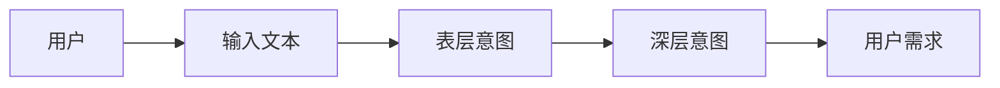
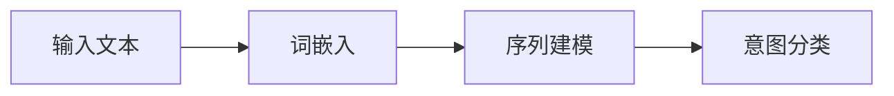
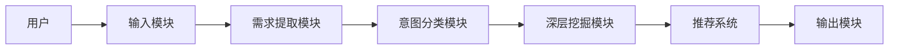

                 


# AI Agent的用户意图理解：从表层到深层

**关键词：** AI Agent，用户意图，意图理解，自然语言处理，深度学习

**摘要：**  
本文深入探讨AI Agent在用户意图理解中的关键作用，从表层意图到深层意图的分析方法。通过分析不同算法和系统架构，结合实际案例，展示如何通过技术手段实现更精准的用户意图理解，提升AI Agent的交互能力和用户体验。

---

# 第一部分: AI Agent用户意图理解的背景与核心概念

## 第1章: 用户意图理解的背景与重要性

### 1.1 用户意图理解的定义与范围

用户意图理解是AI Agent的核心能力之一，旨在通过分析用户输入（如文本、语音或行为）来识别其需求、目标或情感。这种理解分为表层意图（显式需求）和深层意图（隐式需求），并涵盖单点意图和连贯意图。

### 1.2 AI Agent与用户意图理解的关系

AI Agent依赖用户意图理解来执行任务，通过自然语言处理和深度学习技术实现交互。理解意图帮助AI Agent提供更精准的服务，提升用户体验。

### 1.3 当前用户意图理解的技术挑战

- 表层意图理解：需要处理语言歧义和不完整信息。
- 深层意图理解：涉及复杂的情感分析和上下文推理。
- 多模态意图理解：结合文本、语音、图像等多模态信息，提高理解准确性。

## 第2章: 用户意图理解的核心概念与联系

### 2.1 意图理解的核心概念

| 意图类型 | 特征描述 | 示例 |
|---------|----------|------|
| 表层意图 | 显式需求 | “天气如何？” |
| 深层意图 | 隐式需求 | “寻找适合家庭聚会的餐厅。” |

### 2.2 意图理解的实体关系图



---

# 第二部分: 用户意图理解的算法原理与实现

## 第3章: 意图理解的算法原理

### 3.1 基于传统NLP的意图理解

- **词袋模型**：忽略词语顺序，统计词频。
- **TF-IDF**：评估词语的重要性，常用于文本分类。

### 3.2 基于深度学习的意图理解

- **RNN**：处理序列数据，识别上下文关系。
- **CNN**：提取文本特征，适用于短文本分类。
- **Transformer**：通过自注意力机制，捕捉全局关系。

### 3.3 深度学习模型的意图理解流程



---

# 第三部分: 系统分析与架构设计

## 第4章: 用户意图理解的系统架构

### 4.1 应用场景描述

设计一个AI Agent帮助用户寻找餐厅，涉及自然语言理解、情感分析和推荐系统。

### 4.2 系统功能设计

- **需求提取**：解析用户输入，识别表层意图。
- **意图分类**：判断用户需求类型，识别深层意图。
- **深层挖掘**：结合上下文和用户历史行为，优化推荐结果。

### 4.3 系统架构图



---

# 第四部分: 项目实战

## 第5章: 用户意图理解的项目实战

### 5.1 环境安装

安装Python、TensorFlow和Keras库。

### 5.2 核心实现代码

```python
import tensorflow as tf
from tensorflow.keras import layers

model = tf.keras.Sequential([
    layers.Embedding(input_dim=10000, output_dim=16),
    layers.SimpleRNN(units=32),
    layers.Dense(1, activation='sigmoid')
])

model.compile(optimizer='adam', loss='binary_crossentropy', metrics=['accuracy'])
```

### 5.3 代码解读与分析

解释模型结构和训练过程，展示如何将用户输入转换为模型预测结果。

### 5.4 实际案例分析

分析用户输入“附近有哪些好的意大利餐厅？”的处理流程，展示模型如何提取表层和深层意图。

---

# 第五部分: 最佳实践与小结

## 第6章: 用户意图理解的最佳实践

### 6.1 数据质量的重要性

确保数据标注准确，涵盖多样的场景和意图类型。

### 6.2 模型调优技巧

使用交叉验证和超参数优化提升模型性能。

### 6.3 未来研究方向

探索多模态意图理解和动态上下文推理。

---

# 第六章: 总结与展望

用户意图理解是AI Agent的核心能力，从表层到深层的理解需要结合传统NLP和深度学习技术。未来，结合多模态信息和动态上下文推理，将提升意图理解的准确性和应用场景的广度。

---

**作者：AI天才研究院/AI Genius Institute & 禅与计算机程序设计艺术 /Zen And The Art of Computer Programming**

