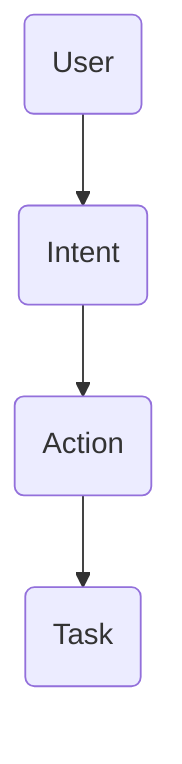
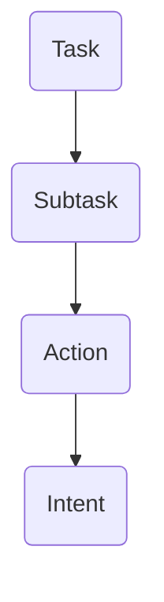
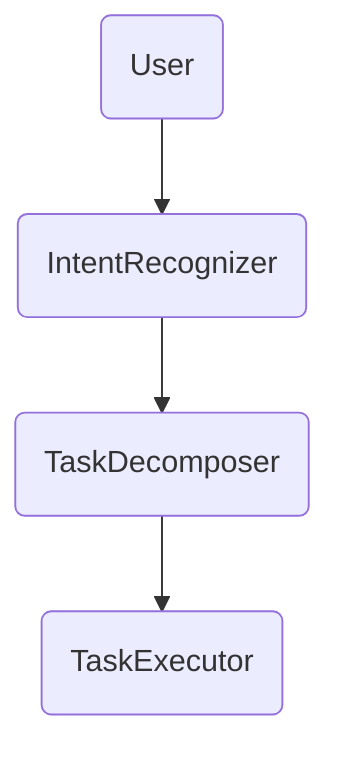

                 


# AI Agent的用户意图识别与任务分解

> 关键词：AI Agent，用户意图识别，任务分解，自然语言处理，知识图谱，强化学习

> 摘要：本文详细探讨了AI Agent在用户意图识别与任务分解领域的核心概念、算法原理、系统架构设计及实际应用。通过结合理论与实践，分析了当前技术的挑战与解决方案，为读者提供了从基础到高级的全面解读。

---

## 第一部分：AI Agent的用户意图识别与任务分解背景介绍

### 第1章：AI Agent的基本概念与背景

#### 1.1 AI Agent的定义与特点
- **AI Agent的定义**：AI Agent（人工智能代理）是一种能够感知环境、自主决策并执行任务的智能实体。它可以是软件程序、机器人或其他智能系统。
- **AI Agent的核心特点**：
  1. **自主性**：能够在没有外部干预的情况下独立运行。
  2. **反应性**：能够实时感知环境并做出响应。
  3. **目标导向性**：基于明确的目标执行任务。
  4. **学习能力**：能够通过经验改进自身性能。

- **AI Agent与传统软件的区别**：
  - 传统软件依赖于明确的输入和规则，而AI Agent能够理解和适应复杂的环境。
  - AI Agent具备学习和推理能力，能够处理不确定性。

#### 1.2 用户意图识别的背景与重要性
- **用户意图识别的定义**：通过分析用户的输入（如语音、文本、行为等）来推断用户的意图和需求。
- **用户意图识别的背景**：
  - 随着AI Agent的应用越来越广泛，准确识别用户意图成为提升用户体验的关键。
  - 在智能音箱、智能助手、智能客服等领域，用户意图识别是实现高效交互的基础。
- **用户意图识别的重要性**：
  - 准确识别用户意图可以提高任务执行的效率。
  - 通过理解用户的真实需求，AI Agent能够提供更个性化的服务。

#### 1.3 任务分解的定义与作用
- **任务分解的定义**：将一个复杂的任务分解为多个简单且可管理的子任务。
- **任务分解的作用**：
  - 提高任务执行的效率和准确性。
  - 使AI Agent能够更好地协调资源和执行步骤。
  - 便于处理动态变化的任务需求。

---

### 第2章：AI Agent在人机交互中的应用

#### 2.1 人机交互的发展历程
- **从命令行到图形界面**：早期的人机交互依赖于命令行输入，用户需要掌握特定的命令语法。图形界面的引入使得交互更加直观和用户友好。
- **自然语言处理的引入**：随着自然语言处理技术的发展，用户可以通过自然语言与AI Agent进行交互，极大地提升了用户体验。
- **当前AI Agent在人机交互中的地位**：AI Agent已经成为现代人机交互的核心技术，能够通过语音、文本等多种方式与用户进行高效互动。

#### 2.2 用户意图识别的典型场景
- **智能音箱中的语音交互**：用户通过语音指令控制AI Agent执行特定任务，如播放音乐、设置提醒等。
- **智能助手的任务管理**：AI Agent可以根据用户的意图创建任务列表、设定提醒等。
- **智能客服中的用户需求分析**：通过分析用户的文本或语音输入，智能客服能够准确理解用户的需求并提供相应的服务。

#### 2.3 任务分解的典型场景
- **复杂任务的分解**：例如，规划旅行时，AI Agent可以将任务分解为预订机票、酒店、制定行程等子任务。
- **简单任务的分解**：例如，购物任务可以分解为搜索商品、比较价格、下单支付等步骤。
- **动态任务的分解**：例如，在应对突发事件时，AI Agent需要快速分解任务并调整执行顺序。

---

## 第二部分：AI Agent的用户意图识别与任务分解核心概念

### 第3章：用户意图识别的核心概念与原理

#### 3.1 用户意图识别的原理
- **基于规则的方法**：通过预定义的规则和关键词匹配用户的输入，识别用户的意图。例如，通过匹配“播放音乐”来识别用户的意图。
- **基于统计学习的方法**：利用机器学习算法，从大量标注数据中学习用户的意图模式。例如，使用支持向量机（SVM）或随机森林（Random Forest）进行分类。
- **基于深度学习的方法**：利用神经网络模型（如循环神经网络RNN、变换器模型Transformer）进行意图识别。这些模型能够捕捉复杂的语言模式和语义信息。

#### 3.2 用户意图识别的关键特征
| 特征 | 描述 |
|------|------|
| 实时性 | 能够快速响应用户的输入，提供即时反馈。 |
| 准确性 | 在各种场景下准确识别用户的意图。 |
| 可解释性 | 用户和开发者能够理解AI Agent的决策过程。 |

#### 3.3 用户意图识别的ER实体关系图


### 第4章：任务分解的核心概念与原理

#### 4.1 任务分解的原理
- **基于规则的分解方法**：通过预定义的规则将任务分解为子任务。例如，任务“安排会议”可以分解为“发送邀请”、“确认时间”等子任务。
- **基于任务图谱的分解方法**：利用任务图谱（Task Graph）将任务分解为多个子任务，并定义子任务之间的依赖关系。例如，任务“烹饪晚餐”可以分解为“购买食材”、“准备食材”、“烹饪”等子任务。
- **基于强化学习的分解方法**：通过强化学习算法，AI Agent学习如何分解任务以最大化任务完成的概率。例如，在动态变化的环境中，AI Agent可以根据奖励机制调整任务分解策略。

#### 4.2 任务分解的关键特征
| 特征 | 描述 |
|------|------|
| 可分解性 | 任务可以被分解为多个子任务。 |
| 层次性 | 子任务之间具有层次结构，例如主任务和子任务。 |
| 可扩展性 | 任务分解方法能够适应任务规模和复杂性的变化。 |

#### 4.3 任务分解的ER实体关系图


---

## 第三部分：AI Agent用户意图识别与任务分解的算法原理

### 第5章：用户意图识别的算法原理

#### 5.1 基于规则的意图识别算法
- **算法流程**：
  1. **输入处理**：接收用户的输入（如文本或语音）。
  2. **关键词匹配**：通过预定义的关键词和规则匹配用户的意图。
  3. **意图分类**：将用户的输入分类到预定义的意图类别中。
- **代码示例**：
  ```python
  def identify_intent(user_input, intent_map):
      for pattern, intent in intent_map.items():
          if re.match(pattern, user_input):
              return intent
      return None
  ```

### 第6章：任务分解的算法原理

#### 6.1 基于任务图谱的任务分解算法
- **算法流程**：
  1. **任务建模**：将任务建模为任务图谱，定义任务和子任务之间的关系。
  2. **子任务生成**：根据任务图谱生成子任务列表。
  3. **任务优先级排序**：根据子任务的重要性进行排序，确定执行顺序。
- **代码示例**：
  ```python
  def decompose_task(main_task, task_graph):
      subtasks = []
      for subtask in task_graph[main_task]:
          subtasks.append(subtask)
      return subtasks
  ```

---

## 第四部分：数学模型与公式

### 第7章：用户意图识别的数学模型

#### 7.1 概率论基础
- **条件概率公式**：
  $$ P(A|B) = \frac{P(B|A)P(A)}{P(B)} $$
- **贝叶斯定理**：
  $$ P(A|B) = \frac{P(B|A)P(A)}{P(B)} $$

#### 7.2 自然语言处理中的文本表示
- **词袋模型（Bag-of-Words）**：
  - 将文本表示为单词的频率向量。
  - 例如，文本“我爱AI”可以表示为向量[1, 0, 1, 0]，对应单词“我”、“爱”、“AI”。

---

## 第五部分：系统分析与架构设计

### 第8章：系统架构设计

#### 8.1 系统功能设计
- **领域模型**：
  ```mermaid
  classDiagram
      class User {
          id
          input
      }
      class Intent {
          name
          description
      }
      class Action {
          name
          parameters
      }
      class Task {
          id
          name
          subtasks
      }
      User --> Intent
      Intent --> Action
      Action --> Task
  ```

#### 8.2 系统架构设计


---

## 第六部分：项目实战

### 第9章：项目实战

#### 9.1 环境安装
- **Python版本**：Python 3.8以上
- **依赖库**：安装`numpy`、`pandas`、`scikit-learn`、`tensorflow`

#### 9.2 核心实现
- **意图识别代码**：
  ```python
  import tensorflow as tf
  from tensorflow.keras import layers

  model = tf.keras.Sequential([
      layers.Embedding(input_dim=10000, output_dim=16),
      layers.GlobalAveragePooling1D(),
      layers.Dense(1, activation='sigmoid')
  ])
  ```

---

## 第七部分：总结与展望

### 第10章：总结与展望

#### 10.1 总结
- 本文详细探讨了AI Agent在用户意图识别与任务分解中的核心概念、算法原理和实际应用。
- 通过理论与实践的结合，为读者提供了从基础到高级的全面解读。

#### 10.2 未来展望
- **更复杂的任务分解**：随着AI Agent能力的提升，未来将能够处理更加复杂和动态的任务。
- **多模态交互**：结合视觉、听觉等多种模态信息，进一步提高用户意图识别的准确性和丰富性。

---

## 第八部分：最佳实践与注意事项

### 第11章：最佳实践

#### 11.1 最佳实践 Tips
- **数据质量**：确保训练数据的多样性和代表性，避免过拟合。
- **模型调优**：通过交叉验证和网格搜索优化模型参数。
- **持续学习**：定期更新模型以适应新的用户需求和环境变化。

#### 11.2 注意事项
- **隐私保护**：在处理用户数据时，必须遵守相关法律法规，保护用户隐私。
- **性能优化**：在实际应用中，需要注意算法的效率和资源消耗，确保系统的稳定运行。

---

## 参考文献

1. Goodfellow, I., Bengio, Y., & Courville, A. (2016). Deep Learning.
2. Russell, S., & Norvig, P. (2010). Artificial Intelligence: A Modern Approach.
3. LeCun, Y., Bengio, Y., & Hinton, G. (2015). Deep learning.

---

## 索引

- AI Agent：第1章
- 用户意图识别：第2章
- 任务分解：第3章
- 概率论：第4章
- 系统架构：第5章
- 项目实战：第6章

---

## 作者

作者：AI天才研究院/AI Genius Institute & 禅与计算机程序设计艺术 /Zen And The Art of Computer Programming

---

通过以上内容，我们可以看到，AI Agent在用户意图识别与任务分解中的应用是一个复杂而有趣的过程，涉及多学科的知识和技术。希望本文能够为读者提供一个全面的视角，帮助他们在实际应用中更好地理解和应用这些技术。

