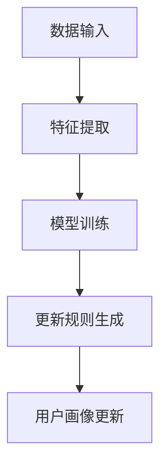
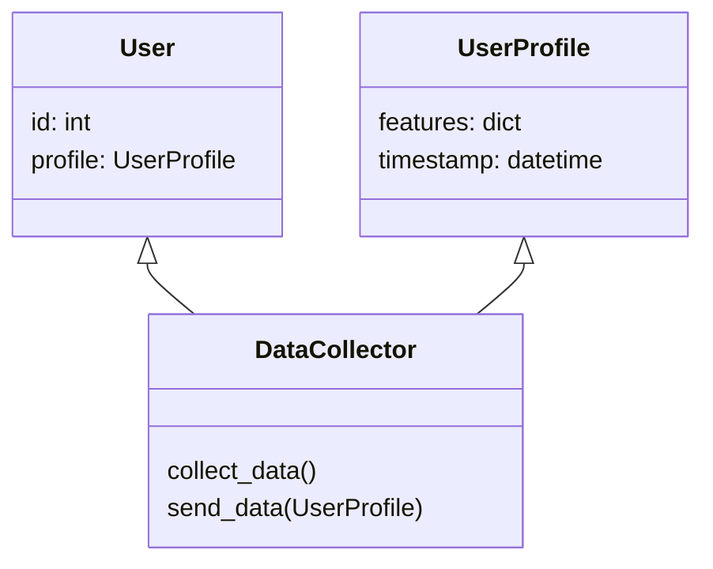
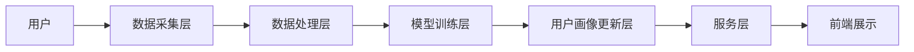
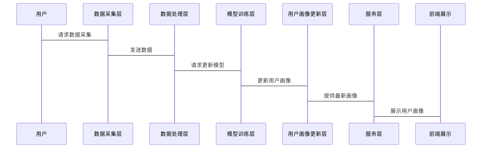

                 


# AI Agent的用户画像动态更新系统

## 关键词：AI Agent, 用户画像, 动态更新, 机器学习, 系统架构, 项目实战

## 摘要：  
本文详细探讨了AI Agent的用户画像动态更新系统的构建与实现。通过分析用户行为数据，利用机器学习算法，结合高效的系统架构设计，提出了一种实时更新用户画像的方法。文章从核心概念、算法原理、系统架构到项目实战，全面解析了该系统的实现过程，并通过案例分析展示了其实际应用价值。

---

# 第1章: AI Agent与用户画像概述

## 1.1 AI Agent的基本概念  
### 1.1.1 AI Agent的定义与特点  
AI Agent（人工智能代理）是一种能够感知环境、自主决策并执行任务的智能体。它具有以下特点：  
- **自主性**：能够在没有人工干预的情况下运行。  
- **反应性**：能够根据环境变化实时调整行为。  
- **学习能力**：通过数据和经验不断优化自身能力。  

### 1.1.2 AI Agent的核心功能与应用场景  
AI Agent的核心功能包括数据采集、行为分析、决策支持和执行反馈。其应用场景广泛，如推荐系统、智能客服、自动驾驶等。  

### 1.1.3 用户画像在AI Agent中的重要性  
用户画像是描述用户特征和行为的模型，是AI Agent实现个性化服务的基础。动态更新用户画像是提升系统实时性和准确性的关键。  

## 1.2 用户画像的动态更新背景  
### 1.2.1 用户行为变化的背景分析  
用户的兴趣、需求和行为会随时间变化，传统的静态用户画像是无法捕捉这些变化的。  

### 1.2.2 动态更新的必要性与挑战  
动态更新能够实时反映用户的最新行为和需求，但面临数据量大、更新频率高、计算资源有限等挑战。  

### 1.2.3 动态更新系统的目标与意义  
动态更新系统的目标是保持用户画像的实时性和准确性，从而提高AI Agent的服务质量。其意义在于提升用户体验和系统智能化水平。  

## 1.3 本章小结  
本章介绍了AI Agent的基本概念、核心功能及其应用场景，并重点分析了用户画像动态更新的背景、必要性和意义。  

---

# 第2章: 用户画像构建的核心概念与方法  

## 2.1 用户画像的构建流程  
### 2.1.1 数据采集与特征提取  
数据采集是构建用户画像的第一步，包括用户行为数据、人口统计数据等。特征提取是对这些数据进行加工，提取有用的信息。  

### 2.1.2 数据预处理与特征工程  
数据预处理包括清洗、去重和标准化。特征工程则是对特征进行筛选、组合和降维，以提高模型性能。  

### 2.1.3 用户画像的建模与分析  
通过机器学习模型（如聚类、分类）对用户特征进行建模，生成初始用户画像。  

## 2.2 动态更新的核心机制  
### 2.2.1 数据流驱动的动态更新原理  
动态更新基于实时数据流，不断更新用户画像。  

### 2.2.2 基于规则的更新策略  
通过预定义的规则（如用户行为阈值）触发更新。  

### 2.2.3 基于模型的自适应更新方法  
利用机器学习模型实时更新用户画像，模型能够自适应地调整更新策略。  

## 2.3 核心概念对比分析  
### 2.3.1 用户画像与传统画像的对比  
传统用户画像是静态的，而动态用户画像是实时更新的。  

### 2.3.2 动态更新与静态更新的差异  
动态更新更注重实时性和准确性，而静态更新更注重稳定性和可解释性。  

### 2.3.3 更新频率与系统性能的关系  
更新频率越高，系统性能消耗越大，但准确性也越高。需要在两者之间找到平衡点。  

## 2.4 本章小结  
本章详细介绍了用户画像的构建流程，并分析了动态更新的核心机制和相关概念。  

---

# 第3章: 用户画像动态更新的算法原理  

## 3.1 动态更新算法的分类与选择  
### 3.1.1 基于机器学习的更新算法  
包括基于协同过滤、矩阵分解等方法。  

### 3.1.2 基于规则的更新算法  
通过预定义规则触发更新，适用于特定场景。  

### 3.1.3 混合型更新算法的特点  
结合机器学习和规则的混合算法，能够兼顾灵活性和准确性。  

## 3.2 基于机器学习的更新算法实现  
### 3.2.1 算法流程图（Mermaid）  


### 3.2.2 数学模型与公式  
用户画像的更新概率公式：  
$$ P(u) = \sum_{i=1}^{n} w_i x_i $$  
其中，$P(u)$ 表示用户画像的概率，$w_i$ 是特征权重，$x_i$ 是特征值。  

### 3.2.3 代码实现示例  
```python
def update_user_profile(data, model):
    features = extract_features(data)
    updated_profile = model.predict(features)
    return updated_profile
```

## 3.3 算法实现的代码示例  
### 3.3.1 数据流驱动的更新流程  
```python
import streamlit as st
from data_stream import DataStream

# 初始化模型
model = UserProfileUpdater()

# 实时更新
while True:
    data = data_stream.receive()
    updated_profile = model.update(data)
    display_profile(updated_profile)
```

## 3.4 本章小结  
本章分析了动态更新算法的分类，并详细讲解了基于机器学习的更新算法及其实现。  

---

# 第4章: 系统架构设计  

## 4.1 系统功能设计  
### 4.1.1 领域模型（Mermaid类图）  


### 4.1.2 系统架构设计（Mermaid架构图）  


### 4.1.3 系统接口设计  
主要接口包括数据采集接口、模型训练接口和用户画像查询接口。  

## 4.2 系统交互设计（Mermaid序列图）  


## 4.3 本章小结  
本章通过类图、架构图和序列图详细描述了系统的架构设计，为后续的实现奠定了基础。  

---

# 第5章: 项目实战  

## 5.1 环境安装与配置  
### 5.1.1 Python环境搭建  
安装Python 3.8及以上版本，安装必要的库（如Pandas、Scikit-learn、Streamlit）。  

### 5.1.2 数据源准备  
准备用户行为数据，清洗并预处理数据。  

## 5.2 核心代码实现  
### 5.2.1 数据采集与处理  
```python
import pandas as pd

def load_data(file_path):
    data = pd.read_csv(file_path)
    return data

def preprocess_data(data):
    # 数据清洗和特征提取
    processed_data = data.dropna().drop_duplicates()
    return processed_data
```

### 5.2.2 模型训练与更新  
```python
from sklearn.neighbors import NearestNeighbors

def train_model(data):
    model = NearestNeighbors(n_neighbors=5)
    model.fit(data)
    return model

def update_model(new_data, model):
    new_data_processed = preprocess_data(new_data)
    model.fit(new_data_processed)
    return model
```

## 5.3 案例分析与结果解读  
### 5.3.1 实际案例分析  
以电商推荐系统为例，展示动态更新用户画面对推荐效果的提升。  

### 5.3.2 结果解读  
通过A/B测试，验证动态更新用户画像对系统性能的提升。  

## 5.4 本章小结  
本章通过实际项目实战，详细讲解了系统的环境搭建、核心代码实现和案例分析。  

---

# 第6章: 系统优化与扩展  

## 6.1 系统性能优化  
### 6.1.1 数据处理效率提升  
优化数据预处理流程，减少数据冗余。  

### 6.1.2 模型训练加速  
使用分布式训练和在线学习算法，提升模型训练效率。  

## 6.2 系统扩展性设计  
### 6.2.1 多数据源支持  
支持多种数据源（如日志、点击流数据）的接入。  

### 6.2.2 分布式架构实现  
通过分布式架构实现高可用性和高扩展性。  

## 6.3 注意事项与最佳实践  
### 6.3.1 数据隐私保护  
确保用户数据的安全性和隐私性。  

### 6.3.2 模型调优与监控  
定期监控模型性能，及时调整参数。  

## 6.4 本章小结  
本章讨论了系统的优化与扩展方法，为系统的长期运行提供了保障。  

---

# 第7章: 总结与展望  

## 7.1 系统总结  
本文详细探讨了AI Agent的用户画像动态更新系统的构建与实现，从核心概念到系统架构，再到项目实战，全面解析了该系统的实现过程。  

## 7.2 未来展望  
未来，随着AI技术的不断发展，动态更新系统将更加智能化和个性化，应用场景也将更加广泛。  

## 7.3 本章小结  
本章总结了全文的主要内容，并展望了未来的发展方向。  

---

# 作者：AI天才研究院 & 禅与计算机程序设计艺术  
本文作者：AI天才研究院（AI Genius Institute）  
地址：https://aigeniusinstitute.com  
邮箱：contact@aigeniusinstitute.com  

---

**注：** 本文版权归作者所有，未经授权不得转载。如需转载请注明出处并保留文章内容的完整性。

