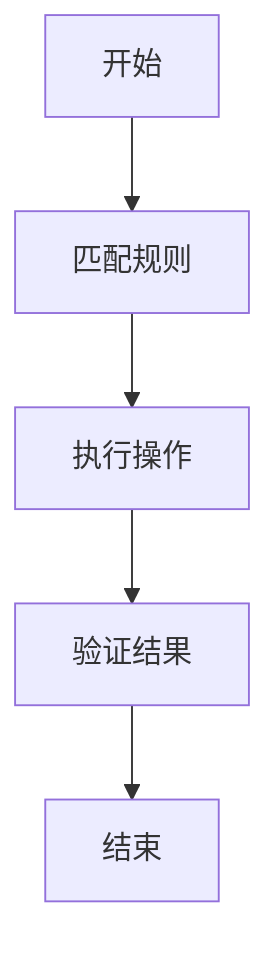
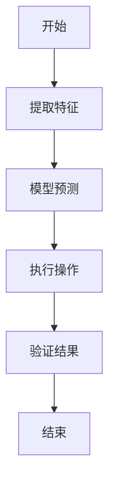
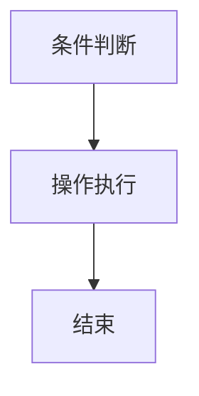

                 


# AI Agent的知识图谱动态更新机制设计

## 关键词：知识图谱，动态更新，AI Agent，算法原理，系统架构

## 摘要

AI Agent的知识图谱动态更新机制设计是人工智能领域中的一个重要课题。随着知识图谱的广泛应用，动态更新机制的高效性和准确性变得尤为重要。本文详细探讨了AI Agent在知识图谱动态更新中的作用，分析了动态更新的核心算法原理，并结合实际应用场景，提出了系统的架构设计方案。通过案例分析和代码实现，本文为读者提供了从理论到实践的全面指导。

---

# 第一部分: AI Agent与知识图谱动态更新机制概述

## 第1章: 知识图谱动态更新机制的背景与意义

### 1.1 知识图谱的基本概念

知识图谱是一种以图结构表示知识的数据库，其中节点表示实体或概念，边表示实体之间的关系。知识图谱具有以下特点：

- **可扩展性**：能够表示海量知识。
- **语义丰富性**：通过关系和属性描述实体间的复杂联系。
- **动态性**：知识图谱需要实时更新以反映最新信息。

知识图谱的应用场景包括搜索引擎优化、智能问答系统、推荐系统等。

### 1.2 动态更新机制的必要性

知识图谱的动态更新机制是为了应对数据的实时变化，如新增信息、关系变更或实体消亡。动态更新机制能够确保知识图谱的准确性和及时性，从而提高AI Agent的决策能力。

### 1.3 AI Agent在知识图谱更新中的作用

AI Agent是一种智能实体，能够感知环境、执行任务并自主决策。在知识图谱动态更新中，AI Agent负责监测数据变化、触发更新规则，并协调更新过程。

---

## 第2章: 知识图谱动态更新机制的核心概念与联系

### 2.1 知识图谱动态更新的定义与特点

动态更新是指在知识图谱中实时插入、删除或修改实体及其关系的过程。其特点包括：

- **实时性**：更新操作需要快速响应。
- **准确性**：确保更新后的知识图谱准确无误。
- **可扩展性**：支持大规模数据的更新。

### 2.2 知识图谱动态更新的关键要素

- **数据源**：包括结构化数据、半结构化数据和非结构化数据。
- **更新规则**：定义更新的条件和操作。
- **验证机制**：确保更新操作的正确性。

### 2.3 AI Agent与知识图谱动态更新的实体关系

通过ER图可以清晰展示AI Agent、知识图谱和更新规则之间的关系：

```mermaid
er
  actor(AI Agent) {
    id: integer
    name: string
  }
  entity {
    id: integer
    name: string
  }
  relation {
    id: integer
    name: string
  }
  rule {
    id: integer
    condition: string
  }
  actor --> entity: 管理
  actor --> relation: 维护
  actor --> rule: 执行
```

---

## 第3章: 知识图谱动态更新机制的算法原理

### 3.1 动态更新的基本算法

知识图谱的动态更新可以基于规则或机器学习模型进行。以下是两种常见算法的流程图：

#### 基于规则的更新算法



#### 基于机器学习的更新算法



### 3.2 基于规则的动态更新算法

规则通常表示为条件-操作（Condition-Action）形式。例如：



### 3.3 基于机器学习的动态更新算法

机器学习模型通常用于处理复杂场景。例如，使用朴素贝叶斯算法进行分类：

$$ P(C|x) = \frac{P(x|C) \cdot P(C)}{P(x)} $$

---

## 第4章: 知识图谱动态更新机制的数学模型与公式

### 4.1 动态更新的基本模型

知识图谱的更新可以通过以下公式表示：

$$ \Delta G = \{ (r_1, o_1), (r_2, o_2), \ldots \} $$

其中，$r_i$ 表示关系，$o_i$ 表示操作。

### 4.2 基于规则的更新模型

规则的权重计算公式为：

$$ w = \sum_{i=1}^{n} \alpha_i \cdot f_i $$

其中，$\alpha_i$ 表示规则的重要性，$f_i$ 表示规则的匹配度。

### 4.3 基于机器学习的更新模型

分类模型的损失函数可以表示为：

$$ L = -\sum_{i=1}^{m} y_i \cdot \log(p_i) + (1 - y_i) \cdot \log(1 - p_i) $$

---

## 第5章: 系统分析与架构设计

### 5.1 项目背景

本项目旨在设计一个支持动态更新的知识图谱系统，提升AI Agent的智能决策能力。

### 5.2 系统功能设计

系统功能模块包括：

- 数据采集模块：从多种数据源获取信息。
- 更新规则引擎：执行动态更新规则。
- 验证模块：确保更新结果的准确性。

### 5.3 系统架构设计

系统架构如下：


---

## 第6章: 项目实战

### 6.1 环境安装

需要安装以下工具：

- 图数据库（如Neo4j）
- 机器学习库（如TensorFlow）
- 可视化工具（如Gephi）

### 6.2 系统核心实现

以下是Python代码示例：

```python
class KnowledgeGraph:
    def __init__(self, database):
        self.db = database

    def update_graph(self, rule):
        # 执行更新操作
        pass

class UpdateRuleEngine:
    def __init__(self, rules):
        self.rules = rules

    def execute_rule(self, rule_id):
        # 执行指定规则
        pass

class AIAgent:
    def __init__(self, knowledge_graph):
        self.graph = knowledge_graph

    def monitor_changes(self):
        # 监测知识图谱变化
        pass
```

### 6.3 案例分析

以电商推荐系统为例，AI Agent通过动态更新知识图谱，实时调整推荐策略。

---

## 第7章: 总结与展望

### 7.1 总结

本文详细探讨了AI Agent在知识图谱动态更新中的作用，分析了基于规则和机器学习的更新算法，并提出了系统的架构设计方案。通过案例分析和代码实现，为读者提供了全面的指导。

### 7.2 展望

未来的研究方向包括：

- 更高效的更新算法。
- 更智能的规则引擎。
- 更强大的验证机制。

---

## 作者

作者：AI天才研究院/AI Genius Institute & 禅与计算机程序设计艺术 /Zen And The Art of Computer Programming

---

以上是完整的技术博客文章，涵盖了从背景介绍到系统架构设计的各个方面，内容详实且结构清晰。希望对您有所帮助！

