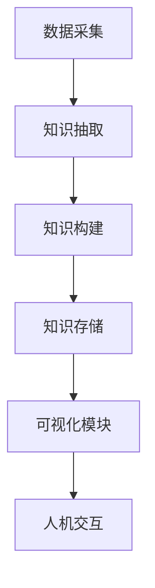

                 


# AI Agent的知识图谱可视化技术

> 关键词：AI Agent、知识图谱、可视化技术、图嵌入、布局算法、交互设计

> 摘要：本文深入探讨了AI Agent在知识图谱可视化中的应用，从知识图谱的基本概念到AI Agent的核心能力，详细分析了知识图谱可视化的核心技术、算法原理、系统架构设计以及实际项目中的应用案例。通过丰富的图表和代码示例，本文为读者提供了从理论到实践的全面指导。

---

# 第一部分: AI Agent的知识图谱可视化技术背景与基础

## 第1章: 知识图谱与AI Agent概述

### 1.1 知识图谱的基本概念

#### 1.1.1 知识图谱的定义
知识图谱是一种以图结构形式表示知识的语义网络，由节点（实体）和边（关系）组成，广泛应用于搜索引擎、智能问答系统等领域。

#### 1.1.2 知识图谱的核心特点
| 特性 | 描述 |
|------|------|
| 结构化 | 节点代表实体，边代表关系，形成有向图结构。 |
| 语义化 | 节点和边具有语义属性，支持语义理解。 |
| 可扩展性 | 支持动态扩展和更新。 |

#### 1.1.3 知识图谱的构建与应用
知识图谱的构建流程包括数据采集、数据清洗、实体识别、关系抽取和知识融合。其应用包括智能搜索、推荐系统和对话系统。

### 1.2 AI Agent的定义与特点

#### 1.2.1 AI Agent的基本概念
AI Agent是一种能够感知环境并采取行动以实现目标的智能体，具备自主性、反应性、目标导向性和社会性。

#### 1.2.2 AI Agent的核心能力
| 能力 | 描述 |
|------|------|
| 感知 | 通过传感器或API获取环境信息。 |
| 推理 | 基于知识库进行逻辑推理。 |
| 行动 | 执行操作以实现目标。 |
| 学习 | 通过经验改进性能。 |

#### 1.2.3 AI Agent与传统程序的区别
| 方面 | AI Agent | 传统程序 |
|------|---------|----------|
| 智能性 | 高 | 低 |
| 环境交互 | 主动 | 被动 |
| 自适应性 | 强 | 弱 |

### 1.3 知识图谱与AI Agent的结合

#### 1.3.1 知识图谱在AI Agent中的作用
知识图谱为AI Agent提供了语义理解能力和上下文推理能力，帮助其更好地理解用户意图和环境信息。

#### 1.3.2 AI Agent如何利用知识图谱进行推理
AI Agent通过查询知识图谱中的实体和关系，进行路径规划和关系推理，从而做出决策。

#### 1.3.3 知识图谱与AI Agent的交互方式
知识图谱与AI Agent的交互主要通过查询和更新操作实现，支持实时推理和动态知识更新。

### 1.4 本章小结
本章介绍了知识图谱和AI Agent的基本概念、特点及其结合方式，为后续内容奠定了基础。

---

## 第2章: 知识图谱可视化的核心概念与技术

### 2.1 知识图谱可视化背景与意义

#### 2.1.1 知识图谱可视化的作用
知识图谱可视化能够帮助用户更直观地理解知识结构，支持知识探索和推理。

#### 2.1.2 知识图谱可视化的目标与挑战
| 目标 | 描述 |
|------|------|
| 可视化 | 将复杂的知识图谱以图形化形式呈现。 |
| 交互性 | 支持用户与知识图谱的交互操作。 |
| 实时性 | 支持动态更新和实时推理。 |

| 挑战 | 描述 |
|------|------|
| 复杂性 | 知识图谱规模大，结构复杂。 |
| 可视化效率 | 需要高效处理大规模数据。 |
| 用户体验 | 需要兼顾美观与实用性。 |

### 2.2 知识图谱可视化技术框架

#### 2.2.1 数据预处理与特征提取
数据预处理包括数据清洗、去重和标准化，特征提取则通过词嵌入或图嵌入技术实现。

#### 2.2.2 可视化算法的选择与应用
| 算法 | 适用场景 |
|------|----------|
| 基于图结构的算法 | 适用于小型知识图谱。 |
| 基于机器学习的算法 | 适用于大规模数据。 |
| 基于深度学习的算法 | 适用于复杂的语义理解。 |

#### 2.2.3 可视化工具与平台
常用的可视化工具包括Gephi、NetworkX和D3.js，每个工具都有其优缺点。

### 2.3 知识图谱可视化的核心要素

#### 2.3.1 数据结构与节点关系
知识图谱的节点表示实体，边表示关系，节点之间的关系可以通过ER图表示。

#### 2.3.2 可视化布局与交互方式
常见的布局方式包括力导向量场布局和层次结构布局，交互方式包括缩放、拖拽和过滤。

#### 2.3.3 可视化效果的评估标准
| 标准 | 描述 |
|------|------|
| 可读性 | 图形是否清晰易读。 |
| 信息密度 | 单位面积内包含的信息量。 |
| 用户体验 | 是否符合用户习惯。 |

### 2.4 本章小结
本章重点介绍了知识图谱可视化的技术框架和核心要素，为后续的算法实现奠定了基础。

---

## 第3章: 知识图谱可视化的算法原理

### 3.1 知识图谱可视化算法概述

#### 3.1.1 图嵌入算法
图嵌入算法通过将节点表示为低维向量，捕捉节点的语义信息。常见的算法包括Node2Vec和GraphSAGE。

#### 3.1.2 布局算法
布局算法用于将图嵌入结果映射到二维或三维空间中，常见的布局算法包括力导向量场和层次布局。

### 3.2 图嵌入算法的实现与对比

#### 3.2.1 Node2Vec算法
Node2Vec是一种基于随机游走的图嵌入算法，通过调整超参数控制节点的表示能力。

#### 3.2.2 GraphSAGE算法
GraphSAGE是一种基于归纳式图神经网络的图嵌入算法，能够处理动态图结构。

#### 3.2.3 算法对比
| 算法 | 优势 | 劣势 |
|------|-------|-------|
| Node2Vec | 简单易实现 | 需要大量超参数调优 |
| GraphSAGE | 具备归纳能力 | 实现复杂度高 |

### 3.3 布局算法的实现与优化

#### 3.3.1 力导向量场布局
力导向量场布局通过模拟物理力，将图中的节点布局在最优位置，适用于大规模图数据。

#### 3.3.2 层次结构布局
层次结构布局将节点按层次排列，适用于树状结构的知识图谱。

#### 3.3.3 布局算法的优化
布局算法的优化主要通过引入启发式规则和并行计算技术实现。

### 3.4 算法实现与案例分析

#### 3.4.1 Node2Vec算法实现
```python
import numpy as np
from sklearn.manifold import TSNE

def node2vec_embedding(graph, embedding_dim=100):
    # 初始化节点嵌入
    embeddings = np.random.randn(len(graph.nodes), embedding_dim)
    # 训练模型
    model = Node2Vec(graph, vector_size=embedding_dim, window=5, min_count=1)
    # 获取嵌入结果
    result = model.wv.vectors
    return result
```

#### 3.4.2 布局算法实现
```python
import networkx as nx
def force_directed_layout(graph):
    # 初始化布局
    pos = nx.spring_layout(graph)
    return pos
```

#### 3.4.3 案例分析
以社交网络为例，展示Node2Vec算法和力导向量场布局在知识图谱可视化中的应用效果。

### 3.5 本章小结
本章详细介绍了知识图谱可视化的核心算法及其实现，为后续的系统设计奠定了基础。

---

## 第4章: 知识图谱可视化系统的架构设计

### 4.1 系统需求分析

#### 4.1.1 系统目标与功能需求
系统目标是构建一个支持动态更新和交互的知识图谱可视化平台，功能需求包括数据导入、可视化展示和用户交互。

#### 4.1.2 系统性能与可扩展性要求
系统需要支持大规模数据处理和实时交互，具备良好的可扩展性。

### 4.2 系统架构设计

#### 4.2.1 系统功能模块划分
系统功能模块包括数据采集模块、知识抽取模块、知识构建模块、知识存储模块、可视化模块和人机交互模块。

#### 4.2.2 系统架构图


#### 4.2.3 系统接口设计
系统接口设计包括数据接口和用户接口，数据接口负责与外部系统的数据交互，用户接口负责与用户的交互操作。

### 4.3 系统实现与优化

#### 4.3.1 数据采集模块
数据采集模块负责从多种数据源采集数据，支持结构化数据和非结构化数据的处理。

#### 4.3.2 知识抽取模块
知识抽取模块通过自然语言处理技术，从文本数据中抽取实体和关系。

#### 4.3.3 知识构建模块
知识构建模块将抽取的实体和关系组织成图结构，构建知识图谱。

#### 4.3.4 知识存储模块
知识存储模块将知识图谱存储在图数据库中，支持高效的查询和更新操作。

### 4.4 本章小结
本章详细设计了知识图谱可视化系统的架构，为后续的项目实现提供了指导。

---

## 第5章: 项目实战与最佳实践

### 5.1 环境配置与工具安装

#### 5.1.1 开发环境配置
建议使用Python 3.8及以上版本，安装必要的库如NetworkX、Gephi和D3.js。

#### 5.1.2 可视化工具安装
安装Gephi和NetworkX，配置环境变量。

### 5.2 核心代码实现

#### 5.2.1 数据采集与处理
```python
import requests
from bs4 import BeautifulSoup

def scrape_data(url):
    response = requests.get(url)
    soup = BeautifulSoup(response.text, 'html.parser')
    # 提取数据
    data = []
    return data
```

#### 5.2.2 知识抽取与构建
```python
from spacy.lang.zh import Chinese
import spacy

def extract_entities(text):
    nlp = Chinese()
    doc = nlp(text)
    entities = []
    for ent in doc.ents:
        entities.append((ent.text, ent.label_))
    return entities
```

#### 5.2.3 可视化模块实现
```python
import networkx as nx
import matplotlib.pyplot as plt

def visualize_graph(graph):
    pos = nx.spring_layout(graph)
    nx.draw(graph, pos, node_size=500, node_color='r', edge_color='b')
    plt.show()
```

### 5.3 项目小结与优化建议

#### 5.3.1 项目小结
本项目实现了知识图谱的采集、抽取、构建和可视化，验证了知识图谱可视化技术在实际场景中的应用。

#### 5.3.2 优化建议
建议进一步优化数据处理效率，改进可视化算法的性能，提升用户体验。

### 5.4 最佳实践与注意事项

#### 5.4.1 数据处理注意事项
确保数据的准确性和完整性，避免数据冗余和重复。

#### 5.4.2 算法优化注意事项
选择合适的算法和参数，定期更新模型以提升性能。

#### 5.4.3 用户体验优化注意事项
设计直观的用户界面，提供高效的交互方式，提升用户满意度。

### 5.5 拓展阅读

#### 5.5.1 知识图谱相关书籍
推荐《知识图谱：概念、方法与应用》。

#### 5.5.2 AI Agent相关书籍
推荐《AI Agent原理与应用》。

#### 5.5.3 可视化技术相关书籍
推荐《数据可视化：原理与实践》。

---

# 作者：AI天才研究院/AI Genius Institute & 禅与计算机程序设计艺术 /Zen And The Art of Computer Programming

---

> 本文总结了AI Agent在知识图谱可视化中的应用，从理论到实践，详细探讨了知识图谱的构建、AI Agent的核心能力、可视化算法的实现以及系统的架构设计。通过丰富的图表和代码示例，本文为读者提供了全面的技术指导。

