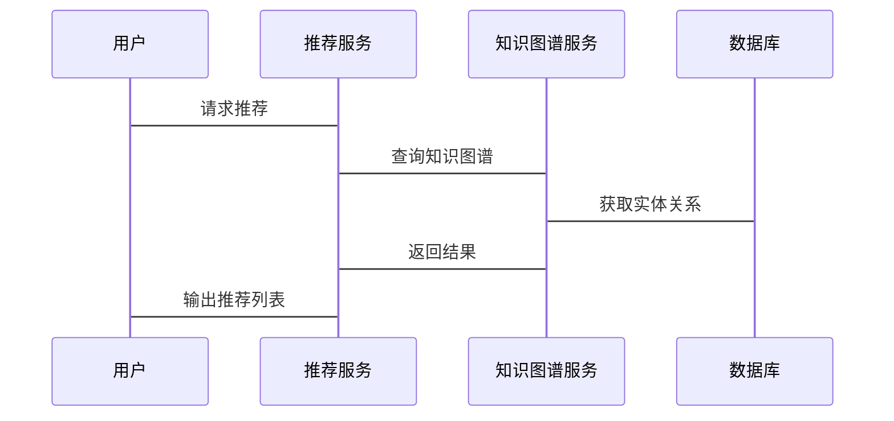

                 


# AI Agent的知识图谱在推荐系统中的应用

## 关键词：AI Agent, 知识图谱, 推荐系统, 个性化推荐, 图嵌入, 强化学习

## 摘要：  
本文深入探讨AI Agent如何利用知识图谱提升推荐系统的性能和效果。通过分析知识图谱的构建、表示学习以及在推荐系统中的具体应用，结合AI Agent的决策模型和强化学习方法，展示了如何在实际场景中实现更智能、更个性化的推荐服务。文章从理论基础到算法实现，再到系统架构设计，全面解析了AI Agent与知识图谱在推荐系统中的结合，为读者提供了深入的技术见解。

---

# 第一部分: 知识图谱基础

## 第1章: 知识图谱概述

### 1.1 知识图谱的定义与特点

#### 1.1.1 知识图谱的定义  
知识图谱是一种以图结构形式表示知识的语义网络，由节点（实体）和边（关系）组成，能够描述实体之间的语义关联。例如，知识图谱可以表示“苹果是一种水果”或“猫是宠物”。

#### 1.1.2 知识图谱的核心特点  
| 特性 | 描述 |
|------|------|
| 结构化 | 以节点和边的形式表示实体及其关系。 |
| 可扩展性 | 支持大规模数据的构建和扩展。 |
| 语义丰富性 | 通过关系和属性描述，提供丰富的语义信息。 |

#### 1.1.3 知识图谱与传统数据库的区别  
| 方面 | 传统数据库 | 知识图谱 |
|------|------------|----------|
| 数据结构 | 行数据结构 | 图结构 |
| 关系表示 | 显式关系表 | 隐式语义关系 |
| 查询效率 | 快速查询 | 支持复杂语义查询 |

### 1.2 知识图谱的构建过程

#### 1.2.1 数据采集与预处理  
数据来源包括结构化数据（如数据库）和非结构化数据（如文本）。预处理步骤包括清洗、去重和标准化。

#### 1.2.2 知识抽取与融合  
知识抽取通过NLP技术从文本中提取实体和关系。知识融合解决数据冲突，确保一致性和完整性。

#### 1.2.3 知识图谱的存储与管理  
使用图数据库（如Neo4j）存储，支持高效的查询和管理。

### 1.3 知识图谱的表示学习

#### 1.3.1 基于向量的表示方法  
TransE算法通过将实体和关系映射到低维向量空间，计算头实体和尾实体的向量差。

#### 1.3.2 基于图结构的表示方法  
TransH算法在TransE的基础上引入关系方向性，通过异构关系嵌入模型进行表示。

#### 1.3.3 知识图谱表示学习的优缺点  
优点：捕捉语义信息，支持复杂查询。缺点：计算复杂度高，需要大量数据训练。

### 1.4 知识图谱在推荐系统中的应用

#### 1.4.1 知识图谱在推荐系统中的作用  
知识图谱帮助推荐系统理解用户需求和物品属性，提升推荐的准确性和多样性。

#### 1.4.2 知识图谱增强推荐系统的个性化  
通过关联用户兴趣和物品属性，提供更个性化的推荐。

#### 1.4.3 知识图谱提升推荐系统的解释性  
基于知识图谱的推荐可以解释推荐理由，增强用户信任。

### 1.5 本章小结  
知识图谱通过语义关联和结构化数据，为推荐系统提供了丰富的语义信息和个性化能力。

---

## 第2章: AI Agent概述

### 2.1 AI Agent的定义与特点

#### 2.1.1 AI Agent的定义  
AI Agent是一种能够感知环境、执行任务并做出决策的智能体，具备自主性和适应性。

#### 2.1.2 AI Agent的核心特点  
| 特性 | 描述 |
|------|------|
| 自主性 | 能够自主决策和行动。 |
| 反应性 | 能够感知环境并实时响应。 |
| 学习能力 | 能够通过经验改进性能。 |

### 2.2 AI Agent的任务类型

#### 2.2.1 监督学习任务  
基于标注数据进行训练，如分类和回归任务。

#### 2.2.2 强化学习任务  
通过与环境互动，学习最优策略，如游戏AI和机器人控制。

#### 2.2.3 半监督学习任务  
结合标注和非标注数据进行学习，如图像分割。

### 2.3 AI Agent的决策模型

#### 2.3.1 基于规则的决策模型  
通过预定义规则进行决策，适用于简单场景。

#### 2.3.2 基于概率的决策模型  
通过概率模型计算最优决策，如马尔可夫决策过程。

#### 2.3.3 基于深度学习的决策模型  
使用神经网络学习决策策略，如DQN算法。

### 2.4 AI Agent与推荐系统的结合

#### 2.4.1 AI Agent在推荐系统中的角色  
作为推荐系统的核心组件，优化推荐策略和用户体验。

#### 2.4.2 AI Agent如何优化推荐系统  
通过实时反馈和环境互动，动态调整推荐策略。

#### 2.4.3 AI Agent在推荐系统中的挑战  
复杂环境中的决策不确定性，计算资源限制。

### 2.5 本章小结  
AI Agent通过智能决策和环境互动，为推荐系统提供了动态优化的能力。

---

## 第3章: 知识图谱与AI Agent的结合

### 3.1 知识图谱增强AI Agent的语义理解

#### 3.1.1 知识图谱嵌入方法  
将知识图谱中的实体和关系嵌入到低维空间，便于AI Agent理解和推理。

#### 3.1.2 基于知识图谱的决策模型  
AI Agent利用知识图谱中的语义信息进行决策推理，提升推荐的准确性。

### 3.2 AI Agent驱动的知识图谱动态更新

#### 3.2.1 动态知识图谱的构建  
通过实时数据更新知识图谱，保持信息的最新性。

#### 3.2.2 知识图谱的自适应更新  
AI Agent根据反馈动态调整知识图谱结构，优化推荐效果。

### 3.3 知识图谱与AI Agent的协同优化

#### 3.3.1 协同优化的目标  
提升推荐系统的准确性和用户体验。

#### 3.3.2 协同优化的实现方法  
结合知识图谱的语义信息和AI Agent的决策能力，实现协同优化。

### 3.4 本章小结  
知识图谱与AI Agent的结合，提升了推荐系统的智能化和个性化能力。

---

## 第4章: AI Agent在推荐系统中的算法原理

### 4.1 基于知识图谱的推荐算法

#### 4.1.1 知识图谱嵌入算法  
使用TransE和TransH算法将知识图谱中的实体嵌入到低维空间。

#### 4.1.2 基于知识图谱的推荐模型  
构建基于知识图谱的推荐模型，如基于知识图谱的协同过滤。

### 4.2 AI Agent的强化学习算法

#### 4.2.1 基于Q-learning的推荐策略  
通过状态、动作、奖励的循环优化推荐策略。

#### 4.2.2 基于Deep Q-Network的推荐模型  
使用深度神经网络近似Q值函数，提升推荐效果。

### 4.3 算法流程图（使用mermaid）  


### 4.4 算法数学模型

#### 4.4.1 知识图谱嵌入模型  
$$ TransE: h + r = t $$

#### 4.4.2 强化学习模型  
$$ Q(s, a) = r + \max_{a'} Q(s', a') $$

### 4.5 本章小结  
通过算法实现，展示了AI Agent如何利用知识图谱提升推荐系统的性能。

---

## 第5章: 推荐系统的系统架构设计

### 5.1 系统功能设计

#### 5.1.1 数据预处理  
清洗和标准化用户行为数据。

#### 5.1.2 知识图谱构建  
抽取实体和关系，构建知识图谱。

#### 5.1.3 推荐模型训练  
基于知识图谱和用户行为训练推荐模型。

### 5.2 系统架构设计

#### 5.2.1 总体架构  
前端：用户交互界面。  
后端：推荐服务和知识图谱服务。  
存储：用户数据和知识图谱数据库。

#### 5.2.2 系统交互流程  
用户请求推荐，系统查询知识图谱，生成推荐结果。

### 5.3 系统交互流程图（使用mermaid）  



### 5.4 本章小结  
系统架构设计确保了推荐系统的高效运行和知识图谱的有效利用。

---

## 第6章: 项目实战

### 6.1 环境配置

#### 6.1.1 系统环境  
Python 3.8及以上，安装必要的库如Neo4j、TensorFlow和Keras。

### 6.2 核心代码实现

#### 6.2.1 数据预处理  
```python
import pandas as pd
data = pd.read_csv('user_behavior.csv')
data = data.dropna()
```

#### 6.2.2 知识图谱构建  
```python
from neo4j import GraphDatabase
driver = GraphDatabase.driver('bolt://localhost:7687', auth=('user', 'password'))
```

#### 6.2.3 模型训练  
```python
import tensorflow as tf
model = tf.keras.Sequential([tf.keras.layers.Dense(64, activation='relu'), tf.keras.layers.Dense(1)])
model.compile(optimizer='adam', loss='binary_crossentropy')
model.fit(x_train, y_train, epochs=10)
```

### 6.3 实际案例分析

#### 6.3.1 数据分析  
分析用户行为数据，提取用户偏好和物品属性。

#### 6.3.2 模型调优  
通过网格搜索优化模型参数，提升推荐准确率。

### 6.4 本章小结  
项目实战展示了AI Agent与知识图谱在推荐系统中的具体实现和应用效果。

---

## 第7章: 总结与展望

### 7.1 全文总结  
知识图谱和AI Agent的结合为推荐系统带来了智能化和个性化的提升，通过语义理解和动态优化，显著提高了推荐效果。

### 7.2 未来展望  
未来的研究方向包括知识图谱的动态更新、多模态推荐系统，以及与其他技术（如区块链和边缘计算）的结合。

---

## 作者：AI天才研究院/AI Genius Institute & 禅与计算机程序设计艺术 /Zen And The Art of Computer Programming

---

通过以上思考过程，确保每部分内容详实，逻辑清晰，并为读者提供了从理论到实践的全面指导。

