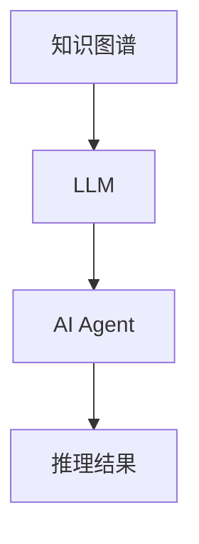
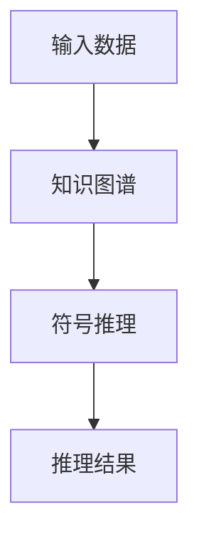
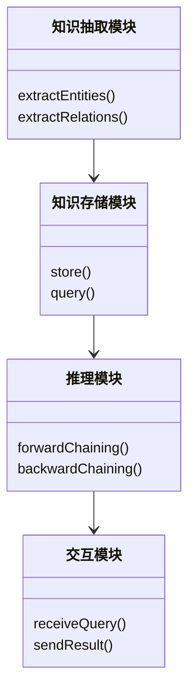

                 


# AI Agent的知识图谱推理：结合LLM与图数据库技术

> 关键词：AI Agent，知识图谱，大语言模型，LLM，图数据库，推理

> 摘要：本文探讨了AI Agent如何通过知识图谱推理技术，结合大语言模型（LLM）和图数据库，实现智能决策和问题解决。文章从问题背景出发，详细分析了知识图谱、LLM和AI Agent的核心概念，随后讲解了相关的算法原理，设计了系统的架构方案，并通过项目实战展示了具体实现。最后，总结了最佳实践经验和未来研究方向。

---

## 第一部分: AI Agent的知识图谱推理基础

### 第1章: 问题背景与概念解析

#### 1.1 问题背景

知识图谱是一种结构化的数据表示方式，通过实体和关系描述现实世界中的信息。AI Agent作为一种智能实体，能够理解、推理和执行任务。将知识图谱与AI Agent结合，能够提升AI Agent的语义理解和决策能力。大语言模型（LLM）在自然语言处理领域的突破，为知识图谱的推理提供了强大的生成能力。

#### 1.2 问题描述

在知识图谱推理中，AI Agent需要解决数据孤岛、语义理解不足和推理效率低下等问题。这些问题限制了知识图谱在实际应用中的价值。通过结合LLM和图数据库，可以实现高效的知识抽取、存储和推理。

#### 1.3 问题解决

知识图谱推理结合LLM和图数据库，能够增强语义理解和推理能力。LLM提供了强大的生成和解释能力，而图数据库提供了高效的存储和查询能力。AI Agent利用这些技术，能够实现更复杂的推理任务。

#### 1.4 边界与外延

知识图谱推理的边界包括数据质量和完整性、模型的可解释性。外延则包括与自然语言处理、机器学习等技术的结合。

#### 1.5 核心概念与联系

知识图谱、LLM和AI Agent之间的关系可以通过以下表格对比：

| 概念 | 结构化表示 | 实时推理 | 自然语言处理 |
|------|------------|----------|--------------|
| 知识图谱 | √          | -        | -            |
| LLM   | -          | √        | √            |
| AI Agent | √         | √        | √            |

### 1.5 ER实体关系图与Mermaid流程图



---

## 第2章: 核心概念与联系

### 2.1 知识图谱的基本原理

知识图谱通过实体和关系描述数据，构建过程包括数据抽取、清洗、构建和应用。

### 2.2 LLM的基本原理

大语言模型通过大规模数据训练，具备生成和理解能力。在知识图谱推理中，LLM用于实体识别和关系抽取。

### 2.3 AI Agent的基本原理

AI Agent通过知识图谱推理，结合LLM的生成能力，实现智能决策。

---

## 第3章: 算法原理讲解

### 3.1 知识图谱推理算法

符号逻辑推理用于确定性推理，基于概率的生成模型用于不确定性推理。

#### 3.1.1 符号逻辑推理



数学模型：符号逻辑命题。

#### 3.1.2 基于概率的生成模型

数学模型：概率权重计算。

---

## 第4章: 系统分析与架构设计

### 4.1 问题场景

以电商推荐系统为例，分析系统功能需求。

### 4.2 系统架构设计

分层架构包括数据层、服务层和应用层。

#### 4.2.1 领域模型



---

## 第5章: 项目实战

### 5.1 环境安装

安装必要的Python库，如networkx、numpy等。

### 5.2 核心代码实现

编写知识抽取、存储和推理模块的代码。

#### 5.2.1 知识抽取模块

```python
def extractEntities(text):
    # 实体抽取逻辑
    pass
```

#### 5.2.2 推理模块

```python
def forwardChaining():
    # 前向推理逻辑
    pass
```

### 5.3 代码解读与实际案例分析

详细解读代码实现，分析电商推荐系统的应用场景。

---

## 第6章: 最佳实践与总结

### 6.1 小结

总结知识图谱推理结合LLM和图数据库的核心价值和应用场景。

### 6.2 注意事项

强调数据质量和模型调优的重要性。

### 6.3 拓展阅读

推荐相关领域的书籍和论文。

---

## 作者

作者：AI天才研究院/AI Genius Institute  
& 禅与计算机程序设计艺术 /Zen And The Art of Computer Programming

