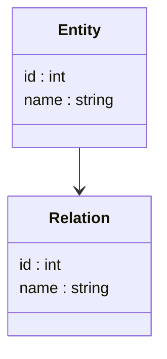
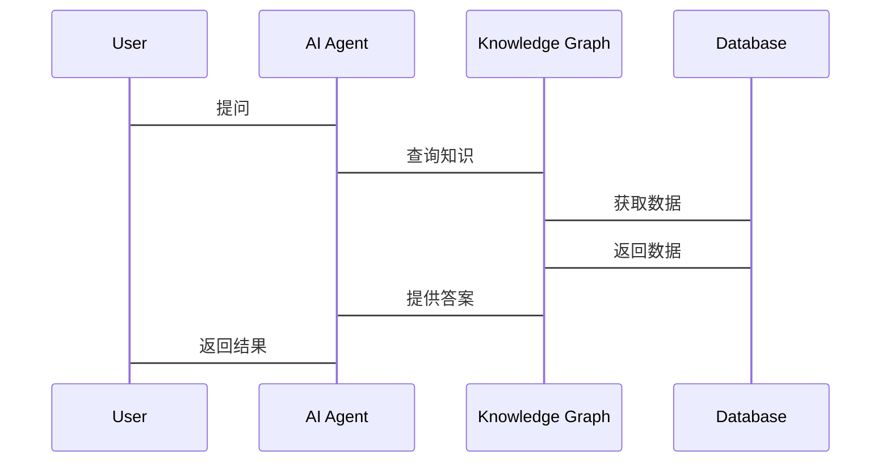

                 


# AI Agent的知识图谱构建与应用

> 关键词：AI Agent, 知识图谱, 知识构建, 语义理解, 应用实践

> 摘要：本文详细探讨了AI Agent的知识图谱构建与应用场景，从知识图谱的基本概念到AI Agent的核心原理，从算法实现到系统架构设计，从项目实战到最佳实践，全面解析AI Agent如何利用知识图谱实现智能推理与决策。

---

# 第一部分: AI Agent与知识图谱的背景介绍

# 第1章: AI Agent与知识图谱概述

## 1.1 知识图谱的定义与背景
### 1.1.1 知识图谱的定义
知识图谱是一种以图结构形式表示知识的语义网络，由实体（概念）和关系（属性）构成。知识图谱通过将分散的数据连接起来，形成一个可计算的、结构化的知识库。

### 1.1.2 知识图谱的构建背景
随着大数据和人工智能技术的快速发展，知识图谱作为连接数据与智能应用的桥梁，广泛应用于搜索引擎优化、语义理解、智能问答等领域。其构建背景主要来源于数据碎片化、语义鸿沟和知识表示的需求。

### 1.1.3 知识图谱的应用场景
知识图谱在多个领域有广泛应用，如自然语言处理、推荐系统、智能客服等。例如，在智能问答系统中，知识图谱可以提供语义理解和上下文关联。

## 1.2 AI Agent的基本概念
### 1.2.1 AI Agent的定义
AI Agent（智能体）是指能够感知环境并采取行动以实现目标的智能实体。它可以是一个软件程序或物理设备，通过与环境交互来完成特定任务。

### 1.2.2 AI Agent的核心特点
- **自主性**：能够在没有外部干预的情况下运行。
- **反应性**：能够实时感知环境并做出反应。
- **目标导向**：基于目标驱动行为。
- **学习能力**：能够通过经验改进性能。

### 1.2.3 AI Agent与传统AI的区别
传统AI注重规则和逻辑推理，而AI Agent更注重与环境的交互和动态适应能力。AI Agent更像一个“活”的实体，能够主动采取行动。

## 1.3 知识图谱与AI Agent的关系
### 1.3.1 知识图谱在AI Agent中的作用
知识图谱为AI Agent提供了语义理解能力，帮助其更好地理解用户需求和环境信息。

### 1.3.2 AI Agent对知识图谱的依赖
AI Agent依赖知识图谱来实现智能推理和决策，尤其是复杂场景下的多步推理。

### 1.3.3 知识图谱与AI Agent的结合方式
知识图谱为AI Agent提供知识基础，AI Agent利用知识图谱进行推理和决策，两者相辅相成。

## 1.4 本章小结
本章介绍了知识图谱和AI Agent的基本概念，分析了它们之间的关系和应用场景，为后续内容奠定了基础。

---

# 第二部分: 知识图谱构建的核心概念与联系

# 第2章: 知识图谱的核心概念与属性

## 2.1 知识图谱的构建原理
### 2.1.1 知识抽取与表示
知识抽取是从文本中提取实体、关系和属性的过程，表示则通过图结构将这些信息组织起来。

### 2.1.2 知识融合与关联
知识融合将多个来源的知识整合到一个图中，关联则建立实体之间的关系。

### 2.1.3 知识存储与管理
知识图谱通常存储在图数据库中，如Neo4j，并通过RDF或JSON-LD等格式进行管理。

## 2.2 知识图谱的属性特征对比
| 属性 | 实体 | 关系 |
|------|------|------|
| 类型 | 概念或具体事物 | 联系或动作 |
| 表示 | 名词形式 | 动词或形容词形式 |
| 示例 | "人"、"书籍" | "是"、"属于" |

## 2.3 知识图谱的ER实体关系图
```mermaid
erDiagram
    actor Entity {
        id : int
        name : string
    }
    actor Relation {
        id : int
        name : string
    }
    Entity o-|{many}| Relation
```

## 2.4 本章小结
本章详细介绍了知识图谱的核心概念和属性，通过对比和图表帮助读者更好地理解知识图谱的结构。

---

# 第三部分: AI Agent的知识图谱构建算法原理

# 第3章: 知识图谱构建算法原理

## 3.1 知识抽取算法
### 3.1.1 基于规则的抽取算法
通过预定义的规则从文本中提取特定模式的信息。

### 3.1.2 基于统计的抽取算法
利用统计学方法，如条件概率，从文本中提取实体和关系。

### 3.1.3 基于深度学习的抽取算法
使用神经网络模型（如BERT）进行端到端的知识抽取。

## 3.2 知识关联算法
### 3.2.1 基于相似度的关联算法
通过计算实体之间的相似度来建立关联。

### 3.2.2 基于路径的关联算法
通过图结构中的路径长度来确定实体之间的关系。

### 3.2.3 基于图嵌入的关联算法
将实体和关系嵌入到向量空间中，通过向量相似度进行关联。

## 3.3 知识图谱构建的数学模型
### 3.3.1 知识图谱的表示模型
知识图谱可以用三元组（头实体，关系，尾实体）表示。

### 3.3.2 图嵌入模型
使用图嵌入算法（如TransE）将图中的节点嵌入到低维向量空间中。

## 3.4 本章小结
本章详细介绍了知识图谱构建的算法原理，从基于规则到基于深度学习的方法，再到图嵌入技术，为后续的系统设计和实现提供了理论基础。

---

# 第四部分: 系统分析与架构设计

# 第4章: 知识图谱构建与AI Agent的系统架构

## 4.1 问题场景介绍
设计一个AI Agent系统，利用知识图谱实现智能问答和推荐功能。

## 4.2 系统功能设计
### 4.2.1 领域模型设计


### 4.2.2 系统架构设计


## 4.3 系统接口设计
- **输入接口**：接收用户查询。
- **输出接口**：返回智能问答结果。

## 4.4 系统交互设计


## 4.5 本章小结
本章通过系统设计和架构图，详细描述了AI Agent与知识图谱结合的实现方案，为后续的代码实现奠定了基础。

---

# 第五部分: 项目实战与最佳实践

# 第5章: 知识图谱构建与AI Agent的项目实战

## 5.1 环境安装
- **Python**：安装Python 3.8及以上版本。
- **依赖库**：安装`networkx`、`numpy`、`spacy`等。

## 5.2 核心代码实现
### 5.2.1 知识抽取代码
```python
import spacy

nlp = spacy.load("en_core_web_sm")
doc = nlp("Apple is a technology company.")
for token in doc:
    print(token.text, token.pos_)
```

### 5.2.2 知识关联代码
```python
from networkx import Graph

g = Graph()
g.add_nodes_from(["Apple", "technology", "company"])
g.add_edges_from([("Apple", "technology"), ("Apple", "company")])
print(g.nodes())
```

## 5.3 案例分析
通过构建一个简单的知识图谱，实现一个AI Agent的问答系统。

## 5.4 项目小结
本章通过实际项目，展示了知识图谱构建与AI Agent结合的实现过程，帮助读者更好地理解理论与实践的结合。

---

# 第六部分: 最佳实践与总结

# 第6章: 知识图谱构建与AI Agent的最佳实践

## 6.1 最佳实践
- **工具选择**：根据需求选择合适的知识图谱构建工具。
- **性能优化**：通过索引和压缩技术优化知识图谱的存储和查询性能。
- **安全考虑**：确保知识图谱中的数据安全和隐私保护。

## 6.2 小结
本文从理论到实践，全面介绍了AI Agent的知识图谱构建与应用，为读者提供了系统的知识体系和实践指导。

## 6.3 注意事项
- 知识图谱的构建需要结合具体场景和需求。
- AI Agent的设计需要考虑系统的可扩展性和可维护性。

## 6.4 拓展阅读
推荐阅读《知识图谱实战》和《AI Agent设计与实现》等书籍。

---

# 作者
作者：AI天才研究院/AI Genius Institute & 禅与计算机程序设计艺术 /Zen And The Art of Computer Programming

