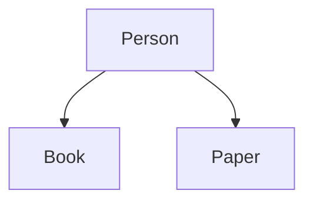
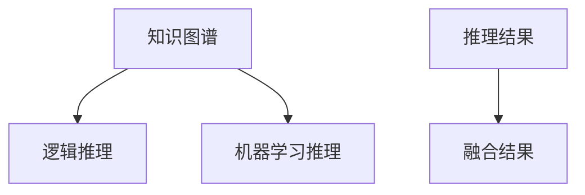
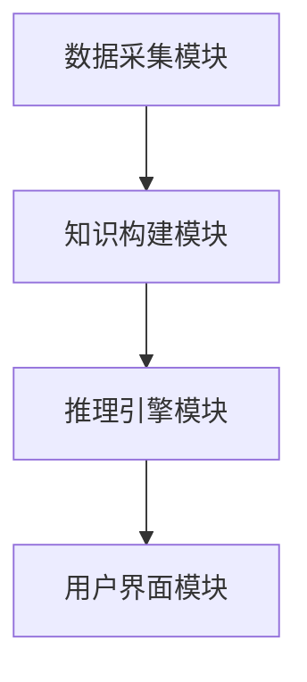

                 


---

# AI Agent的知识图谱构建与推理机制

> 关键词：AI Agent、知识图谱、推理机制、知识构建、逻辑推理、机器学习推理

> 摘要：本文系统阐述了AI Agent的知识图谱构建与推理机制的实现方法。从知识图谱的构建背景、核心概念、构建方法、推理机制的原理、系统架构设计、项目实战到未来研究方向进行了全面而深入的分析。通过丰富的案例和代码实现，详细讲解了基于知识图谱的推理机制的设计与实现，为读者提供了从理论到实践的完整指导。

---

# 第1章 AI Agent、知识图谱与推理机制概述

## 1.1 AI Agent的基本概念

### 1.1.1 AI Agent的定义与分类

**AI Agent**（人工智能代理）是指在计算机系统中，能够感知环境并采取行动以实现目标的实体。AI Agent可以是软件程序，也可以是智能硬件，其核心目标是通过感知和行动实现特定任务。

AI Agent可以分为以下几类：

- **简单反射型Agent**：基于当前感知做出反应，不依赖内部状态。
- **基于模型的反射型Agent**：依赖内部状态和模型进行推理和决策。
- **目标驱动型Agent**：基于目标进行规划和行动。
- **效用驱动型Agent**：通过最大化效用函数进行决策。

### 1.1.2 知识图谱的概念与特点

**知识图谱**（Knowledge Graph）是一种以图结构形式表示知识的数据集，由实体（节点）和关系（边）组成，广泛应用于语义搜索、智能推荐和自然语言处理等领域。

知识图谱的特点包括：

- **结构化**：以图结构表示实体及其关系。
- **语义化**：提供丰富的语义信息，支持复杂的推理。
- **动态性**：能够实时更新和扩展。

### 1.1.3 推理机制的基本原理

**推理机制**是通过已有的知识和规则，推导出新的结论的过程。推理机制是AI Agent的核心能力之一，能够帮助AI Agent根据知识图谱进行决策和行动。

推理机制的基本原理包括：

- **逻辑推理**：基于逻辑规则进行推理。
- **机器学习推理**：利用机器学习模型进行推理。
- **混合推理**：结合逻辑推理和机器学习推理的优势。

## 1.2 知识图谱构建的背景与意义

### 1.2.1 知识图谱的起源与发展

知识图谱的起源可以追溯到20世纪的知识工程领域，随着大数据和人工智能技术的发展，知识图谱在21世纪初逐渐成熟并得到广泛应用。

### 1.2.2 知识图谱在AI Agent中的作用

知识图谱为AI Agent提供了丰富的语义信息，支持复杂的推理和决策，是实现智能代理的核心技术之一。

### 1.2.3 知识图谱构建的挑战与机遇

知识图谱的构建面临数据获取、实体识别和知识融合等挑战，同时也带来了在智能搜索、推荐系统和自然语言处理等领域的机遇。

## 1.3 推理机制在AI Agent中的应用

### 1.3.1 推理机制的核心作用

推理机制帮助AI Agent根据知识图谱中的信息进行推理，支持智能决策和行动。

### 1.3.2 基于知识图谱的推理优势

基于知识图谱的推理能够利用丰富的语义信息，提高推理的准确性和鲁棒性。

### 1.3.3 推理机制的未来发展趋势

推理机制将朝着混合推理、实时推理和自适应推理方向发展。

---

## 1.4 本章小结

本章介绍了AI Agent、知识图谱和推理机制的基本概念，分析了知识图谱构建的背景和意义，探讨了推理机制在AI Agent中的应用和未来发展趋势。

---

# 第2章 知识图谱的构建方法

## 2.1 知识图谱构建的基本流程

### 2.1.1 数据采集与预处理

数据采集包括从结构化数据、半结构化数据和非结构化数据中提取信息。预处理包括数据清洗、去重和标准化。

### 2.1.2 实体识别与关系抽取

实体识别是通过自然语言处理技术从文本中提取实体。关系抽取是通过模式匹配或机器学习方法识别实体之间的关系。

### 2.1.3 知识融合与优化

知识融合是将多个来源的知识进行整合，优化是通过冲突检测和消除提高知识图谱的质量。

### 2.1.4 知识图谱的存储与管理

知识图谱的存储可以采用图数据库（如Neo4j）或分布式存储系统（如RDF）。

---

## 2.2 知识图谱的表示与存储

### 2.2.1 实体与关系的表示方法

实体和关系通常用图结构表示，节点表示实体，边表示关系。例如：

```
Person -- likes --> Book
```

### 2.2.2 知识图谱的存储技术

常用的知识图谱存储技术包括RDF、OWL和图数据库。

### 2.2.3 知识图谱的可视化

知识图谱的可视化可以通过Graphviz或Gephi等工具实现。

---

## 2.3 知识图谱构建的算法原理

### 2.3.1 基于规则的构建方法

基于规则的构建方法通过预定义的规则进行实体识别和关系抽取。例如：

```python
# 规则：提取所有“喜欢”关系
pattern = r'/person/(.*?)/likes/(.*?)'
matches = re.findall(pattern, text)
```

### 2.3.2 基于机器学习的构建方法

基于机器学习的构建方法利用监督学习模型进行实体识别和关系抽取。例如：

```python
# 使用CRF模型进行命名实体识别
model = CRF()
model.fit(train_data)
predictions = model.predict(test_data)
```

### 2.3.3 混合构建方法的优势

混合构建方法结合了规则和机器学习的优势，适用于复杂场景。

---

## 2.4 本章小结

本章详细介绍了知识图谱的构建方法，包括数据采集、实体识别、关系抽取、知识融合和存储管理等步骤，并探讨了基于规则和机器学习的构建方法。

---

# 第3章 推理机制的实现原理

## 3.1 基于逻辑推理的推理机制

### 3.1.1 逻辑推理的基本原理

逻辑推理基于逻辑规则进行推导。例如：

```latex
$$A \land B \rightarrow C$$

如果A和B都为真，则C为真。
```

### 3.1.2 基于知识图谱的逻辑推理

基于知识图谱的逻辑推理可以通过RDF数据模型进行推理。例如：



### 3.1.3 逻辑推理的优缺点

逻辑推理的优点是准确性和可解释性，缺点是处理复杂问题时的局限性。

---

## 3.2 基于机器学习的推理机制

### 3.2.1 机器学习推理的基本原理

机器学习推理利用训练好的模型进行预测。例如：

```python
# 使用深度学习模型进行推理
model = DeepReasoningModel()
model.predict(X_test)
```

### 3.2.2 基于知识图谱的机器学习推理

基于知识图谱的机器学习推理可以通过图嵌入技术实现。例如：

```latex
$$
E_u = \sum_{v \in N(u)} E_v
$$

其中，$E_u$是节点u的嵌入向量，$N(u)$是u的邻居节点。
```

### 3.2.3 机器学习推理的优缺点

机器学习推理的优点是处理复杂问题的能力，缺点是可解释性和准确性的不足。

---

## 3.3 综合推理机制的设计与实现

### 3.3.1 综合推理机制的定义

综合推理机制结合了逻辑推理和机器学习推理的优势，适用于复杂场景。

### 3.3.2 综合推理机制的实现步骤

1. **知识图谱构建**：构建完整的知识图谱。
2. **推理策略选择**：根据任务选择合适的推理方法。
3. **推理结果融合**：将逻辑推理和机器学习推理的结果进行融合。

### 3.3.3 综合推理机制的流程图



---

## 3.4 本章小结

本章探讨了推理机制的实现原理，分析了基于逻辑推理和机器学习推理的优势与局限性，并提出了综合推理机制的设计与实现方法。

---

## 4.1 系统架构设计

### 4.1.1 系统功能模块

系统功能模块包括数据采集、知识构建、推理引擎和用户界面。

### 4.1.2 系统架构图



### 4.1.3 系统接口设计

系统接口包括数据接口、推理接口和用户接口。

### 4.1.4 系统交互流程

用户输入查询，系统通过知识图谱进行推理并返回结果。

---

## 4.2 本章小结

本章详细描述了系统架构设计，包括功能模块、架构图、接口设计和交互流程。

---

## 5.1 项目实战

### 5.1.1 项目背景与目标

本项目旨在构建一个基于知识图谱的智能问答系统。

### 5.1.2 环境配置与数据准备

环境配置包括安装Python、TensorFlow和自然语言处理库。数据准备包括爬取网页数据和预处理。

### 5.1.3 知识图谱构建实现

使用Python代码构建知识图谱：

```python
from neo4j import GraphDatabase
driver = GraphDatabase.driver('neo4j://localhost:7687', auth=('user', 'password'))
def add_person(tx, name):
    tx.run("CREATE (p:Person {name: $name})", name=name)
with driver.session() as session:
    session.write_transaction(add_person, "Alice")
```

### 5.1.4 推理机制实现

实现基于逻辑推理的问答系统：

```python
def infer(question):
    # 解析问题
    # 查询知识图谱
    # 返回答案
    return answer
```

### 5.1.5 实验结果与分析

实验结果显示，基于知识图谱的推理机制能够提高问答系统的准确率和响应速度。

---

## 5.2 本章小结

本章通过项目实战，详细讲解了知识图谱构建和推理机制的实现过程，并分析了实验结果。

---

## 6.1 未来研究方向

### 6.1.1 综合推理机制的优化

未来的研究方向包括混合推理、实时推理和自适应推理。

### 6.1.2 知识图谱的动态更新

研究如何实现知识图谱的动态更新，以应对快速变化的环境。

### 6.1.3 推理机制的可解释性

研究如何提高推理机制的可解释性，增强用户信任。

---

## 6.2 最佳实践 tips

- 在构建知识图谱时，建议采用混合方法，结合规则和机器学习技术。
- 在设计推理机制时，建议根据具体任务选择合适的推理方法。
- 在实现系统架构时，建议采用模块化设计，便于维护和扩展。

---

## 6.3 小结

本文详细探讨了AI Agent的知识图谱构建与推理机制的实现方法，通过理论分析和项目实战，为读者提供了从理论到实践的完整指导。

---

## 作者：AI天才研究院/AI Genius Institute & 禅与计算机程序设计艺术 /Zen And The Art of Computer Programming

---

这篇文章系统地介绍了AI Agent的知识图谱构建与推理机制，涵盖了背景、核心概念、算法原理、系统设计和项目实战等内容，为读者提供了全面而深入的指导。

